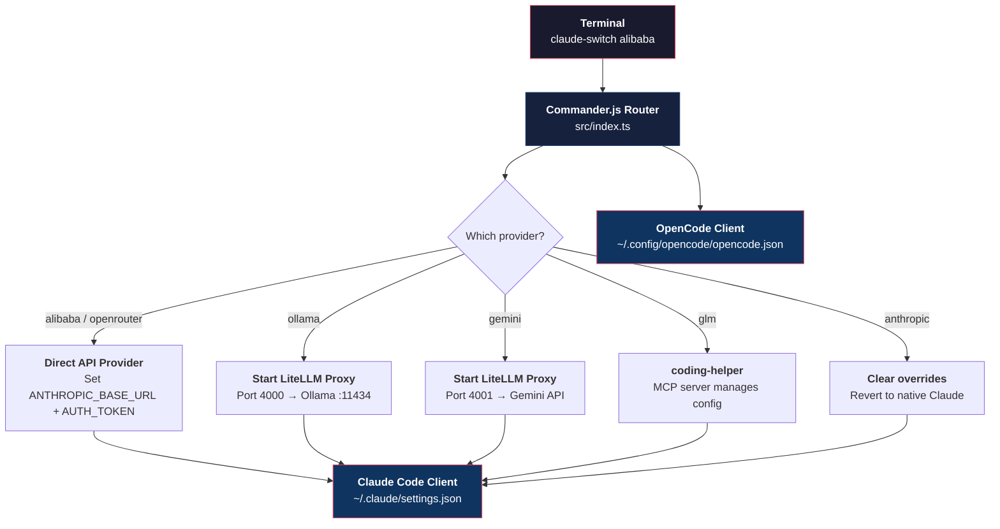

**Claude AI Switcher** is a lightweight Node.js CLI that lets you swap the AI backend powering **Claude Code** and **OpenCode** with a single command. Instead of manually editing JSON configuration files, managing API keys across terminals, and wrestling with protocol translation for local models, you run `claude-switch alibaba` or `claude-switch ollama` and the tool handles everything: environment variable injection, LiteLLM proxy lifecycle, credential validation, and safe backup of your existing settings. It turns a multi-step, error-prone process into a single, idempotent operation.

Sources: [package.json](package.json#L1-L8), [README.md](README.md#L1-L4)

## The Problem It Solves

Claude Code is Anthropic's terminal-based AI coding assistant. Out of the box, it communicates exclusively with Anthropic's own API. However, a growing ecosystem of alternative providers — Alibaba's DashScope Coding Plan, Google Gemini, local Ollama models, OpenRouter's free-tier proxies, and Zhipu's GLM via coding-helper — expose Anthropic-compatible or OpenAI-compatible endpoints that Claude Code *can* use, but only if you manually set three environment variables (`ANTHROPIC_BASE_URL`, `ANTHROPIC_AUTH_TOKEN`, `ANTHROPIC_MODEL`) inside `~/.claude/settings.json` plus optional model-tier aliases. Doing this by hand is fragile: a typo in a URL breaks your session, switching providers without clearing the previous state creates conflicting configurations, and local models behind OpenAI-format APIs (Ollama, Gemini) require a running LiteLLM translation proxy that most developers forget to start. Claude AI Switcher automates all of this into a unified CLI.

Sources: [src/clients/claude-code.ts](src/clients/claude-code.ts#L140-L178), [ARCHITECTURE.md](ARCHITECTURE.md#L55-L86)

## Supported Providers at a Glance

The tool ships with six provider configurations, each with distinct connection strategies and default model catalogs:

| Provider | Connection Type | Requires API Key | Default Opus Model | Default Sonnet Model | Default Haiku Model |
|---|---|---|---|---|---|
| **Anthropic** | Direct (native) | No (uses env `ANTHROPIC_API_KEY`) | *(cleared — native)* | *(cleared)* | *(cleared)* |
| **Alibaba** | Direct (Anthropic-compatible) | Yes | `qwen3.6-plus` | `kimi-k2.5` | `glm-5` |
| **OpenRouter** | Direct (Anthropic-compatible) | Yes | `qwen/qwen3.6-plus:free` | `openrouter/free` | `openrouter/free` |
| **GLM / Z.AI** | External (`coding-helper` MCP) | No (auth via `coding-helper`) | `glm-5.1` | `glm-5v-turbo` | `glm-5-turbo` |
| **Ollama** | LiteLLM proxy on `:4000` | No (local) | `deepseek-r1:latest` | `qwen2.5-coder:latest` | `llama3.1:latest` |
| **Gemini** | LiteLLM proxy on `:4001` | Yes | `gemini-2.5-pro` | `gemini-2.5-flash` | `gemini-2.5-flash-lite` |

Sources: [src/models.ts](src/models.ts#L23-L69), [src/models.ts](src/models.ts#L309-L344)

## High-Level Architecture

The codebase is organized as a thin CLI layer routing into discrete provider modules and two client-configuration adapters. The following diagram shows how a `claude-switch` command flows from your terminal through to the configuration files on disk:



The **two clients** serve different purposes. The **Claude Code client** writes environment variables into `~/.claude/settings.json` to redirect Claude Code's API calls to whichever provider you select. The **OpenCode client** writes structured provider schemas into `~/.config/opencode/opencode.json` so that OpenCode (a separate terminal AI tool) can use the same providers. Both clients share the same API key store at `~/.claude-ai-switcher/config.json` but write to independent configuration files, meaning you can run both tools simultaneously against different providers.

Sources: [src/index.ts](src/index.ts#L1-L68), [src/clients/claude-code.ts](src/clients/claude-code.ts#L31-L33), [src/clients/opencode.ts](src/clients/opencode.ts#L22-L25), [src/config.ts](src/config.ts#L11-L13)

## Project Structure

```
claude-ai-switcher/
├── src/
│   ├── index.ts               # CLI entry point — Commander.js routing
│   ├── models.ts              # Provider & model definitions, tier alias maps
│   ├── config.ts              # API key storage (~/.claude-ai-switcher/config.json)
│   ├── display.ts             # Terminal output formatting (chalk, ora spinners)
│   ├── verify.ts              # Lightweight HTTP health checks for API keys
│   ├── clients/
│   │   ├── claude-code.ts     # Reads/writes ~/.claude/settings.json
│   │   └── opencode.ts        # Reads/writes ~/.config/opencode/opencode.json
│   └── providers/
│       ├── anthropic.ts       # Native Anthropic — clears overrides
│       ├── alibaba.ts         # Alibaba DashScope Coding Plan
│       ├── openrouter.ts      # OpenRouter free/paid proxy
│       ├── glm.ts             # GLM/Z.AI via coding-helper MCP
│       ├── ollama.ts          # Ollama + LiteLLM proxy management
│       └── gemini.ts          # Gemini + LiteLLM proxy management
├── package.json               # Dependencies: commander, chalk, ora, fs-extra
└── tsconfig.json              # TypeScript → Node.js ESM compilation
```

Sources: [package.json](package.json#L30-L35), [ARCHITECTURE.md](ARCHITECTURE.md#L5-L22)

## Core Design Principles

**Idempotent configuration writes.** Every switch command reads the current settings file, applies only the relevant changes, and writes back the complete result. Running `claude-switch alibaba` twice produces the same output as running it once — no duplicate keys, no partial states.

**Backup before mutation.** Before any write to `~/.claude/settings.json` or `~/.claude.json`, the tool creates a timestamped backup (e.g., `settings.json.backup.1706000000000`). If something goes wrong, you can restore from the backup.

**Auto-onboarding suppression.** Claude Code requires a `hasCompletedOnboarding: true` flag in `~/.claude.json` to function without throwing connection errors. The tool sets this flag automatically on every provider switch, so new users or fresh installations never hit the onboarding blocker.

**Protocol translation for non-Anthropic APIs.** Ollama and Gemini speak the OpenAI Chat Completions protocol, not the Anthropic Messages API. The tool detects whether LiteLLM is installed, starts a detached proxy process on a fixed port (`:4000` for Ollama, `:4001` for Gemini), waits up to 5 seconds for the health endpoint to respond, then configures Claude Code to point at the proxy. The entire lifecycle — start, health check, port allocation — is managed transparently.

Sources: [src/clients/claude-code.ts](src/clients/claude-code.ts#L100-L136), [src/providers/ollama.ts](src/providers/ollama.ts#L1-L1), [ARCHITECTURE.md](ARCHITECTURE.md#L134-L147)

## The Tier Alias System in Brief

Claude Code routes requests through three model tiers — **Opus** (heavyweight reasoning), **Sonnet** (balanced performance), and **Haiku** (fast responses). When you switch to a non-Anthropic provider, Claude AI Switcher maps each tier to a model from the selected provider using three environment variables:

| Environment Variable | Purpose |
|---|---|
| `ANTHROPIC_DEFAULT_OPUS_MODEL` | Maps Claude's Opus tier to the provider's best reasoning model |
| `ANTHROPIC_DEFAULT_SONNET_MODEL` | Maps Claude's Sonnet tier to a balanced model |
| `ANTHROPIC_DEFAULT_HAIKU_MODEL` | Maps Claude's Haiku tier to a fast/cheap model |

You can override any tier at switch time with `--opus`, `--sonnet`, or `--haiku` flags. Switching back to Anthropic clears all three variables so native Claude models are restored. This system is the key abstraction that lets Claude Code operate against providers that have completely different model catalogs.

Sources: [src/clients/claude-code.ts](src/clients/claude-code.ts#L35-L57), [src/models.ts](src/models.ts#L16-L20)

## Safety and Security

API keys for Alibaba, OpenRouter, and Gemini are stored locally in `~/.claude-ai-switcher/config.json` — never sent to any server except the provider's own endpoint during verification. Key verification uses lightweight `GET /models` requests (or equivalent) with a 5-second timeout, confirming the key is valid without consuming tokens or generating content. Anthropic's own API key is never stored by the tool; it relies on the standard `ANTHROPIC_API_KEY` environment variable if present.

Sources: [src/config.ts](src/config.ts#L11-L20), [src/verify.ts](src/verify.ts#L1-L30)

## Two Target Clients

| Aspect | Claude Code | OpenCode |
|---|---|---|
| Config file | `~/.claude/settings.json` | `~/.config/opencode/opencode.json` |
| Mechanism | Environment variables injected into settings | Structured provider schema with model definitions |
| Switching command | `claude-switch <provider>` (top-level) | `claude-switch opencode add/remove <provider>` |
| Supported providers | All 6 (Anthropic, Alibaba, GLM, OpenRouter, Ollama, Gemini) | 4 (Alibaba, OpenRouter, Ollama, Gemini) |
| API key source | `~/.claude-ai-switcher/config.json` | Same shared store |
| Onboarding | Auto-sets `hasCompletedOnboarding` | Not applicable |

The CLI provides two routing styles for Claude Code: shorthand top-level commands (`claude-switch alibaba`) and explicit subcommands (`claude-switch claude alibaba`). Both invoke the same underlying logic. OpenCode commands live under the `opencode` subcommand namespace and add/remove provider entries from OpenCode's JSON schema without affecting Claude Code's configuration.

Sources: [src/index.ts](src/index.ts#L364-L439), [src/index.ts](src/index.ts#L530-L709), [src/clients/opencode.ts](src/clients/opencode.ts#L1-L25)

## Technology Stack

| Layer | Technology | Purpose |
|---|---|---|
| Runtime | Node.js ≥ 18 | Cross-platform execution |
| Language | TypeScript 5.3 (ESM) | Type safety, compiled to `dist/` |
| CLI framework | Commander.js 11 | Command routing, option parsing |
| Terminal output | Chalk 5 + Ora 8 | Colored text, spinners |
| File I/O | fs-extra 11 | Atomic JSON read/write, directory creation |
| Build | `tsc` (TypeScript compiler) | Single `npm run build` step |
| Protocol proxy | LiteLLM (external Python dependency) | OpenAI → Anthropic API translation |

Sources: [package.json](package.json#L9-L14), [package.json](package.json#L30-L46)

## Where to Go Next

This overview covered the "what" and "why." The documentation catalog provides a progressive path into the "how":

1. **Get started immediately** — [Quick Start: Installation and First Provider Switch](2-quick-start-installation-and-first-provider-switch) walks you through installation, your first `claude-switch` command, and verifying it worked.
2. **Let the wizard guide you** — [Interactive Setup Wizard](3-interactive-setup-wizard) documents the `claude-switch setup` command that walks you through provider selection interactively.
3. **Master every command** — [Switching Providers for Claude Code](4-switching-providers-for-claude-code) and [Managing OpenCode Providers (Add/Remove)](5-managing-opencode-providers-add-remove) are your CLI reference.
4. **Understand the internals** — Start with [Project Architecture and Module Responsibilities](7-project-architecture-and-module-responsibilities) when you want to modify or extend the tool.