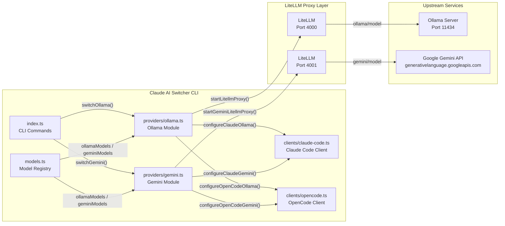
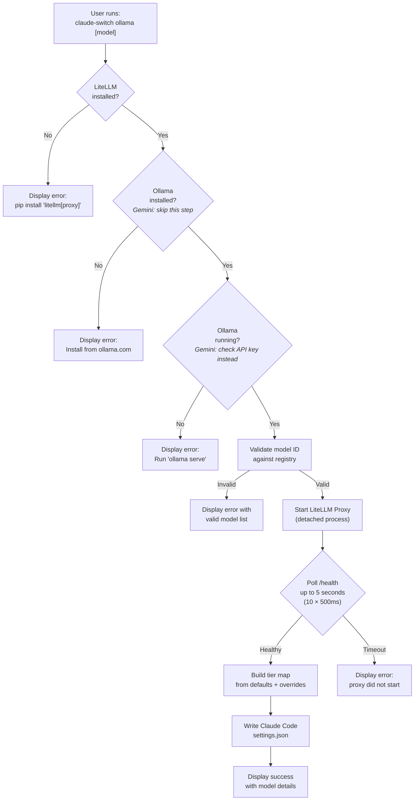

Claude AI Switcher supports two providers — **Ollama** and **Gemini** — that cannot natively speak the Anthropic Messages API. Instead, they rely on a **LiteLLM proxy** as an intermediary protocol translator, turning Anthropic-format requests from Claude Code into OpenAI-format requests that Ollama and Gemini actually understand. Each provider is assigned a fixed localhost port: Ollama on `4000`, Gemini on `4001`. This page explains the architectural rationale, the configuration contracts, the proxy lifecycle, and how the two providers differ in their prerequisites and runtime behavior.

Sources: [ollama.ts](src/providers/ollama.ts#L1-L12), [gemini.ts](src/providers/gemini.ts#L1-L12)

## Why a Proxy? The Protocol Mismatch

Claude Code communicates with backends using the **Anthropic Messages API** format (`/v1/messages` with `x-api-key` headers, `role`/`content` message shapes, and the `model` field). However, Ollama and Google Gemini expose only **OpenAI Chat Completions**-compatible endpoints — different URL patterns, different header conventions, different request/response schemas. Rather than patching each provider individually, the project deploys a single open-source translation layer: **LiteLLM Proxy**.

LiteLLM accepts Anthropic-format requests on one side, translates them to the target provider's OpenAI-compatible format on the other, and relays responses back. This means Claude Code sees a uniform Anthropic endpoint at `http://localhost:<port>`, while LiteLLM handles all format adaptation internally. The result is a clean separation of concerns: the provider modules (`ollama.ts`, `gemini.ts`) manage proxy lifecycle and configuration, while the client modules (`claude-code.ts`, `opencode.ts`) treat both proxies as just another Anthropic-compatible endpoint.

Sources: [ollama.ts](src/providers/ollama.ts#L4-L7), [gemini.ts](src/providers/gemini.ts#L4-L7)

## Architectural Overview

The following diagram shows how Ollama and Gemini providers relate to the rest of the system. Both follow the same proxy pattern but differ in their upstream dependencies — Ollama chains through a local Ollama server, while Gemini calls Google's cloud API directly.



Sources: [index.ts](src/index.ts#L52-L66), [models.ts](src/models.ts#L332-L343)

## Provider Configuration Contracts

Each provider module exports a **config interface**, a **default endpoint constant**, a **config factory function**, and a set of **lifecycle functions**. The following table compares the two providers across these dimensions.

| Aspect | Ollama | Gemini |
|--------|--------|--------|
| Config Interface | `OllamaConfig { provider, model, endpoint }` | `GeminiConfig { provider, apiKey, model, endpoint }` |
| Default Model | `deepseek-r1:latest` | `gemini-2.5-pro` |
| Endpoint | `http://localhost:4000` | `http://localhost:4001` |
| LiteLLM Port | `4000` (`OLLAMA_LITELLM_PORT`) | `4001` (`GEMINI_LITELLM_PORT`) |
| API Key Required | No (uses `"ollama"` as token) | Yes (`GEMINI_API_KEY` env var injected into proxy) |
| Upstream Service | Ollama server on port `11434` | Google AI Studio API (cloud) |
| Extra Pre-flight | Checks Ollama installed + running | Checks API key validity |
| Shell Spawn Mode | `shell: false` | `shell: true` (env var injection) |
| Spawn Command | `litellm --model ollama/<model> --port 4000` | `litellm --model gemini/<model> --port 4001` |

The most significant difference is the **authentication model**. Ollama runs entirely locally and requires no API key — the auth token is simply the string `"ollama"`. Gemini, by contrast, requires a real Google API key that gets injected into the LiteLLM proxy process via the `GEMINI_API_KEY` environment variable at spawn time. This is why the Gemini proxy spawns with `shell: true` (to ensure environment variable propagation), while Ollama uses `shell: false` for a leaner process launch.

Sources: [ollama.ts](src/providers/ollama.ts#L19-L35), [ollama.ts](src/providers/ollama.ts#L116-L146), [gemini.ts](src/providers/gemini.ts#L18-L35), [gemini.ts](src/providers/gemini.ts#L101-L136)

## The Proxy Lifecycle: Start, Health Check, Configure

Both providers follow an identical three-phase lifecycle when a user runs `claude-switch ollama` or `claude-switch gemini`. The sequence is orchestrated by the `switchOllama()` and `switchGemini()` functions in the CLI entry point.



**Phase 1 — Pre-flight checks** validate all prerequisites before attempting to start the proxy. For Ollama, this means verifying that both `litellm` and `ollama` are installed on the system `PATH`, and that the Ollama daemon is actually listening on port `11434` (checked via `GET /api/tags`). For Gemini, the pre-flight is simpler — only LiteLLM needs to be installed, since the upstream is Google's cloud API. The model ID is then validated against the static model registry in `models.ts`.

**Phase 2 — Proxy startup** spawns a detached LiteLLM child process. The process is launched with `child_process.spawn()`, immediately unref'd so the Node.js parent is not blocked, and then polled via the `/health` endpoint up to 10 times at 500ms intervals (5-second total timeout). If the proxy is already running on the target port, the startup is skipped entirely and `{ success: true }` is returned immediately.

**Phase 3 — Client configuration** writes the proxy endpoint into Claude Code's `~/.claude/settings.json` as the `ANTHROPIC_BASE_URL`, sets the `ANTHROPIC_AUTH_TOKEN`, and applies the tier alias map (see [Model Tier Alias Mapping (Opus/Sonnet/Haiku)](15-model-tier-alias-mapping-opus-sonnet-haiku)). The same proxy endpoint is also written to OpenCode's `~/.config/opencode/opencode.json` when using the `opencode add ollama` or `opencode add gemini` commands.

Sources: [index.ts](src/index.ts#L244-L358), [ollama.ts](src/providers/ollama.ts#L116-L146), [gemini.ts](src/providers/gemini.ts#L101-L136)

## How Claude Code and OpenCode Consume the Proxy

Once the proxy is running, the client configuration layer points both Claude Code and OpenCode at the LiteLLM endpoint. The configuration differs between the two clients because they use different provider schemas.

### Claude Code Configuration

Claude Code reads environment variables from `~/.claude/settings.json`. For both Ollama and Gemini, the following keys are written:

| Environment Variable | Ollama Value | Gemini Value |
|---------------------|-------------|-------------|
| `ANTHROPIC_AUTH_TOKEN` | `"ollama"` (dummy) | `<gemini-api-key>` |
| `ANTHROPIC_BASE_URL` | `http://localhost:4000` | `http://localhost:4001` |
| `ANTHROPIC_MODEL` | `<selected-model>` (e.g., `deepseek-r1:latest`) | `<selected-model>` (e.g., `gemini-2.5-pro`) |
| `ANTHROPIC_DEFAULT_OPUS_MODEL` | Tier alias (default: `deepseek-r1:latest`) | Tier alias (default: `gemini-2.5-pro`) |
| `ANTHROPIC_DEFAULT_SONNET_MODEL` | Tier alias (default: `qwen2.5-coder:latest`) | Tier alias (default: `gemini-2.5-flash`) |
| `ANTHROPIC_DEFAULT_HAIKU_MODEL` | Tier alias (default: `llama3.1:latest`) | Tier alias (default: `gemini-2.5-flash-lite`) |

Provider detection in `getCurrentProvider()` works by inspecting the `ANTHROPIC_BASE_URL` — if it contains `localhost:4000`, the provider is identified as Ollama; if it contains `localhost:4001`, it's identified as Gemini. This simple string-matching heuristic is reliable because the ports are fixed constants.

Sources: [claude-code.ts](src/clients/claude-code.ts#L218-L250), [claude-code.ts](src/clients/claude-code.ts#L293-L311)

### OpenCode Configuration

OpenCode uses a different schema at `~/.config/opencode/opencode.json`. Instead of environment variables, it defines a structured provider object with an npm SDK, connection options, and per-model metadata. Both Ollama and Gemini providers specify `@ai-sdk/openai` as the npm package (because LiteLLM exposes an OpenAI-compatible `/v1` endpoint), and both point at the LiteLLM proxy URL with `/v1` appended:

```json
{
  "provider": {
    "ollama": {
      "npm": "@ai-sdk/openai",
      "name": "Ollama (Local)",
      "options": {
        "baseURL": "http://localhost:4000/v1",
        "apiKey": "ollama"
      },
      "models": { ... }
    },
    "gemini": {
      "npm": "@ai-sdk/openai",
      "name": "Gemini (Google)",
      "options": {
        "baseURL": "http://localhost:4001/v1",
        "apiKey": "<gemini-api-key>"
      },
      "models": { ... }
    }
  }
}
```

Note the subtle difference: the Claude Code configuration points at `http://localhost:4000` (LiteLLM's Anthropic-compatible endpoint), while OpenCode points at `http://localhost:4000/v1` (LiteLLM's OpenAI-compatible endpoint). LiteLLM serves both protocols from the same proxy instance.

Sources: [opencode.ts](src/clients/opencode.ts#L308-L370), [opencode.ts](src/clients/opencode.ts#L375-L426)

## Model Catalog and Tier Aliases

Each proxy provider ships with a curated set of models registered in `models.ts`. The **tier alias map** determines which model is used when Claude Code requests a "tier" like Opus, Sonnet, or Haiku — this is critical because Claude Code internally maps its model requests through these tier aliases rather than calling models by their native IDs.

### Ollama Models

| Model ID | Display Name | Context Window | Capabilities |
|----------|-------------|----------------|-------------|
| `deepseek-r1:latest` | DeepSeek R1 | 128K tokens | Text Generation, Deep Thinking, Reasoning |
| `qwen2.5-coder:latest` | Qwen 2.5 Coder | 128K tokens | Text Generation, Coding, Tool Calling |
| `llama3.1:latest` | Llama 3.1 | 128K tokens | Text Generation, Code, Vision |
| `codellama:latest` | Code Llama | 100K tokens | Text Generation, Coding |

**Default Tier Map**: Opus → `deepseek-r1:latest`, Sonnet → `qwen2.5-coder:latest`, Haiku → `llama3.1:latest`

### Gemini Models

| Model ID | Display Name | Context Window | Capabilities |
|----------|-------------|----------------|-------------|
| `gemini-2.5-pro` | Gemini 2.5 Pro | 1M tokens | Text Generation, Deep Thinking, Code, Vision |
| `gemini-2.5-flash` | Gemini 2.5 Flash | 1M tokens | Text Generation, Fast Responses, Code |
| `gemini-2.5-flash-lite` | Gemini 2.5 Flash Lite | 1M tokens | Text Generation, Cost-optimized |

**Default Tier Map**: Opus → `gemini-2.5-pro`, Sonnet → `gemini-2.5-flash`, Haiku → `gemini-2.5-flash-lite`

Users can override individual tiers at switch time using the `--opus`, `--sonnet`, and `--haiku` CLI flags (see [Custom Tier Overrides with --opus, --sonnet, --haiku Flags](16-custom-tier-overrides-with-opus-sonnet-haiku-flags)).

Sources: [models.ts](src/models.ts#L212-L267), [models.ts](src/models.ts#L37-L48)

## Verification: Health Checks and API Key Validation

The `verifyAllKeys()` function in `verify.ts` performs provider-specific health checks. For the two proxy providers, the verification strategy differs based on their architecture.

### Ollama Verification

Ollama verification is a two-step process: first, it pings `http://localhost:4000/health` to confirm the LiteLLM proxy is alive; then it pings `http://localhost:11434/api/tags` to confirm the Ollama daemon is responding. Both must succeed for the status to be `ok`. If the proxy is healthy but Ollama is down, the user gets a targeted error message indicating which component failed.

### Gemini Verification

Gemini verification first validates the API key independently by calling `https://generativelanguage.googleapis.com/v1beta/models` with the `x-goog-api-key` header. If the key is valid, it *additionally* checks `http://localhost:4001/health` for informational purposes — the proxy status is appended to the success message (e.g., "Key valid, proxy running" or "Key valid, proxy not running"). This decoupled approach means a valid key is reported as `ok` even if the proxy hasn't been started yet, giving the user clear guidance on what action to take next.

Sources: [verify.ts](src/verify.ts#L202-L258)

## Prerequisites and Installation

Before using either proxy provider, ensure the following dependencies are met:

| Prerequisite | Ollama | Gemini | Install Command |
|-------------|--------|--------|-----------------|
| LiteLLM with proxy support | ✅ Required | ✅ Required | `pip install 'litellm[proxy]'` |
| Ollama CLI | ✅ Required | ❌ Not needed | Download from [ollama.com](https://ollama.com) |
| Ollama server running | ✅ Required (port 11434) | ❌ Not needed | `ollama serve` |
| Google API Key | ❌ Not needed | ✅ Required | Get from [AI Studio](https://aistudio.google.com/apikey) |
| Models pulled | ✅ Required | ❌ Cloud-hosted | `ollama pull deepseek-r1:latest` |

The LiteLLM installation check uses `which litellm` on macOS/Linux and `where litellm` on Windows, executed via `child_process.exec`. This is the first gate in the pre-flight sequence — if LiteLLM is missing, the switch command exits immediately with an error message and installation instructions.

Sources: [ollama.ts](src/providers/ollama.ts#L48-L77), [gemini.ts](src/providers/gemini.ts#L48-L61), [index.ts](src/index.ts#L248-L262)

## Related Pages

- **[LiteLLM Proxy Lifecycle Management (Start, Health Check, Port Allocation)](19-litellm-proxy-lifecycle-management-start-health-check-port-allocation)** — deep dive into the proxy spawn mechanics, polling loop, and error handling
- **[Direct API Providers (Anthropic, Alibaba, OpenRouter)](9-direct-api-providers-anthropic-alibaba-openrouter)** — the contrasting pattern for providers that natively support the Anthropic API
- **[API Key Verification: Lightweight HTTP Health Checks](18-api-key-verification-lightweight-http-health-checks)** — full verification system across all providers
- **[Adding a New Provider: Step-by-Step Implementation Guide](23-adding-a-new-provider-step-by-step-implementation-guide)** — how to add a new LiteLLM-backed provider following the established pattern