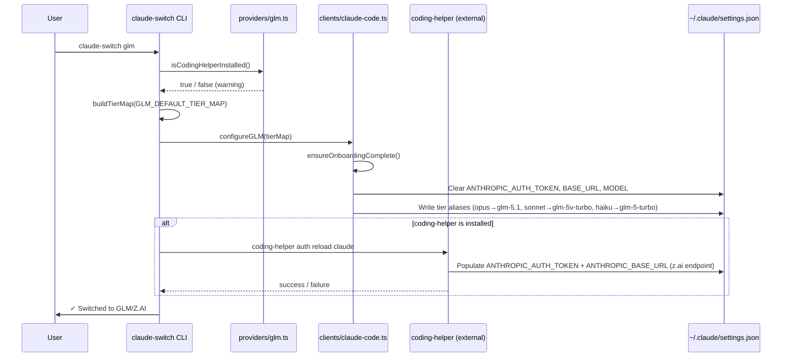

The GLM/Z.AI provider occupies a unique architectural position in Claude AI Switcher: unlike every other provider in the system, it **delegates authentication entirely to an external tool** — the `@z_ai/coding-helper` CLI package — rather than storing and managing API keys locally. This design reflects the fact that Zhipu AI's Coding Plan uses a managed authentication flow that is best handled by Zhipu's own tooling. Claude AI Switcher's role in this integration is focused on **model tier alias mapping** and **Claude Code settings orchestration**, while `coding-helper` owns the credential lifecycle and API endpoint configuration.

Sources: [glm.ts](src/providers/glm.ts#L1-L6), [models.ts](src/models.ts#L308-L325)

## Architectural Overview: The Delegation Pattern

The GLM provider follows what can be described as a **delegation pattern**: the switcher writes tier alias mappings into `~/.claude/settings.json`, and then hands off to `coding-helper` to populate the authentication environment variables (`ANTHROPIC_AUTH_TOKEN`, `ANTHROPIC_BASE_URL`) through its own `auth reload` mechanism. This creates a two-phase configuration flow that is fundamentally different from providers like Alibaba or OpenRouter, where the switcher directly writes both API keys and endpoints.



The diagram above illustrates the critical two-phase write: first the switcher clears any conflicting provider env vars and writes the tier alias map, then `coding-helper` populates the authentication credentials. If `coding-helper` is not installed, the switcher still writes the tier map but warns the user that authentication cannot be completed.

Sources: [glm.ts](src/providers/glm.ts#L29-L60), [claude-code.ts](src/clients/claude-code.ts#L184-L198), [index.ts](src/index.ts#L177-L203)

## The GLM Model Catalog and Default Tier Mapping

The GLM provider exposes six models from Zhipu AI's lineup, covering a range from flagship reasoning models to fast inference variants. Notably, the **GLM-5V-Turbo** stands out as the only multimodal model in the GLM catalog — it natively understands images, videos, design drafts, and screenshots, enabling visual programming workflows.

| Model ID | Display Name | Context Window | Key Capabilities | Description |
|---|---|---|---|---|
| `glm-5.1` | GLM-5.1 | 200K tokens | Text Generation, Deep Thinking | Most advanced model with state-of-the-art reasoning |
| `glm-5v-turbo` | GLM-5V-Turbo | 200K tokens | Text, Deep Thinking, Visual Understanding, Visual Programming | First multimodal coding foundation model |
| `glm-5-turbo` | GLM-5-Turbo | 200K tokens | Text Generation, Deep Thinking, Fast Responses | Balanced reasoning with low latency |
| `glm-5` | GLM-5 | 200K tokens | Text Generation, Deep Thinking | Flagship enhanced reasoning model |
| `glm-4.7` | GLM-4.7 | 256K tokens | Text Generation, Deep Thinking | Balanced model for code understanding |
| `glm-4.7-flash` | GLM-4.7-Flash | 256K tokens | Text Generation, Fast Inference | Speed-optimized inference model |

The default tier alias mapping assigns models to Claude Code's three operational tiers based on capability hierarchy:

| Claude Code Alias | GLM Model | Rationale |
|---|---|---|
| **Opus** (highest capability) | `glm-5.1` | Zhipu's most advanced reasoning model |
| **Sonnet** (balanced) | `glm-5v-turbo` | Multimodal capabilities for code + visual workflows |
| **Haiku** (fast/lightweight) | `glm-5-turbo` | Low-latency responses for quick tasks |

Sources: [models.ts](src/models.ts#L149-L192), [models.ts](src/models.ts#L22-L27)

## Provider Configuration: The `GLMConfig` Interface

The GLM provider module exports a `GLMConfig` interface that is notably **minimal** compared to other provider configurations. It carries only a `provider` discriminator and an optional `model` field — there is no `apiKey` field that is actively populated by the switcher itself. The model resolution follows a cascading environment variable lookup:

```
ZHIPUAI_MODEL → ZAI_MODEL → "glm-5" (fallback)
```

This means users can override the default model by setting either `ZHIPUAI_MODEL` or `ZAI_MODEL` in their shell environment before invoking the switcher. The two variable names accommodate different versions of Zhipu's SDK conventions — `ZHIPUAI_MODEL` is the current canonical name, while `ZAI_MODEL` provides backward compatibility.

Sources: [glm.ts](src/providers/glm.ts#L13-L24)

## The coding-helper CLI: Detection and Reload

The integration with `coding-helper` is mediated through two functions that encapsulate all external process interaction:

**`isCodingHelperInstalled()`** performs a cross-platform binary check using `which` (macOS/Linux) or `where` (Windows). This is a lightweight pre-flight check — it merely confirms the binary exists on `PATH`, not that it is authenticated or functional. When the binary is missing, the switcher emits a warning with installation instructions (`npm install -g @z_ai/coding-helper`) but still proceeds to write the tier map configuration, allowing users to install and authenticate `coding-helper` later.

**`reloadGLMConfig()`** invokes `coding-helper auth reload claude`, which is the command that `coding-helper` uses to push its stored credentials into Claude Code's settings. This is the bridge between Zhipu's authentication system and Claude Code's environment variable configuration. The function returns a structured result (`{ success: boolean; error?: string }`) so the caller can distinguish between a successful reload and a degraded state where only the tier map was written.

Sources: [glm.ts](src/providers/glm.ts#L29-L60)

## The Claude Code Configuration Flow

When the `switchGLM()` function in the CLI orchestrator is invoked, it follows a precise sequence that differs from the direct API providers in two critical ways:

1. **No API key prompt** — Unlike `switchAlibaba()` or `switchOpenRouter()`, which prompt for and store API keys, `switchGLM()` never interacts with the key management system in `src/config.ts`. The `config.json` file has no `glmApiKey` field. This is by design: authentication is fully owned by `coding-helper`.

2. **Env var clearance** — Before applying the GLM tier map, `configureGLM()` explicitly removes `ANTHROPIC_AUTH_TOKEN`, `ANTHROPIC_BASE_URL`, and `ANTHROPIC_MODEL` from the settings. This prevents stale credentials from a previous provider (e.g., Alibaba) from leaking into the GLM session. The `coding-helper auth reload claude` command then repopulates these variables with fresh GLM credentials.

The detection logic in `getCurrentProvider()` recognizes GLM configurations through three distinct heuristics, applied in order:

| Detection Signal | Condition | Confidence |
|---|---|---|
| MCP server present | `settings.mcpServers["glm-coding-plan"]` exists | High — explicit GLM marker |
| z.ai endpoint | `ANTHROPIC_BASE_URL` contains `"z.ai"` | High — coding-helper sets this |
| Tier map without base URL | Tier aliases set but no `ANTHROPIC_BASE_URL` | Medium — likely GLM pre-reload |

This multi-signal approach ensures that the status command can correctly identify the GLM provider regardless of whether `coding-helper` has already completed its auth reload or is still pending.

Sources: [index.ts](src/index.ts#L177-L203), [claude-code.ts](src/clients/claude-code.ts#L184-L198), [claude-code.ts](src/clients/claude-code.ts#L313-L337)

## Verification: Checking Without an API Key

The GLM verification strategy in `verifyGLM()` mirrors the delegation pattern: since the switcher does not hold a GLM API key, it cannot perform a direct HTTP health check against Zhipu's API. Instead, it verifies two signals:

1. **Binary presence** — Confirms `coding-helper` is on `PATH` using the same `which`/`where` check as `isCodingHelperInstalled()`.
2. **Environment variable inspection** — Checks for `ZHIPUAI_MODEL` or `ZAI_MODEL` in the process environment. If either is set, it reports a higher-confidence status (`"coding-helper installed, env vars set"`); otherwise, it falls back to `"coding-helper installed"`.

This verification result appears in the `claude-switch status` output alongside the other providers. It uses the same `VerifyResult` interface but will never report `"invalid"` or `"missing"` in the same way as key-based providers — the worst case is `"error"` if the binary check itself fails.

Sources: [verify.ts](src/verify.ts#L91-L116), [verify.ts](src/verify.ts#L150-L197)

## Comparison: GLM vs. Direct API Providers

The following table highlights how the GLM provider's delegation model contrasts with the direct API providers (Anthropic, Alibaba, OpenRouter):

| Aspect | Direct API Providers | GLM/Z.AI |
|---|---|---|
| **API key storage** | `~/.claude-ai-switcher/config.json` | Not stored by switcher |
| **Endpoint configuration** | Hardcoded in switcher code | Set by `coding-helper auth reload` |
| **Auth mechanism** | Switcher writes `ANTHROPIC_AUTH_TOKEN` directly | `coding-helper` writes it via `auth reload` |
| **Model selection** | Per-command `[model]` argument | Tier aliases only (no per-command model arg) |
| **Pre-flight checks** | API key prompt + validation | `coding-helper` binary presence check |
| **Post-switch action** | None | `coding-helper auth reload claude` |
| **Verification** | HTTP request to provider API | Binary + env var check |

Sources: [glm.ts](src/providers/glm.ts#L1-L61), [config.ts](src/config.ts#L52-L65), [claude-code.ts](src/clients/claude-code.ts#L141-L198)

## CLI Usage: The `glm` Command

The GLM provider is exposed through two equivalent command paths — a top-level shorthand and an explicit Claude Code subcommand. Both accept the standard tier override flags.

```bash
# Top-level shorthand (recommended for quick switching)
claude-switch glm

# Explicit Claude Code targeting
claude-switch claude glm

# With tier overrides
claude-switch glm --opus glm-5 --sonnet glm-4.7 --haiku glm-4.7-flash

# View GLM models
claude-switch models glm
```

When executed, the command produces output that reflects the delegation state:

```
✓ Switched to GLM/Z.AI
  Provider: GLM/Z.AI
  Managed by: coding-helper        ← shown only if coding-helper is installed

  Claude model aliases:
    ANTHROPIC_DEFAULT_OPUS_MODEL   → glm-5.1
    ANTHROPIC_DEFAULT_SONNET_MODEL → glm-5v-turbo
    ANTHROPIC_DEFAULT_HAIKU_MODEL  → glm-5-turbo
```

If `coding-helper` is not installed, the output includes a warning block with installation instructions instead of the "Managed by" line. The configuration still takes effect for the tier aliases, but Claude Code will not be able to authenticate until `coding-helper` is installed and `coding-helper auth` is run.

Sources: [index.ts](src/index.ts#L389-L399), [index.ts](src/index.ts#L177-L203)

## Prerequisites and Troubleshooting

The GLM provider has a single external dependency that must be satisfied independently of Claude AI Switcher:

| Prerequisite | Install Command | Purpose |
|---|---|---|
| `@z_ai/coding-helper` | `npm install -g @z_ai/coding-helper` | Manages Zhipu AI authentication |
| `coding-helper auth` (one-time) | `coding-helper auth` | Authenticates with Zhipu AI and stores credentials |

**Common issues and their resolutions:**

| Symptom | Cause | Resolution |
|---|---|---|
| Warning: "coding-helper not found" | Binary not on PATH | Install with `npm install -g @z_ai/coding-helper` |
| Warning: "coding-helper reload failed" | `auth reload claude` returned non-zero | Run `coding-helper auth` to refresh credentials |
| Status shows GLM but Claude Code can't connect | Auth reload didn't populate env vars | Manually run `coding-helper auth reload claude` |
| Wrong model used for a tier | Default tier map doesn't match preference | Use `--opus`, `--sonnet`, `--haiku` flags to override |

Sources: [glm.ts](src/providers/glm.ts#L29-L60), [index.ts](src/index.ts#L178-L195)

---

**Next steps in the documentation:**

- Understand how Claude Code settings are managed in detail → [Claude Code Client: Settings, Environment Variables, and Backups](12-claude-code-client-settings-environment-variables-and-backups)
- See how the tier alias system works across all providers → [Model Tier Alias Mapping (Opus/Sonnet/Haiku)](15-model-tier-alias-mapping-opus-sonnet-haiku)
- Learn how to add your own provider with similar patterns → [Adding a New Provider: Step-by-Step Implementation Guide](23-adding-a-new-provider-step-by-step-implementation-guide)