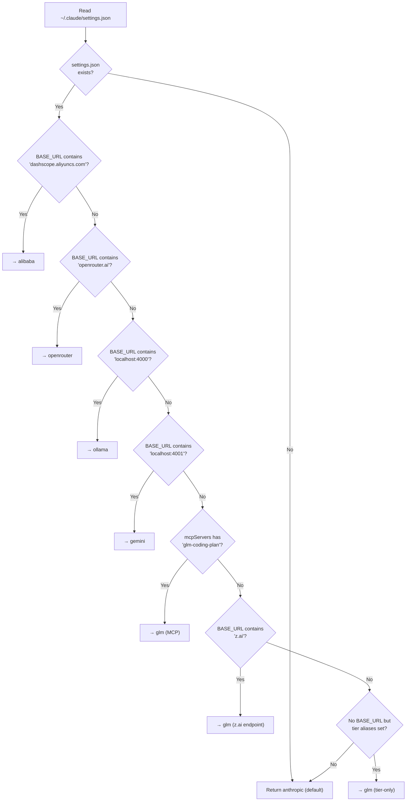
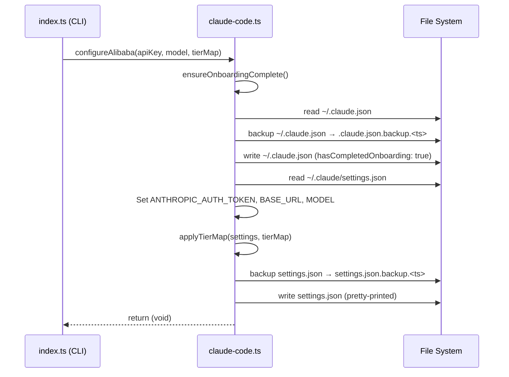

The Claude Code client layer is the translation boundary between claude-ai-switcher's provider abstractions and Claude Code's native configuration format. Every `claude-switch` command that targets Claude Code ultimately flows through the [`claude-code.ts`](src/clients/claude-code.ts) module, which reads and writes two JSON files on disk — `~/.claude/settings.json` and `~/.claude.json` — and manages timestamped backups before every mutation. Understanding this layer is essential for debugging switching failures, recovering from corrupted settings, and knowing exactly which environment variables Claude Code consumes at runtime.

Sources: [claude-code.ts](src/clients/claude-code.ts#L1-L15)

## The Two Configuration Files

Claude Code uses two separate JSON files in the user's home directory, each serving a distinct purpose. The **settings file** at `~/.claude/settings.json` is the primary configuration surface that claude-ai-switcher manipulates — it holds an `env` object where environment variables are injected to reroute Claude Code's API calls. The **onboarding file** at `~/.claude.json` tracks whether the user has completed Claude Code's initial setup flow; claude-ai-switcher forcibly sets `hasCompletedOnboarding` to `true` here to prevent an "Unable to connect to Anthropic services" error that would otherwise block non-Anthropic providers before they can take effect.

| File | Path | Purpose | Managed By |
|------|------|---------|------------|
| Settings | `~/.claude/settings.json` | Environment variables, MCP servers, model aliases | `writeClaudeSettings()` |
| Onboarding | `~/.claude.json` | Onboarding completion flag | `writeClaudeJson()` |

Both files are represented by permissive TypeScript interfaces — `ClaudeSettings` and `ClaudeJson` — that use index signatures (`[key: string]: any`) to preserve any fields that Claude Code itself may have written, ensuring that claude-ai-switcher never accidentally destroys configuration it doesn't understand.

Sources: [claude-code.ts](src/clients/claude-code.ts#L12-L34), [claude-code.ts](src/clients/claude-code.ts#L76-L95)

## Environment Variables: The Core Routing Mechanism

All provider switching in Claude Code is achieved by injecting environment variables into the `env` object inside `settings.json`. Claude Code reads these variables at startup to determine which API endpoint to contact, which authentication token to use, and which model to select. There are exactly **six** environment variables that the switcher manages, divided into two categories: **routing variables** that control which API Claude Code talks to, and **tier alias variables** that map Claude Code's internal model tiers (opus/sonnet/haiku) to provider-specific model identifiers.

### Routing Variables

| Variable | Purpose | Example Value |
|----------|---------|---------------|
| `ANTHROPIC_AUTH_TOKEN` | API key or authentication token for the target provider | `sk-ant-...`, `ollama` |
| `ANTHROPIC_BASE_URL` | Base URL that overrides Claude Code's default Anthropic endpoint | `https://openrouter.ai/api/v1` |
| `ANTHROPIC_MODEL` | The default model identifier sent to the provider | `qwen3.6-plus`, `deepseek-r1:latest` |

### Tier Alias Variables

| Variable | Purpose | Example Value |
|----------|---------|---------------|
| `ANTHROPIC_DEFAULT_OPUS_MODEL` | Model mapped to Claude's "opus" tier | `glm-5.1` |
| `ANTHROPIC_DEFAULT_SONNET_MODEL` | Model mapped to Claude's "sonnet" tier | `glm-5v-turbo` |
| `ANTHROPIC_DEFAULT_HAIKU_MODEL` | Model mapped to Claude's "haiku" tier | `glm-5-turbo` |

The tier alias variables are managed through two internal helper functions — `applyTierMap()` writes all three keys atomically, while `clearTierMap()` removes them and also cleans up the parent `env` object if it becomes empty. This ensures no stale aliases persist when switching back to native Anthropic.

Sources: [claude-code.ts](src/clients/claude-code.ts#L35-L57), [models.ts](src/models.ts#L16-L20)

## Provider-Specific Configuration Patterns

Each provider applies a distinct combination of these environment variables. The following table shows exactly which variables are set for each provider, revealing the architectural pattern: **direct API providers** (Alibaba, OpenRouter) and **proxy-based providers** (Ollama, Gemini) all three routing variables plus tier aliases, while **GLM/Z.AI** sets only tier aliases (relying on `coding-helper` for routing), and **Anthropic** is the "zero state" that removes everything.

| Provider | `AUTH_TOKEN` | `BASE_URL` | `MODEL` | Tier Aliases |
|----------|:---:|:---:|:---:|:---:|
| **Anthropic** (reset) | Deleted | Deleted | Deleted | Cleared |
| **Alibaba** | API key | `coding-intl.dashscope.aliyuncs.com/...` | Selected model | ✓ Applied |
| **OpenRouter** | API key | `openrouter.ai/api/v1` | Selected model | ✓ Applied |
| **Ollama** | `"ollama"` | `localhost:4000` | Selected model | ✓ Applied |
| **Gemini** | API key | `localhost:4001` | Selected model | ✓ Applied |
| **GLM/Z.AI** | Deleted | Deleted | Deleted | ✓ Applied |

A critical detail: when switching to **GLM**, the function explicitly *deletes* `ANTHROPIC_AUTH_TOKEN`, `ANTHROPIC_BASE_URL`, and `ANTHROPIC_MODEL` before applying the tier map. This is because GLM relies on `coding-helper` to manage its own authentication separately — leaving stale Alibaba or OpenRouter credentials would conflict. When switching back to **Anthropic**, both the `alibaba-coding-plan` and `glm-coding-plan` MCP server entries are also removed from `mcpServers`, completing the full reset.

Sources: [claude-code.ts](src/clients/claude-code.ts#L141-L198), [claude-code.ts](src/clients/claude-code.ts#L200-L250)

## Backup Mechanism: Atomic Write with Timestamped Copies

Every write operation through `writeClaudeSettings()` and `writeClaudeJson()` follows an identical three-step protocol: **ensure directory → backup existing → write new**. Before any bytes are overwritten, the existing file is copied to a timestamped backup using the pattern `<filename>.backup.<Date.now()>`. The `Date.now()` timestamp provides millisecond-precision uniqueness, meaning rapid successive switches never collide.

```
~/.claude/
├── settings.json                          ← Current active settings
├── settings.json.backup.1720451234567     ← Timestamped backup #1
├── settings.json.backup.1720451299812     ← Timestamped backup #2
└── ...

~/.claude.json
├── .claude.json                           ← Current onboarding state
├── .claude.json.backup.1720451234999      ← Timestamped backup
└── ...
```

The `fs-extra` library's `copyFile()` is used for the backup and `ensureDir()` guarantees the `~/.claude/` directory exists before any file operation. New settings are written with `JSON.stringify(settings, null, 2)` — pretty-printed with 2-space indentation — making the resulting files human-readable and diff-friendly.

Sources: [claude-code.ts](src/clients/claude-code.ts#L97-L126)

## Onboarding Guard: Preventing the Connection Error

When Claude Code starts and `hasCompletedOnboarding` is not `true` in `~/.claude.json`, it attempts to connect to Anthropic's servers to complete setup. If you've switched to a non-Anthropic provider, this connection attempt fails and blocks the entire session. The `ensureOnboardingComplete()` function solves this by reading `~/.claude.json`, setting the flag to `true`, and writing it back — all before any provider-specific configuration is applied. Every provider configuration function (`configureAlibaba`, `configureAnthropic`, `configureGLM`, `configureOpenRouter`, `configureOllama`, `configureGemini`) calls `ensureOnboardingComplete()` as its very first operation, making the guard universal and unconditional.

Sources: [claude-code.ts](src/clients/claude-code.ts#L128-L136), [claude-code.ts](src/clients/claude-code.ts#L141-L153)

## Provider Detection: The URL-Based Cascade

The `getCurrentProvider()` function reads the current settings and determines which provider is active through a **priority-ordered cascade of URL matching**. It inspects `ANTHROPIC_BASE_URL` for recognizable substrings, falling through each check in sequence. The detection order matters: more specific patterns are checked first, with GLM having multiple fallback detection strategies.



The return value includes the detected `provider` name, the current `model` (if set), the `endpoint` URL, and a `tierMap` object containing any opus/sonnet/haiku aliases currently in effect. This structure feeds directly into the `claude-switch status` and `claude-switch current` display commands.

Sources: [claude-code.ts](src/clients/claude-code.ts#L252-L341), [index.ts](src/index.ts#L716-L830)

## Full Write Lifecycle: Step-by-Step

The following diagram traces the complete execution path when a user runs `claude-switch alibaba qwen3.6-plus`, showing how each layer interacts from CLI entry point through file system mutation.



This sequence reveals an important property: **both** `~/.claude.json` and `~/.claude/settings.json` are potentially written during a single switch operation. Each gets its own independent backup, so you can roll back either file independently if needed.

Sources: [claude-code.ts](src/clients/claude-code.ts#L97-L153), [index.ts](src/index.ts#L138-L175)

## What Gets Preserved Across Switches

The `ClaudeSettings` interface uses an index signature (`[key: string]: any`) and the read-modify-write pattern ensures that **all existing fields are preserved** when writing new settings. When `readClaudeSettings()` returns the full JSON object, the provider-specific `configure*` functions only modify the `env` property (and occasionally `mcpServers`). All other keys — custom permissions, user preferences, or anything else Claude Code stores — pass through untouched.

The one exception is `configureAnthropic()`, which actively *deletes* specific MCP server entries (`alibaba-coding-plan`, `glm-coding-plan`) in addition to cleaning env vars. This is intentional: switching to native Anthropic means you no longer need those provider-specific MCP integrations, and leaving them could cause connection errors when Claude Code tries to start them.

Sources: [claude-code.ts](src/clients/claude-code.ts#L12-L15), [claude-code.ts](src/clients/claude-code.ts#L158-L178)

## Related Pages

- **[Model and Provider Type Definitions](14-model-and-provider-type-definitions)** — The `ClaudeSettings`, `ClaudeJson`, and `ModelTierMap` interfaces that define the shape of configuration data.
- **[Provider Detection from Claude Settings](20-provider-detection-from-claude-settings)** — Deep dive into the `getCurrentProvider()` cascade and how each provider is identified.
- **[How Provider Switching Works: The End-to-End Flow](8-how-provider-switching-works-the-end-to-end-flow)** — The full lifecycle from CLI command through client configuration.
- **[Custom Tier Overrides with --opus, --sonnet, --haiku Flags](16-custom-tier-overrides-with-opus-sonnet-haiku-flags)** — How the `buildTierMap()` function merges CLI overrides with defaults before passing to `applyTierMap()`.
- **[API Key Storage and Local Configuration Management](17-api-key-storage-and-local-configuration-management)** — The separate `~/.claude-ai-switcher/config.json` file where API keys are stored, independent of Claude Code's own settings.