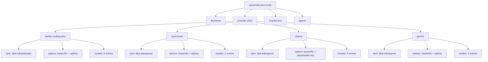
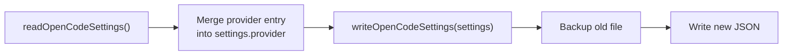

The OpenCode client module manages `~/.config/opencode/opencode.json` — a structured JSON file that declares AI providers, their connection parameters, and available models for the OpenCode editor. Unlike the [Claude Code client](12-claude-code-client-settings-environment-variables-and-backups), which configures providers through environment variables injected into a settings file, OpenCode uses a **declarative provider schema** where each provider is a self-contained block specifying an npm SDK package, a base URL, an API key, and a catalog of models with their individual capabilities and limits. This page covers the TypeScript interface definitions, the per-provider JSON structure, the file I/O lifecycle, and how the CLI's `opencode add`/`opencode remove` commands translate into JSON mutations.

Sources: [opencode.ts](src/clients/opencode.ts#L1-L17)

## Configuration File Location and Lifecycle

OpenCode follows the XDG configuration convention, storing its settings at `~/.config/opencode/opencode.json`. The module resolves this path via `os.homedir()` joined with `.config/opencode/opencode.json`. Four lifecycle functions govern access to this file:

| Function | Purpose | Creates File? | Creates Directory? |
|---|---|---|---|
| `getOpenCodeConfigPath()` | Returns the absolute path string | No | No |
| `opencodeSettingsExists()` | Checks file existence via `fs.existsSync` | No | No |
| `readOpenCodeSettings()` | Reads and parses JSON; returns `{}` if absent | No | No |
| `writeOpenCodeSettings()` | Writes formatted JSON with backup | Yes | Yes (`fs.ensureDir`) |

The **read** function is defensive: if the file does not exist, it returns an empty `OpenCodeSettings` object rather than throwing. This allows the `configure*` functions to treat a fresh read as a blank canvas and populate only the fields they need. The **write** function performs a two-step sequence: first, it ensures the parent directory `~/.config/opencode/` exists via `fs.ensureDir`; second, if a settings file already exists, it creates a timestamped backup (`opencode.json.backup.<epoch>`) before writing the new content. The JSON is serialized with `JSON.stringify(settings, null, 2)` — two-space indentation for human readability.

Sources: [opencode.ts](src/clients/opencode.ts#L23-L67)

## The OpenCodeSettings Interface

The root TypeScript interface is defined as follows:

```typescript
export interface OpenCodeSettings {
  $schema?: string;
  provider?: Record<string, any>;
  mcpServers?: Record<string, any>;
  agents?: Record<string, any>;
  [key: string]: any;
}
```

The **`$schema`** field is set to `"https://opencode.ai/config.json"` by every `configure*` function, anchoring the file to OpenCode's official JSON Schema for validation and IDE autocomplete. The **`provider`** field is the central concern of this module — a dictionary keyed by provider name, where each value is a nested object defining the provider's SDK, connection options, and model catalog. The **`mcpServers`** and **`agents`** fields are preserved for OpenCode's own use but are never modified by claude-ai-switcher. The index signature `[key: string]: any` ensures that any existing keys in the file (for example, custom OpenCode settings added by the user) survive read-modify-write cycles unharmed.

Sources: [opencode.ts](src/clients/opencode.ts#L11-L17)

## Provider Configuration Schema

Every provider written to `opencode.json` shares a common structural skeleton, though the exact fields vary by provider. The general shape is:

```json
{
  "provider": {
    "<provider-key>": {
      "npm": "<npm-sdk-package>",
      "name": "<Human-Readable Name>",
      "options": {
        "baseURL": "<api-endpoint>",
        "apiKey": "<api-key-or-placeholder>"
      },
      "models": {
        "<model-id>": {
          "name": "<Display Name>",
          "modalities": {
            "input": ["text", "image"],
            "output": ["text"]
          },
          "options": {
            "thinking": {
              "type": "enabled",
              "budgetTokens": 8192
            }
          },
          "limit": {
            "context": <max-context-tokens>,
            "output": <max-output-tokens>
          }
        }
      }
    }
  }
}
```

The following diagram illustrates how provider entries map to the physical JSON structure:



Sources: [opencode.ts](src/clients/opencode.ts#L73-L208)

## Provider-by-Provider Schema Details

Each provider has distinct connection characteristics. The table below summarizes the four providers that the OpenCode module can configure:

| Provider Key | SDK Package | Base URL | API Key Required | Models Count | Thinking Support |
|---|---|---|---|---|---|
| `bailian-coding-plan` | `@ai-sdk/anthropic` | `https://coding-intl.dashscope.aliyuncs.com/apps/anthropic/v1` | Yes (Alibaba DashScope) | 8 | qwen3.6-plus, MiniMax-M2.5, glm-5, glm-4.7, kimi-k2.5 |
| `openrouter` | `@ai-sdk/openai` | `https://openrouter.ai/api/v1` | Yes (OpenRouter) | 2 | No |
| `ollama` | `@ai-sdk/openai` | `http://localhost:4000/v1` | No (placeholder `"ollama"`) | 4 | No |
| `gemini` | `@ai-sdk/openai` | `http://localhost:4001/v1` | Yes (Google AI Studio) | 3 | No |

### Alibaba (bailian-coding-plan)

The Alibaba provider is the most feature-rich entry, registering eight models from multiple vendors (Qwen, MiniMax, GLM/Zhipu, Kimi/Moonshot) all accessible through Alibaba's DashScope "coding plan" endpoint. Five of these models enable the **thinking** option with a `budgetTokens` budget of 8192 — this configures extended reasoning where the model produces internal chain-of-thought before generating output. The `qwen3.6-plus` model stands out with a 1M context window and multimodal input (text + image).

Sources: [opencode.ts](src/clients/opencode.ts#L73-L211)

### OpenRouter

The OpenRouter configuration uses the `@ai-sdk/openai` SDK adapter pointed at OpenRouter's OpenAI-compatible API. It registers two models: `qwen/qwen3.6-plus:free` and `openrouter/free`. Both use a conservative 131,072-token context limit and 32,768-token output limit. The API key is the user's OpenRouter key stored in `~/.claude-ai-switcher/config.json`.

Sources: [opencode.ts](src/clients/opencode.ts#L261-L303)

### Ollama (via LiteLLM Proxy on Port 4000)

Ollama is configured as a local provider pointing at `http://localhost:4000/v1` — the LiteLLM proxy endpoint rather than Ollama's native port 11434. The API key field uses the placeholder string `"ollama"` since LiteLLM's proxy doesn't require authentication for local Ollama. Four models are registered: `deepseek-r1:latest`, `qwen2.5-coder:latest`, `llama3.1:latest`, and `codellama:latest`. The `llama3.1` model is the only one declaring multimodal input.

Sources: [opencode.ts](src/clients/opencode.ts#L308-L370)

### Gemini (via LiteLLM Proxy on Port 4001)

Gemini follows the same proxy pattern as Ollama but on port 4001. Three models are registered: `gemini-2.5-pro`, `gemini-2.5-flash`, and `gemini-2.5-flash-lite`. Both Pro and Flash declare multimodal input (text + image) and a 1M context window. The Gemini API key is passed through to the LiteLLM proxy, which then authenticates with Google's API.

Sources: [opencode.ts](src/clients/opencode.ts#L375-L426)

## The Read-Modify-Write Pattern

All provider configuration functions follow an identical sequence — a **read-modify-write** pattern that preserves existing settings:



This pattern is critical because `opencode.json` may contain user-defined keys (`mcpServers`, `agents`, custom theme settings, etc.) that must not be destroyed. The `readOpenCodeSettings()` call loads the full object; the `configure*` function then adds or replaces only its target provider key; and `writeOpenCodeSettings()` serializes the entire object back. For example, `configureAlibaba()` only touches `settings.provider["bailian-coding-plan"]` while leaving `settings.provider["openrouter"]` or any other provider untouched.

Sources: [opencode.ts](src/clients/opencode.ts#L73-L211)

## Provider Removal and Selective Deletion

The `removeProvider(providerKey)` function performs surgical deletion of a single provider entry. It reads the current settings, deletes `settings.provider[providerKey]` if present, then checks whether the `provider` dictionary is now empty — if so, it removes the entire `provider` key to keep the file clean. This function is invoked by the CLI's `opencode remove <provider>` subcommands, which use dynamic imports to lazy-load the module:

```typescript
const { removeProvider } = await import("./clients/opencode.js");
await removeProvider("bailian-coding-plan");
```

The `configureAnthropic()` function takes a broader approach: it removes all four custom provider keys (`bailian-coding-plan`, `openrouter`, `ollama`, `gemini`) to restore OpenCode to its default state of using the native Anthropic SDK. After deletion, it also cleans up an empty `provider` dictionary.

Sources: [opencode.ts](src/clients/opencode.ts#L217-L246), [opencode.ts](src/clients/opencode.ts#L432-L445)

## Provider Detection and Status Reporting

The `getCurrentProvider()` function implements a **priority-ordered detection** chain. It reads the settings file and checks for provider keys in this order:

1. `bailian-coding-plan` → identifies as `"alibaba"`
2. `openrouter` → identifies as `"openrouter"`
3. `ollama` → identifies as `"ollama"` (endpoint: `localhost:4000`)
4. `gemini` → identifies as `"gemini"` (endpoint: `localhost:4001`)
5. None found → defaults to `"anthropic"`

Each match returns an object with `{ provider, endpoint? }`. If the settings file doesn't exist, the function returns `{ provider: "anthropic" }` immediately — OpenCode's default. This detection is used by the CLI's `status` command to display the current OpenCode provider alongside the Claude Code provider.

Sources: [opencode.ts](src/clients/opencode.ts#L450-L494)

## CLI-to-Function Mapping

The following table maps each CLI command to the OpenCode module function it invokes:

| CLI Command | Module Function | Action |
|---|---|---|
| `claude-switch opencode add alibaba` | `configureAlibaba(apiKey)` | Writes full `bailian-coding-plan` provider with 8 models |
| `claude-switch opencode add openrouter` | `configureOpenRouter(apiKey)` | Writes `openrouter` provider with 2 models |
| `claude-switch opencode add ollama` | `configureOllama()` | Writes `ollama` provider with 4 models (no API key) |
| `claude-switch opencode add gemini` | `configureGemini(apiKey)` | Writes `gemini` provider with 3 models |
| `claude-switch opencode remove alibaba` | `removeProvider("bailian-coding-plan")` | Deletes Alibaba provider only |
| `claude-switch opencode remove openrouter` | `removeProvider("openrouter")` | Deletes OpenRouter provider only |
| `claude-switch opencode remove ollama` | `removeProvider("ollama")` | Deletes Ollama provider only |
| `claude-switch opencode remove gemini` | `removeProvider("gemini")` | Deletes Gemini provider only |
| `claude-switch status` | `getCurrentProvider()` | Reads and reports active provider |

The `add` commands retrieve API keys from `~/.claude-ai-switcher/config.json` via the shared [`config.ts`](src/config.ts) module, prompting the user interactively if no key is stored. The `remove` commands use dynamic `import()` to load the `removeProvider` function on demand, which is a minor optimization to avoid loading the full OpenCode module unless a remove operation is actually requested.

Sources: [index.ts](src/index.ts#L538-L709)

## GLM: The Null-Configuration Provider

The `configureGLM()` function is a notable exception in the module — it is a **no-op**. Because GLM/Z.AI is managed externally by the `@z_ai/coding-helper` tool (which directly configures both Claude Code and OpenCode), the OpenCode module has no GLM provider schema to write. The function exists solely to maintain a consistent API surface across all provider types.

Sources: [opencode.ts](src/clients/opencode.ts#L252-L255)

## Generated JSON Example

When a user runs `claude-switch opencode add alibaba` followed by `claude-switch opencode add gemini`, the resulting `opencode.json` contains both providers side-by-side. The read-modify-write pattern ensures the Alibaba entry is preserved when Gemini is added:

```json
{
  "$schema": "https://opencode.ai/config.json",
  "provider": {
    "bailian-coding-plan": {
      "npm": "@ai-sdk/anthropic",
      "name": "Model Studio Coding Plan",
      "options": {
        "baseURL": "https://coding-intl.dashscope.aliyuncs.com/apps/anthropic/v1",
        "apiKey": "sk-..."
      },
      "models": { /* 8 model entries */ }
    },
    "gemini": {
      "npm": "@ai-sdk/openai",
      "name": "Gemini (Google)",
      "options": {
        "baseURL": "http://localhost:4001/v1",
        "apiKey": "AIza..."
      },
      "models": { /* 3 model entries */ }
    }
  }
}
```

Sources: [opencode.ts](src/clients/opencode.ts#L73-L426)

## Related Pages

- For the Claude Code client's approach using environment variables and settings files, see [Claude Code Client: Settings, Environment Variables, and Backups](12-claude-code-client-settings-environment-variables-and-backups).
- For the CLI commands that invoke these functions, see [Managing OpenCode Providers (Add/Remove)](5-managing-opencode-providers-add-remove).
- For the underlying data model definitions, see [Model and Provider Type Definitions](14-model-and-provider-type-definitions).
- For how API keys are stored and retrieved by the `add` commands, see [API Key Storage and Local Configuration Management](17-api-key-storage-and-local-configuration-management).