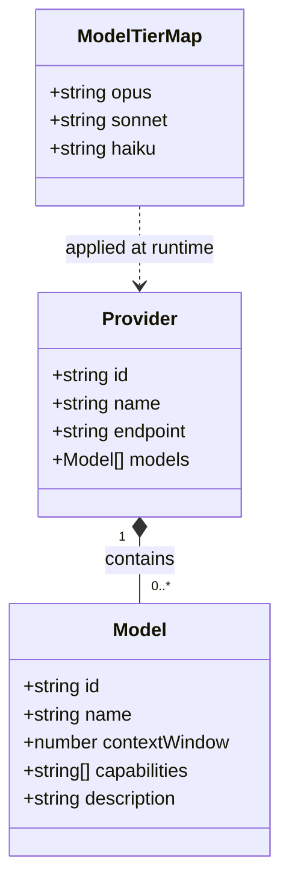
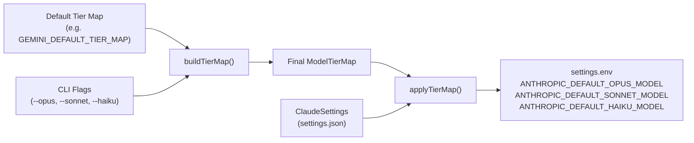

Claude AI Switcher's type system revolves around three interfaces — **`Model`**, **`Provider`**, and **`ModelTierMap`** — that together form the canonical data layer every CLI command, client adapter, and display routine draws from. These types live primarily in [src/models.ts](src/models.ts) and are supplemented by client-specific interfaces in the configuration layer. Understanding their shape and relationships is essential before exploring the tier alias system or adding new providers.

## The Three Core Interfaces

The type hierarchy is intentionally flat. There are no abstract base classes or inheritance chains — just three focused interfaces that compose naturally. The diagram below shows how `Provider` contains an array of `Model` objects, while `ModelTierMap` exists independently and is joined to a provider at runtime through default maps and optional CLI overrides.

Each **`Model`** instance represents a single AI model with five fields. The `id` is the machine-readable identifier used in API calls and CLI arguments (e.g. `"qwen3.6-plus"` or `"claude-opus-4-6-20250205"`). The `name` is a human-friendly label for display. The `contextWindow` is measured in tokens and drives the formatted output shown to users. The `capabilities` array carries descriptive strings like `"Text Generation"`, `"Deep Thinking"`, `"Coding"`, or `"Visual Understanding"` — these are purely informational and used in [display.ts](src/display.ts) output formatting, not in any branching logic. The `description` provides a one-line summary for the CLI model list.

Sources: [models.ts](src/models.ts#L1-L7), [display.ts](src/display.ts#L22-L71)

The **`Provider`** interface wraps a collection of models under a named provider identity. Its `id` serves as the lookup key in the global `providers` record (e.g. `"alibaba"`, `"glm"`, `"ollama"`). The `name` is the display label shown in status output. The optional `endpoint` stores the base URL for providers that route through a custom API endpoint — Anthropic omits this field because it uses Claude Code's default endpoint, while every other provider specifies one. The `models` array holds all `Model` objects available under that provider.

Sources: [models.ts](src/models.ts#L9-L14), [models.ts](src/models.ts#L309-L344)

The **`ModelTierMap`** interface is the bridge between the model catalog and Claude Code's three-tier alias system. It contains exactly three string fields — `opus`, `sonnet`, and `haiku` — each mapping to a model ID that Claude Code will use when its internal logic selects an Opus-class, Sonnet-class, or Haiku-class model. This mapping is critical because Claude Code's architecture assumes the Anthropic three-tier model stratification, and every non-Anthropic provider must translate its own model lineup into this three-tier vocabulary.

Sources: [models.ts](src/models.ts#L16-L20)

## Provider Registry and Model Catalogs

The system uses a centralized **provider registry** — the `providers` record — as a single source of truth. Each key is a provider ID string, and each value is a `Provider` object. This record is constructed from six independent model catalog arrays, each exported as a named constant for direct import by provider-specific logic.

| Provider ID | Display Name | Endpoint | Catalog Constant | Model Count |
|---|---|---|---|---|
| `anthropic` | Anthropic (Default) | *(none — native)* | `anthropicModels` | 5 |
| `alibaba` | Alibaba Coding Plan | `https://coding-intl.dashscope.aliyuncs.com/apps/anthropic` | `alibabaModels` | 9 |
| `glm` | GLM/Z.AI | *(managed by coding-helper)* | `glmModels` | 6 |
| `openrouter` | OpenRouter | `https://openrouter.ai/api/v1` | `openrouterModels` | 2 |
| `ollama` | Ollama (Local) | `http://localhost:4000` | `ollamaModels` | 4 |
| `gemini` | Gemini (Google) | `http://localhost:4001` | `geminiModels` | 3 |

The registry provides two accessor functions: `getModel(providerId, modelId)` retrieves a specific model by ID within a provider, and `getModels(providerId)` returns the full catalog for a provider. These are used throughout the CLI — for example, `switchAlibaba` in [index.ts](src/index.ts) calls `getModels("alibaba")` to validate a user-supplied model ID before proceeding with configuration.

Sources: [models.ts](src/models.ts#L309-L358), [index.ts](src/index.ts#L153-L159)

## Default Tier Maps and Dynamic Generation

Each provider ships with a **default `ModelTierMap`** that assigns the provider's best-fitting models to the three Claude Code tiers. These defaults are exported as named constants:

| Constant | Opus | Sonnet | Haiku |
|---|---|---|---|
| `GLM_DEFAULT_TIER_MAP` | `glm-5.1` | `glm-5v-turbo` | `glm-5-turbo` |
| `OPENROUTER_DEFAULT_TIER_MAP` | `qwen/qwen3.6-plus:free` | `openrouter/free` | `openrouter/free` |
| `OLLAMA_DEFAULT_TIER_MAP` | `deepseek-r1:latest` | `qwen2.5-coder:latest` | `llama3.1:latest` |
| `GEMINI_DEFAULT_TIER_MAP` | `gemini-2.5-pro` | `gemini-2.5-flash` | `gemini-2.5-flash-lite` |

The **Alibaba** provider is a special case: its tier map is generated dynamically by the `getAlibabaTierMap(model)` function. When the default model (`qwen3.6-plus`) is selected, it assigns `qwen3.6-plus` to opus, `kimi-k2.5` to sonnet, and `glm-5` to haiku. When a different model is explicitly chosen, that model becomes the opus tier while the others shift down. This design ensures that the user's explicitly-selected model always occupies the highest tier slot.

Sources: [models.ts](src/models.ts#L22-L69)

The `buildTierMap` helper in [index.ts](src/index.ts#L100-L109) merges a default map with any CLI-provided overrides (`--opus`, `--sonnet`, `--haiku` flags). It takes a base `ModelTierMap` and an options object, replacing only the tier entries where the user supplied an explicit value. This composition pattern means the default maps act as fallbacks while preserving full user control.

Sources: [index.ts](src/index.ts#L100-L109)

## Supporting Interfaces in the Client Layer

Beyond the three core types, the client modules define their own interfaces that describe the shape of configuration files on disk. These are not model definitions per se, but they govern how model and provider data is materialized into actual settings.

The **`ClaudeSettings`** interface in [claude-code.ts](src/clients/claude-code.ts#L12-L15) represents `~/.claude/settings.json` — a loose record with optional `mcpServers` and a dynamic `[key: string]: any` catch-all. The tier map is applied by writing three specific environment variable keys (`ANTHROPIC_DEFAULT_OPUS_MODEL`, `ANTHROPIC_DEFAULT_SONNET_MODEL`, `ANTHROPIC_DEFAULT_HAIKU_MODEL`) into `settings.env`, which is how Claude Code reads model aliases.

The **`OpenCodeSettings`** interface in [opencode.ts](src/clients/opencode.ts#L11-L17) represents `~/.config/opencode/opencode.json`. It uses a different schema — providers are nested objects with their own model definitions that include `modalities`, `limit`, and `options` fields specific to OpenCode's configuration format. Notably, OpenCode does not use the `ModelTierMap` concept; it configures models directly in its provider schema.

Sources: [claude-code.ts](src/clients/claude-code.ts#L12-L39), [opencode.ts](src/clients/opencode.ts#L11-L17)

The **`UserConfig`** interface in [config.ts](src/config.ts#L14-L20) stores per-provider API keys and user preferences (default provider, default model) in `~/.claude-ai-switcher/config.json`. It is the persistence layer for authentication credentials and is accessed through the `getApiKey`, `setApiKey`, and `hasApiKey` helper functions.

Sources: [config.ts](src/config.ts#L14-L20)

## Type Flow Through the System

The following diagram traces how a `ModelTierMap` flows from its default definition through CLI override merging and into the final configuration file:

This flow shows that the `ModelTierMap` is the single abstraction that connects the model catalog to Claude Code's configuration. The `Provider` and `Model` types feed into display logic and model validation, but the tier map is the data structure that actually changes Claude Code's behavior.

## Utility Functions

Two utility functions round out the model module:

- **`formatContext(tokens: number): string`** — Converts raw token counts into human-readable strings like `"1M tokens"`, `"128K tokens"`, or `"500 tokens"`. This is used in both the CLI switch output and the `displayModels` table rendering.
- **`getModel(providerId, modelId): Model | undefined`** and **`getModels(providerId): Model[]`** — Registry accessors that encapsulate the lookup logic, returning `undefined` or an empty array for unknown providers rather than throwing.

Sources: [models.ts](src/models.ts#L71-L79), [models.ts](src/models.ts#L347-L358)

## What Comes Next

With the type foundation established, the next pages explore how these types are used in practice:

- [Model Tier Alias Mapping (Opus/Sonnet/Haiku)](15-model-tier-alias-mapping-opus-sonnet-haiku) details the logic behind each provider's default tier assignments and how model characteristics drive the opus/sonnet/haiku classification.
- [Custom Tier Overrides with --opus, --sonnet, --haiku Flags](16-custom-tier-overrides-with-opus-sonnet-haiku-flags) explains the `buildTierMap` merge mechanism and the CLI flag wiring.