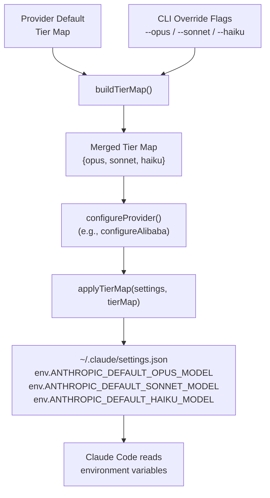

Claude AI Switcher's tier alias system is the bridge between Anthropic's three-tier model naming convention (Opus, Sonnet, Haiku) and the diverse model catalogs offered by non-Anthropic providers. When Claude Code sends a request that references a tier name — for instance "opus" — the tier alias system ensures that request is routed to the correct model on whichever provider is currently active, whether that's a Qwen model on Alibaba, a DeepSeek model on Ollama, or a Gemini model on Google's infrastructure. This abstraction lets you switch providers freely without Claude Code ever needing to know which underlying model it's actually talking to.

Sources: [models.ts](src/models.ts#L16-L27), [claude-code.ts](src/clients/claude-code.ts#L35-L46)

## The ModelTierMap Interface

At the core of the system is a minimal yet precise type definition. The `ModelTierMap` interface declares three string fields — `opus`, `sonnet`, and `haiku` — each holding a model identifier string that a provider understands. Every provider in the system produces one of these maps, and every client configuration function consumes one. This creates a universal contract: regardless of whether you're switching to Alibaba, GLM, OpenRouter, Ollama, or Gemini, the output is always a consistent three-tier mapping.

Sources: [models.ts](src/models.ts#L16-L20)

```typescript
export interface ModelTierMap {
  opus: string;
  sonnet: string;
  haiku: string;
}
```

## Default Tier Maps Per Provider

Each provider ships with a curated default tier map that selects the best available model for each capability tier. These defaults are chosen based on model capability, latency characteristics, and cost — the Opus tier gets the most powerful model, Sonnet gets the balanced mid-tier, and Haiku gets the fastest/cheapest option. The table below summarizes all five provider-specific defaults:

| Provider | Opus (Highest Capability) | Sonnet (Balanced) | Haiku (Fast / Low-Cost) |
|---|---|---|---|
| **GLM/Z.AI** | `glm-5.1` | `glm-5v-turbo` | `glm-5-turbo` |
| **OpenRouter** | `qwen/qwen3.6-plus:free` | `openrouter/free` | `openrouter/free` |
| **Ollama** | `deepseek-r1:latest` | `qwen2.5-coder:latest` | `llama3.1:latest` |
| **Gemini** | `gemini-2.5-pro` | `gemini-2.5-flash` | `gemini-2.5-flash-lite` |
| **Anthropic** | *(cleared — uses native models)* | *(cleared)* | *(cleared)* |

Note that OpenRouter maps both Sonnet and Haiku to `openrouter/free` because the free tier has a single model. Anthropic is a special case: switching to the native Anthropic provider explicitly **clears** all tier map environment variables so that Claude Code uses its built-in model routing.

Sources: [models.ts](src/models.ts#L22-L48), [claude-code.ts](src/clients/claude-code.ts#L48-L57)

## Dynamic Tier Mapping: Alibaba's Adaptive Strategy

Alibaba's provider is the only one that uses a **dynamic** tier map — the `getAlibabaTierMap()` function returns different mappings depending on which model you selected. This design reflects Alibaba's diverse model catalog, which includes models from Qwen, GLM, Kimi, and MiniMax — all accessible through a single API endpoint. The function implements a simple branching logic:

- **When using the default model** (`qwen3.6-plus`): the Opus tier maps to `qwen3.6-plus`, Sonnet to `kimi-k2.5`, and Haiku to `glm-5`. This spreads the tiers across different model families for variety.
- **When using any other specific model**: the selected model becomes the Opus tier, `qwen3.6-plus` shifts down to Sonnet, and `kimi-k2.5` fills the Haiku slot. This ensures the user's chosen model always gets the highest-tier slot.

Sources: [models.ts](src/models.ts#L50-L69)

```typescript
// Default model selected: tier diversity across families
getAlibabaTierMap("qwen3.6-plus")
// → { opus: "qwen3.6-plus", sonnet: "kimi-k2.5", haiku: "glm-5" }

// Specific model selected: user's choice becomes opus
getAlibabaTierMap("glm-5")
// → { opus: "glm-5", sonnet: "qwen3.6-plus", haiku: "kimi-k2.5" }
```

## How Tier Maps Flow to Claude Code

The tier alias system writes its mappings into Claude Code's `~/.claude/settings.json` file using three well-known environment variable keys. The mapping between tier names and environment variable names is defined once as the `TIER_ENV_KEYS` constant — `ANTHROPIC_DEFAULT_OPUS_MODEL`, `ANTHROPIC_DEFAULT_SONNET_MODEL`, and `ANTHROPIC_DEFAULT_HAIKU_MODEL`. When a provider switch occurs, the `applyTierMap()` function injects these three key-value pairs into the `settings.env` object. When switching back to native Anthropic, `clearTierMap()` removes them.

Sources: [claude-code.ts](src/clients/claude-code.ts#L35-L57)

The following diagram shows the complete data flow from a provider's default tier map through CLI override merging and into the Claude Code settings file:



Sources: [index.ts](src/index.ts#L100-L123), [claude-code.ts](src/clients/claude-code.ts#L41-L46)

## The buildTierMap() Merge Function

Every provider switch function calls `buildTierMap()` to produce the final tier map. This function takes two arguments: a `defaultMap` (the provider's static default or the result of `getAlibabaTierMap()`) and an `opts` object containing optional `--opus`, `--sonnet`, and `--haiku` CLI flag values. For each tier, the CLI override takes precedence if provided; otherwise the provider's default is used. This is a simple fallback merge — no validation of the override strings occurs at this layer (validation happens earlier in the switch function when checking against the provider's model catalog).

Sources: [index.ts](src/index.ts#L100-L109)

```typescript
function buildTierMap(
  defaultMap: ModelTierMap,
  opts: { opus?: string; sonnet?: string; haiku?: string }
): ModelTierMap {
  return {
    opus: opts.opus || defaultMap.opus,
    sonnet: opts.sonnet || defaultMap.sonnet,
    haiku: opts.haiku || defaultMap.haiku
  };
}
```

## Tier Map Application and Removal in Settings

The `applyTierMap()` and `clearTierMap()` functions are the two operations that manage the lifecycle of tier aliases within Claude Code's settings file. `applyTierMap()` is straightforward — it ensures the `settings.env` object exists, then writes all three `TIER_ENV_KEYS` entries with the tier map values. `clearTierMap()` performs the inverse: it deletes all three keys from `settings.env`, and if the env object becomes empty, it removes the entire `env` key to keep the settings file clean. This clean removal is critical when switching back to native Anthropic, where no tier overrides should be present.

Sources: [claude-code.ts](src/clients/claude-code.ts#L41-L57)

```jsonc
// settings.json after switching to Alibaba with default model
{
  "env": {
    "ANTHROPIC_AUTH_TOKEN": "sk-...",
    "ANTHROPIC_BASE_URL": "https://coding-intl.dashscope.aliyuncs.com/apps/anthropic",
    "ANTHROPIC_MODEL": "qwen3.6-plus",
    "ANTHROPIC_DEFAULT_OPUS_MODEL": "qwen3.6-plus",
    "ANTHROPIC_DEFAULT_SONNET_MODEL": "kimi-k2.5",
    "ANTHROPIC_DEFAULT_HAIKU_MODEL": "glm-5"
  }
}
```

## Reading Tier Maps Back: The Status Command

When you run `claude-switch status`, the system reads the current tier map back from the settings file. The `getCurrentProvider()` function in the Claude Code client inspects `settings.env` for the three `TIER_ENV_KEYS` and constructs a `tierMap` object with any values it finds. This object is then displayed in the status output, showing the active alias mappings so you can verify that the correct models are assigned to each tier. If no tier map keys are present (as with native Anthropic), the aliases section is simply omitted.

Sources: [claude-code.ts](src/clients/claude-code.ts#L255-L271), [index.ts](src/index.ts#L731-L735)

## Tier Map by Provider: Architectural Comparison

The following table compares how each provider handles tier mapping, highlighting the architectural differences:

| Aspect | GLM / OpenRouter / Ollama / Gemini | Alibaba | Anthropic |
|---|---|---|---|
| **Map Type** | Static constant | Dynamic function | N/A (cleared) |
| **Source** | `*_DEFAULT_TIER_MAP` constant | `getAlibabaTierMap(model)` | `clearTierMap()` |
| **Model-Aware** | No — same map regardless of model | Yes — map changes with model selection | N/A |
| **Opus Strategy** | Best available model | Selected model or default best | Native Claude Opus |
| **Config Target** | `~/.claude/settings.json` env vars | `~/.claude/settings.json` env vars | Removes env vars |
| **CLI Override** | `--opus`, `--sonnet`, `--haiku` flags | `--opus`, `--sonnet`, `--haiku` flags | N/A |

Sources: [models.ts](src/models.ts#L22-L69), [claude-code.ts](src/clients/claude-code.ts#L159-L177)

## Where to Go Next

- To understand the TypeScript type definitions that underpin the tier map, see [Model and Provider Type Definitions](14-model-and-provider-type-definitions).
- To learn how the `--opus`, `--sonnet`, and `--haiku` CLI flags override the defaults at runtime, see [Custom Tier Overrides with --opus, --sonnet, --haiku Flags](16-custom-tier-overrides-with-opus-sonnet-haiku-flags).
- For the full end-to-end switching flow that invokes tier map building, see [How Provider Switching Works: The End-to-End Flow](8-how-provider-switching-works-the-end-to-end-flow).
- To see how the Claude Code client writes tier maps into settings, see [Claude Code Client: Settings, Environment Variables, and Backups](12-claude-code-client-settings-environment-variables-and-backups).