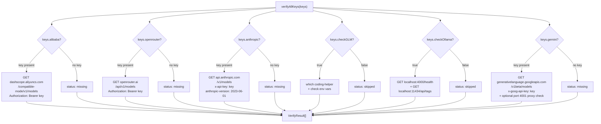

The `claude-switch status` command does more than display your current provider configuration — it silently dispatches a wave of HTTP requests to validate every configured API key in parallel. The verification module at [verify.ts](src/verify.ts) implements a **read-only health-check pattern**: each provider gets a lightweight `GET` request against its models-listing endpoint, and the HTTP status code is decoded into one of five discrete result states. The design is deliberately minimal — no tokens are consumed, no chat completions are triggered, and every check is bounded by a 5-second timeout. This page dissects how the verification orchestrator works, how each provider's check differs, and how results flow back to the console.

Sources: [verify.ts](src/verify.ts#L1-L7)

## The VerifyResult Contract

Every provider check converges on a single `VerifyResult` interface. This contract is the lingua franca between the individual verification functions and the status command's rendering loop — it normalises heterogeneous API responses into a uniform shape that the CLI can display with a consistent icon set.

| Field | Type | Purpose |
|-------|------|---------|
| `provider` | `string` | Identifier matching the provider key (e.g. `"alibaba"`, `"anthropic"`) |
| `status` | `"ok" \| "invalid" \| "missing" \| "error" \| "skipped"` | Discrete outcome of the check |
| `message` | `string?` | Optional human-readable detail (e.g. `"Key valid"`, `"Connection failed"`) |

The five status values form a complete lattice of possible outcomes. **`ok`** means the API responded with HTTP 200 — the key is valid and the endpoint is reachable. **`invalid`** is reserved for HTTP 401/403 responses, indicating the key exists but authentication failed. **`missing`** is assigned before any HTTP call when no key is configured for that provider. **`error`** captures connectivity failures (DNS, timeout, unexpected HTTP codes). **`skipped`** is used for providers that were not requested in the verification batch (e.g. GLM and Ollama when their boolean flags are false).

Sources: [verify.ts](src/verify.ts#L9-L13)

## Timeout and Network Resilience

All HTTP checks route through a single `fetchWithTimeout` wrapper that layers an `AbortController`-based deadline over the standard `fetch` API. The constant `TIMEOUT_MS` is set to **5 000 milliseconds** — long enough for a legitimate response under normal network conditions, but short enough to prevent the status command from hanging when a provider's endpoint is unreachable.

The implementation follows a straightforward pattern: create an `AbortController`, schedule a `setTimeout` that calls `controller.abort()`, then pass the controller's signal into the `fetch` options. The `finally` block guarantees the timer is cleared regardless of outcome, preventing resource leaks. If the timeout fires before the response arrives, the `AbortError` is caught by the outer try/catch in each provider function and translated into an `{ status: "error", message: "Connection failed" }` result.

Sources: [verify.ts](src/verify.ts#L7-L30)

## Provider-Specific Verification Strategies

Each provider has a dedicated verification function tailored to its API surface. Despite the structural similarities, the endpoints, headers, and authentication mechanisms vary significantly. The following diagram illustrates the dispatch pattern and the distinct HTTP targets:

Sources: [verify.ts](src/verify.ts#L150-L197)

### Alibaba (DashScope)

The Alibaba verification hits `https://dashscope.aliyuncs.com/compatible-mode/v1/models` with a `GET` request, passing the API key as a `Bearer` token in the `Authorization` header. This endpoint is distinct from the provider's operational endpoint (`coding-intl.dashscope.aliyuncs.com`) used for actual chat completions — the verification deliberately targets the public model-listing API to avoid any token consumption. A 200 response confirms the key is active; 401/403 signals an invalid or expired key.

Sources: [verify.ts](src/verify.ts#L35-L57), [alibaba.ts](src/providers/alibaba.ts#L19-L20)

### OpenRouter

OpenRouter's check mirrors Alibaba's pattern: a `GET` to `https://openrouter.ai/api/v1/models` with the key as a `Bearer` token. The response semantics are identical — 200 for valid, 401/403 for invalid. OpenRouter's model-listing endpoint is publicly documented and requires no request body, making it an ideal lightweight probe.

Sources: [verify.ts](src/verify.ts#L62-L85), [openrouter.ts](src/providers/openrouter.ts#L19)

### Anthropic

The Anthropic verification differs in its authentication header scheme. Rather than `Authorization: Bearer`, it uses the `x-api-key` header combined with the mandatory `anthropic-version: 2023-06-01` header — matching Anthropic's documented authentication convention. The target is `https://api.anthropic.com/v1/models`. Note that the Anthropic key is sourced from the `ANTHROPIC_API_KEY` environment variable rather than from the local config file, reflecting the fact that Anthropic is the native provider for Claude Code and its key management is external to this tool.

Sources: [verify.ts](src/verify.ts#L121-L145)

### GLM/Z.AI (coding-helper)

GLM is the outlier — it does **not** perform an HTTP health check. Instead, `verifyGLM` runs a local process check: it dynamically imports Node's `child_process.exec` and runs `which coding-helper` (or `where` on Windows) to confirm the CLI tool is installed. If the binary is found, it additionally checks for the presence of `ZHIPUAI_MODEL` or `ZAI_MODEL` environment variables and appends that information to the result message. This two-stage approach reflects GLM's architecture: the `coding-helper` binary manages its own authentication and API routing, so verifying its installation is sufficient to confirm the provider is operational.

Sources: [verify.ts](src/verify.ts#L91-L116)

### Ollama (Local Service)

Ollama verification is a **dual health check** — it probes both the LiteLLM proxy on port 4000 and the Ollama daemon on port 11434. The first request hits `http://localhost:4000/health`; if that fails, the function returns immediately with an error indicating the proxy is not running. If the proxy is healthy, it proceeds to `http://localhost:11434/api/tags` to confirm the Ollama daemon is also responsive. Both checks are read-only `GET` requests requiring no authentication. Only when **both** services respond successfully does the result carry `status: "ok"` with the message `"Ollama + LiteLLM proxy running"`.

Sources: [verify.ts](src/verify.ts#L202-L227), [ollama.ts](src/providers/ollama.ts#L25-L27)

### Gemini

Gemini verification combines a remote API key check with a local proxy status check. The primary request targets `https://generativelanguage.googleapis.com/v1beta/models` using the `x-goog-api-key` header — Google's standard API key authentication. If the key is valid (HTTP 200), the function then **opportunistically** probes `http://localhost:4001/health` to check the LiteLLM proxy status. This proxy check is non-blocking and purely informational — the result message appends `", proxy running"` or `", proxy not running"` without affecting the overall `ok` status. A key that authenticates but has no running proxy is still reported as valid, since the API key itself is correct. Authentication failures return on HTTP 400, 401, or 403.

Sources: [verify.ts](src/verify.ts#L232-L258), [gemini.ts](src/providers/gemini.ts#L25-L26)

## Parallel Dispatch with verifyAllKeys

The `verifyAllKeys` function is the orchestration hub. It accepts a structured keys object and returns a `Promise<VerifyResult[]>`. Rather than checking providers sequentially, it builds an array of `Promise<VerifyResult>` and dispatches them all through `Promise.all` — meaning all six provider checks execute concurrently. The parallelism is a deliberate performance choice: with a 5-second timeout per check, sequential execution could take up to 30 seconds in a worst-case scenario where all endpoints are unreachable. Parallel execution caps the total at roughly 5 seconds regardless of how many providers are configured.

The function uses a conditional dispatch pattern. For key-based providers (Alibaba, OpenRouter, Anthropic, Gemini), it checks whether the key is present; if so, it pushes the actual verification promise, otherwise it pushes a pre-resolved `{ status: "missing" }` promise. For flag-based providers (GLM, Ollama), it checks the boolean flag and either runs the check or returns `{ status: "skipped" }`.

| Provider | Key Source | Missing Behavior | Check Type |
|----------|-----------|-----------------|------------|
| Alibaba | `config.json` | `status: "missing"` | HTTP GET to DashScope models API |
| OpenRouter | `config.json` | `status: "missing"` | HTTP GET to OpenRouter models API |
| Anthropic | `ANTHROPIC_API_KEY` env var | `status: "missing"` | HTTP GET to Anthropic models API |
| Gemini | `config.json` | `status: "missing"` | HTTP GET to Google models API + proxy probe |
| GLM | Boolean flag | `status: "skipped"` | Local binary check (`which coding-helper`) |
| Ollama | Boolean flag | `status: "skipped"` | Dual HTTP GET (proxy + daemon) |

Sources: [verify.ts](src/verify.ts#L150-L197)

## Key Masking for Safe Display

The `maskKey` function provides a minimal obfuscation layer for displaying API keys in the terminal. It preserves the first four and last four characters, replacing everything in between with `...` — for example, `sk-ant-abcdef123456` becomes `sk-a...3456`. Keys shorter than 8 characters are masked entirely as `****`. This ensures that the status output can display enough of the key for the user to visually confirm which key is in use (e.g. distinguishing between a personal key and a team key) without exposing the full secret.

The masking is applied in the status command's rendering loop, where each result is checked against the known key variables. If a key exists for the matching provider, the masked version is appended in dim text after the status detail line.

Sources: [verify.ts](src/verify.ts#L15-L20), [index.ts](src/index.ts#L810-L822)

## Integration with the Status Command

The `claude-switch status` command is the sole consumer of `verifyAllKeys`. After displaying the current Claude Code and OpenCode configuration, it enters the verification phase: it gathers all available keys from the local config file (via `getApiKey`) and the environment variable for Anthropic, wraps the call in an `ora` spinner displaying `"Verifying API keys..."`, and then iterates over the result array to render each provider's status with a colour-coded icon.

| Status | Icon | Colour | Detail Text |
|--------|------|--------|-------------|
| `ok` | ✓ | Green | Provider-specific (e.g. `"Key valid"`) |
| `invalid` | ✗ | Red | `"Authentication failed"` |
| `missing` | ○ | Dim | `"No key configured"` |
| `error` | ⚠ | Yellow | Provider-specific (e.g. `"Connection failed"`) |
| `skipped`/default | – | Dim | `"Skipped"` |

The rendering loop applies the `maskKey` function conditionally — only providers with a present key (Alibaba, OpenRouter, Anthropic, Gemini) display the masked suffix. GLM and Ollama, which are checked via boolean flags rather than stored keys, never display a masked key.

Sources: [index.ts](src/index.ts#L761-L826)

## Design Rationale: Why GET /models?

The verification module consistently targets **model-listing endpoints** (`GET /models` or equivalent) rather than attempting a minimal chat completion. This choice is driven by three factors. First, model-listing endpoints are universally unauthenticated aside from the API key itself — they do not require a request body, model selection, or token budget. Second, they are **costless**: no tokens are consumed, no billing is triggered, and no rate-limit quotas are depleted. Third, the response is deterministic and fast — a simple 200/401/403 status code is sufficient to determine key validity without parsing any response body.

The only exceptions are GLM (which checks local tool installation rather than making an HTTP call) and Ollama (which checks local service health on known ports). These providers don't have traditional API keys, so their verification logic is fundamentally different — confirming the toolchain is present and the services are running is the equivalent of "key is valid."

Sources: [verify.ts](src/verify.ts#L1-L7)

## Related Pages

- [API Key Storage and Local Configuration Management](17-api-key-storage-and-local-configuration-management) — how keys are persisted in `~/.claude-ai-switcher/config.json` and retrieved by the verification module
- [Viewing Status, Current Config, and Model Lists](6-viewing-status-current-config-and-model-lists) — the `status` command that triggers verification and renders results
- [LiteLLM Proxy Lifecycle Management](19-litellm-proxy-lifecycle-management-start-health-check-port-allocation) — the proxy health checks referenced by Ollama and Gemini verification
- [Direct API Providers (Anthropic, Alibaba, OpenRouter)](9-direct-api-providers-anthropic-alibaba-openrouter) — the provider configurations whose endpoints are probed during verification