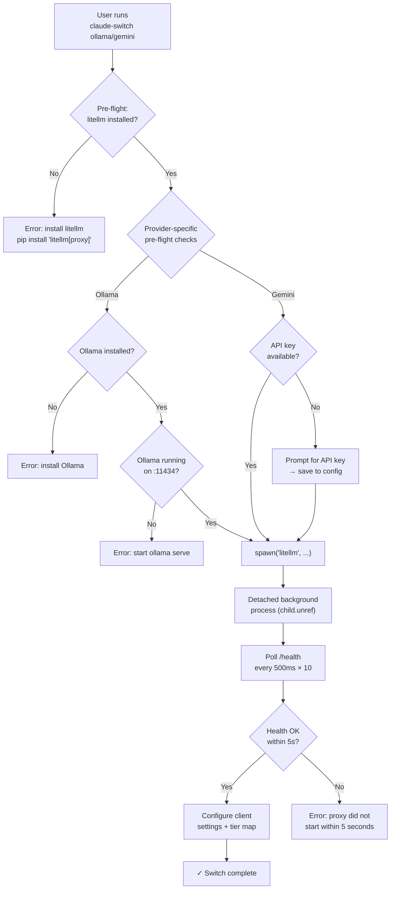

Claude AI Switcher relies on **LiteLLM proxy** to bridge two providers — Ollama and Gemini — into Claude Code's Anthropic-native request format. Both Ollama and Gemini speak the OpenAI Chat Completions protocol, not the Anthropic Messages API that Claude Code emits. The LiteLLM proxy runs as a local background process on a fixed port, translating requests in real time. This page covers the complete lifecycle: how ports are allocated, how the proxy is started as a detached child process, how health is verified through polling, and how the orchestrating code in `index.ts` sequences pre-flight checks before launch.

Sources: [ollama.ts](src/providers/ollama.ts#L1-L12), [gemini.ts](src/providers/gemini.ts#L1-L12)

## Why a Proxy Layer Exists

Claude Code sends requests using the Anthropic Messages API format (with `ANTHROPIC_BASE_URL` pointing to an endpoint). Providers like Ollama and Google Gemini expose only OpenAI-compatible endpoints. Rather than modifying Claude Code itself, Claude AI Switcher deploys a **LiteLLM proxy** as a local translation shim: the proxy accepts Anthropic-format requests on localhost and forwards them as OpenAI-format requests to the underlying provider. This architecture means the switching logic only needs to set environment variables and spawn a proxy — no client-side patches required.

Sources: [ollama.ts](src/providers/ollama.ts#L1-L12), [gemini.ts](src/providers/gemini.ts#L1-L12)

## Port Allocation Strategy

Each proxy-backed provider is assigned a **dedicated, hardcoded port** to prevent conflicts when both Ollama and Gemini are used simultaneously. The allocation is defined as module-level constants:

| Provider | LiteLLM Port | Upstream Service | Upstream Port | Endpoint Constant |
|----------|-------------|-----------------|---------------|-------------------|
| Ollama   | `4000`      | Ollama daemon   | `11434`       | `http://localhost:4000` |
| Gemini   | `4001`      | Google AI API   | N/A (cloud)   | `http://localhost:4001` |

These ports are referenced in three distinct locations, ensuring consistency across the start, configure, and detect phases:

1. **Provider modules** export `OLLAMA_LITELLM_PORT = 4000` and `GEMINI_LITELLM_PORT = 4001` as the canonical port numbers used by `startLitellmProxy()` and `startGeminiLitellmProxy()`.
2. **Client configuration** writes these same URLs into Claude Code settings (`ANTHROPIC_BASE_URL`) and OpenCode settings (`baseURL`), so downstream clients know where to send requests.
3. **Provider detection** in `getCurrentProvider()` matches against `localhost:4000` and `localhost:4001` strings to identify which proxy-backed provider is currently active.

Sources: [ollama.ts](src/providers/ollama.ts#L25-L27), [gemini.ts](src/providers/gemini.ts#L25-L26), [claude-code.ts](src/clients/claude-code.ts#L293-L311), [opencode.ts](src/clients/opencode.ts#L306-L370)

## Lifecycle Overview

The following diagram illustrates the complete proxy lifecycle from the user's `claude-switch ollama` or `claude-switch gemini` command through to a running proxy and configured client:



Sources: [index.ts](src/index.ts#L244-L358)

## Pre-flight Checks

Before spawning any proxy process, the orchestrator in `index.ts` runs a **sequential gate of pre-flight validations**. These checks fail fast with actionable error messages rather than allowing a broken proxy to start silently.

**Ollama pre-flight sequence** (three gates):

1. **LiteLLM installed** — Runs `which litellm` (or `where litellm` on Windows) to verify the CLI binary exists on `$PATH`. Returns an installation instruction if missing.
2. **Ollama installed** — Runs `which ollama` to verify the Ollama binary is available.
3. **Ollama running** — Performs an HTTP `GET` to `http://localhost:11434/api/tags` with a 3-second timeout. This endpoint returns the list of locally available models and confirms the Ollama daemon is accepting connections.

**Gemini pre-flight sequence** (two gates):

1. **LiteLLM installed** — Same `which litellm` check as Ollama.
2. **API key available** — Checks `~/.claude-ai-switcher/config.json` for a stored `geminiApiKey`. If missing, prompts the user interactively and persists the key for future use.

Sources: [index.ts](src/index.ts#L248-L287), [index.ts](src/index.ts#L309-L335), [ollama.ts](src/providers/ollama.ts#L48-L94)

## Proxy Start: Detached Process Spawning

Once pre-flight checks pass, the proxy is launched via Node.js `child_process.spawn()`. Both Ollama and Gemini follow the same structural pattern with two notable differences in their spawn configuration:

| Aspect | Ollama Proxy | Gemini Proxy |
|--------|-------------|-------------|
| Command | `litellm --model ollama/{model} --port 4000` | `litellm --model gemini/{model} --port 4001` |
| `shell` option | `false` | `true` |
| Environment | Inherited from parent | Injected `GEMINI_API_KEY` |
| Idempotency | Returns immediately if proxy already running | Returns immediately if proxy already running |

**Idempotent start**: Both `startLitellmProxy()` and `startGeminiLitellmProxy()` begin by checking whether the proxy is already healthy on the target port. If `isLitellmProxyRunning(port)` returns `true`, the function returns `{ success: true }` immediately without spawning a second process. This makes the switch commands safe to run repeatedly.

**Detachment pattern**: The child process is spawned with `detached: true` and `stdio: "ignore"`, followed by `child.unref()`. This trio ensures the LiteLLM process survives after the Node.js parent exits — critical because `claude-switch` is a CLI tool that terminates after configuration, while the proxy must remain alive for subsequent Claude Code sessions.

**Gemini's `shell: true`**: The Gemini proxy uses `shell: true` in its spawn options because the `GEMINI_API_KEY` environment variable must be injected into the process environment. The env is spread from `process.env` with the API key added: `{ ...process.env, GEMINI_API_KEY: apiKey }`. Ollama requires no secrets (it's purely local), so it uses `shell: false` for a more direct spawn.

Sources: [ollama.ts](src/providers/ollama.ts#L116-L146), [gemini.ts](src/providers/gemini.ts#L98-L136)

## Health Check: Polling the /health Endpoint

After spawning, both proxy start functions enter a **synchronous polling loop** to confirm the proxy is accepting connections before returning control to the caller:

```typescript
// Poll health endpoint for up to 5 seconds
for (let i = 0; i < 10; i++) {
  await new Promise(resolve => setTimeout(resolve, 500));
  if (await isLitellmProxyRunning(port)) {
    return { success: true };
  }
}
```

The polling strategy uses **10 iterations at 500ms intervals**, yielding a maximum wait of 5 seconds. Each iteration calls `isLitellmProxyRunning()`, which performs an HTTP `GET` to `http://localhost:{port}/health` with a 3-second `AbortController` timeout. If any iteration receives an `ok` response, the function returns immediately with `{ success: true }`. If all 10 attempts fail, it returns `{ success: false, error: "LiteLLM proxy did not start within 5 seconds" }`.

The health check function itself is lightweight — it creates a fresh `AbortController` per call, issues a single GET request, and returns a boolean based on `resp.ok`. This design keeps the per-poll overhead minimal (no body parsing, no connection pooling concerns).

Sources: [ollama.ts](src/providers/ollama.ts#L99-L111), [ollama.ts](src/providers/ollama.ts#L131-L139), [gemini.ts](src/providers/gemini.ts#L84-L96), [gemini.ts](src/providers/gemini.ts#L121-L129)

## Verification Layer: Status Command Integration

Beyond the startup health check, the `claude-switch status` command runs a **separate verification pass** through `verifyAllKeys()` in `verify.ts`. This verification uses a higher 5-second timeout (vs. 3 seconds for startup health checks) and provides user-facing diagnostic messages:

**Ollama verification** performs a two-tier check:
1. First probes `http://localhost:4000/health` — if this fails, reports "LiteLLM proxy not running on port 4000".
2. Then probes `http://localhost:11434/api/tags` — if this fails, reports "Ollama not running on port 11434".
3. Only if both succeed does it report `"ok"` with message "Ollama + LiteLLM proxy running".

**Gemini verification** performs a key-first check:
1. Validates the API key by calling `https://generativelanguage.googleapis.com/v1beta/models` directly against Google's cloud API.
2. If the key is valid, additionally probes `http://localhost:4001/health` for informational purposes and appends ", proxy running" or ", proxy not running" to the status message. The proxy status is **non-blocking** for the verification result — a valid key with a stopped proxy still reports `status: "ok"`.

This two-layer approach (startup health gate + status verification) gives users both a hard failure at switch time and a diagnostic view when checking overall system health.

Sources: [verify.ts](src/verify.ts#L200-L258)

## Architectural Comparison: Ollama vs. Gemini Proxy

The following table summarizes the key architectural differences between the two proxy-backed providers:

| Dimension | Ollama | Gemini |
|-----------|--------|--------|
| Port | 4000 | 4001 |
| Model prefix in spawn | `ollama/` | `gemini/` |
| Requires local daemon | Yes (Ollama on :11434) | No (cloud API) |
| Requires API key | No (local only) | Yes (Google AI Studio) |
| Key storage | N/A | `~/.claude-ai-switcher/config.json` |
| Spawn shell mode | `false` | `true` |
| Env injection | None | `GEMINI_API_KEY` |
| Pre-flight gates | 3 (litellm + ollama binary + ollama running) | 2 (litellm + API key) |
| Claude Code auth token | `"ollama"` (dummy) | Actual API key |
| Verification priority | Proxy first, then Ollama | Key first, proxy informational |

Sources: [ollama.ts](src/providers/ollama.ts#L116-L146), [gemini.ts](src/providers/gemini.ts#L98-L136), [claude-code.ts](src/clients/claude-code.ts#L221-L250)

## Process Lifetime and Limitations

The LiteLLM proxy processes spawned by Claude AI Switcher are **fully detached** — they are not tracked, monitored, or automatically stopped by the tool. Once `child.unref()` is called, the process belongs to the OS init system (PID 1 on Linux/macOS). This has several practical implications:

- **No automatic cleanup**: Switching to Anthropic or another provider does not stop the running LiteLLM proxy. It continues consuming the allocated port until manually killed or the system reboots.
- **Port conflicts**: Because ports are hardcoded, only one Ollama proxy and one Gemini proxy can run at a time. If a stale proxy is bound to port 4000 or 4001, the idempotency check (`isLitellmProxyRunning`) will detect it and skip spawning, which is correct behavior if the existing proxy serves the same model.
- **Model mismatch**: If a user switches from `deepseek-r1` to `qwen2.5-coder` under Ollama, the existing proxy on port 4000 is still serving `deepseek-r1`. The idempotency check sees a healthy proxy and returns success without restarting — the model name mismatch is **not detected**. Users needing a different model must manually kill the proxy (`kill $(lsof -ti:4000)`) before switching.

Sources: [ollama.ts](src/providers/ollama.ts#L116-L146), [gemini.ts](src/providers/gemini.ts#L98-L136)

## Related Pages

- [LiteLLM Proxy Providers (Ollama on Port 4000, Gemini on Port 4001)](10-litellm-proxy-providers-ollama-on-port-4000-gemini-on-port-4001) — Provider-level configuration details and available models
- [API Key Verification: Lightweight HTTP Health Checks](18-api-key-verification-lightweight-http-health-checks) — The verification framework used by the `status` command
- [How Provider Switching Works: The End-to-End Flow](8-how-provider-switching-works-the-end-to-end-flow) — The complete flow from CLI invocation to running proxy
- [Claude Code Client: Settings, Environment Variables, and Backups](12-claude-code-client-settings-environment-variables-and-backups) — How `ANTHROPIC_BASE_URL` is written to Claude settings