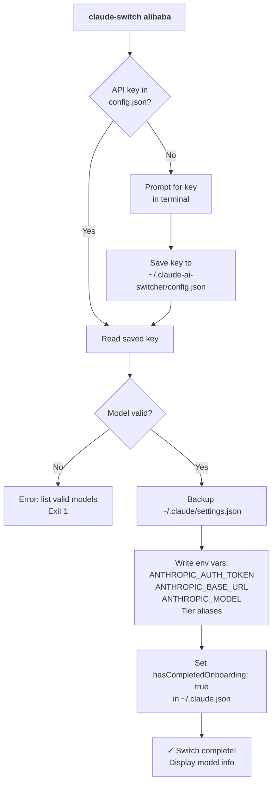

**Claude AI Switcher** gets you from zero to a working provider switch in under two minutes. This page walks you through the prerequisites, the three-command build-and-install sequence, and your first live provider switch so you can see the tool in action immediately. Everything else — advanced flags, multi-provider setups, proxy management — is covered in dedicated pages later in the documentation.

Sources: [package.json](package.json#L1-L47), [README.md](README.md#L1-L4)

## Prerequisites

Before you begin, confirm your environment meets these requirements. The tool is a Node.js CLI written in TypeScript, so the runtime constraint is the only hard dependency.

| Requirement | Minimum Version | How to Verify |
|---|---|---|
| **Node.js** | ≥ 18.0.0 | `node --version` |
| **npm** | bundled with Node | `npm --version` |
| **Operating System** | macOS, Linux, or Windows 11 | — |

On **Windows**, run all build commands inside Git Bash, WSL, or PowerShell. The CLI itself works in any terminal after installation. The `engines` field in `package.json` enforces the Node version constraint at install time.

Sources: [package.json](package.json#L43-L45), [README.md](README.md#L29-L42)

### Optional Dependencies per Provider

Each provider may need additional software or credentials. You only need the extras for providers you actually plan to use.

| Provider | Extra Dependency | API Key Required |
|---|---|---|
| **Anthropic** | None | Uses existing `ANTHROPIC_API_KEY` env var |
| **Alibaba** | None | Yes — prompted on first switch |
| **OpenRouter** | None | Yes — prompted on first switch |
| **GLM / Z.AI** | `@z_ai/coding-helper` (npm global) | No (handled by coding-helper) |
| **Ollama** | Ollama + `litellm[proxy]` (pip) | No (local inference) |
| **Gemini** | `litellm[proxy]` (pip) | Yes — prompted on first switch |

Sources: [src/index.ts](src/index.ts#L244-L358), [README.md](README.md#L5-L18)

## Installation

The installation is a standard Node.js build-and-link workflow. Clone the repository (or download it), then run the three commands below from the project root.

```bash
# 1. Install dependencies
npm install

# 2. Compile TypeScript to JavaScript
npm run build

# 3. Register the CLI globally on your system
npm link
```

After `npm link` completes, the `claude-switch` command is available everywhere in your terminal. Verify it works:

```bash
claude-switch --version
# Expected output: 1.1.0
```

The build compiles TypeScript from `src/` into `dist/` using the configuration in `tsconfig.json`. The shebang line `#!/usr/bin/env node` at the top of the compiled entry point ensures the file is executed as a Node script. The `bin` field in `package.json` maps the `claude-switch` command name to `./dist/index.js`.

Sources: [package.json](package.json#L6-L14), [package.json](package.json#L9-L13), [tsconfig.json](tsconfig.json#L1-L19), [src/index.ts](src/index.ts#L1-L8)

### What Gets Installed Where

The diagram below shows the two configuration locations the tool manages on your system. Understanding these paths helps you troubleshoot and verify switches later.

```
~/
├── .claude/
│   ├── settings.json          ← Claude Code's runtime config
│   └── settings.json.backup.* ← Automatic backups (created on every write)
├── .claude.json               ← Onboarding flag (hasCompletedOnboarding)
├── .claude-ai-switcher/
│   └── config.json            ← Your API keys (alibaba, openrouter, gemini)
└── .config/
    └── opencode/
        └── opencode.json      ← OpenCode provider config (separate client)
```

The tool **never** sends your keys anywhere except the provider endpoint you explicitly select. Keys are stored locally in `~/.claude-ai-switcher/config.json`.

Sources: [src/config.ts](src/config.ts#L11-L12), [src/clients/claude-code.ts](src/clients/claude-code.ts#L31-L33), [src/clients/claude-code.ts](src/clients/claude-code.ts#L100-L112)

## Your First Provider Switch

This section walks you through switching Claude Code from the default Anthropic backend to the **Alibaba Coding Plan** provider — the most common first switch because it offers high-quality models with a generous free tier and requires no additional software beyond the CLI itself.

### Step-by-Step Flow

The flowchart below shows the exact decision path the CLI follows when you run the switch command. You can see where the API key prompt appears and how the tool guards against invalid model names.



Sources: [src/index.ts](src/index.ts#L138-L175), [src/clients/claude-code.ts](src/clients/claude-code.ts#L141-L153), [src/clients/claude-code.ts](src/clients/claude-code.ts#L132-L136)

### Run the Switch Command

With `claude-switch` installed, execute:

```bash
claude-switch alibaba
```

**First run behavior:** Since no API key is stored yet, the CLI will pause and prompt you interactively:

```
⚠ Alibaba API Key not found
  Get your API key from: https://modelstudio.console.alibabacloud.com/

Enter your Alibaba API Key: <paste your key here>
```

Paste your API key and press Enter. The tool saves it to `~/.claude-ai-switcher/config.json` so you will never be prompted for it again. On subsequent switches the saved key is read automatically.

Sources: [src/index.ts](src/index.ts#L80-L98), [src/index.ts](src/index.ts#L144-L151)

### What Just Happened

After a successful switch you'll see output like this:

```
✓ Switched to: Alibaba Coding Plan
──────────────────────────────────────────────────────────
  Model: Qwen3.6-Plus
  Context: 1M tokens
  Endpoint: https://coding-intl.dashscope.aliyuncs.com/apps/anthropic
  Capabilities: Text Generation, Deep Thinking, Visual Understanding
  Balanced performance, speed, and cost. Supports thinking/non-thinking modes with 1M context window.

  Claude model aliases:
    ANTHROPIC_DEFAULT_OPUS_MODEL   → qwen3.6-plus
    ANTHROPIC_DEFAULT_SONNET_MODEL → kimi-k2.5
    ANTHROPIC_DEFAULT_HAIKU_MODEL  → glm-5
```

Under the hood, the CLI performed four actions in sequence:

| Step | Action | File Modified |
|---|---|---|
| 1 | Created a timestamped backup | `~/.claude/settings.json.backup.<timestamp>` |
| 2 | Wrote provider environment variables into settings | `~/.claude/settings.json` → `env` block |
| 3 | Applied tier alias mappings (Opus/Sonnet/Haiku) | `~/.claude/settings.json` → `env` block |
| 4 | Set `hasCompletedOnboarding: true` | `~/.claude.json` |

The key environment variables written to `settings.json` are `ANTHROPIC_AUTH_TOKEN` (your API key), `ANTHROPIC_BASE_URL` (the Alibaba endpoint), and `ANTHROPIC_MODEL` (the selected model ID). Claude Code reads these on startup and routes all requests through the configured provider instead of the default Anthropic API.

Sources: [src/index.ts](src/index.ts#L161-L175), [src/clients/claude-code.ts](src/clients/claude-code.ts#L141-L153), [src/clients/claude-code.ts](src/clients/claude-code.ts#L100-L136)

## Verifying Your Switch

After switching, confirm everything is wired correctly with the **status** command. This command displays your current provider configuration and performs live API key verification against each provider's health endpoint.

```bash
claude-switch status
```

You'll see output similar to:

```
=== Claude AI Switcher Status ===

  Claude Code:
    Provider: alibaba
    Model: qwen3.6-plus
    Endpoint: https://coding-intl.dashscope.aliyuncs.com/apps/anthropic
    Aliases:
      opus   → qwen3.6-plus
      sonnet → kimi-k2.5
      haiku  → glm-5

  API Key Verification:
──────────────────────────────────────────────────
    ✓ Anthropic     No key configured
    ✓ Alibaba       Valid (sk-••••••••AbCD)
    ○ OpenRouter    No key configured
    ○ GLM           No key configured
    ○ Ollama        No key configured
    ○ Gemini        No key configured
──────────────────────────────────────────────────
```

The status icons mean: **✓** key is valid, **✗** key is invalid, **○** no key stored, **⚠** verification error (network issue, etc.).

Sources: [src/index.ts](src/index.ts#L715-L831), [README.md](README.md#L176-L179)

## Switching Back to Anthropic

To return Claude Code to its default behavior (native Anthropic Claude models), run:

```bash
claude-switch anthropic
```

This command clears the `ANTHROPIC_AUTH_TOKEN`, `ANTHROPIC_BASE_URL`, and `ANTHROPIC_MODEL` environment variables from `~/.claude/settings.json`, removes the tier alias mappings, and restores Claude Code's default routing to the Anthropic API. Your previously stored API keys in `~/.claude-ai-switcher/config.json` remain untouched — only the active routing configuration is changed.

Sources: [src/clients/claude-code.ts](src/clients/claude-code.ts#L159-L178), [src/index.ts](src/index.ts#L129-L136)

## Choosing a Different Model

The default Alibaba model is `qwen3.6-plus`, but you can specify any model from the provider's catalog as a positional argument:

```bash
claude-switch alibaba qwen3-coder-plus
```

Before applying the switch, the CLI validates the model ID against the built-in model catalog. If you provide an invalid model name, the tool lists all valid options and exits — no configuration files are modified.

Sources: [src/index.ts](src/index.ts#L153-L159), [README.md](README.md#L52-L54)

## Quick Reference: All Switch Commands

| Command | Effect | Extra Dependencies |
|---|---|---|
| `claude-switch anthropic` | Restore default Anthropic routing | None |
| `claude-switch alibaba [model]` | Switch to Alibaba Coding Plan | None |
| `claude-switch openrouter [model]` | Switch to OpenRouter | None |
| `claude-switch glm` | Switch to GLM/Z.AI | `@z_ai/coding-helper` |
| `claude-switch ollama [model]` | Switch to local Ollama | Ollama + LiteLLM proxy |
| `claude-switch gemini [model]` | Switch to Google Gemini | LiteLLM proxy |

All commands also work with the explicit `claude` prefix: `claude-switch claude alibaba`, `claude-switch claude anthropic`, etc.

Sources: [src/index.ts](src/index.ts#L364-L439), [README.md](README.md#L86-L115)

## Troubleshooting

| Symptom | Cause | Fix |
|---|---|---|
| `command not found: claude-switch` | `npm link` not run or failed | Re-run `npm link` from the project root |
| `Unable to connect to Anthropic services` in Claude Code | Onboarding flag not set | The switch command sets this automatically; re-run `claude-switch alibaba` |
| `Invalid model: xyz` | Model ID not in catalog | Run `claude-switch models alibaba` to see valid IDs |
| `LiteLLM is required` (Ollama/Gemini) | Missing Python dependency | `pip install 'litellm[proxy]'` |
| `Ollama is not running` | Ollama daemon not started | Run `ollama serve` in a separate terminal |

Sources: [src/index.ts](src/index.ts#L248-L269), [src/clients/claude-code.ts](src/clients/claude-code.ts#L129-L136)

## Where to Go Next

You now have the tool installed and understand the core switch workflow. Here's the recommended reading path to deepen your knowledge:

1. **[Interactive Setup Wizard](3-interactive-setup-wizard)** — Walk through the `claude-switch setup` command to configure all your API keys at once in a guided flow.
2. **[Switching Providers for Claude Code](4-switching-providers-for-claude-code)** — Master all switch commands, custom model selection, and tier alias overrides (`--opus`, `--sonnet`, `--haiku`).
3. **[Viewing Status, Current Config, and Model Lists](6-viewing-status-current-config-and-model-lists)** — Learn the full `status`, `current`, `list`, and `models` inspection commands.
4. **[API Key Storage and Local Configuration Management](17-api-key-storage-and-local-configuration-management)** — Understand exactly how and where your keys are stored.