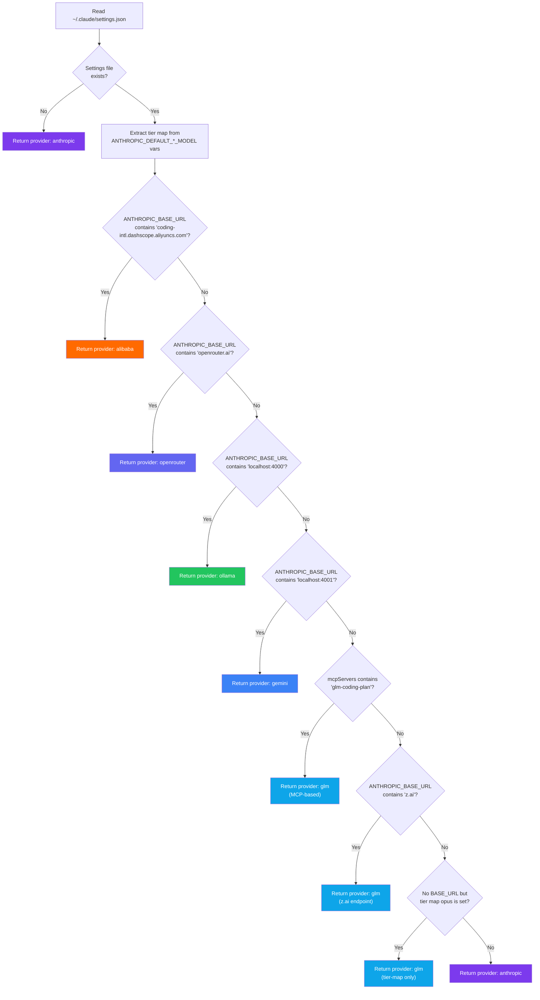

**Provider detection** is the subsystem that answers a deceptively simple question: *which AI provider is Claude Code currently configured to use?* The answer requires inspecting `~/.claude/settings.json` — the single source of truth for Claude Code's runtime environment — and applying a priority-ordered chain of heuristic checks against known provider fingerprints. This page explains the detection algorithm, the data structures it reads, how different providers leave distinct traces in the settings file, and how the CLI consumes the detection result to power the `status` and `current` commands.

Sources: [claude-code.ts](src/clients/claude-code.ts#L255-L340)

## The Settings File as Provider State

Claude Code stores its configuration in `~/.claude/settings.json`. When `claude-switch` switches providers, it writes a specific combination of environment variables into the `env` field of this JSON file. Claude Code itself reads these environment variables at startup to determine which API endpoint to call and which model to use. The `env` field is a flat key-value map that mirrors the process environment Claude Code would see — but persisted across sessions.

Three environment variables form the **primary provider fingerprint**:

| Variable | Purpose | Example |
|---|---|---|
| `ANTHROPIC_BASE_URL` | The API endpoint URL Claude Code calls | `https://openrouter.ai/api/v1` |
| `ANTHROPIC_AUTH_TOKEN` | The API key or token for authentication | `sk-or-v1-...` |
| `ANTHROPIC_MODEL` | The default model identifier | `qwen3.6-plus` |

Three additional variables form the **tier alias fingerprint**, mapping Claude Code's built-in opus/sonnet/haiku tier names to provider-specific model IDs:

| Variable | Purpose | Example |
|---|---|---|
| `ANTHROPIC_DEFAULT_OPUS_MODEL` | Model used when Claude Code requests "opus" tier | `gemini-2.5-pro` |
| `ANTHROPIC_DEFAULT_SONNET_MODEL` | Model used when Claude Code requests "sonnet" tier | `gemini-2.5-flash` |
| `ANTHROPIC_DEFAULT_HAIKU_MODEL` | Model used when Claude Code requests "haiku" tier | `gemini-2.5-flash-lite` |

When no provider overrides are active (i.e., the user is on native Anthropic), these six environment variables are simply absent from the `env` field — or the `env` field itself may be empty or missing.

Sources: [claude-code.ts](src/clients/claude-code.ts#L31-L46)

## Provider Fingerprints and Detection Priority

The `getCurrentProvider()` function in `src/clients/claude-code.ts` implements a **priority-ordered detection chain**. Each check inspects the `ANTHROPIC_BASE_URL` value for a known substring that uniquely identifies a provider. Because URL substrings are distinct (no provider shares a domain with another), the detection is deterministic and requires no additional API calls.



The complete priority order and detection signatures are:

| Priority | Provider | Detection Signal | Settings Path |
|---|---|---|---|
| 1 | Alibaba | `ANTHROPIC_BASE_URL` contains `coding-intl.dashscope.aliyuncs.com` | `env.ANTHROPIC_BASE_URL` |
| 2 | OpenRouter | `ANTHROPIC_BASE_URL` contains `openrouter.ai` | `env.ANTHROPIC_BASE_URL` |
| 3 | Ollama | `ANTHROPIC_BASE_URL` contains `localhost:4000` | `env.ANTHROPIC_BASE_URL` |
| 4 | Gemini | `ANTHROPIC_BASE_URL` contains `localhost:4001` | `env.ANTHROPIC_BASE_URL` |
| 5 | GLM (MCP) | `mcpServers["glm-coding-plan"]` exists | `mcpServers.glm-coding-plan` |
| 6 | GLM (z.ai) | `ANTHROPIC_BASE_URL` contains `z.ai` | `env.ANTHROPIC_BASE_URL` |
| 7 | GLM (tier only) | No `ANTHROPIC_BASE_URL` but tier alias env vars set | `env.ANTHROPIC_DEFAULT_*_MODEL` |
| 8 | Anthropic | Fallback — no provider signals detected | *(absence of signals)* |

The ordering is significant. Alibaba is checked first because its full URL is the most specific. The three GLM detection paths (5–7) exist because GLM/Z.AI can be configured through different mechanisms depending on whether the `coding-helper` tool is installed and how it was set up. The GLM provider is unique in that it can be detected without any `ANTHROPIC_BASE_URL` at all — the presence of tier alias variables alone is sufficient evidence that GLM is active.

Sources: [claude-code.ts](src/clients/claude-code.ts#L255-L340)

## The Return Type: A Provider Snapshot

The `getCurrentProvider()` function returns a structured object that captures everything the CLI needs to display about the current provider state:

```typescript
{
  provider: string;        // "anthropic" | "alibaba" | "openrouter" | "ollama" | "gemini" | "glm"
  model?: string;          // The ANTHROPIC_MODEL value (if set)
  endpoint?: string;       // The ANTHROPIC_BASE_URL value (if set)
  tierMap?: {              // Tier alias mapping (if any are set)
    opus?: string;
    sonnet?: string;
    haiku?: string;
  }
} | null
```

Every field except `provider` is optional because not all providers configure every field. Anthropic, for instance, returns only `{ provider: "anthropic" }` with no model, endpoint, or tier map — it uses Claude Code's built-in defaults. Alibaba, by contrast, returns all four fields because it overrides the endpoint, sets a specific model, and applies tier aliases. GLM returns a tier map but may not return a model or endpoint, depending on which of the three detection paths matched.

Sources: [claude-code.ts](src/clients/claude-code.ts#L255-L271)

## How the Detection Result Is Constructed

Before entering the priority chain, the function extracts the tier map in a single pass from the settings `env` object. The `TIER_ENV_KEYS` constant maps tier names to their Claude Code environment variable names, and the extraction reads all three values — which may be `undefined` if not set:

```typescript
const TIER_ENV_KEYS = {
  opus:   "ANTHROPIC_DEFAULT_OPUS_MODEL",
  sonnet: "ANTHROPIC_DEFAULT_SONNET_MODEL",
  haiku:  "ANTHROPIC_DEFAULT_HAIKU_MODEL"
} as const;

const tierMap = settings.env ? {
  opus:   settings.env[TIER_ENV_KEYS.opus],
  sonnet: settings.env[TIER_ENV_KEYS.sonnet],
  haiku:  settings.env[TIER_ENV_KEYS.haiku]
} : undefined;
```

This `tierMap` object is then attached to every provider result in the chain. Even if the detection identifies the provider as "alibaba," the tier map values are still included because the CLI `status` command displays them regardless of which provider is active. This avoids a second read of the settings file.

Sources: [claude-code.ts](src/clients/claude-code.ts#L35-L39), [claude-code.ts](src/clients/claude-code.ts#L267-L271)

## Consumption: The `status` and `current` Commands

Two CLI commands consume the detection result. The `status` command provides a comprehensive view including API key verification, while the `current` command is a lightweight alternative showing only the active provider, model, endpoint, and tier aliases. Both commands follow the same pattern: call `getClaudeProvider()` (the imported alias for `getCurrentProvider`), then conditionally render each field only if it has a value.

The rendering logic in the `status` command handler:

| Returned Field | Rendered As | Condition |
|---|---|---|
| `provider` | `Provider: <name>` | Always |
| `model` | `Model: <model-id>` | Only if truthy |
| `endpoint` | `Endpoint: <url>` | Only if truthy |
| `tierMap.opus` | `Aliases: opus → <id>, sonnet → <id>, haiku → <id>` | Only if `tierMap.opus` is truthy |

This design means that an Anthropic configuration shows minimal output (just "Provider: anthropic") while an Alibaba or GLM configuration shows the full matrix of model aliases — giving the user exactly the information they need without noise.

Sources: [index.ts](src/index.ts#L716-L831), [index.ts](src/index.ts#L833-L870)

## The Edge Case: No Settings File

If `~/.claude/settings.json` does not exist at all, the function returns `{ provider: "anthropic" }` immediately without attempting to read the file. This is the correct default because Claude Code, in the absence of any settings overrides, connects to Anthropic's API using its built-in configuration. The `status` command handles this case explicitly: if `claudeSettingsExists()` returns `false`, it prints "Not configured (using defaults)" instead of calling `getCurrentProvider()` at all.

Sources: [claude-code.ts](src/clients/claude-code.ts#L261-L263), [index.ts](src/index.ts#L725-L742)

## OpenCode Detection: A Simpler Parallel

The OpenCode client (`src/clients/opencode.ts`) implements a parallel but structurally different detection mechanism. Instead of inspecting environment variable substrings, it checks for named provider keys in the `provider` field of `~/.config/opencode/opencode.json`. The priority order is: `bailian-coding-plan` (Alibaba) → `openrouter` → `ollama` → `gemini` → fallback to `anthropic`. Each provider key is a well-known string rather than a URL substring, making the detection more explicit but less flexible.

Sources: [opencode.ts](src/clients/opencode.ts#L450-L494)

## Detection vs. Configuration: A Critical Distinction

It is important to understand that **detection is read-only**. The `getCurrentProvider()` function never modifies `~/.claude/settings.json`. It is the mirror image of the configuration functions (`configureAlibaba`, `configureOpenRouter`, etc.) that *write* the settings. The detection function reads exactly what those configuration functions wrote, using the same key names and URL patterns. This symmetry is the architectural contract that makes detection reliable: if `configureAlibaba` writes `ANTHROPIC_BASE_URL` with a value containing `coding-intl.dashscope.aliyuncs.com`, then `getCurrentProvider` will always detect "alibaba" by checking for that same substring.

Sources: [claude-code.ts](src/clients/claude-code.ts#L141-L153), [claude-code.ts](src/clients/claude-code.ts#L273-L281)

## Related Pages

- [Claude Code Client: Settings, Environment Variables, and Backups](12-claude-code-client-settings-environment-variables-and-backups) — covers the full read/write lifecycle of `~/.claude/settings.json`
- [How Provider Switching Works: The End-to-End Flow](8-how-provider-switching-works-the-end-to-end-flow) — places detection in the broader context of a complete switch operation
- [Viewing Status, Current Config, and Model Lists](6-viewing-status-current-config-and-model-lists) — the CLI commands that consume the detection result
- [Model and Provider Type Definitions](14-model-and-provider-type-definitions) — the TypeScript interfaces that define the provider and model data structures