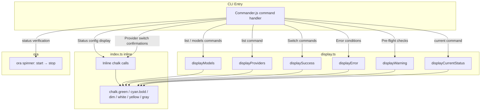

Claude AI Switcher is a CLI tool that lives entirely in the terminal — every interaction the user has with it flows through `console.log` statements decorated by two libraries: **Chalk** for semantic color-coding and text styling, and **Ora** for ephemeral spinners during asynchronous operations. This page dissects the formatting layer's architecture, its color semantics, the reusable display functions in `display.ts`, and the single Ora spinner integration in the `status` command.

Sources: [package.json](package.json#L30-L35), [display.ts](src/display.ts#L1-L152)

## Dependency Profile

Both libraries are pinned as production dependencies and ship with the compiled output. Chalk 5 uses pure ESM, and Ora 8 follows the same pattern — which is why the project's `tsconfig.json` compiles to ES modules and the `ora` import uses dynamic `await import()` at the call site.

| Library | Version | Role | Import Style |
|---------|---------|------|-------------|
| **chalk** | `^5.3.0` | Terminal string styling (colors, bold, dim) | Static `import chalk from "chalk"` |
| **ora** | `^8.0.1` | Terminal spinner for async operations | Dynamic `const ora = (await import("ora")).default` |

The dynamic import for Ora is a deliberate architectural choice: the spinner is only needed during the `status` command's API key verification phase. By dynamically importing it, the library code is never loaded into memory for any other command — a marginal but principled optimization for a tool that runs on every provider switch.

Sources: [package.json](package.json#L30-L35), [index.ts](src/index.ts#L11), [index.ts](src/index.ts#L771-L773)

## The Display Module: Reusable Formatting Functions

The `src/display.ts` file acts as the project's presentation layer — a thin but intentional abstraction that encapsulates all structured output patterns. It exports seven functions, each with a single responsibility, each using Chalk to enforce a consistent visual language.

Sources: [display.ts](src/display.ts#L1-L152)

### Function Catalog

| Function | Purpose | Chalk Styles Used |
|----------|---------|-------------------|
| `formatTableRow(columns, widths)` | Pads columns for aligned table output | None (returns raw string) |
| `displayModels(providerName, models, currentModel?)` | Renders a model catalog with headers, separators, and row highlighting | `green`, `dim`, `cyan.bold`, `green.bold`, `white`, `yellow`, `gray` |
| `displayCurrentStatus(provider, model?, endpoint?)` | Shows current provider/model/endpoint in a key-value layout | `green`, `cyan.bold`, `white`, `dim` |
| `displaySuccess(message)` | Success feedback with ✓ icon | `green` |
| `displayError(message)` | Error feedback with ✗ icon | `red` |
| `displayWarning(message)` | Warning feedback with ⚠ icon | `yellow` |
| `displayInfo(message)` | Informational feedback with ℹ icon | `blue` |
| `displayProviders(providers)` | Lists available providers with model counts | `green`, `cyan.bold`, `dim` |

The `formatTableRow` function is notable for being the only export that doesn't apply Chalk styling itself — it returns a raw padded string. Color is applied by the caller before the strings reach `formatTableRow`, making it a pure layout utility. This separation means the alignment logic is decoupled from the color semantics.

Sources: [display.ts](src/display.ts#L10-L17), [display.ts](src/display.ts#L22-L71), [display.ts](src/display.ts#L76-L90), [display.ts](src/display.ts#L95-L118), [display.ts](src/display.ts#L135-L151)

## Color Semantics: A Consistent Visual Vocabulary

The project enforces a strict color-to-meaning mapping across both `display.ts` and the inline Chalk calls in `index.ts`. This isn't accidental — every color choice maps to a specific user cognition pattern.

```
┌──────────────────────────────────────────────────────────────────┐
│                   Color → Semantics Mapping                      │
├────────────┬─────────────────────────────────────────────────────┤
│  green     │  Success, confirmation, active state (✓, ●)        │
│  red       │  Error, failure (✗)                                 │
│  yellow    │  Warning, context window sizes, attention (⚠)       │
│  blue      │  Informational messages (ℹ)                         │
│  cyan.bold │  Labels, headers, section titles                    │
│  white     │  Primary data values (model names, provider names)  │
│  gray      │  Secondary metadata (capabilities, status detail)   │
│  dim       │  Tertiary info: separators, descriptions, hints     │
└────────────┴─────────────────────────────────────────────────────┘
```

This mapping is visible in the provider switch confirmation pattern — a template repeated identically for Alibaba, OpenRouter, Ollama, and Gemini. Each switch result renders:

```
✓ Switched to: <Provider Name>          ← green
────────────────────────────────────────── ← dim separator
  Model: <model.name>                    ← cyan.bold label + white value
  Context: <128K tokens>                 ← cyan.bold label + yellow value
  Endpoint: <url>                        ← cyan.bold label + dim value
  Capabilities: <list>                   ← cyan.bold label + gray value
  <description>                          ← dim
```

The consistency of this template means a user switching between providers always sees the same visual structure — only the values change. This reduces cognitive load when switching contexts rapidly.

Sources: [index.ts](src/index.ts#L165-L172), [index.ts](src/index.ts#L232-L239), [index.ts](src/index.ts#L293-L299), [index.ts](src/index.ts#L348-L354), [display.ts](src/display.ts#L81-L89)

## The Ora Spinner: Single-Use Async Feedback

Ora appears in exactly one location: the `status` command's API key verification flow. The pattern is minimal but instructive:

```typescript
const ora = (await import("ora")).default;
const spinner = ora("Verifying API keys...").start();

const results = await verifyAllKeys({ ... });

spinner.stop();
```

The spinner lifecycle is deliberately simple — it starts before the parallel API verification calls and stops unconditionally after they complete. There's no `.succeed()` or `.fail()` call; the spinner text simply disappears and is replaced by the per-provider verification results that follow. This means the spinner serves as a pure progress indicator, not a result renderer.

After the spinner stops, each verification result gets its own Chalk-styled icon and text, following the same color semantics table above:

| `result.status` | Icon | Chalk Color | Example Detail |
|-----------------|------|-------------|----------------|
| `ok` | ✓ | `green` | "Key valid" + masked key |
| `invalid` | ✗ | `red` | "Authentication failed" |
| `missing` | ○ | `dim` | "No key configured" |
| `error` | ⚠ | `yellow` | "Connection failed" |

Sources: [index.ts](src/index.ts#L771-L784), [index.ts](src/index.ts#L786-L823)

## Structural Layout Patterns

Beyond individual color choices, the project employs three recurring structural patterns for terminal output.

**The Separator Rule.** Horizontal rules built from `─` characters repeated 50–80 times, rendered with `chalk.dim()`, divide output into logical sections. The separator width varies by context: 80 characters for model tables, 60 for provider switch confirmations, 50 for verification results. This width variation subtly communicates the density of the information that follows.

**The Nested Indentation Pattern.** Provider data is always indented two spaces from the left margin. Sub-details (like tier aliases) get four spaces. This creates a visual hierarchy without requiring box-drawing or borders:

```
  Claude Code:                              ← cyan.bold, 2-space indent
    Provider: Anthropic                     ← 4-space indent
    Model: claude-sonnet-4-20250514         ← 4-space indent
    Aliases:                                ← dim, 4-space indent
      opus   → claude-opus-4-20250514       ← 6-space indent
```

**The Icon-Prefixed Message Pattern.** The four `displaySuccess`/`displayError`/`displayWarning`/`displayInfo` functions all prefix their messages with a Unicode icon (`✓`, `✗`, `⚠`, `ℹ`) followed by the Chalk-colored text. This means `grep`-ability is maintained — the icon uniquely identifies the message category without needing to parse color codes.

Sources: [display.ts](src/display.ts#L95-L118), [display.ts](src/display.ts#L33-L70), [index.ts](src/index.ts#L724-L741)

## Inline Chalk in index.ts: Why Not Everything Goes Through display.ts

While `display.ts` provides the reusable primitives, `index.ts` contains extensive inline Chalk usage that doesn't go through the display module. This is an architectural tradeoff, not an oversight. The inline calls fall into two categories:

**Context-specific formatting** that composes display functions with provider-specific data in ways that don't generalize. For example, the provider switch confirmation template is structurally identical across providers, but each provider's data (endpoint URL, description, capabilities) comes from different sources and is rendered with slightly different conditional logic. Extracting this into a generic `displayProviderSwitch(provider, model, endpoint, ...)` function would add abstraction without reducing complexity.

**Status and configuration display** in the `status` and `current` commands, where the output structure varies based on runtime conditions (whether settings files exist, whether tier maps are configured). The conditional nesting makes a shared function impractical.

What `display.ts` does export are the **reusable primitives**: `displaySuccess`, `displayError`, `displayWarning`, and `displayProviders` — functions whose input/output contract is stable regardless of which command calls them. The provider-specific rendering stays inline because it's tightly coupled to command logic.

Sources: [index.ts](src/index.ts#L125-L203), [display.ts](src/display.ts#L95-L118)

## The Duplicate formatContext Function

An interesting archaeological detail: `formatContext` exists in both `src/models.ts` (line 72) and `src/display.ts` (line 123) with identical implementations. The `models.ts` version is the canonical one — `index.ts` imports it directly from `./models.js` and uses it in provider switch confirmations. The `display.ts` version is used internally by `displayModels`. Both functions convert a token count into a human-readable string like "128K tokens" or "1M tokens".

This duplication exists because `displayModels` needs the formatting but `display.ts` was designed as a self-contained presentation module. A refactoring could eliminate the duplication by having `display.ts` import from `models.ts`, but the current structure keeps `display.ts` dependency-free (it only imports Chalk).

Sources: [models.ts](src/models.ts#L72-L79), [display.ts](src/display.ts#L123-L130), [index.ts](src/index.ts#L18)

## Interaction Diagram: Display Functions in Command Flow



The diagram shows how command handlers bifurcate their output: reusable patterns (success, error, warning, model tables) route through `display.ts`, while context-heavy rendering (provider switch confirmations, configuration display) uses inline Chalk directly. The Ora spinner is an isolated branch used exclusively by the `status` command.

Sources: [index.ts](src/index.ts#L1-L70), [display.ts](src/display.ts#L1-L152)

## Extending the Display Layer

When adding a new provider (as described in [Adding a New Provider: Step-by-Step Implementation Guide](23-adding-a-new-provider-step-by-step-implementation-guide)), the display layer requires attention in two areas:

1. **The provider switch confirmation** in `index.ts` should follow the existing template: `chalk.green` for the header, `chalk.dim` for the separator, and the `chalk.cyan.bold` / `chalk.white` / `chalk.yellow` / `chalk.dim` / `chalk.gray` pattern for each detail row.

2. **Error and warning messages** during pre-flight checks should use `displayError()` and `displayWarning()` from `display.ts`, with `chalk.dim()` for follow-up instructions (e.g., install commands).

The model data for `displayModels()` and `displayProviders()` flows automatically from the provider registry defined in `models.ts` — no display changes are needed there.

Sources: [index.ts](src/index.ts#L244-L303), [display.ts](src/display.ts#L22-L71)

## Related Pages

- **[Project Architecture and Module Responsibilities](7-project-architecture-and-module-responsibilities)** — how `display.ts` fits into the overall module structure
- **[How Provider Switching Works: The End-to-End Flow](8-how-provider-switching-works-the-end-to-end-flow)** — where display calls occur in the switching pipeline
- **[API Key Verification: Lightweight HTTP Health Checks](18-api-key-verification-lightweight-http-health-checks)** — the verification logic that Ora's spinner wraps
- **[Adding a New Provider: Step-by-Step Implementation Guide](23-adding-a-new-provider-step-by-step-implementation-guide)** — practical guide showing where to add display output for new providers
- **[Build Toolchain: TypeScript Configuration and npm Scripts](24-build-toolchain-typescript-configuration-and-npm-scripts)** — how ESM imports for Chalk and Ora are configured at build time