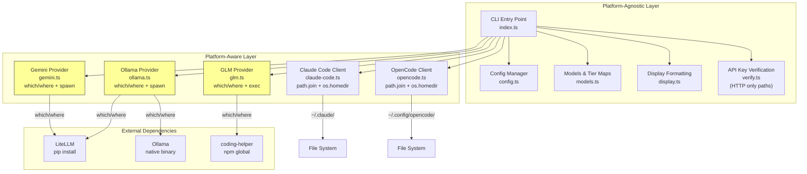
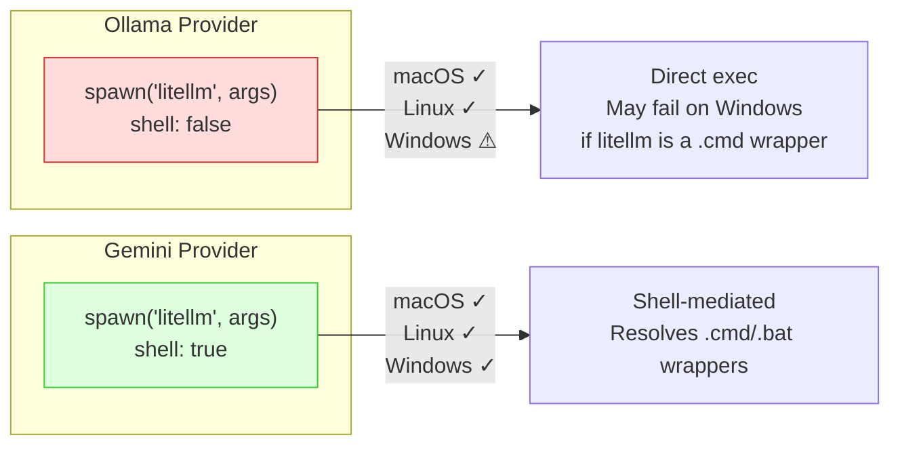

Claude AI Switcher is designed as a **Node.js CLI tool** first, which means its baseline cross-platform compatibility comes from the Node.js runtime itself rather than platform-specific native code. The tool targets Node.js ≥18 (declared in `package.json`'s `engines` field) and compiles TypeScript to ES2020 CommonJS — a combination that runs identically on macOS, Linux, and Windows. This page examines every layer where the operating system matters: file path resolution, external binary detection, process spawning, network binding, and configuration directory conventions — identifying both the robust patterns and the edge cases a contributor should understand.

Sources: [package.json](package.json#L43-L46), [tsconfig.json](tsconfig.json#L1-L19), [src/index.ts](src/index.ts#L1-L8)

## Architecture: Where the Platform Boundary Exists

The following diagram maps every module to its cross-platform concern, showing which layers are fully abstracted by Node.js and which require explicit platform branching:



The yellow-highlighted modules in the **Platform-Aware Layer** are the only files that contain explicit OS branching logic. Everything else — the CLI parser, config manager, display formatting, and HTTP-based verification — relies entirely on cross-platform Node.js APIs.

Sources: [src/config.ts](src/config.ts#L1-L12), [src/display.ts](src/display.ts#L1-L6), [src/providers/ollama.ts](src/providers/ollama.ts#L14), [src/providers/gemini.ts](src/providers/gemini.ts#L49-L56), [src/providers/glm.ts](src/providers/glm.ts#L8)

## File Path Resolution: The `os.homedir()` + `path.join()` Pattern

The most critical cross-platform concern for a configuration tool is **where files live on disk**. Claude AI Switcher follows a single consistent pattern throughout its codebase: it uses `os.homedir()` to resolve the user's home directory and `path.join()` to construct all file paths. These two Node.js APIs automatically produce the correct separator (`/` on Unix, `\` on Windows) and resolve the home directory correctly regardless of platform (`/Users/name` on macOS, `/home/name` on Linux, `C:\Users\name` on Windows).

**Configuration directory locations and how they're constructed:**

| Module | Path Resolved | Code Pattern | macOS Result | Linux Result | Windows Result |
|--------|--------------|--------------|-------------|-------------|---------------|
| Claude Code Client | `~/.claude/` | `path.join(os.homedir(), ".claude")` | `/Users/name/.claude/` | `/home/name/.claude/` | `C:\Users\name\.claude\` |
| Claude Code JSON | `~/.claude.json` | `path.join(os.homedir(), ".claude.json")` | `/Users/name/.claude.json` | `/home/name/.claude.json` | `C:\Users\name\.claude.json` |
| OpenCode Client | `~/.config/opencode/` | `path.join(os.homedir(), ".config", "opencode")` | `/Users/name/.config/opencode/` | `/home/name/.config/opencode/` | `C:\Users\name\.config\opencode\` |
| Tool Config | `~/.claude-ai-switcher/` | `path.join(os.homedir(), ".claude-ai-switcher")` | `/Users/name/.claude-ai-switcher/` | `/home/name/.claude-ai-switcher/` | `C:\Users\name\.claude-ai-switcher\` |

The **OpenCode path** (`~/.config/opencode/`) uses the XDG convention, which is native on Linux and commonly adopted on macOS. On Windows, the code creates a `.config` directory inside the user's home rather than using `%APPDATA%`. This is not a bug — it mirrors how OpenCode itself resolves its config path — but it means the Windows path diverges from the typical `%APPDATA%\opencode\` convention that native Windows applications use.

Sources: [src/clients/claude-code.ts](src/clients/claude-code.ts#L31-L33), [src/clients/opencode.ts](src/clients/opencode.ts#L23-L25), [src/config.ts](src/config.ts#L11-L12)

## Binary Detection: The `which`/`where` Branching Pattern

Three provider modules (Ollama, Gemini, GLM) need to detect whether external command-line tools are installed. Each uses the same platform-detection pattern, importing `platform()` from Node's `os` module and branching between the Unix `which` command and the Windows `where` command:

```typescript
// Pattern used in ollama.ts, gemini.ts, glm.ts, and verify.ts
const cmd = platform() === "win32" ? "where <binary>" : "which <binary>";
await execAsync(cmd);
```

**This pattern appears in four locations across the codebase:**

| File | Binary Detected | Line | Windows Command | Unix Command |
|------|----------------|------|----------------|-------------|
| [ollama.ts](src/providers/ollama.ts#L54) | `litellm` | L54 | `where litellm` | `which litellm` |
| [ollama.ts](src/providers/ollama.ts#L71) | `ollama` | L71 | `where ollama` | `which ollama` |
| [gemini.ts](src/providers/gemini.ts#L55) | `litellm` | L55 | `where litellm` | `which litellm` |
| [glm.ts](src/providers/glm.ts#L35) | `coding-helper` | L35 | `where coding-helper` | `which coding-helper` |

A fifth occurrence exists in [verify.ts](src/verify.ts#L97-L98), checking for `coding-helper` during GLM key verification. The pattern is functionally correct: both `which` and `where` exit with code 0 when the binary is found and non-zero otherwise. The `execAsync` call wraps the `child_process.exec` function which always invokes the system shell, so the command is resolved via `PATH` as expected on both platforms.

Sources: [src/providers/ollama.ts](src/providers/ollama.ts#L48-L77), [src/providers/gemini.ts](src/providers/gemini.ts#L48-L61), [src/providers/glm.ts](src/providers/glm.ts#L29-L41), [src/verify.ts](src/verify.ts#L91-L116)

## Process Spawning: The `shell` Flag Inconsistency

The most nuanced cross-platform concern lies in how the tool spawns the LiteLLM proxy as a detached background process. Two provider modules do this — **Ollama** and **Gemini** — but they use **different `shell` options**, creating an asymmetry in Windows compatibility:



**Ollama's `startLitellmProxy`** calls `spawn("litellm", [...args], { detached: true, stdio: "ignore", shell: false })` at [line 124 of ollama.ts](src/providers/ollama.ts#L124-L129). The `shell: false` option means Node.js attempts to execute the `litellm` binary directly. On Unix systems, `pip install` creates a Python wrapper script with execute permissions, so this works. On Windows, however, `pip install` creates a `.cmd` batch wrapper — and `spawn()` with `shell: false` cannot resolve `.cmd` files without an explicit shell.

**Gemini's `startGeminiLitellmProxy`** calls the same spawn but with `shell: true` at [line 116 of gemini.ts](src/providers/gemini.ts#L113-L119). The `shell: true` option delegates command resolution to the system shell (`cmd.exe` on Windows, `/bin/sh` on Unix), which correctly resolves `.cmd` wrappers. This is the safer cross-platform choice.

The practical implication: **on Windows, the Ollama provider's LiteLLM proxy launch may fail** with an `ENOENT` error, while the Gemini provider's equivalent call will succeed. The fix would be to change `shell: false` to `shell: true` in the Ollama provider, matching the Gemini implementation.

Sources: [src/providers/ollama.ts](src/providers/ollama.ts#L116-L146), [src/providers/gemini.ts](src/providers/gemini.ts#L101-L136)

## Network Binding: `localhost` and Local Proxy Communication

The LiteLLM proxy and Ollama daemon both bind to `localhost` — the tool hard-codes `localhost` in all HTTP calls for health checks, API communication, and endpoint configuration. This works reliably on macOS and Linux, where `localhost` consistently resolves to `127.0.0.1` (IPv4). On Windows, `localhost` may resolve to `::1` (IPv6 loopback) in certain configurations, which can cause connection failures if the target service only listens on IPv4.

**Port assignments used throughout the codebase:**

| Service | Port | Purpose | References |
|---------|------|---------|-----------|
| LiteLLM Proxy (Ollama) | 4000 | Translates Anthropic API → OpenAI format for Ollama | [ollama.ts](src/providers/ollama.ts#L25-L27), [claude-code.ts](src/clients/claude-code.ts#L228) |
| LiteLLM Proxy (Gemini) | 4001 | Translates Anthropic API → OpenAI format for Gemini | [gemini.ts](src/providers/gemini.ts#L25-L26), [claude-code.ts](src/clients/claude-code.ts#L245) |
| Ollama Daemon | 11434 | Native Ollama API | [ollama.ts](src/providers/ollama.ts#L27) |

All health checks use `fetch()` with a 3-second `AbortController` timeout — a pattern that works identically across all platforms since Node.js 18's built-in `fetch` is platform-independent.

Sources: [src/providers/ollama.ts](src/providers/ollama.ts#L82-L111), [src/providers/gemini.ts](src/providers/gemini.ts#L84-L96), [src/clients/claude-code.ts](src/clients/claude-code.ts#L221-L250)

## CLI Entry Point: Shebang and npm Bin Resolution

The entry point file [src/index.ts](src/index.ts#L1) begins with `#!/usr/bin/env node`, the standard POSIX shebang that tells Unix-like systems to use Node.js as the interpreter. On Windows, this shebang line is ignored — npm's `bin` field in [package.json](package.json#L6-L8) handles the mapping instead. When installed globally (`npm install -g`), npm creates a platform-appropriate wrapper:

- **macOS/Linux**: A shell script at `/usr/local/bin/claude-switch` that invokes `node` with the compiled JS file
- **Windows**: A `.cmd` file at `%APPDATA%\npm\claude-switch.cmd` that performs the same invocation via `cmd.exe`

This means the CLI works on all three platforms without modification, as long as the package is installed through npm.

Sources: [src/index.ts](src/index.ts#L1), [package.json](package.json#L6-L8)

## Dependency Cross-Platform Analysis

Every runtime dependency in the project is pure JavaScript with no native bindings, which eliminates the most common source of cross-platform failures (native module compilation):

| Dependency | Version | Type | Cross-Platform Notes |
|-----------|---------|------|---------------------|
| `commander` | ^11.1.0 | CLI parser | Pure JS. No OS-specific behavior. |
| `fs-extra` | ^11.2.0 | File system | Wraps Node's `fs` with promise support. Uses `path.join()` internally. |
| `chalk` | ^5.3.0 | Terminal colors | Auto-detects color support per terminal. Degrades gracefully on minimal terminals. |
| `ora` | ^8.0.1 | Spinners | Uses Unicode characters; falls back to ASCII on unsupported terminals. |

The `tsconfig.json` configuration targets `ES2020` with `CommonJS` modules, which is fully supported by Node.js 18+ on all platforms. The `forceConsistentCasingInFileNames` compiler option at [line 11](tsconfig.json#L11) is particularly relevant for cross-platform development: it prevents the common Windows issue where file imports work due to case-insensitive file systems but fail on case-sensitive Linux systems.

Sources: [package.json](package.json#L30-L35), [tsconfig.json](tsconfig.json#L1-L19)

## Cross-Platform Compatibility Summary

The table below provides a per-provider view of cross-platform readiness, highlighting which providers are fully tested on all operating systems and which carry platform-specific caveats:

| Provider | File I/O | Binary Detection | Process Spawn | Network | Overall |
|----------|----------|-----------------|--------------|---------|---------|
| **Anthropic** | ✅ `os.homedir` | N/A | N/A | ✅ Remote HTTPS | ✅ Full |
| **Alibaba** | ✅ `os.homedir` | N/A | N/A | ✅ Remote HTTPS | ✅ Full |
| **OpenRouter** | ✅ `os.homedir` | N/A | N/A | ✅ Remote HTTPS | ✅ Full |
| **GLM/Z.AI** | ✅ `os.homedir` | ✅ `which`/`where` | ✅ `exec()` (shell implied) | N/A | ✅ Full |
| **Ollama** | ✅ `os.homedir` | ✅ `which`/`where` | ⚠️ `shell: false` on Windows | ⚠️ `localhost` IPv6 risk | ⚠️ Windows caveat |
| **Gemini** | ✅ `os.homedir` | ✅ `which`/`where` | ✅ `shell: true` | ⚠️ `localhost` IPv6 risk | ✅ Mostly full |

The three providers that don't require external binaries (Anthropic, Alibaba, OpenRouter) are fully cross-platform with no caveats. The Ollama provider carries the most risk on Windows due to the `shell: false` spawn and its dependency on two external services (Ollama daemon + LiteLLM proxy) that must both be running on localhost.

Sources: [src/providers/ollama.ts](src/providers/ollama.ts#L1-L147), [src/providers/gemini.ts](src/providers/gemini.ts#L1-L137), [src/providers/glm.ts](src/providers/glm.ts#L1-L61), [src/providers/anthropic.ts](src/providers/anthropic.ts#L1-L24), [src/providers/alibaba.ts](src/providers/alibaba.ts#L1-L44), [src/providers/openrouter.ts](src/providers/openrouter.ts#L1-L43)

## Platform-Specific Edge Cases to Watch

**Environment variable case sensitivity.** The tool writes environment variables like `ANTHROPIC_AUTH_TOKEN` and `ANTHROPIC_BASE_URL` into Claude Code's [settings.json](src/clients/claude-code.ts#L146-L149). On Linux and macOS, environment variable names are case-sensitive; on Windows, they are case-insensitive. The code reads these back using exact-case string matching (`settings.env?.["ANTHROPIC_BASE_URL"]`), which is correct for JSON object property access (always case-sensitive regardless of OS) but worth noting if anyone extends the tool to read directly from `process.env` on Windows.

**Backup file naming.** The Claude Code client creates backup files using template literals: `` `${SETTINGS_FILE}.backup.${Date.now()}` `` at [line 107 of claude-code.ts](src/clients/claude-code.ts#L106-L107). The resulting filename (e.g., `settings.json.backup.1700000000000`) is valid on all platforms since it avoids reserved characters. The OpenCode client follows the same pattern at [line 63 of opencode.ts](src/clients/opencode.ts#L61-L63).

**Display output and Unicode.** The [display.ts](src/display.ts) module uses Unicode characters like `✓`, `✗`, `⚠`, `─`, and `●`. These render correctly in modern terminal emulators on all platforms (Windows Terminal, iTerm2, GNOME Terminal). On legacy Windows `cmd.exe` (pre-Windows 10 build 18272), Unicode box-drawing characters may not render correctly, but this is an increasingly rare environment. The `chalk` and `ora` libraries both degrade gracefully when color or Unicode is unavailable.

Sources: [src/clients/claude-code.ts](src/clients/claude-code.ts#L100-L126), [src/clients/opencode.ts](src/clients/opencode.ts#L52-L67), [src/display.ts](src/display.ts#L33-L34)

---

**Continue exploring the infrastructure layer:** For the full process lifecycle of LiteLLM proxy management (start, health check, port allocation), see [LiteLLM Proxy Lifecycle Management](19-litellm-proxy-lifecycle-management-start-health-check-port-allocation). For how the tool reads existing Claude settings to determine the active provider, see [Provider Detection from Claude Settings](20-provider-detection-from-claude-settings). For the TypeScript build configuration that enables this cross-compilation, see [Build Toolchain: TypeScript Configuration and npm Scripts](24-build-toolchain-typescript-configuration-and-npm-scripts).