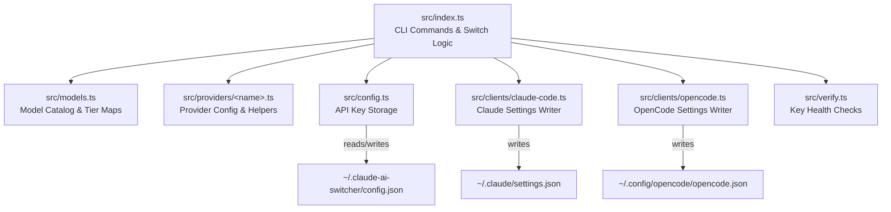

This guide walks through the exact process of adding a new AI provider to Claude AI Switcher. Every provider in the codebase — from simple direct-API integrations to complex LiteLLM proxy pipelines — follows the same structural pattern across **seven files**. Understanding that pattern is the difference between a clean, maintainable addition and a fragile patch. We will use a hypothetical provider called **"Nova"** as a running example, and we will reference every real provider as a concrete comparison point so you can verify each step against working code.

Sources: [index.ts](src/index.ts#L1-L68), [models.ts](src/models.ts#L1-L359), [config.ts](src/config.ts#L1-L102)

## Architectural Overview: The Seven Touchpoints

Adding a provider requires coordinated changes across seven modules, each serving a distinct responsibility in the switch pipeline. The diagram below maps the dependency flow from the user's CLI command down to the configuration files that Claude Code and OpenCode actually read.



Each touchpoint is a separate concern: **models** define what's available, **providers** define how to connect, **config** stores secrets, **clients** write target-application settings, and **verify** validates that everything works. The CLI orchestrates them all.

Sources: [models.ts](src/models.ts#L309-L344), [providers/alibaba.ts](src/providers/alibaba.ts#L1-L44), [config.ts](src/config.ts#L14-L20), [clients/claude-code.ts](src/clients/claude-code.ts#L1-L57), [clients/opencode.ts](src/clients/opencode.ts#L1-L67)

## Choosing Your Provider Type

Before writing any code, determine which integration pattern your provider requires. The codebase implements two distinct architectures, and the choice dictates which helper functions you need and how the client configuration layer works.

| Pattern | Providers | API Format | Requires LiteLLM | Claude Code Mechanism |
|---|---|---|---|---|
| **Direct API** | Alibaba, OpenRouter | Anthropic-compatible | No | `ANTHROPIC_BASE_URL` + `ANTHROPIC_AUTH_TOKEN` env vars |
| **LiteLLM Proxy** | Ollama, Gemini | OpenAI-only | Yes | Same env vars, but pointing to `localhost:<port>` |
| **Delegated CLI** | GLM/Z.AI | Managed externally | No | Tier map env vars only; `coding-helper` manages the rest |

**Direct API** is the simplest — the provider natively speaks the Anthropic Messages API, so you just redirect Claude Code's endpoint. **LiteLLM Proxy** is needed when the provider only speaks OpenAI format; LiteLLM runs as a local translator. **Delegated CLI** is a special case where a third-party tool manages authentication entirely.

Sources: [providers/alibaba.ts](src/providers/alibaba.ts#L18-L29), [providers/ollama.ts](src/providers/ollama.ts#L1-L12), [providers/glm.ts](src/providers/glm.ts#L1-L24)

## Step 1: Define Models and Tier Map in `src/models.ts`

Every provider needs two things in the models module: a **model catalog array** (what models are available) and a **tier map** (which model maps to the Opus/Sonnet/Haiku aliases that Claude Code uses internally).

### Model Catalog

Add an exported array of `Model` objects. Each entry requires `id`, `name`, `contextWindow` (in tokens), `capabilities`, and `description`:

```typescript
// Nova provider models
export const novaModels: Model[] = [
  {
    id: "nova-ultra",
    name: "Nova Ultra",
    contextWindow: 512000,
    capabilities: ["Text Generation", "Deep Thinking", "Code"],
    description: "Nova's flagship model with 512K context and advanced reasoning."
  },
  {
    id: "nova-lite",
    name: "Nova Lite",
    contextWindow: 128000,
    capabilities: ["Text Generation", "Fast Responses"],
    description: "Nova's fast and cost-effective model."
  }
];
```

Sources: [models.ts](src/models.ts#L82-L146), [models.ts](src/models.ts#L1-L7)

### Tier Map

Define a `ModelTierMap` constant that assigns models to the three Claude Code tiers. For static mappings, export a simple constant. For dynamic mappings (where the default depends on which model the user selected), export a function:

```typescript
// Static tier map (simple case)
export const NOVA_DEFAULT_TIER_MAP: ModelTierMap = {
  opus: "nova-ultra",
  sonnet: "nova-lite",
  haiku: "nova-lite"
};
```

The existing `getAlibabaTierMap` function demonstrates the dynamic pattern — it changes the Sonnet and Haiku defaults based on whether the user chose the default model or a specific one. Use this pattern only if your provider's tier strategy is context-dependent.

Sources: [models.ts](src/models.ts#L30-L48), [models.ts](src/models.ts#L53-L69)

### Register in the Providers Record

The `providers` object at the bottom of the file is the central registry that the `list`, `models`, and `status` commands all read from. Add your provider entry:

```typescript
export const providers: Record<string, Provider> = {
  // ... existing providers ...
  nova: {
    id: "nova",
    name: "Nova AI",
    endpoint: "https://api.nova-ai.example.com/v1",
    models: novaModels
  }
};
```

The `endpoint` field is optional (GLM omits it because its endpoint is managed externally). If your provider uses a LiteLLM proxy, the endpoint will be `http://localhost:<port>`.

Sources: [models.ts](src/models.ts#L309-L344)

## Step 2: Create the Provider Module `src/providers/<name>.ts`

Each provider gets its own module under `src/providers/` that encapsulates provider-specific constants, configuration interfaces, and helper functions. The module pattern is consistent across all existing providers — here's what it must contain:

| Export | Purpose | Required |
|---|---|---|
| Config interface | Type-safe config object | Yes |
| Endpoint constant | API URL for the provider | Yes (unless delegated) |
| `getConfig()` | Factory function returning a typed config | Yes |
| `getAvailableModels()` | Returns the model catalog | Yes |
| `findModel()` | Lookup a single model by ID | Yes |
| Health/pre-flight checks | `isXInstalled()`, `isXRunning()` | Only for LiteLLM proxy providers |

### Direct API Provider Template

Follow the Alibaba or OpenRouter pattern for providers that natively support the Anthropic API format:

```typescript
// src/providers/nova.ts
import { providers, novaModels } from "../models.js";

export const NOVA_PROVIDER = providers.nova;

export interface NovaConfig {
  provider: "nova";
  apiKey: string;
  model: string;
  endpoint: string;
}

export const NOVA_ENDPOINT = "https://api.nova-ai.example.com/v1";
export const NOVA_VERIFY_URL = "https://api.nova-ai.example.com/v1/models";

export function getNovaConfig(apiKey: string, model?: string): NovaConfig {
  return {
    provider: "nova",
    apiKey,
    model: model || "nova-ultra",
    endpoint: NOVA_ENDPOINT
  };
}

export function getAvailableModels() {
  return novaModels;
}

export function findModel(modelId: string) {
  return novaModels.find(m => m.id === modelId);
}
```

Sources: [providers/alibaba.ts](src/providers/alibaba.ts#L1-L44), [providers/openrouter.ts](src/providers/openrouter.ts#L1-L43)

### LiteLLM Proxy Provider Template

If your provider requires LiteLLM translation, follow the Ollama or Gemini pattern. These modules include additional functions for dependency checking, service health probes, and proxy process spawning:

```typescript
// Proxy health check pattern (from Gemini)
export async function isLitellmProxyRunning(port: number): Promise<boolean> {
  try {
    const controller = new AbortController();
    const timeout = setTimeout(() => controller.abort(), 3000);
    const resp = await fetch(`http://localhost:${port}/health`, {
      signal: controller.signal
    });
    clearTimeout(timeout);
    return resp.ok;
  } catch {
    return false;
  }
}

// Proxy spawn pattern (from Gemini)
export async function startNovaLitellmProxy(
  apiKey: string,
  model: string,
  port: number
): Promise<{ success: boolean; error?: string }> {
  // Check if already running
  if (await isLitellmProxyRunning(port)) {
    return { success: true };
  }

  const { spawn } = await import("child_process");
  const child = spawn("litellm", ["--model", `nova/${model}`, "--port", String(port)], {
    detached: true,
    stdio: "ignore",
    shell: true,
    env: { ...process.env, NOVA_API_KEY: apiKey }
  });
  child.unref();

  // Poll health endpoint for up to 5 seconds
  for (let i = 0; i < 10; i++) {
    await new Promise(resolve => setTimeout(resolve, 500));
    if (await isLitellmProxyRunning(port)) {
      return { success: true };
    }
  }

  return { success: false, error: "LiteLLM proxy did not start within 5 seconds" };
}
```

Key implementation details for proxy providers: **port allocation** must not conflict with existing ports (Ollama uses 4000, Gemini uses 4001 — pick the next available). The `spawn` call uses `detached: true` and `child.unref()` so the proxy outlives the CLI process. The health-check polling loop runs 10 iterations at 500ms intervals, giving a 5-second startup window.

Sources: [providers/gemini.ts](src/providers/gemini.ts#L45-L136), [providers/ollama.ts](src/providers/ollama.ts#L45-L147)

## Step 3: Register API Key Storage in `src/config.ts`

If your provider requires an API key, the `UserConfig` interface and the `getApiKey`/`setApiKey` switch statements must be extended. This is the simplest integration point — three small additions:

**Add the field to `UserConfig`:**

```typescript
export interface UserConfig {
  alibabaApiKey?: string;
  openrouterApiKey?: string;
  geminiApiKey?: string;
  novaApiKey?: string;       // ← Add this
  defaultProvider?: string;
  defaultModel?: string;
}
```

**Add cases to `getApiKey`:**

```typescript
case "nova":
  return config.novaApiKey;
```

**Add cases to `setApiKey`:**

```typescript
case "nova":
  config.novaApiKey = apiKey;
  break;
```

Note that GLM and Ollama don't have entries here because GLM delegates authentication to `coding-helper` and Ollama runs locally without an API key. If your provider is similar, skip this step entirely.

Sources: [config.ts](src/config.ts#L14-L20), [config.ts](src/config.ts#L52-L65), [config.ts](src/config.ts#L70-L86)

## Step 4: Add Client Configuration in `src/clients/claude-code.ts`

This is the most critical touchpoint. The `claude-code.ts` module writes to `~/.claude/settings.json`, which controls how Claude Code connects to its backend. Every non-Anthropic provider works by setting three environment variables that override Claude Code's default connection:

| Environment Variable | Purpose | Example |
|---|---|---|
| `ANTHROPIC_AUTH_TOKEN` | API key for the provider | `sk-nova-xxxx` |
| `ANTHROPIC_BASE_URL` | Provider endpoint URL | `https://api.nova-ai.example.com/v1` |
| `ANTHROPIC_MODEL` | Default model identifier | `nova-ultra` |
| `ANTHROPIC_DEFAULT_OPUS_MODEL` | Tier alias for Opus | `nova-ultra` |
| `ANTHROPIC_DEFAULT_SONNET_MODEL` | Tier alias for Sonnet | `nova-lite` |
| `ANTHROPIC_DEFAULT_HAIKU_MODEL` | Tier alias for Haiku | `nova-lite` |

### Write the `configure` Function

Follow this template, which mirrors the pattern in `configureAlibaba` and `configureOpenRouter`:

```typescript
export async function configureNova(apiKey: string, model: string, tierMap: ModelTierMap): Promise<void> {
  await ensureOnboardingComplete();

  const settings = await readClaudeSettings();

  settings.env = settings.env || {};
  settings.env["ANTHROPIC_AUTH_TOKEN"] = apiKey;
  settings.env["ANTHROPIC_BASE_URL"] = "https://api.nova-ai.example.com/v1";
  settings.env["ANTHROPIC_MODEL"] = model;

  applyTierMap(settings, tierMap);
  await writeClaudeSettings(settings);
}
```

The `ensureOnboardingComplete()` call is mandatory — it sets `hasCompletedOnboarding: true` in `~/.claude.json` to prevent the "Unable to connect to Anthropic services" error. The `applyTierMap` helper writes the three `ANTHROPIC_DEFAULT_*_MODEL` env vars from your tier map.

Sources: [clients/claude-code.ts](src/clients/claude-code.ts#L140-L153), [clients/claude-code.ts](src/clients/claude-code.ts#L41-L46), [clients/claude-code.ts](src/clients/claude-code.ts#L132-L136)

### Update `configureAnthropic` Cleanup

The `configureAnthropic` function is the "reset to defaults" path. When users switch back to Anthropic, it must clean up your provider's env vars. Add a `delete` statement for any unique env vars your provider introduces, or simply ensure the standard three (`ANTHROPIC_AUTH_TOKEN`, `ANTHROPIC_BASE_URL`, `ANTHROPIC_MODEL`) are already covered — they are, at lines 170-173.

Sources: [clients/claude-code.ts](src/clients/claude-code.ts#L159-L178)

### Update `getCurrentProvider` Detection

The `getCurrentProvider` function reads `~/.claude/settings.json` and determines which provider is active by inspecting env vars. Add a detection block that identifies your provider — typically by matching a substring in `ANTHROPIC_BASE_URL`:

```typescript
// Check for Nova via env vars
if (settings.env?.["ANTHROPIC_BASE_URL"]?.includes("nova-ai.example.com")) {
  return {
    provider: "nova",
    model: settings.env["ANTHROPIC_MODEL"],
    endpoint: settings.env["ANTHROPIC_BASE_URL"],
    tierMap
  };
}
```

Insert this block before the final `return { provider: "anthropic" }` fallback. The detection order matters — more specific URL patterns should come before generic ones. Currently the detection order is: Alibaba → OpenRouter → Ollama → Gemini → GLM (MCP) → GLM (z.ai) → GLM (tier-only) → Anthropic (default).

Sources: [clients/claude-code.ts](src/clients/claude-code.ts#L255-L340)

## Step 5: Add Client Configuration in `src/clients/opencode.ts`

The OpenCode client writes to `~/.config/opencode/opencode.json` with a fundamentally different schema than Claude Code. Instead of environment variables, OpenCode uses a structured `provider` object with npm package references, model definitions including modality and limit metadata, and per-model options like thinking budget.

### Write the `configure` Function

Follow the Gemini or Alibaba pattern — each writes a complete provider object with all models:

```typescript
export async function configureNova(apiKey: string): Promise<void> {
  const settings = await readOpenCodeSettings();

  settings.$schema = "https://opencode.ai/config.json";

  settings.provider = settings.provider || {};
  settings.provider["nova"] = {
    npm: "@ai-sdk/anthropic",  // or "@ai-sdk/openai" depending on API format
    name: "Nova AI",
    options: {
      baseURL: "https://api.nova-ai.example.com/v1",
      apiKey: apiKey
    },
    models: {
      "nova-ultra": {
        name: "Nova Ultra",
        modalities: { input: ["text", "image"], output: ["text"] },
        options: { thinking: { type: "enabled", budgetTokens: 8192 } },
        limit: { context: 512000, output: 65536 }
      },
      "nova-lite": {
        name: "Nova Lite",
        modalities: { input: ["text"], output: ["text"] },
        limit: { context: 128000, output: 32768 }
      }
    }
  };

  await writeOpenCodeSettings(settings);
}
```

The `npm` field determines which AI SDK adapter OpenCode uses. Providers with Anthropic-compatible APIs use `"@ai-sdk/anthropic"`; those with OpenAI-compatible APIs (including LiteLLM proxy endpoints) use `"@ai-sdk/openai"`.

Sources: [clients/opencode.ts](src/clients/opencode.ts#L73-L211), [clients/opencode.ts](src/clients/opencode.ts#L375-L426)

### Update Cleanup and Detection

Add a deletion entry in `configureAnthropic` to remove your provider key when switching back to default, and add a detection block in `getCurrentProvider`:

```typescript
// In configureAnthropic()
if (settings.provider?.["nova"]) {
  delete settings.provider["nova"];
}

// In getCurrentProvider()
if (settings.provider?.["nova"]) {
  return { provider: "nova", endpoint: settings.provider["nova"].options?.baseURL };
}
```

Sources: [clients/opencode.ts](src/clients/opencode.ts#L217-L246), [clients/opencode.ts](src/clients/opencode.ts#L450-L494)

## Step 6: Add Verification in `src/verify.ts`

The verification module performs lightweight HTTP health checks against each provider's API to confirm that stored keys are valid. Each provider gets a dedicated `verify<Provider>` function and an entry in the `verifyAllKeys` orchestrator.

### Write the Verify Function

The pattern is consistent: make a GET request to a lightweight endpoint (typically `/models` or `/v1/models`), interpret HTTP status codes, and return a typed `VerifyResult`:

```typescript
async function verifyNova(apiKey: string): Promise<VerifyResult> {
  try {
    const res = await fetchWithTimeout(
      "https://api.nova-ai.example.com/v1/models",
      {
        method: "GET",
        headers: { "Authorization": `Bearer ${apiKey}` }
      }
    );
    if (res.ok) {
      return { provider: "nova", status: "ok", message: "Key valid" };
    }
    if (res.status === 401 || res.status === 403) {
      return { provider: "nova", status: "invalid", message: "Authentication failed" };
    }
    return { provider: "nova", status: "error", message: `HTTP ${res.status}` };
  } catch {
    return { provider: "nova", status: "error", message: "Connection failed" };
  }
}
```

For LiteLLM proxy providers, also check the proxy health endpoint (see `verifyOllama` and `verifyGemini` for the dual-check pattern).

### Update `verifyAllKeys`

Add a new key parameter to the function signature and a conditional check in the body:

```typescript
export async function verifyAllKeys(keys: {
  // ... existing keys ...
  nova?: string;       // ← Add parameter
}): Promise<VerifyResult[]> {
  // ... existing checks ...

  if (keys.nova) {
    checks.push(verifyNova(keys.nova));
  } else {
    checks.push(Promise.resolve({ provider: "nova", status: "missing" }));
  }

  return Promise.all(checks);
}
```

Sources: [verify.ts](src/verify.ts#L1-L57), [verify.ts](src/verify.ts#L150-L197)

## Step 7: Wire Everything into `src/index.ts`

This is the integration layer — the largest touchpoint where all previous steps converge. You need to add imports, a switch function, CLI command registrations at three levels (top-level, `claude` subcommand, `opencode add/remove` subcommands), and update the status command.

### Add Imports

Import your provider module, tier map, and client configuration functions:

```typescript
import { NOVA_DEFAULT_TIER_MAP } from "./models.js";
import { configureNova as configureClaudeNova } from "./clients/claude-code.js";
import { configureNova as configureOpenCodeNova } from "./clients/opencode.js";
```

Sources: [index.ts](src/index.ts#L14-L67)

### Write the Switch Function

The `switch<Provider>` function orchestrates the full switch workflow. Follow the `switchAlibaba` or `switchGemini` pattern depending on your provider type. Here's the Direct API template:

```typescript
async function switchNova(
  model: string | undefined,
  tierOpts: { opus?: string; sonnet?: string; haiku?: string }
): Promise<void> {
  const selectedModel = model || "nova-ultra";

  // 1. Resolve API key (prompt if missing)
  let apiKey = await getApiKey("nova");
  if (!apiKey) {
    apiKey = await promptApiKey("Nova", "https://nova-ai.example.com/keys");
    await setApiKey("nova", apiKey);
  }

  // 2. Validate model selection
  const novaModels = getModels("nova");
  const validModel = novaModels.find((m) => m.id === selectedModel);
  if (!validModel) {
    displayError(`Invalid model: ${selectedModel}`);
    console.log(chalk.dim("  Valid models: ") + novaModels.map((m) => m.id).join(", "));
    process.exit(1);
  }

  // 3. Build tier map with optional overrides
  const tierMap = buildTierMap(NOVA_DEFAULT_TIER_MAP, tierOpts);

  // 4. Apply configuration
  await configureClaudeNova(apiKey, selectedModel, tierMap);

  // 5. Display success with model details
  console.log(chalk.green(`\n✓ Switched to: Nova AI`));
  console.log(chalk.dim("─".repeat(60)));
  console.log(`  ${chalk.cyan.bold("Model:")} ${chalk.white(validModel.name)}`);
  console.log(`  ${chalk.cyan.bold("Context:")} ${chalk.yellow(formatContext(validModel.contextWindow))}`);
  console.log(`  ${chalk.cyan.bold("Endpoint:")} ${chalk.dim("https://api.nova-ai.example.com/v1")}`);
  console.log(`  ${chalk.cyan.bold("Capabilities:")} ${chalk.gray(validModel.capabilities.join(", "))}`);
  console.log(chalk.dim(`  ${validModel.description}`));
  console.log();
  displayTierMap(tierMap);
  console.log();
}
```

For LiteLLM proxy providers, add pre-flight checks between steps 1 and 2 (check `isLitellmInstalled`, check service running, start proxy). See `switchOllama` for the complete proxy pre-flight sequence.

Sources: [index.ts](src/index.ts#L138-L175), [index.ts](src/index.ts#L244-L303)

### Register CLI Commands

Register commands at **three levels** to support all invocation patterns:

```typescript
// 1. Top-level shorthand: `claude-switch nova [model]`
addTierOptions(
  program
    .command("nova [model]")
    .description("Switch Claude Code to Nova AI")
).action(async (model, options) => {
  try {
    await switchNova(model, options);
  } catch (error) {
    displayError(error instanceof Error ? error.message : "Failed to switch to Nova");
    process.exit(1);
  }
});

// 2. Explicit Claude targeting: `claude-switch claude nova [model]`
addTierOptions(
  claudeCmd
    .command("nova [model]")
    .description("Switch Claude Code to Nova AI")
).action(async (model, options) => {
  try {
    await switchNova(model, options);
  } catch (error) {
    displayError(error instanceof Error ? error.message : "Failed to switch to Nova");
    process.exit(1);
  }
});

// 3. OpenCode add: `claude-switch opencode add nova`
opencodeAddCmd
  .command("nova")
  .description("Add Nova AI provider to OpenCode")
  .action(async () => {
    try {
      let apiKey = await getApiKey("nova");
      if (!apiKey) {
        apiKey = await promptApiKey("Nova", "https://nova-ai.example.com/keys");
        await setApiKey("nova", apiKey);
      }
      await configureOpenCodeNova(apiKey);
      displaySuccess("Added Nova AI provider to OpenCode");
      console.log(chalk.dim("  Config: ~/.config/opencode/opencode.json"));
      console.log(chalk.dim("  Provider: nova"));
      console.log(chalk.dim("  Models: nova-ultra, nova-lite"));
      console.log();
    } catch (error) {
      displayError(error instanceof Error ? error.message : "Failed to add Nova provider");
      process.exit(1);
    }
  });

// 4. OpenCode remove: `claude-switch opencode remove nova`
opencodeRemoveCmd
  .command("nova")
  .description("Remove Nova AI provider from OpenCode")
  .action(async () => {
    try {
      const { removeProvider } = await import("./clients/opencode.js");
      await removeProvider("nova");
      displaySuccess("Removed Nova AI provider from OpenCode");
      console.log(chalk.dim("  Other providers remain unchanged"));
      console.log();
    } catch (error) {
      displayError(error instanceof Error ? error.message : "Failed to remove Nova provider");
      process.exit(1);
    }
  });
```

Sources: [index.ts](src/index.ts#L364-L439), [index.ts](src/index.ts#L530-L637), [index.ts](src/index.ts#L639-L709)

### Update Status and Setup Commands

Add your provider to the `status` command's key retrieval and verification call, and to the `setup` wizard's interactive prompts. Both follow simple append patterns — add `const novaKey = await getApiKey("nova")` near the existing key retrievals, add it to the `verifyAllKeys` call, and add a setup prompt block following the Gemini pattern.

Sources: [index.ts](src/index.ts#L766-L782), [index.ts](src/index.ts#L948-L1000)

## Complete File Change Checklist

The table below provides a consolidated reference for every file that must be modified, in the recommended implementation order. Each row identifies the specific changes needed and which existing provider serves as the best reference implementation.

| Step | File | Changes | Best Reference |
|---|---|---|---|
| 1 | `src/models.ts` | Model array, tier map constant, providers record entry | [Alibaba models](src/models.ts#L82-L146) |
| 2 | `src/providers/<name>.ts` | New file: config interface, endpoint, getConfig, findModel | [OpenRouter](src/providers/openrouter.ts#L1-L43) |
| 2a | `src/providers/<name>.ts` | (Proxy only) isInstalled, isRunning, startProxy | [Gemini](src/providers/gemini.ts#L45-L136) |
| 3 | `src/config.ts` | UserConfig field, getApiKey case, setApiKey case | [Gemini entries](src/config.ts#L14-L86) |
| 4 | `src/clients/claude-code.ts` | configure function, getCurrentProvider detection | [OpenRouter config](src/clients/claude-code.ts#L200-L216) |
| 5 | `src/clients/opencode.ts` | configure function, getCurrentProvider detection, cleanup | [Gemini config](src/clients/opencode.ts#L375-L426) |
| 6 | `src/verify.ts` | verify function, verifyAllKeys entry | [OpenRouter verify](src/verify.ts#L62-L85) |
| 7 | `src/index.ts` | Import, switch function, 4 CLI commands, status, setup | [Gemini switch](src/index.ts#L305-L358) |

## Testing Your Implementation

After completing all seven steps, verify your provider works end-to-end with this sequence:

1. **Build**: Run `npm run build` to compile TypeScript and catch type errors
2. **Key storage**: `claude-switch key nova test-key-123` — verify it persists to `~/.claude-ai-switcher/config.json`
3. **Switch**: `claude-switch nova nova-ultra` — verify `~/.claude/settings.json` has correct env vars
4. **Status**: `claude-switch status` — verify your provider appears with correct verification status
5. **Current**: `claude-switch current` — verify detection identifies your provider correctly
6. **Models**: `claude-switch models nova` — verify all models display with metadata
7. **Reset**: `claude-switch anthropic` — verify your env vars are cleaned up
8. **OpenCode add/remove**: `claude-switch opencode add nova` then `claude-switch opencode remove nova`

For LiteLLM proxy providers, also verify: proxy starts on the correct port, health check passes within 5 seconds, and `process.exit` doesn't kill the detached proxy process.

Sources: [index.ts](src/index.ts#L883-L919), [index.ts](src/index.ts#L921-L943)

## Common Pitfalls and Edge Cases

**Port conflicts for proxy providers**: Ollama uses port 4000, Gemini uses 4001. Your new proxy provider must use a different port. Hard-code it as a constant (following the `GEMINI_LITELLM_PORT = 4001` pattern) and use it consistently across your provider module, claude-code client, and opencode client.

**Tier map env var naming**: The three tier aliases use exact env var names `ANTHROPIC_DEFAULT_OPUS_MODEL`, `ANTHROPIC_DEFAULT_SONNET_MODEL`, and `ANTHROPIC_DEFAULT_HAIKU_MODEL`. These are set by the `applyTierMap` helper — never set them manually in your configure function.

**Backup before write**: Both `writeClaudeSettings` and `writeOpenCodeSettings` automatically create timestamped backups before overwriting. You don't need to implement this yourself — just call the existing write functions.

**`ensureOnboardingComplete` is mandatory**: Every Claude Code configure function must call this before writing settings. Without it, users switching from a fresh install will see "Unable to connect to Anthropic services."

**OpenCode provider key naming**: The key in the `settings.provider` object doesn't have to match the CLI command name. Alibaba uses `"bailian-coding-plan"` as its OpenCode key but `"alibaba"` as its CLI command. Choose whatever key OpenCode expects.

Sources: [providers/gemini.ts](src/providers/gemini.ts#L25-L26), [clients/claude-code.ts](src/clients/claude-code.ts#L35-L46), [clients/claude-code.ts](src/clients/claude-code.ts#L100-L112), [clients/opencode.ts](src/clients/opencode.ts#L81-L82)

## Related Pages

For deeper understanding of the systems this guide touches, consult these pages in the documentation:

- [Model and Provider Type Definitions](14-model-and-provider-type-definitions) — the TypeScript interfaces that govern all data structures
- [Direct API Providers (Anthropic, Alibaba, OpenRouter)](9-direct-api-providers-anthropic-alibaba-openrouter) — detailed explanation of the direct API integration pattern
- [LiteLLM Proxy Providers (Ollama on Port 4000, Gemini on Port 4001)](10-litellm-proxy-providers-ollama-on-port-4000-gemini-on-port-4001) — the proxy lifecycle and port allocation strategy
- [Claude Code Client: Settings, Environment Variables, and Backups](12-claude-code-client-settings-environment-variables-and-backups) — how `~/.claude/settings.json` is structured and modified
- [OpenCode Client: Provider Schema and JSON Configuration](13-opencode-client-provider-schema-and-json-configuration) — the OpenCode provider object schema
- [API Key Verification: Lightweight HTTP Health Checks](18-api-key-verification-lightweight-http-health-checks) — the verification architecture
- [Build Toolchain: TypeScript Configuration and npm Scripts](24-build-toolchain-typescript-configuration-and-npm-scripts) — building and testing