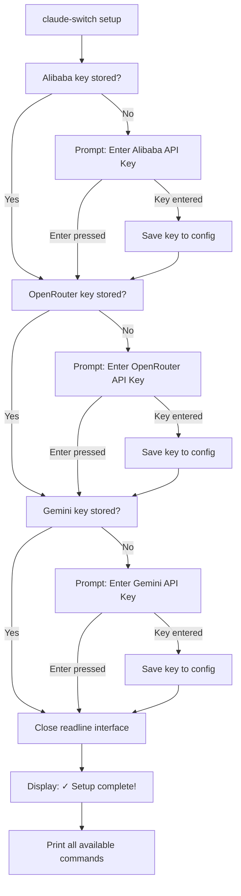

The **Interactive Setup Wizard** is your one-command onboarding experience for Claude AI Switcher. Running `claude-switch setup` launches a guided, step-by-step prompt that collects API keys for every supported provider — so you never need to manually edit configuration files or hunt down the right CLI flags on your first session. The wizard is intentionally selective: it only prompts for providers whose keys are *not yet stored*, and it gracefully skips any provider you don't want to configure right now by simply pressing Enter.

Sources: [index.ts](src/index.ts#L946-L1030)

## When to Run the Wizard

The setup wizard is designed for **first-time configuration**, but it is also safe to re-run at any time. Because it checks `hasApiKey()` before prompting for each provider, running it again will only ask about providers you haven't yet configured — making it a convenient way to add keys incrementally without touching the `claude-switch key` command.

| Scenario | Wizard Behavior |
|----------|----------------|
| First install, no keys stored | Prompts for all three API-key providers |
| Re-run after partial setup | Skips providers that already have keys; prompts only for missing ones |
| Re-run when all keys exist | Completes instantly with a success message |
| Press Enter to skip a provider | Stores nothing for that provider; you can set it later with `claude-switch key` |

Sources: [index.ts](src/index.ts#L954-L968), [config.ts](src/config.ts#L91-L94)

## Wizard Flow

The diagram below illustrates the exact decision sequence the wizard follows. Each "Prompt" node is an interactive terminal question — the wizard waits for your input before proceeding.



Sources: [index.ts](src/index.ts#L946-L1030)

## Providers the Wizard Configures

The wizard handles exactly **three** providers that require stored API keys. Two other providers — Anthropic and GLM/Z.AI — are excluded by design, and Ollama requires no key at all.

| Provider | Prompted in Wizard? | Why / Why Not |
|----------|---------------------|---------------|
| **Alibaba** | ✅ Yes | Key stored in `~/.claude-ai-switcher/config.json` |
| **OpenRouter** | ✅ Yes | Key stored in `~/.claude-ai-switcher/config.json` |
| **Gemini** | ✅ Yes | Key stored in `~/.claude-ai-switcher/config.json` |
| Anthropic | ❌ No | Reads `ANTHROPIC_API_KEY` environment variable directly |
| GLM/Z.AI | ❌ No | Auth managed externally via `@z_ai/coding-helper` CLI |
| Ollama | ❌ No | Fully local — no API key needed |

Sources: [index.ts](src/index.ts#L954-L1000), [config.ts](src/config.ts#L14-L20)

## Step-by-Step Walkthrough

### Step 1 — Launch the Wizard

```bash
claude-switch setup
```

The terminal displays a green banner:

```
=== Claude AI Switcher Setup ===
```

This confirms the wizard is active and waiting for interactive input.

Sources: [index.ts](src/index.ts#L948-L950)

### Step 2 — Alibaba Coding Plan

If no Alibaba key is stored, the wizard prints:

```
Alibaba Coding Plan Setup
  Get your API key from: https://modelstudio.console.alibabacloud.com/

Enter your Alibaba API Key (or press Enter to skip):
```

Type or paste your key and press Enter to save it. If you don't have one yet, press Enter alone to skip — you can always set it later with `claude-switch key alibaba <key>`.

Sources: [index.ts](src/index.ts#L954-L968)

### Step 3 — OpenRouter

If no OpenRouter key is stored, the wizard prints:

```
OpenRouter Setup
  Get your API key from: https://openrouter.ai/settings/keys

Enter your OpenRouter API Key (or press Enter to skip):
```

The same skip-or-enter pattern applies. OpenRouter offers free-tier models (e.g. `qwen/qwen3.6-plus:free`), so even a free account key is useful.

Sources: [index.ts](src/index.ts#L970-L984)

### Step 4 — Gemini (Google)

If no Gemini key is stored, the wizard prints:

```
Gemini Setup
  Get your API key from: https://aistudio.google.com/apikey

Enter your Gemini API Key (or press Enter to skip):
```

Google AI Studio provides free API keys with generous rate limits, making this an easy key to obtain.

Sources: [index.ts](src/index.ts#L986-L1000)

### Step 5 — Completion and Command Reference

After all prompts are processed, the wizard closes the readline interface and prints a success banner followed by a full command reference table:

```
✓ Setup complete!

Available commands:
  claude-switch alibaba [model]          - Switch Claude Code to Alibaba
  claude-switch anthropic                - Switch Claude Code to Anthropic
  claude-switch glm                      - Switch Claude Code to GLM/Z.AI
  claude-switch openrouter [model]       - Switch Claude Code to OpenRouter
  claude-switch ollama [model]           - Switch Claude Code to Ollama
  claude-switch gemini [model]           - Switch Claude Code to Gemini
  claude-switch status                   - Show current config + verify API keys
  ...
```

This serves as an immediate cheat sheet you can reference without checking documentation.

Sources: [index.ts](src/index.ts#L1002-L1025)

## Where Keys Are Stored

All keys collected by the wizard are persisted in a single JSON file on your local machine. No keys are ever sent to any remote server during the setup process — they are written directly to disk.

| Detail | Value |
|--------|-------|
| Config directory | `~/.claude-ai-switcher/` |
| Config file | `~/.claude-ai-switcher/config.json` |
| File format | JSON (pretty-printed, 2-space indent) |
| Example structure | `{"alibabaApiKey": "sk-...", "openrouterApiKey": "sk-or-...", "geminiApiKey": "AIza..."}` |

The `config.ts` module handles all reads and writes via `fs-extra`, creating the directory automatically if it doesn't exist.

Sources: [config.ts](src/config.ts#L11-L47)

## Inline Key Prompting (Automatic Fallback)

Beyond the dedicated `setup` wizard, every provider-switch command that requires an API key includes an **inline fallback prompt**. If you run `claude-switch alibaba` without having stored a key, the switch function itself will pause and ask for one before proceeding. This is powered by the `promptApiKey` helper — it displays a warning in yellow, shows the key-retrieval URL, and requires a non-empty answer (unlike the wizard, you cannot skip by pressing Enter alone; the process exits with an error if the input is blank).

Sources: [index.ts](src/index.ts#L80-L98)

## Verifying Your Setup

After the wizard completes, run the status command to confirm everything is working:

```bash
claude-switch status
```

This command reads all stored keys, verifies each one against the provider's API with a lightweight HTTP health check, and displays a results table with masked keys:

```
  API Key Verification:
──────────────────────────────────────────────────
  ✓ alibaba      Key valid (sk-x...xxxx)
  ✓ openrouter   Key valid (sk-or-x...xxxx)
  ○ anthropic    No key configured
  ✓ glm          coding-helper installed
  ⚠ ollama      LiteLLM proxy not running on port 4000
  ✓ gemini       Key valid, proxy not running (AIzax...xxxx)
```

For a full deep-dive into how each verification works, see [API Key Verification: Lightweight HTTP Health Checks](18-api-key-verification-lightweight-http-health-checks).

Sources: [index.ts](src/index.ts#L715-L831), [verify.ts](src/verify.ts#L150-L197)

## Next Steps

Now that your API keys are configured, you're ready to start switching providers:

- **[Switching Providers for Claude Code](4-switching-providers-for-claude-code)** — Learn the full set of `claude-switch` commands to switch between Anthropic, Alibaba, GLM, OpenRouter, Ollama, and Gemini.
- **[Managing OpenCode Providers (Add/Remove)](5-managing-opencode-providers-add-remove)** — Configure OpenCode with the same providers using `opencode add` and `opencode remove`.
- **[Viewing Status, Current Config, and Model Lists](6-viewing-status-current-config-and-model-lists)** — Explore the `status`, `current`, `list`, and `models` commands in detail.