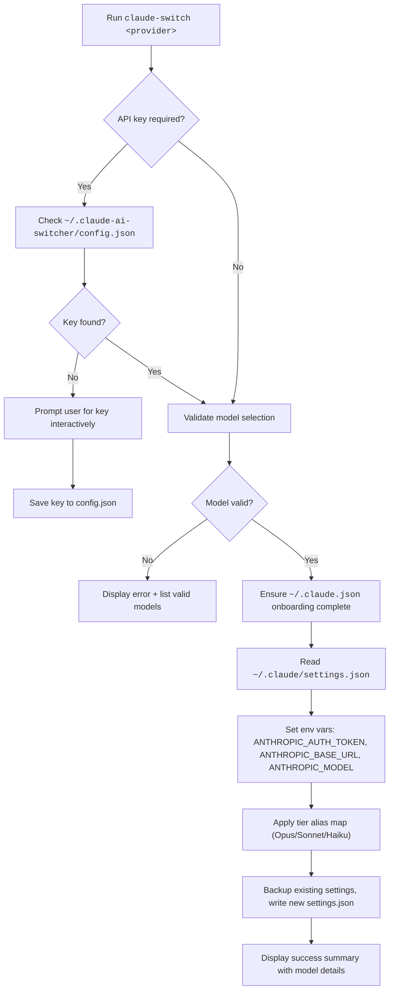

The `claude-switch` CLI provides a single-command interface to redirect Claude Code's AI backend from one provider to another. When you run a switch command, the tool modifies two configuration files — `~/.claude/settings.json` and `~/.claude.json` — setting environment variables that Claude Code reads at startup to determine which API endpoint to call, which authentication token to use, and which model aliases map to the Opus/Sonnet/Haiku tiers. This page documents every switch command available for Claude Code, explains what each one does under the hood, and helps you choose the right provider for your workflow.

Sources: [index.ts](src/index.ts#L1-L74), [claude-code.ts](src/clients/claude-code.ts#L1-L46)

## Available Providers at a Glance

Claude AI Switcher supports six providers, each with distinct connectivity requirements. The table below summarizes them so you can pick the right command for your situation.

| Provider | Command | Endpoint | API Key Required | Extra Dependencies |
|---|---|---|---|---|
| **Anthropic** (default) | `claude-switch anthropic` | Native Anthropic API | `ANTHROPIC_API_KEY` env var | None |
| **Alibaba Coding Plan** | `claude-switch alibaba [model]` | `coding-intl.dashscope.aliyuncs.com` | Yes (stored locally) | None |
| **GLM/Z.AI** | `claude-switch glm` | `z.ai` (via coding-helper) | Managed by `@z_ai/coding-helper` | `@z_ai/coding-helper` npm package |
| **OpenRouter** | `claude-switch openrouter [model]` | `openrouter.ai/api/v1` | Yes (stored locally) | None |
| **Ollama** (local) | `claude-switch ollama [model]` | `localhost:4000` (LiteLLM proxy) | No (local) | Ollama + LiteLLM proxy |
| **Gemini** (Google) | `claude-switch gemini [model]` | `localhost:4001` (LiteLLM proxy) | Yes (stored locally) | LiteLLM proxy |

Sources: [models.ts](src/models.ts#L309-L344), [index.ts](src/index.ts#L364-L439)

## Two Ways to Invoke Switch Commands

Every provider switch command can be invoked in one of two syntactic forms — a **shorthand** top-level command and an **explicit** `claude` subcommand. Both forms are functionally identical; they call the same internal handler functions and produce the same `settings.json` changes. The explicit form is useful when you want to make it clear in scripts or documentation that you are targeting Claude Code specifically (as opposed to OpenCode).

| Shorthand Form | Explicit Form |
|---|---|
| `claude-switch anthropic` | `claude-switch claude anthropic` |
| `claude-switch alibaba qwen3.6-plus` | `claude-switch claude alibaba qwen3.6-plus` |
| `claude-switch glm` | `claude-switch claude glm` |
| `claude-switch openrouter` | `claude-switch claude openrouter` |
| `claude-switch ollama` | `claude-switch claude ollama` |
| `claude-switch gemini` | `claude-switch claude gemini` |

Sources: [index.ts](src/index.ts#L364-L524)

## The Switching Flow: What Happens Behind the Scenes

Regardless of which provider you choose, every switch command follows the same four-phase pipeline. Understanding this pipeline helps you debug issues and predict what changes the tool will make to your system.



The critical file being modified is `~/.claude/settings.json`. Claude Code reads three environment variables from this file's `env` block at startup: **`ANTHROPIC_AUTH_TOKEN`** (your API key), **`ANTHROPIC_BASE_URL`** (the provider's API endpoint), and **`ANTHROPIC_MODEL`** (the default model identifier). Additionally, three tier-alias variables — **`ANTHROPIC_DEFAULT_OPUS_MODEL`**, **`ANTHROPIC_DEFAULT_SONNET_MODEL`**, and **`ANTHROPIC_DEFAULT_HAIKU_MODEL`** — tell Claude Code which actual model names to use when a user selects the Opus, Sonnet, or Haiku tier.

Sources: [claude-code.ts](src/clients/claude-code.ts#L35-L57), [claude-code.ts](src/clients/claude-code.ts#L100-L136)

## Switching to Anthropic (Default)

The `anthropic` command restores Claude Code to its factory configuration — native Anthropic Claude models with no third-party proxy. It removes the Alibaba and GLM MCP server entries from your settings, clears all provider-specific environment variables (`ANTHROPIC_AUTH_TOKEN`, `ANTHROPIC_BASE_URL`, `ANTHROPIC_MODEL`), and wipes the tier alias overrides. After running this command, Claude Code will use whatever `ANTHROPIC_API_KEY` is set in your shell environment and connect directly to Anthropic's API.

```bash
claude-switch anthropic
```

No model argument is needed because Anthropic is the default provider. The tool simply strips away all third-party overrides and lets Claude Code fall back to its built-in configuration. This is also the recommended "reset" command if you want to undo a previous provider switch.

Sources: [index.ts](src/index.ts#L129-L136), [claude-code.ts](src/clients/claude-code.ts#L159-L178)

## Switching to Alibaba Coding Plan

The Alibaba Coding Plan provider routes Claude Code requests through Alibaba's DashScope platform, giving you access to models like Qwen3.6-Plus, Qwen3-Coder-Next, Kimi K2.5, and others via an Anthropic-compatible API endpoint.

```bash
# Switch with the default model (qwen3.6-plus)
claude-switch alibaba

# Switch with a specific model
claude-switch alibaba qwen3-coder-plus
```

If this is your first time using the Alibaba provider, the tool will prompt you for an API key. You can get one from the [Alibaba Model Studio console](https://modelstudio.console.alibabacloud.com/). The key is stored locally in `~/.claude-ai-switcher/config.json` — it is never sent anywhere except to the DashScope endpoint during API calls.

The tool validates your model selection against a built-in catalog. If you specify an invalid model, it will display an error and list all valid model IDs. The available Alibaba models are:

| Model ID | Context Window | Key Capabilities |
|---|---|---|
| `qwen3.6-plus` | 1M tokens | Text Generation, Deep Thinking, Visual Understanding |
| `qwen3-max-2026-01-23` | 256K tokens | Text Generation, Deep Thinking |
| `qwen3-coder-next` | 256K tokens | Text Generation, Coding Agent |
| `qwen3-coder-plus` | 1M tokens | Text Generation, Coding |
| `glm-5` | 200K tokens | Text Generation, Deep Thinking |
| `glm-4.7` | 256K tokens | Text Generation, Deep Thinking |
| `glm-4.7-flash` | 256K tokens | Text Generation, Fast Inference |
| `kimi-k2.5` | 1M tokens | Text Generation, Deep Thinking, Visual Understanding |
| `MiniMax-M2.5` | 256K tokens | Text Generation, Deep Thinking |

Sources: [index.ts](src/index.ts#L138-L175), [models.ts](src/models.ts#L82-L146), [claude-code.ts](src/clients/claude-code.ts#L141-L153)

## Switching to GLM/Z.AI

The GLM provider integrates with Zhipu AI's coding-helper tool to route Claude Code through GLM models. Unlike other providers, GLM does not require you to manage an API key directly — the `@z_ai/coding-helper` package handles authentication.

```bash
claude-switch glm
```

Before switching, the tool checks whether `coding-helper` is installed. If it is not found, a warning is displayed with installation instructions (`npm install -g @z_ai/coding-helper`), but the switch still proceeds — the tier alias map will be written to your settings regardless. If coding-helper is installed, the tool also triggers a config reload via `reloadGLMConfig()` to synchronize the local configuration with the coding-helper service.

Sources: [index.ts](src/index.ts#L177-L203), [providers/glm.ts](src/providers/glm.ts#L1-L1)

## Switching to OpenRouter

OpenRouter provides an Anthropic-compatible API that aggregates multiple model providers. Switching to OpenRouter routes all Claude Code requests through `https://openrouter.ai/api/v1`.

```bash
# Switch with the default model
claude-switch openrouter

# Switch with a specific model
claude-switch openrouter qwen/qwen3.6-plus:free
```

Like Alibaba, the OpenRouter switch prompts for an API key on first use (available from [OpenRouter's key settings](https://openrouter.ai/settings/keys)) and stores it locally. The tool validates the model against its catalog before applying changes.

Sources: [index.ts](src/index.ts#L205-L242), [claude-code.ts](src/clients/claude-code.ts#L204-L216)

## Switching to Ollama (Local Models)

Ollama is a local model runner that operates entirely on your machine. Because Claude Code expects an Anthropic-compatible API, the tool starts a **LiteLLM proxy** on port 4000 that translates between Claude Code's Anthropic-format requests and Ollama's native API.

```bash
# Switch with the default model (deepseek-r1:latest)
claude-switch ollama

# Switch with a specific model
claude-switch ollama qwen2.5-coder:latest
```

This command performs three pre-flight checks before proceeding. First, it verifies that **LiteLLM** is installed (`pip install 'litellm[proxy]'`). Second, it verifies that **Ollama** itself is installed. Third, it confirms that the Ollama daemon is running (`ollama serve`). If any of these checks fail, the command exits with a descriptive error and installation instructions. After passing all checks, the tool starts the LiteLLM proxy process and writes `http://localhost:4000` as the base URL into your Claude settings.

Sources: [index.ts](src/index.ts#L244-L303), [claude-code.ts](src/clients/claude-code.ts#L221-L233)

## Switching to Gemini (Google)

The Gemini provider works similarly to Ollama — it uses a **LiteLLM proxy** on port 4001 to translate between Claude Code's Anthropic-format API calls and Google's Gemini API.

```bash
# Switch with the default model (gemini-2.5-pro)
claude-switch gemini

# Switch with a specific model
claude-switch gemini gemini-2.5-flash
```

This command requires LiteLLM to be installed and a **Gemini API key** (available from [Google AI Studio](https://aistudio.google.com/apikey)). The tool starts the LiteLLM proxy with your Gemini credentials and writes `http://localhost:4001` as the base URL. Unlike Ollama, Gemini does not require a local daemon — it connects to Google's cloud infrastructure through the proxy.

Sources: [index.ts](src/index.ts#L305-L358), [claude-code.ts](src/clients/claude-code.ts#L238-L250)

## Customizing Model Tier Aliases

Every provider switch command accepts three optional flags — `--opus`, `--sonnet`, and `--haiku` — that let you override which model is assigned to each Claude Code tier. By default, the tool uses a built-in mapping per provider, but these flags give you full control.

```bash
# Override all three tiers for Alibaba
claude-switch alibaba qwen3.6-plus --opus qwen3-coder-next --sonnet qwen3.6-plus --haiku glm-4.7-flash

# Override only the opus tier for Ollama
claude-switch ollama --opus codellama:latest
```

The tier flags work with both the shorthand and explicit command forms. When you override a tier, the tool writes the corresponding `ANTHROPIC_DEFAULT_OPUS_MODEL`, `ANTHROPIC_DEFAULT_SONNET_MODEL`, or `ANTHROPIC_DEFAULT_HAIKU_MODEL` environment variable into `~/.claude/settings.json`. Any tier you don't override retains its default value for that provider. The table below shows the default tier mappings for each provider:

| Provider | Opus Default | Sonnet Default | Haiku Default |
|---|---|---|---|
| **Anthropic** | *(cleared)* | *(cleared)* | *(cleared)* |
| **Alibaba** (qwen3.6-plus) | `qwen3.6-plus` | `kimi-k2.5` | `glm-5` |
| **Alibaba** (other model) | *(selected model)* | `qwen3.6-plus` | `kimi-k2.5` |
| **GLM/Z.AI** | `glm-5.1` | `glm-5v-turbo` | `glm-5-turbo` |
| **OpenRouter** | `qwen/qwen3.6-plus:free` | `openrouter/free` | `openrouter/free` |
| **Ollama** | `deepseek-r1:latest` | `qwen2.5-coder:latest` | `llama3.1:latest` |
| **Gemini** | `gemini-2.5-pro` | `gemini-2.5-flash` | `gemini-2.5-flash-lite` |

Sources: [index.ts](src/index.ts#L100-L123), [models.ts](src/models.ts#L23-L69)

## Settings File Modifications: Before and After

To make the switching process concrete, here is a side-by-side comparison of what `~/.claude/settings.json` looks like before and after running `claude-switch alibaba qwen3.6-plus`:

| Key | Before (Anthropic Default) | After (Alibaba) |
|---|---|---|
| `env.ANTHROPIC_AUTH_TOKEN` | *(absent)* | `sk-xxxxxxxxxxxx` |
| `env.ANTHROPIC_BASE_URL` | *(absent)* | `https://coding-intl.dashscope.aliyuncs.com/apps/anthropic` |
| `env.ANTHROPIC_MODEL` | *(absent)* | `qwen3.6-plus` |
| `env.ANTHROPIC_DEFAULT_OPUS_MODEL` | *(absent)* | `qwen3.6-plus` |
| `env.ANTHROPIC_DEFAULT_SONNET_MODEL` | *(absent)* | `kimi-k2.5` |
| `env.ANTHROPIC_DEFAULT_HAIKU_MODEL` | *(absent)* | `glm-5` |
| `mcpServers.alibaba-coding-plan` | *(absent)* | *(absent — not set by this version)* |

Every time the tool writes to `settings.json`, it first creates a timestamped backup (e.g., `settings.json.backup.1719500000000`) so you can always revert manually if needed. It also ensures `hasCompletedOnboarding` is set to `true` in `~/.claude.json` to prevent Claude Code from showing a "Unable to connect to Anthropic services" error on first launch with a non-default provider.

Sources: [claude-code.ts](src/clients/claude-code.ts#L100-L136), [claude-code.ts](src/clients/claude-code.ts#L141-L153)

## Troubleshooting Common Switch Errors

| Error Message | Cause | Solution |
|---|---|---|
| `Invalid model: xyz` | The model ID is not in the built-in catalog | Run `claude-switch models <provider>` to see valid IDs |
| `LiteLLM is required for Ollama support` | LiteLLM proxy package not installed | Run `pip install 'litellm[proxy]'` |
| `Ollama is not installed` | Ollama binary not found on PATH | Install from [ollama.com](https://ollama.com) |
| `Ollama is not running` | Ollama daemon is stopped | Run `ollama serve` in a terminal |
| `Alibaba API Key not found` | First time using Alibaba, or key was deleted | Enter key when prompted, or run `claude-switch key alibaba <your-key>` |
| `coding-helper not found` | GLM integration package missing | Run `npm install -g @z_ai/coding-helper` then `coding-helper auth` |
| `Failed to start LiteLLM proxy` | Port conflict or LiteLLM misconfiguration | Check if ports 4000/4001 are already in use |

Sources: [index.ts](src/index.ts#L244-L303), [index.ts](src/index.ts#L80-L98)

## Where to Go Next

Now that you understand how to switch providers for Claude Code, here are the logical next steps in the documentation:

- **[Managing OpenCode Providers (Add/Remove)](5-managing-opencode-providers-add-remove)** — Learn how to add and remove providers for the OpenCode client using `claude-switch opencode add/remove` commands.
- **[Viewing Status, Current Config, and Model Lists](6-viewing-status-current-config-and-model-lists)** — Use `status`, `current`, `list`, and `models` commands to inspect your configuration and verify API key validity.
- **[Custom Tier Overrides with --opus, --sonnet, --haiku Flags](16-custom-tier-overrides-with-opus-sonnet-haiku-flags)** — Deep dive into the tier alias system and advanced override patterns.
- **[Claude Code Client: Settings, Environment Variables, and Backups](12-claude-code-client-settings-environment-variables-and-backups)** — Full technical reference for the settings file format and backup mechanism.