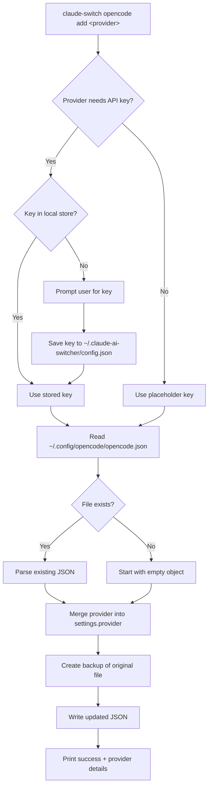
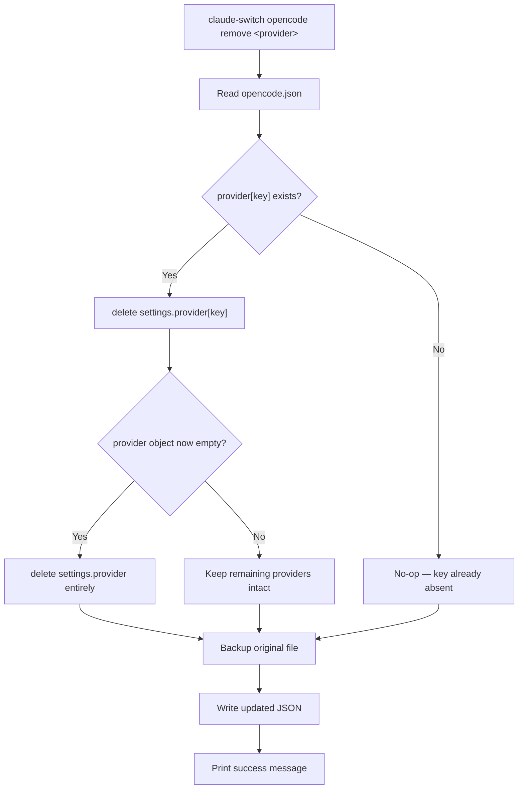

**OpenCode** is a terminal-based AI coding assistant that reads its provider configuration from a single JSON file at `~/.config/opencode/opencode.json`. Claude AI Switcher provides a dedicated `opencode` subcommand with `add` and `remove` operations that let you manage providers in that file without ever editing JSON by hand. Unlike the top-level `alibaba`, `openrouter`, `ollama`, and `gemini` commands — which target **Claude Code** — the `opencode` subcommand targets the OpenCode configuration exclusively. This page walks you through every available add/remove operation, explains what gets written under the hood, and shows you how the tool keeps your existing providers safe during removal.

Sources: [opencode.ts](src/clients/opencode.ts#L1-L17), [index.ts](src/index.ts#L527-L532)

## Command Syntax at a Glance

All OpenCode management commands share a common pattern: `claude-switch opencode <action> <provider>`. The `action` is either `add` or `remove`, and the `provider` is one of four supported names. The table below summarizes every combination.

| Command | What It Does | API Key Required? | External Dependency |
|---|---|---|---|
| `claude-switch opencode add alibaba` | Writes `bailian-coding-plan` provider with 8 models | Yes (Alibaba) | None |
| `claude-switch opencode add openrouter` | Writes `openrouter` provider with 2 models | Yes (OpenRouter) | None |
| `claude-switch opencode add ollama` | Writes `ollama` provider with 4 models | No | LiteLLM proxy on port 4000 |
| `claude-switch opencode add gemini` | Writes `gemini` provider with 3 models | Yes (Google Gemini) | LiteLLM proxy on port 4001 |
| `claude-switch opencode remove alibaba` | Deletes `bailian-coding-plan` key from config | — | — |
| `claude-switch opencode remove openrouter` | Deletes `openrouter` key from config | — | — |
| `claude-switch opencode remove ollama` | Deletes `ollama` key from config | — | — |
| `claude-switch opencode remove gemini` | Deletes `gemini` key from config | — | — |

Sources: [index.ts](src/index.ts#L534-L709)

## Adding a Provider

### How the Add Flow Works

When you run `claude-switch opencode add <provider>`, the tool performs three logical steps: (1) resolve the API key if the provider requires one — either from the local key store at `~/.claude-ai-switcher/config.json` or by prompting you interactively, (2) read the current OpenCode configuration (creating an empty object if the file does not yet exist), and (3) merge the new provider definition into the `provider` object and write the file back with a timestamped backup. The flowchart below illustrates this process.



Sources: [index.ts](src/index.ts#L538-L637), [config.ts](src/config.ts#L52-L86), [opencode.ts](src/clients/opencode.ts#L38-L67)

### Adding Alibaba (Bailian Coding Plan)

Running `claude-switch opencode add alibaba` writes a `bailian-coding-plan` entry to your OpenCode configuration. This provider uses the `@ai-sdk/anthropic` npm package and points to the Alibaba Model Studio endpoint. It ships **eight models** — each with context window limits, modality declarations, and (where applicable) thinking-mode configuration. The command will prompt you for an API key if one has not been previously stored.

```bash
$ claude-switch opencode add alibaba

⚠ Alibaba API Key not found
  Get your API key from: https://modelstudio.console.alibabacloud.com/

Enter your Alibaba API Key: sk-xxxxxxxx

✓ Added Alibaba Coding Plan provider to OpenCode

  Config: ~/.config/opencode/opencode.json
  Provider: bailian-coding-plan
  Models: qwen3.6-plus, qwen3-max-2026-01-23, qwen3-coder-next, qwen3-coder-plus, MiniMax-M2.5, glm-5, glm-4.7, kimi-k2.5
```

The resulting `provider` block in `opencode.json` looks like this (abbreviated for clarity):

```json
{
  "$schema": "https://opencode.ai/config.json",
  "provider": {
    "bailian-coding-plan": {
      "npm": "@ai-sdk/anthropic",
      "name": "Model Studio Coding Plan",
      "options": {
        "baseURL": "https://coding-intl.dashscope.aliyuncs.com/apps/anthropic/v1",
        "apiKey": "sk-xxxxxxxx"
      },
      "models": {
        "qwen3.6-plus": { "name": "Qwen3.6 Plus", "limit": { "context": 1000000, "output": 65536 } },
        "kimi-k2.5": { "name": "Kimi K2.5", "limit": { "context": 262144, "output": 32768 } }
      }
    }
  }
}
```

**A key detail for beginners**: Alibaba models like `qwen3.6-plus`, `MiniMax-M2.5`, `glm-5`, `glm-4.7`, and `kimi-k2.5` include a `thinking` option with `budgetTokens: 8192`. This enables OpenCode to use extended reasoning mode for those models. Models without a `thinking` block (e.g., `qwen3-max-2026-01-23`, `qwen3-coder-next`) operate in standard generation mode.

Sources: [opencode.ts](src/clients/opencode.ts#L73-L211), [index.ts](src/index.ts#L538-L563)

### Adding OpenRouter

Running `claude-switch opencode add openrouter` writes an `openrouter` entry using the `@ai-sdk/openai` npm package, pointing to `https://openrouter.ai/api/v1`. Two models are configured by default — `qwen/qwen3.6-plus:free` and `openrouter/free` — both with 131K-token context windows. An API key is required and will be prompted for if not stored.

```bash
$ claude-switch opencode add openrouter

✓ Added OpenRouter provider to OpenCode

  Config: ~/.config/opencode/opencode.json
  Provider: openrouter
  Models: qwen/qwen3.6-plus:free, openrouter/free
```

Sources: [opencode.ts](src/clients/opencode.ts#L261-L303), [index.ts](src/index.ts#L565-L590)

### Adding Ollama (Local Models)

Running `claude-switch opencode add ollama` writes an `ollama` entry that points to `http://localhost:4000/v1` — the LiteLLM proxy endpoint. Four local models are pre-configured: `deepseek-r1:latest`, `qwen2.5-coder:latest`, `llama3.1:latest`, and `codellama:latest`. No real API key is needed; the placeholder `"ollama"` is used. The tool will display a reminder that the LiteLLM proxy must be running on port 4000.

```bash
$ claude-switch opencode add ollama

✓ Added Ollama provider to OpenCode

  Config: ~/.config/opencode/opencode.json
  Provider: ollama
  Models: deepseek-r1:latest, qwen2.5-coder:latest, llama3.1:latest, codellama:latest
  Note: Requires LiteLLM proxy running on port 4000
```

**Important distinction**: Unlike the Claude Code `ollama` command (which starts the LiteLLM proxy for you), the OpenCode `add ollama` command does **not** start or verify the proxy. It simply writes the configuration. You need to ensure the proxy is running separately — see [LiteLLM Proxy Providers (Ollama on Port 4000, Gemini on Port 4001)](10-litellm-proxy-providers-ollama-on-port-4000-gemini-on-port-4001) for proxy lifecycle details.

Sources: [opencode.ts](src/clients/opencode.ts#L308-L370), [index.ts](src/index.ts#L592-L609)

### Adding Gemini (Google)

Running `claude-switch opencode add gemini` writes a `gemini` entry that points to `http://localhost:4001/v1` — a second LiteLLM proxy running on a separate port. Three Gemini models are configured: `gemini-2.5-pro`, `gemini-2.5-flash`, and `gemini-2.5-flash-lite`. A Google API key is required. As with Ollama, the tool does not start the proxy; it only writes the configuration.

```bash
$ claude-switch opencode add gemini

✓ Added Gemini provider to OpenCode

  Config: ~/.config/opencode/opencode.json
  Provider: gemini
  Models: gemini-2.5-pro, gemini-2.5-flash, gemini-2.5-flash-lite
  Note: Requires LiteLLM proxy running on port 4001
```

Sources: [opencode.ts](src/clients/opencode.ts#L375-L426), [index.ts](src/index.ts#L611-L637)

## Removing a Provider

### How Removal Works — and Why It's Safe

The `remove` command is designed around a **surgical deletion** principle: it deletes only the single provider key you specify and leaves every other key in the configuration untouched. Internally, the `removeProvider` function reads the current settings, checks for the target provider key, deletes it if present, and then performs a cleanup step — if the `provider` object becomes empty after the deletion, it removes the entire `provider` key from the settings. A timestamped backup of the file is created before writing.



The provider key names used internally are **not** the same as the CLI names. The table below maps each CLI argument to the actual JSON key that gets deleted.

| CLI Argument | JSON Key Deleted |
|---|---|
| `alibaba` | `bailian-coding-plan` |
| `openrouter` | `openrouter` |
| `ollama` | `ollama` |
| `gemini` | `gemini` |

Sources: [opencode.ts](src/clients/opencode.ts#L432-L445), [index.ts](src/index.ts#L639-L709)

### Removal Examples

```bash
# Remove just the Alibaba provider — other providers stay
$ claude-switch opencode remove alibaba

✓ Removed Alibaba Coding Plan provider from OpenCode

  Other providers remain unchanged

# Remove Ollama — Gemini stays intact
$ claude-switch opencode remove ollama

✓ Removed Ollama provider from OpenCode

  Other providers remain unchanged
```

After removing a provider, the `opencode.json` file is rewritten with the provider key gone but everything else (including `$schema`, `mcpServers`, `agents`, and any other provider entries) preserved exactly as before.

Sources: [index.ts](src/index.ts#L643-L709)

## What Gets Written: Provider Configuration Schema

Every provider that OpenCode reads follows the same schema. Understanding this schema helps you reason about what `add` writes and what `remove` deletes. The `provider` object is a dictionary keyed by a provider identifier. Each provider entry contains:

| Field | Purpose | Example |
|---|---|---|
| `npm` | The AI SDK npm package OpenCode should use | `"@ai-sdk/anthropic"` or `"@ai-sdk/openai"` |
| `name` | Human-readable provider name | `"Model Studio Coding Plan"` |
| `options.baseURL` | The API endpoint URL | `"https://openrouter.ai/api/v1"` |
| `options.apiKey` | The API key for authentication | `"sk-xxxxxxxx"` or `"ollama"` |
| `models` | Dictionary of model definitions | See below |

Each model within the `models` dictionary has:

| Field | Purpose | Example |
|---|---|---|
| `name` | Human-readable model name | `"Qwen3.6 Plus"` |
| `modalities.input` | Accepted input types | `["text", "image"]` |
| `modalities.output` | Output types | `["text"]` |
| `options.thinking.type` | Enables extended reasoning | `"enabled"` |
| `options.thinking.budgetTokens` | Token budget for thinking | `8192` |
| `limit.context` | Maximum context window in tokens | `1000000` |
| `limit.output` | Maximum output tokens | `65536` |

Sources: [opencode.ts](src/clients/opencode.ts#L11-L17), [opencode.ts](src/clients/opencode.ts#L81-L208)

## Before and After: Configuration File Comparison

The table below shows the state of `~/.config/opencode/opencode.json` after running a sequence of commands, demonstrating how providers accumulate and how removal is selective.

| Step | Command | `provider` keys in opencode.json |
|---|---|---|
| 1 | *(empty file)* | — |
| 2 | `opencode add alibaba` | `bailian-coding-plan` |
| 3 | `opencode add gemini` | `bailian-coding-plan`, `gemini` |
| 4 | `opencode add openrouter` | `bailian-coding-plan`, `gemini`, `openrouter` |
| 5 | `opencode remove alibaba` | `gemini`, `openrouter` |
| 6 | `opencode remove gemini` | `openrouter` |
| 7 | `opencode remove openrouter` | *(provider key removed entirely)* |

Sources: [opencode.ts](src/clients/opencode.ts#L432-L445)

## API Key Handling

Three of the four providers (Alibaba, OpenRouter, Gemini) require an API key. When you run an `add` command for one of these providers, the tool first checks the local key store at `~/.claude-ai-switcher/config.json`. If a key is found, it is used silently. If not, the tool prompts you on the terminal, saves the key for future use, and then proceeds with the configuration write. The Ollama provider skips this entirely — it uses the literal string `"ollama"` as a placeholder API key since the LiteLLM proxy does not require authentication.

The key store is shared between Claude Code and OpenCode commands. If you already entered your Alibaba key when switching Claude Code with `claude-switch alibaba`, the `opencode add alibaba` command will reuse that same key without prompting.

Sources: [config.ts](src/config.ts#L52-L86), [index.ts](src/index.ts#L543-L549)

## Backup Behavior

Every time the tool writes to `opencode.json`, it first creates a timestamped backup at `~/.config/opencode/opencode.json.backup.<timestamp>` — where `<timestamp>` is `Date.now()` (milliseconds since epoch). This backup is created only if the original file already exists, so the very first `add` command on a fresh system will not produce a backup. The backup is a complete copy of the file before modification, allowing you to manually revert if something goes wrong.

Sources: [opencode.ts](src/clients/opencode.ts#L52-L67)

## Key Differences from Claude Code Switching

It is important to understand that the `opencode add/remove` commands are **not** a parallel to the top-level provider switching commands. The table below highlights the fundamental differences.

| Aspect | Claude Code Switching (e.g., `claude-switch alibaba`) | OpenCode Add/Remove (e.g., `claude-switch opencode add alibaba`) |
|---|---|---|
| Target config file | `~/.claude/settings.json` | `~/.config/opencode/opencode.json` |
| Operation | Replaces environment variables and endpoint | Adds or removes a provider entry |
| Model selection | Single active model with tier aliases | All models written at once |
| LiteLLM proxy | Starts proxy automatically (Ollama/Gemini) | Does not start or verify proxy |
| Multi-provider | Only one provider active at a time | Multiple providers can coexist |

Sources: [index.ts](src/index.ts#L360-L439), [index.ts](src/index.ts#L527-L709)

## Troubleshooting

| Problem | Cause | Solution |
|---|---|---|
| "API Key is required" error | You pressed Enter without typing a key at the prompt | Re-run the command and enter a valid key |
| Provider not showing in OpenCode | The `opencode.json` file path is wrong or OpenCode is using a different config directory | Verify the file exists at `~/.config/opencode/opencode.json` |
| Ollama models not connecting | LiteLLM proxy is not running on port 4000 | Start the proxy: see [LiteLLM Proxy Providers](10-litellm-proxy-providers-ollama-on-port-4000-gemini-on-port-4001) |
| Gemini models not connecting | LiteLLM proxy is not running on port 4001 | Start the proxy with your Gemini API key |
| JSON parse error on opencode.json | The file was manually edited and contains invalid JSON | Restore from the `.backup.*` file in the same directory |

Sources: [config.ts](src/config.ts#L90-L94), [opencode.ts](src/clients/opencode.ts#L38-L47)

## Where to Go Next

Now that you can add and remove OpenCode providers, here are the logical next steps:

- **Check your current configuration** — use [Viewing Status, Current Config, and Model Lists](6-viewing-status-current-config-and-model-lists) to verify what's active across both Claude Code and OpenCode
- **Understand the full provider system** — see [OpenCode Client: Provider Schema and JSON Configuration](13-opencode-client-provider-schema-and-json-configuration) for a deep dive into how OpenCode reads and uses the provider configuration
- **Manage LiteLLM proxies** — if you're using Ollama or Gemini, read [LiteLLM Proxy Lifecycle Management (Start, Health Check, Port Allocation)](19-litellm-proxy-lifecycle-management-start-health-check-port-allocation) to understand how to start and verify the proxy processes