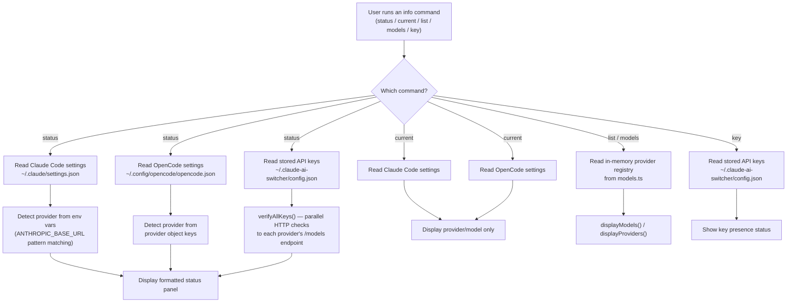
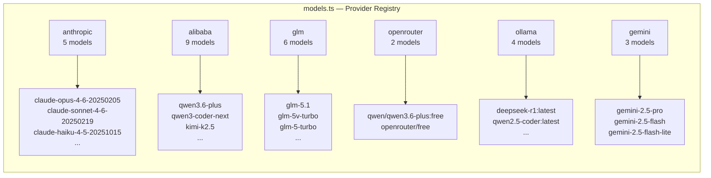

Claude AI Switcher provides a family of read-only **info commands** that let you inspect your current provider configuration, verify that your API keys are functional, and browse the catalog of available models across all supported providers. These commands never modify files or environment variables — they are purely observational, making them safe to run at any time to understand *what is currently active* and *what is available*.

This page covers five CLI commands: `status`, `current`, `list`, `models`, and `key`. Together they form the diagnostic backbone of the tool, answering the questions "where am I?", "what can I use?", and "are my credentials valid?"

Sources: [index.ts](src/index.ts#L715-L943)

## The Info Command Family at a Glance

The following table summarizes all five commands, their purpose, and what they inspect:

| Command | Purpose | Reads Files? | Makes Network Calls? |
|---|---|---|---|
| `claude-switch status` | Full health check: config + API key verification | Yes — `~/.claude/settings.json`, `~/.claude-ai-switcher/config.json`, `opencode.json` | Yes — pings each provider's API |
| `claude-switch current` | Show active provider/model for both clients | Yes — `~/.claude/settings.json`, `opencode.json` | No |
| `claude-switch list` | List every provider with all its models | No — reads in-memory model registry | No |
| `claude-switch models <provider>` | Show models for one specific provider | No — reads in-memory model registry | No |
| `claude-switch key <provider>` | Check or set API key status for a provider | Yes — `~/.claude-ai-switcher/config.json` | No (read-only mode) |

Sources: [index.ts](src/index.ts#L715-L943), [display.ts](src/display.ts#L1-L152)

## Architecture: How the Info Commands Work

Before diving into each command individually, it helps to understand the data flow. Every info command follows the same three-layer pattern: the **CLI layer** in `index.ts` orchestrates the command, the **client layer** reads the actual configuration files from disk, and the **display layer** formats the output for the terminal.



The key architectural insight is that `status` and `current` read **real configuration files on disk** to determine what is actually active, while `list` and `models` read the **built-in model registry** defined in `models.ts` to show what is available. This separation means `list` works even if you have never configured any provider.

Sources: [index.ts](src/index.ts#L715-L919), [models.ts](src/models.ts#L309-L358), [clients/claude-code.ts](src/clients/claude-code.ts#L254-L340), [clients/opencode.ts](src/clients/opencode.ts#L450-L494)

---

## The `status` Command — Full Health Check

The `status` command is the most comprehensive diagnostic tool. It combines three operations into a single run: reading the active configuration for both Claude Code and OpenCode, then verifying every API key by making lightweight HTTP requests to each provider's API endpoint.

```bash
claude-switch status
```

### What It Does Step by Step

**1. Reads the Claude Code configuration.** The command first checks whether `~/.claude/settings.json` exists using `claudeSettingsExists()`. If the file exists, it calls `getClaudeProvider()` which reads the settings and pattern-matches against the `ANTHROPIC_BASE_URL` environment variable embedded in the settings file to determine the active provider (Alibaba, OpenRouter, Ollama, Gemini, GLM, or default Anthropic). It also extracts the active model name, endpoint URL, and any model tier aliases (Opus/Sonnet/Haiku mappings).

**2. Reads the OpenCode configuration.** The same detection logic applies to OpenCode's `~/.config/opencode/opencode.json`. The `getCurrentProvider()` function checks for known provider keys (`bailian-coding-plan`, `openrouter`, `ollama`, `gemini`) in the settings' `provider` object.

**3. Verifies all API keys in parallel.** Using `verifyAllKeys()`, the command fires off concurrent HTTP health checks to each provider's API. The verification logic uses a 5-second timeout per request and maps HTTP status codes to one of five states: **ok** (200 response), **invalid** (401/403), **missing** (no key stored), **error** (network failure or unexpected HTTP code), or **skipped**. Keys are displayed in masked form (e.g., `sk-r...k2x4`) so you can confirm which key is in use without exposing it.

Sources: [index.ts](src/index.ts#L715-L831), [verify.ts](src/verify.ts#L150-L197), [clients/claude-code.ts](src/clients/claude-code.ts#L254-L340)

### Provider Detection Logic

The `getCurrentProvider()` function in the Claude Code client uses a **priority-ordered chain of pattern matches** against the settings' `env` block. This is how the tool determines which provider is active:

| Priority | Pattern Matched | Detected Provider |
|---|---|---|
| 1 | `ANTHROPIC_BASE_URL` contains `coding-intl.dashscope.aliyuncs.com` | Alibaba |
| 2 | `ANTHROPIC_BASE_URL` contains `openrouter.ai` | OpenRouter |
| 3 | `ANTHROPIC_BASE_URL` contains `localhost:4000` | Ollama |
| 4 | `ANTHROPIC_BASE_URL` contains `localhost:4001` | Gemini |
| 5 | `mcpServers["glm-coding-plan"]` exists | GLM |
| 6 | `ANTHROPIC_BASE_URL` contains `z.ai` | GLM |
| 7 | No `ANTHROPIC_BASE_URL` but tier aliases set | GLM |
| 8 | No overrides found | Anthropic (default) |

If no settings file exists at all, the function returns `{ provider: "anthropic" }` since that is the out-of-the-box default for Claude Code.

Sources: [clients/claude-code.ts](src/clients/claude-code.ts#L254-L340), [clients/opencode.ts](src/clients/opencode.ts#L450-L494)

### Example Output

```
=== Claude AI Switcher Status ===

  Claude Code:
    Provider: alibaba
    Model: qwen3.6-plus
    Endpoint: https://coding-intl.dashscope.aliyuncs.com/apps/anthropic
    Aliases:
      opus   → qwen3.6-plus
      sonnet → kimi-k2.5
      haiku  → glm-5

  OpenCode:
    Not installed

  API Key Verification:
──────────────────────────────────────────────────
    ✓ alibaba      Key valid (sk-r...k2x4)
    ○ openrouter   No key configured
    ○ anthropic    No key configured
    ✓ glm          coding-helper installed
    ⚠ ollama       LiteLLM proxy not running on port 4000
    ✓ gemini       Key valid, proxy running
──────────────────────────────────────────────────
```

Each provider row uses a visual indicator: ✓ for valid, ✗ for invalid, ○ for missing, ⚠ for errors.

Sources: [index.ts](src/index.ts#L720-L831), [verify.ts](src/verify.ts#L1-L259)

### How API Key Verification Works Under the Hood

The `verifyAllKeys()` function in `verify.ts` orchestrates parallel checks for each provider. Each verification function makes a single lightweight HTTP GET request to the provider's `/models` or `/health` endpoint:

| Provider | Endpoint Checked | Method |
|---|---|---|
| Alibaba | `https://dashscope.aliyuncs.com/compatible-mode/v1/models` | GET with `Authorization: Bearer <key>` |
| OpenRouter | `https://openrouter.ai/api/v1/models` | GET with `Authorization: Bearer <key>` |
| Anthropic | `https://api.anthropic.com/v1/models` | GET with `x-api-key: <key>` |
| GLM | Checks `which coding-helper` + env vars | No HTTP call |
| Ollama | `http://localhost:4000/health` + `http://localhost:11434/api/tags` | Two GET checks |
| Gemini | `https://generativelanguage.googleapis.com/v1beta/models` + `http://localhost:4001/health` | GET with `x-goog-api-key` |

All HTTP requests use a 5-second timeout enforced via `AbortController`. The `maskKey()` utility displays only the first 4 and last 4 characters of a key, replacing the middle with `...`.

Sources: [verify.ts](src/verify.ts#L7-L259)

---

## The `current` Command — Quick Configuration Snapshot

The `current` command is a lighter alternative to `status`. It shows the active provider, model, endpoint, and tier aliases for both Claude Code and OpenCode — but **skips API key verification entirely**. This makes it instant, with no network calls.

```bash
claude-switch current
```

### When to Use `current` vs `status`

| Scenario | Use `current` | Use `status` |
|---|---|---|
| "Which provider am I on right now?" | ✓ | ✓ |
| "Are my API keys still valid?" | ✗ | ✓ |
| "Is Ollama's LiteLLM proxy running?" | ✗ | ✓ |
| Quick check before a meeting | ✓ (instant) | (slower, network calls) |
| Debugging authentication failures | ✗ | ✓ |

The `current` command reads exactly the same configuration files as `status` (`~/.claude/settings.json` and `~/.config/opencode/opencode.json`) using the same `getCurrentProvider()` detection functions. The only difference is that it stops after displaying the configuration and does not proceed to the API key verification phase.

Sources: [index.ts](src/index.ts#L833-L881)

### Example Output

```
Current Configuration:

  Claude Code:
    Provider: openrouter
    Model: qwen/qwen3.6-plus:free
    Endpoint: https://openrouter.ai/api/v1
    Model aliases:
      opus   → qwen/qwen3.6-plus:free
      sonnet → openrouter/free
      haiku  → openrouter/free

  OpenCode:
    Provider: alibaba
    Endpoint: https://coding-intl.dashscope.aliyuncs.com/apps/anthropic/v1
```

Sources: [index.ts](src/index.ts#L838-L876)

---

## The `list` Command — All Providers and Models

The `list` command displays every provider registered in the tool's model registry along with all available models for each provider. Unlike `status` and `current`, this command does **not read any configuration files** — it iterates over the in-memory `providers` dictionary defined in `models.ts`.

```bash
claude-switch list
```

### How the Model Registry Works

The `providers` object in `models.ts` is a `Record<string, Provider>` where each key is a provider ID and each value contains the provider's name, optional endpoint, and an array of `Model` objects. Each `Model` carries an `id`, display `name`, `contextWindow` (in tokens), a `capabilities` array, and a human-readable `description`.



When you run `list`, the command maps each provider through `displayProviders()` to show a summary (name, model count, endpoint), then calls `displayModels()` for each provider to render a formatted table of models with their context windows and capabilities.

Sources: [index.ts](src/index.ts#L883-L899), [models.ts](src/models.ts#L309-L358), [display.ts](src/display.ts#L22-L71), [display.ts](src/display.ts#L135-L151)

### Example Output

```
✓ Available Providers:

  Anthropic (Default) (anthropic)
    Models: 5

  Alibaba Coding Plan (alibaba)
    Models: 9
    Endpoint: https://coding-intl.dashscope.aliyuncs.com/apps/anthropic

  ...

✓ Provider: Alibaba Coding Plan
────────────────────────────────────────────────────────────────────────────────

Model                 Context          Capabilities
────────────────────────────────────────────────────────────────────────────────
  qwen3.6-plus        1M tokens        Text Generation, Deep Thinking, Visual Understanding
  Balanced performance, speed, and cost. Supports thinking/non-thinking modes with 1M context window.

  qwen3-max-2026-01-23  262K tokens   Text Generation, Deep Thinking
  Most capable model for complex, multi-step tasks with enhanced reasoning.

...
```

The `displayModels()` function dynamically calculates column widths based on model ID lengths and highlights the current model (when passed) with a green `●` bullet indicator.

Sources: [display.ts](src/display.ts#L22-L71), [models.ts](src/models.ts#L82-L306)

---

## The `models` Command — Provider-Specific Model Listing

When you want to see models for just one provider rather than all of them, use the `models` command with a provider name argument:

```bash
claude-switch models <provider>
```

### Valid Provider Names

| Provider ID | Provider Display Name |
|---|---|
| `anthropic` | Anthropic (Default) |
| `alibaba` | Alibaba Coding Plan |
| `glm` | GLM/Z.AI |
| `openrouter` | OpenRouter |
| `ollama` | Ollama (Local) |
| `gemini` | Gemini (Google) |

If you omit the provider argument or supply an unknown name, the command prints an error with the list of valid provider IDs:

```bash
$ claude-switch models
✗ Error: Please specify a provider: anthropic, alibaba, openrouter, glm, ollama, or gemini
  Example: claude-switch models alibaba
```

The command resolves the provider name case-insensitively by looking it up in the `providers` dictionary from `models.ts`, then delegates rendering to the shared `displayModels()` function.

Sources: [index.ts](src/index.ts#L901-L919)

---

## The `key` Command — API Key Inspection

The `key` command lets you check whether an API key is stored for a given provider, or set a new one. When called with only a provider name (no key value), it operates in **read-only mode** — checking whether a key exists in `~/.claude-ai-switcher/config.json` and reporting its presence without revealing the actual value.

```bash
# Check if a key is set (read-only)
claude-switch key alibaba
claude-switch key openrouter
claude-switch key gemini
```

### How Key Storage Works

API keys are persisted in `~/.claude-ai-switcher/config.json`, a simple JSON file managed by the `config.ts` module. The `UserConfig` interface defines three optional key fields: `alibabaApiKey`, `openrouterApiKey`, and `geminiApiKey`. The Anthropic key is **not** stored in this file — it is read directly from the `ANTHROPIC_API_KEY` environment variable during `status` verification.

| Provider | Storage Location | Key Field |
|---|---|---|
| Alibaba | `~/.claude-ai-switcher/config.json` | `alibabaApiKey` |
| OpenRouter | `~/.claude-ai-switcher/config.json` | `openrouterApiKey` |
| Gemini | `~/.claude-ai-switcher/config.json` | `geminiApiKey` |
| Anthropic | `ANTHROPIC_API_KEY` env var | Not persisted by this tool |
| GLM | Managed externally by `coding-helper` | Not applicable |
| Ollama | No key required | Not applicable |

When you supply a second argument, the command **writes** the key to the config file:

```bash
# Set a new key (write operation)
claude-switch key alibaba sk-your-new-key-here
```

Sources: [index.ts](src/index.ts#L921-L943), [config.ts](src/config.ts#L14-L101)

### Example Output

```
# Key exists
✓ API key is set for alibaba

# Key does not exist
⚠ No API key set for openrouter
  Set with: claude-switch key openrouter <your-key>
```

Sources: [index.ts](src/index.ts#L926-L934)

---

## Display Formatting: How Output Is Rendered

All info commands share a common set of display utilities from `display.ts` that use the `chalk` library for terminal coloring. Understanding these formatting functions helps you interpret the output and, if you are extending the tool, know which helpers to reuse.

| Function | Purpose | Used By |
|---|---|---|
| `displayModels()` | Renders a tabular model list with context sizes and capabilities | `list`, `models` |
| `displayProviders()` | Renders a summary list of all providers with model counts | `list` |
| `displayCurrentStatus()` | Renders provider/model/endpoint status block | (Available for external use) |
| `displaySuccess()` | Green `✓` message | All commands |
| `displayError()` | Red `✗` message | All commands |
| `displayWarning()` | Yellow `⚠` message | All commands |
| `displayInfo()` | Blue `ℹ` message | All commands |
| `formatContext()` | Converts token counts to human-readable strings (e.g., `1M tokens`) | `displayModels()` |

The `formatContext()` function converts raw token counts into readable strings: values ≥ 1,000,000 become `XM tokens`, values ≥ 1,000 become `XK tokens`, and smaller values are displayed as-is.

Sources: [display.ts](src/display.ts#L1-L152)

---

## Where to Go Next

Now that you know how to inspect your current configuration and browse available models, here are the natural next steps depending on what you want to do:

- **Switch to a different provider** → [Switching Providers for Claude Code](4-switching-providers-for-claude-code)
- **Configure OpenCode providers** → [Managing OpenCode Providers (Add/Remove)](5-managing-opencode-providers-add-remove)
- **Understand how provider detection works internally** → [Provider Detection from Claude Settings](20-provider-detection-from-claude-settings)
- **Learn about the model tier alias system** → [Model and Provider Type Definitions](14-model-and-provider-type-definitions)
- **Explore how API keys are stored and verified** → [API Key Storage and Local Configuration Management](17-api-key-storage-and-local-configuration-management)
- **See how console output is formatted** → [Console Output Formatting with Chalk and Ora](21-console-output-formatting-with-chalk-and-ora)