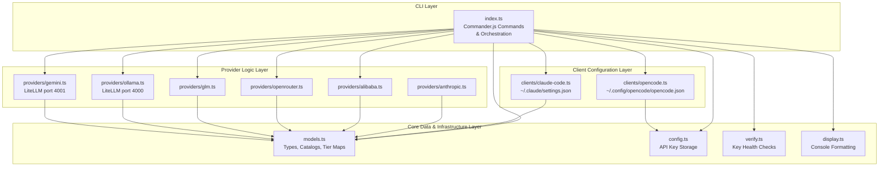
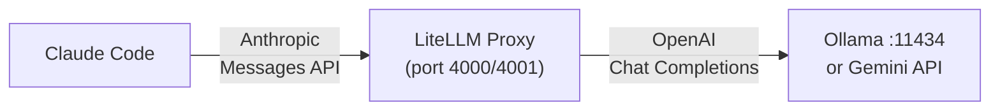

Claude AI Switcher is a CLI tool built with TypeScript that configures two AI coding clients — **Claude Code** and **OpenCode** — to use alternative AI providers instead of the default Anthropic API. The codebase is organized into a clean layered architecture where a single entry point orchestrates six modules, each with a sharply defined responsibility boundary. This page provides a top-down map of every module, how data flows between them, and what each file owns so you can navigate the code with confidence.

Sources: [package.json](package.json#L1-L47), [src/index.ts](src/index.ts#L1-L68)

## Visual Project Structure

```
src/
├── index.ts                    ← CLI entry point (Commander.js commands)
├── models.ts                   ← Type definitions, model catalogs, provider registry
├── config.ts                   ← API key storage (~/.claude-ai-switcher/config.json)
├── verify.ts                   ← Lightweight HTTP health checks for API keys
├── display.ts                  ← Console output formatting (Chalk + Ora)
├── clients/
│   ├── claude-code.ts          ← Reads/writes ~/.claude/settings.json
│   └── opencode.ts             ← Reads/writes ~/.config/opencode/opencode.json
└── providers/
    ├── anthropic.ts            ← Anthropic (default) — clears overrides
    ├── alibaba.ts              ← Alibaba Coding Plan — endpoint + model config
    ├── openrouter.ts           ← OpenRouter — endpoint + model config
    ├── glm.ts                  ← GLM/Z.AI — coding-helper integration
    ├── ollama.ts               ← Ollama — LiteLLM proxy lifecycle (port 4000)
    └── gemini.ts               ← Gemini — LiteLLM proxy lifecycle (port 4001)
```

Sources: [src/index.ts](src/index.ts#L1-L68), [src/models.ts](src/models.ts#L1-L20)

## Architectural Layer Diagram

The following diagram illustrates the four-layer architecture. **Each layer only depends on layers below it** — there are no upward dependencies or circular imports, making the system predictable and easy to test.



Sources: [src/index.ts](src/index.ts#L1-L68), [src/models.ts](src/models.ts#L308-L358), [src/config.ts](src/config.ts#L1-L20)

## Module Responsibility Catalog

The table below summarizes each module's single responsibility, its public interface shape, and the filesystem artifact it manages.

| Module | Single Responsibility | Key Exports | Managed File / Resource |
|---|---|---|---|
| **`src/index.ts`** | CLI command definitions, user-facing orchestration of the switch flow | `program` (Commander), `switchX()` functions | — (reads from all other modules) |
| **`src/models.ts`** | Type definitions for `Model`, `Provider`, `ModelTierMap`; static model catalogs; provider registry; tier alias defaults | `providers`, `getModels()`, `ModelTierMap`, `GLM_DEFAULT_TIER_MAP`, etc. | — (pure data, no I/O) |
| **`src/config.ts`** | Persistent API key storage and retrieval for third-party providers | `getApiKey()`, `setApiKey()`, `hasApiKey()`, `readConfig()` | `~/.claude-ai-switcher/config.json` |
| **`src/clients/claude-code.ts`** | Read, modify, and backup Claude Code settings with tier map env vars | `configureAlibaba()`, `configureOpenRouter()`, `configureOllama()`, `configureGemini()`, `configureGLM()`, `configureAnthropic()`, `getCurrentProvider()` | `~/.claude/settings.json`, `~/.claude.json` |
| **`src/clients/opencode.ts`** | Read, modify, and backup OpenCode provider schema JSON | `configureAlibaba()`, `configureOpenRouter()`, `configureOllama()`, `configureGemini()`, `removeProvider()`, `getCurrentProvider()` | `~/.config/opencode/opencode.json` |
| **`src/verify.ts`** | Lightweight HTTP health checks against provider API endpoints | `verifyAllKeys()`, `maskKey()` | — (network requests only) |
| **`src/display.ts`** | Terminal output formatting using Chalk and Ora spinner | `displayModels()`, `displaySuccess()`, `displayError()`, `displayProviders()` | — (console I/O only) |
| **`src/providers/*.ts`** | Provider-specific logic: endpoint URLs, installation checks, proxy lifecycle | `getAlibabaConfig()`, `startLitellmProxy()`, `isCodingHelperInstalled()`, etc. | — (delegated to clients layer) |

Sources: [src/models.ts](src/models.ts#L1-L20), [src/config.ts](src/config.ts#L14-L20), [src/clients/claude-code.ts](src/clients/claude-code.ts#L1-L46), [src/clients/opencode.ts](src/clients/opencode.ts#L1-L17), [src/verify.ts](src/verify.ts#L1-L13), [src/display.ts](src/display.ts#L1-L18)

## Core Data Layer — `models.ts`

The **models** module is the foundation of the entire system — it is imported by every other module except `display.ts`. It contains three distinct concerns that are co-located because they share the same type domain:

**Type Definitions** define the shape of all data flowing through the system. `Model` describes an individual AI model (id, name, context window, capabilities, description). `Provider` groups models under a provider identity with an optional endpoint URL. `ModelTierMap` maps the three Claude model tiers (opus, sonnet, haiku) to specific model identifiers.

**Static Model Catalogs** are hard-coded arrays — `alibabaModels`, `glmModels`, `openrouterModels`, `ollamaModels`, `geminiModels`, and `anthropicModels` — each containing the complete set of models available for that provider. These catalogs serve as both validation data (the CLI checks user-supplied model IDs against them) and display data (the `models` command renders them in a table).

**Provider Registry** is the `providers` record that maps string keys (`"anthropic"`, `"alibaba"`, `"glm"`, `"openrouter"`, `"ollama"`, `"gemini"`) to full `Provider` objects. The `getModels()` and `getModel()` functions provide the lookup interface used throughout the codebase.

The tier alias system deserves special attention: each provider has a default `ModelTierMap` (e.g., `OLLAMA_DEFAULT_TIER_MAP` maps opus → `deepseek-r1:latest`, sonnet → `qwen2.5-coder:latest`, haiku → `llama3.1:latest`). These defaults are used by the `buildTierMap()` helper in `index.ts`, which overlays any user-supplied `--opus`, `--sonnet`, or `--haiku` CLI flags on top of the provider defaults.

Sources: [src/models.ts](src/models.ts#L1-L69), [src/models.ts](src/models.ts#L308-L358)

## Client Configuration Layer

The client layer is the **write boundary** — it is the only part of the codebase that modifies external configuration files. Both client modules share an identical operational pattern: **read → backup → mutate → write**. Before any write operation, the existing file is copied to a timestamped backup (e.g., `settings.json.backup.1719480000000`), ensuring that users can always revert a broken configuration.

### Claude Code Client (`clients/claude-code.ts`)

This module manages two files in the user's home directory:

- **`~/.claude/settings.json`** — The primary configuration target. Provider switches work by setting three environment variables inside this file's `env` key: `ANTHROPIC_AUTH_TOKEN`, `ANTHROPIC_BASE_URL`, and `ANTHROPIC_MODEL`. The tier alias system writes three additional env vars: `ANTHROPIC_DEFAULT_OPUS_MODEL`, `ANTHROPIC_DEFAULT_SONNET_MODEL`, and `ANTHROPIC_DEFAULT_HAIKU_MODEL`.

- **`~/.claude.json`** — A secondary file that stores the onboarding flag. The module calls `ensureOnboardingComplete()` before every provider switch to set `hasCompletedOnboarding: true`, which prevents the "Unable to connect to Anthropic services" error that would otherwise appear when non-Anthropic providers are configured.

The `getCurrentProvider()` function performs **detection by URL pattern matching** — it inspects `ANTHROPIC_BASE_URL` to determine which provider is active. For example, if the URL contains `"coding-intl.dashscope.aliyuncs.com"`, it returns `"alibaba"`; if it contains `"localhost:4000"`, it returns `"ollama"`.

Sources: [src/clients/claude-code.ts](src/clients/claude-code.ts#L1-L112), [src/clients/claude-code.ts](src/clients/claude-code.ts#L254-L341)

### OpenCode Client (`clients/opencode.ts`)

This module manages `~/.config/opencode/opencode.json` using a fundamentally different configuration schema. Instead of environment variables, OpenCode uses a **provider object structure** where each provider (e.g., `"bailian-coding-plan"`, `"openrouter"`, `"ollama"`, `"gemini"`) is a key containing an npm package reference, options (baseURL, apiKey), and a models sub-object with per-model modalities and limits. The `removeProvider()` function enables surgical deletion of a single provider key while preserving all others.

Sources: [src/clients/opencode.ts](src/clients/opencode.ts#L1-L67), [src/clients/opencode.ts](src/clients/opencode.ts#L432-L494)

## Provider Logic Layer

The six provider modules under `src/providers/` encapsulate provider-specific knowledge. They fall into two distinct categories based on how they connect to Claude Code:

### Direct API Providers

These providers expose Anthropic-compatible API endpoints that Claude Code can hit directly. The client modules set `ANTHROPIC_BASE_URL` to the provider's endpoint, and no intermediary infrastructure is needed.

| Provider | Endpoint | Authentication |
|---|---|---|
| **Anthropic** (default) | Native (no override) | `ANTHROPIC_API_KEY` env var |
| **Alibaba** | `https://coding-intl.dashscope.aliyuncs.com/apps/anthropic` | API key via `ANTHROPIC_AUTH_TOKEN` |
| **OpenRouter** | `https://openrouter.ai/api/v1` | API key via `ANTHROPIC_AUTH_TOKEN` |

Each of these provider modules exports a `getAvailableModels()` function and a `findModel()` lookup, alongside a typed config interface (e.g., `AlibabaConfig`, `OpenRouterConfig`).

Sources: [src/providers/anthropic.ts](src/providers/anthropic.ts#L1-L24), [src/providers/alibaba.ts](src/providers/alibaba.ts#L1-L44), [src/providers/openrouter.ts](src/providers/openrouter.ts#L1-L43)

### LiteLLM Proxy Providers

Ollama and Gemini do not speak the Anthropic Messages API natively — they use the OpenAI Chat Completions format. To bridge this incompatibility, the tool spawns a **LiteLLM proxy** as a detached background process that translates between the two protocols.



The `startLitellmProxy()` (Ollama) and `startGeminiLitellmProxy()` (Gemini) functions follow the same lifecycle pattern: check if the proxy is already running via the `/health` endpoint, spawn a detached `litellm` child process if not, then poll the health endpoint up to 10 times with 500ms intervals (5-second timeout). The Ollama variant additionally checks that Ollama itself is installed and running on port 11434 before attempting to start the proxy.

Sources: [src/providers/ollama.ts](src/providers/ollama.ts#L1-L146), [src/providers/gemini.ts](src/providers/gemini.ts#L1-L136)

### GLM/Z.AI Provider

The GLM provider is architecturally unique — it does not manage its own endpoint or API key. Instead, it delegates to the external `@z_ai/coding-helper` CLI tool. The module provides `isCodingHelperInstalled()` (a `which`/`where` check) and `reloadGLMConfig()` (runs `coding-helper auth reload claude`). The actual API credentials and endpoint are managed entirely by the coding-helper ecosystem.

Sources: [src/providers/glm.ts](src/providers/glm.ts#L1-L61)

## Infrastructure Modules

### Configuration Manager (`config.ts`)

This module owns the `~/.claude-ai-switcher/` directory and its `config.json` file. It exposes a `UserConfig` interface with optional fields for `alibabaApiKey`, `openrouterApiKey`, `geminiApiKey`, `defaultProvider`, and `defaultModel`. The `getApiKey(provider)` and `setApiKey(provider, key)` functions use a switch statement to map provider names to the corresponding config field. Note that Anthropic and GLM keys are **not** stored here — Anthropic uses `ANTHROPIC_API_KEY` from the shell environment, and GLM is managed by coding-helper.

Sources: [src/config.ts](src/config.ts#L1-L101)

### API Key Verification (`verify.ts`)

The verification module makes lightweight HTTP requests to each provider's `/models` or equivalent endpoint with a 5-second timeout (`fetchWithTimeout`). The `verifyAllKeys()` function accepts a bag of keys and provider flags, runs all checks in parallel via `Promise.all()`, and returns an array of `VerifyResult` objects. Each result carries a status (`ok | invalid | missing | error | skipped`) and a human-readable message. The `maskKey()` utility renders API keys as `sk-...4f2e` format for safe display.

Sources: [src/verify.ts](src/verify.ts#L1-L197)

### Display Formatting (`display.ts`)

A thin presentation layer built on Chalk that provides structured output functions: `displayModels()` renders a formatted table with model ID, context window, and capabilities; `displaySuccess()`, `displayError()`, `displayWarning()`, and `displayInfo()` provide consistent status-line formatting; `displayProviders()` lists all available providers with model counts. This module has **zero knowledge** of business logic — it accepts plain data and renders it.

Sources: [src/display.ts](src/display.ts#L1-L152)

## CLI Entry Point — `index.ts`

The 1033-line entry point serves as the **composition root** where all modules are wired together. It uses Commander.js to define three command groups:

**Top-level shorthand commands** (`alibaba [model]`, `anthropic`, `glm`, `openrouter [model]`, `ollama [model]`, `gemini [model]`) provide direct provider switching for Claude Code. Each maps to a `switchX()` private function that orchestrates the full flow: resolve API key (prompt if missing), validate the model against the catalog, start any required infrastructure (LiteLLM proxies), call the appropriate client configuration function, and display the result.

**The `claude` subcommand** mirrors the top-level commands under an explicit namespace (e.g., `claude-switch claude alibaba qwen3.6-plus`).

**The `opencode` subcommand** provides `add` and `remove` subcommands for managing OpenCode providers. Unlike Claude Code (which switches exclusively), OpenCode supports multiple simultaneous providers — hence the add/remove paradigm.

**Info commands** (`status`, `current`, `list`, `models [provider]`, `key <provider> [apikey]`, `setup`) provide introspection, key management, and an interactive setup wizard.

The `buildTierMap()` helper merges provider-default tier maps with user-supplied CLI flags, while `addTierOptions()` attaches `--opus`, `--sonnet`, and `--haiku` options to any command.

Sources: [src/index.ts](src/index.ts#L1-L123), [src/index.ts](src/index.ts#L360-L440), [src/index.ts](src/index.ts#L526-L600)

## Dependency Flow and Module Coupling

The dependency graph is intentionally **star-shaped** — `index.ts` is the hub that imports from all other modules, while those modules have minimal inter-dependencies. The core `models.ts` module is the single shared data contract: both client modules and all provider modules import from it, but they never import from each other. This design means adding a new provider requires touching only `models.ts` (add the catalog), the new provider file, the two client modules (add configure/detect functions), and `index.ts` (add the CLI command) — with zero risk of regression in existing providers.

Sources: [src/index.ts](src/index.ts#L10-L67), [src/models.ts](src/models.ts#L308-L344)

## Where to Go Next

Now that you understand the architectural map, these pages dive deeper into specific layers:

- **[How Provider Switching Works: The End-to-End Flow](8-how-provider-switching-works-the-end-to-end-flow)** — traces a single `claude-switch alibaba` command through every module
- **[Model and Provider Type Definitions](14-model-and-provider-type-definitions)** — detailed breakdown of the `Model`, `Provider`, and `ModelTierMap` interfaces
- **[Claude Code Client: Settings, Environment Variables, and Backups](12-claude-code-client-settings-environment-variables-and-backups)** — deep dive into how `~/.claude/settings.json` is read, mutated, and backed up
- **[Adding a New Provider: Step-by-Step Implementation Guide](23-adding-a-new-provider-step-by-step-implementation-guide)** — practical guide that leverages the architectural patterns documented here