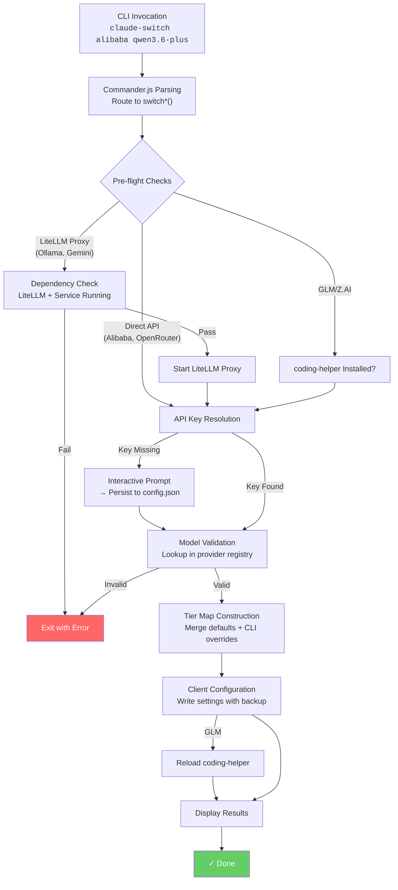
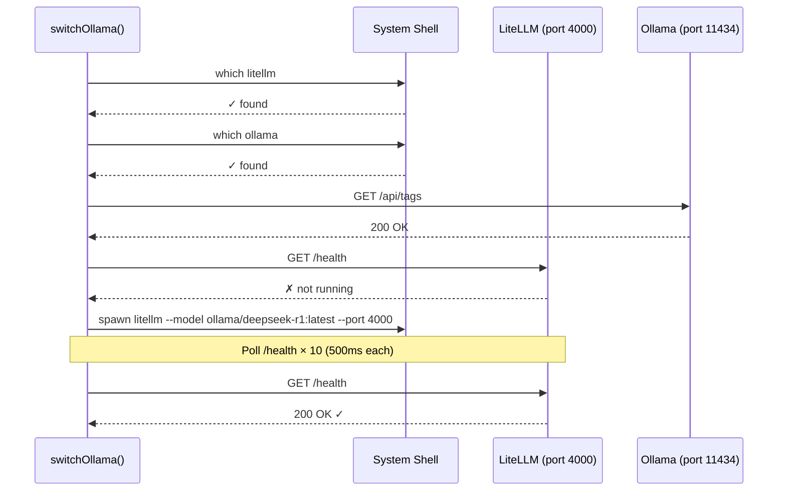
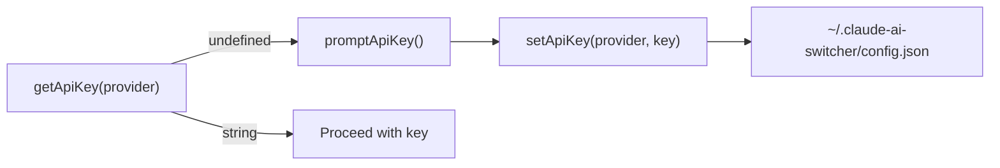
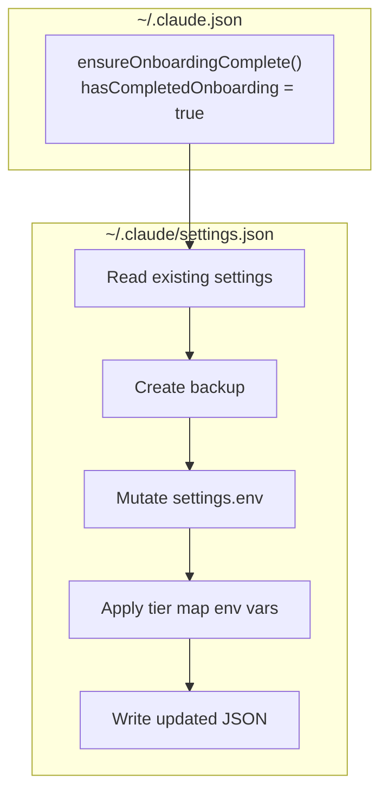

This page traces the complete execution path from the moment you type a CLI command to the point where your target client (Claude Code or OpenCode) is reconfigured to use a different AI provider. Understanding this flow is essential for debugging switching failures, extending the system with new providers, or reasoning about why certain pre-flight checks exist. Each phase is decomposed into its constituent operations with precise source references so you can verify claims against the implementation.

## The Big Picture: One Diagram, Six Phases

Provider switching is a **linear pipeline with conditional branches**. Every `switch*` function in the CLI follows the same skeletal structure — only the pre-flight checks and the proxy-launch step differ by provider. The diagram below captures the universal sequence; subsequent sections examine each phase in isolation.

Sources: [index.ts](src/index.ts#L129-L358)

---

## Phase 1 — Command Parsing and Dispatch

The entry point is [src/index.ts](src/index.ts#L1-L1033), which bootstraps a **Commander.js** program at module load time. Each provider is registered twice — once as a top-level shorthand (e.g., `claude-switch alibaba`) and once under the explicit `claude` namespace (e.g., `claude-switch claude alibaba`). Both routes invoke the same `switch*` function, so there is zero behavioral difference between the two forms.

The dispatch table maps provider names to their corresponding handler functions. Each handler is an `async function` that encapsulates the full switching pipeline for that provider. The `addTierOptions()` helper attaches the `--opus`, `--sonnet`, and `--haiku` optional flags to any command that accepts model-tier overrides, wiring them into the Commander option parser automatically.

| CLI Command | Handler Function | Target Client |
|---|---|---|
| `claude-switch alibaba [model]` | `switchAlibaba()` | Claude Code |
| `claude-switch openrouter [model]` | `switchOpenRouter()` | Claude Code |
| `claude-switch ollama [model]` | `switchOllama()` | Claude Code |
| `claude-switch gemini [model]` | `switchGemini()` | Claude Code |
| `claude-switch glm` | `switchGLM()` | Claude Code |
| `claude-switch anthropic` | `switchAnthropic()` | Claude Code |
| `claude-switch opencode add <provider>` | Inline actions | OpenCode |
| `claude-switch opencode remove <provider>` | Inline actions | OpenCode |

Sources: [index.ts](src/index.ts#L69-L74), [index.ts](src/index.ts#L364-L524), [index.ts](src/index.ts#L530-L709)

---

## Phase 2 — Pre-flight Checks (Provider-Specific)

Pre-flight checks are **gate conditions** that must pass before any configuration is modified. They prevent partial states where the client is reconfigured but the underlying infrastructure cannot serve requests. The checks vary significantly by provider category.

### Direct API Providers (No Infrastructure Required)

**Alibaba, OpenRouter, and Anthropic** skip infrastructure checks entirely. Their only prerequisite is an API key. Because these providers expose Anthropic-compatible endpoints directly, no proxy layer is needed.

### LiteLLM Proxy Providers (Ollama, Gemini)

Ollama and Gemini require a three-stage pre-flight sequence executed in strict order:

1. **LiteLLM installed?** — Calls `isLitellmInstalled()` which shells out to `which litellm` (or `where litellm` on Windows) to verify the Python package is available on `PATH`.
2. **Service installed and running?** — For Ollama, this additionally checks `isOllamaInstalled()` and `isOllamaRunning()` (the latter pings `http://localhost:11434/api/tags`). Gemini skips this since it's a cloud API.
3. **LiteLLM proxy started** — If the proxy isn't already running on the designated port, `startLitellmProxy()` spawns it as a **detached background process** and polls the `/health` endpoint up to 10 times (500ms intervals = 5 seconds total) awaiting readiness.

Sources: [ollama.ts](src/providers/ollama.ts#L48-L146), [gemini.ts](src/providers/gemini.ts#L48-L136), [index.ts](src/index.ts#L244-L303), [index.ts](src/index.ts#L305-L358)

### GLM/Z.AI (coding-helper)

The GLM provider is unique: it delegates authentication and endpoint management to the external `@z_ai/coding-helper` package. The pre-flight check is simply `isCodingHelperInstalled()`, which shells out to `which coding-helper`. A **warning** (not an error) is displayed if it's absent — the switch still proceeds because tier map aliases are written regardless, but the `coding-helper auth reload claude` post-configuration step will be skipped.

Sources: [glm.ts](src/providers/glm.ts#L29-L60), [index.ts](src/index.ts#L177-L203)

---

## Phase 3 — API Key Resolution and Persistence

The key resolution strategy follows a **read-then-prompt-then-write** pattern implemented identically for Alibaba, OpenRouter, and Gemini. Anthropic uses its own API key (the `ANTHROPIC_API_KEY` environment variable) and is never prompted for. GLM delegates auth entirely to coding-helper. Ollama uses the dummy string `"ollama"` as its auth token.

The resolution flow for providers that need a key:

1. **Read** from `~/.claude-ai-switcher/config.json` via `getApiKey(provider)`.
2. If absent, **prompt** the user interactively with `promptApiKey()`, which displays the provider name and a help URL pointing to the key-issuance console.
3. **Persist** the entered key back to `config.json` via `setApiKey(provider, apiKey)`.

The config file stores keys under typed fields (`alibabaApiKey`, `openrouterApiKey`, `geminiApiKey`) within a single `UserConfig` object. The file is created on first write if it doesn't exist. This means keys survive across sessions — you only need to enter them once.

Sources: [config.ts](src/config.ts#L1-L101), [index.ts](src/index.ts#L80-L98), [index.ts](src/index.ts#L138-L175)

---

## Phase 4 — Model Validation and Tier Map Construction

### Model Validation

Every `switch*` function validates the requested model ID against a static registry defined in [src/models.ts](src/models.ts#L1-L359). The `getModels(providerId)` function retrieves the model array for a provider, and a simple `Array.find()` checks whether the user-supplied model ID exists. On failure, the CLI prints the list of valid models and exits with code 1. This happens **before** any configuration is written, ensuring no partial state.

### Tier Map Construction

The **tier alias system** is the mechanism by which Claude Code maps its internal model tiers (Opus, Sonnet, Haiku) to provider-specific model names. When Claude Code reads `ANTHROPIC_DEFAULT_OPUS_MODEL=deepseek-r1:latest` from its settings environment, it substitutes that model wherever it would normally use Claude Opus.

The `buildTierMap()` function merges a provider's **default tier map** with any CLI overrides provided via `--opus`, `--sonnet`, or `--haiku` flags. CLI overrides take precedence when present; otherwise, the provider's default is used.

| Provider | Default Opus | Default Sonnet | Default Haiku |
|---|---|---|---|
| Anthropic | *(cleared)* | *(cleared)* | *(cleared)* |
| Alibaba (qwen3.6-plus) | `qwen3.6-plus` | `kimi-k2.5` | `glm-5` |
| Alibaba (other model) | *selected model* | `qwen3.6-plus` | `kimi-k2.5` |
| OpenRouter | `qwen/qwen3.6-plus:free` | `openrouter/free` | `openrouter/free` |
| Ollama | `deepseek-r1:latest` | `qwen2.5-coder:latest` | `llama3.1:latest` |
| Gemini | `gemini-2.5-pro` | `gemini-2.5-flash` | `gemini-2.5-flash-lite` |
| GLM | `glm-5.1` | `glm-5v-turbo` | `glm-5-turbo` |

The Alibaba tier map is dynamic — `getAlibabaTierMap(model)` adjusts the mapping based on which model the user selected, placing the chosen model at the Opus tier while demoting the default to Sonnet.

Sources: [models.ts](src/models.ts#L16-L69), [index.ts](src/index.ts#L100-L123)

---

## Phase 5 — Client Configuration Write

This is the **commit point** — the phase where the target client's configuration files are atomically rewritten with the new provider settings. The two clients use fundamentally different configuration schemas.

### Claude Code Configuration

Claude Code reads its settings from `~/.claude/settings.json`. The `configure*` functions in [src/clients/claude-code.ts](src/clients/claude-code.ts#L1-L341) all follow an identical **read → mutate → write** pattern:

1. **`ensureOnboardingComplete()`** — Sets `hasCompletedOnboarding: true` in `~/.claude.json` to prevent Claude Code from showing its "Unable to connect to Anthropic services" error dialog when a non-Anthropic provider is active.
2. **`readClaudeSettings()`** — Parses `~/.claude/settings.json`, returning `{}` if the file doesn't exist.
3. **Mutate `settings.env`** — Sets three critical environment variables:

| Environment Variable | Purpose |
|---|---|
| `ANTHROPIC_AUTH_TOKEN` | API key for the provider |
| `ANTHROPIC_BASE_URL` | Provider's Anthropic-compatible endpoint |
| `ANTHROPIC_MODEL` | Default model to use |

4. **`applyTierMap()`** — Writes the three tier alias env vars (`ANTHROPIC_DEFAULT_OPUS_MODEL`, `ANTHROPIC_DEFAULT_SONNET_MODEL`, `ANTHROPIC_DEFAULT_HAIKU_MODEL`).
5. **`writeClaudeSettings()`** — Creates a timestamped backup (`settings.json.backup.<timestamp>`) before writing the new JSON.

When switching **back to Anthropic**, the process is inverted: `configureAnthropic()` **deletes** the provider-specific env vars and tier aliases, restoring Claude Code to its native state.

### OpenCode Configuration

OpenCode reads from `~/.config/opencode/opencode.json`. Its schema is structurally different — instead of environment variables, it uses a **nested provider object** with model definitions, modalities, and limits. Each `configure*` function in [src/clients/opencode.ts](src/clients/opencode.ts#L1-L495) builds the full provider block inline and writes it under a provider-specific key (`bailian-coding-plan`, `openrouter`, `ollama`, `gemini`).

The key architectural difference: OpenCode supports **multiple providers simultaneously** in its config. Adding a provider never removes others. The `removeProvider(key)` function deletes only the named provider key, preserving the rest. This is why OpenCode uses `add`/`remove` subcommands rather than a `switch` metaphor.

Sources: [claude-code.ts](src/clients/claude-code.ts#L100-L250), [opencode.ts](src/clients/opencode.ts#L50-L445)

---

## Phase 6 — Post-Configuration and Result Display

After the configuration write succeeds, two final steps complete the flow:

### GLM-Specific: coding-helper Reload

When switching to GLM and `coding-helper` is installed, the CLI executes `coding-helper auth reload claude` via `reloadGLMConfig()`. This tells the coding-helper daemon to push fresh GLM credentials into Claude Code's settings, complementing the tier map that was already written. If the reload fails, a warning is shown but the switch is still considered successful because the local tier map is already in place.

### Success Display

Every `switch*` function concludes with a formatted summary printed to stdout via `chalk`:

- **Provider name and model** with color-coded labels
- **Context window size** formatted for readability (e.g., "1M tokens")
- **Endpoint URL** showing where requests will be routed
- **Capability list** (Text Generation, Deep Thinking, etc.)
- **Tier alias mapping** showing the Opus/Sonnet/Haiku model assignments

Sources: [index.ts](src/index.ts#L163-L175), [glm.ts](src/providers/glm.ts#L46-L60), [display.ts](src/display.ts#L1-L152)

---

## Provider Detection: Reading the Current State

The `getCurrentProvider()` function in both client modules implements the **inverse** of the switching flow — it reads the existing configuration and determines which provider is active by pattern-matching against known endpoints and keys.

For **Claude Code**, detection follows a priority-ordered chain of URL substring checks on `ANTHROPIC_BASE_URL`:

| Priority | Pattern in `ANTHROPIC_BASE_URL` | Detected Provider |
|---|---|---|
| 1 | `coding-intl.dashscope.aliyuncs.com` | Alibaba |
| 2 | `openrouter.ai` | OpenRouter |
| 3 | `localhost:4000` | Ollama |
| 4 | `localhost:4001` | Gemini |
| 5 | `mcpServers["glm-coding-plan"]` exists | GLM |
| 6 | `z.ai` | GLM (via coding-helper) |
| 7 | Tier aliases set but no BASE_URL | GLM |
| 8 | *(none of the above)* | Anthropic (default) |

This priority order matters because it determines which provider is reported when multiple signals are present. The first match wins.

Sources: [claude-code.ts](src/clients/claude-code.ts#L255-L341), [opencode.ts](src/clients/opencode.ts#L450-L495)

---

## Switching Back to Anthropic: The Reversal Path

Switching to Anthropic is the **inverse operation** of every other provider switch. The `configureAnthropic()` function in both clients performs selective deletion rather than addition:

- **Claude Code**: Removes `ANTHROPIC_AUTH_TOKEN`, `ANTHROPIC_BASE_URL`, `ANTHROPIC_MODEL`, and all three tier alias env vars. Also removes `mcpServers["alibaba-coding-plan"]` and `mcpServers["glm-coding-plan"]` if present. The result is a settings file with a clean (or no) `env` block, causing Claude Code to use its built-in Anthropic defaults.

- **OpenCode**: Removes all custom provider keys (`bailian-coding-plan`, `openrouter`, `ollama`, `gemini`) from the `provider` object. If no providers remain, the `provider` key itself is deleted, returning OpenCode to its native Anthropic integration.

Sources: [claude-code.ts](src/clients/claude-code.ts#L159-L178), [opencode.ts](src/clients/opencode.ts#L217-L246)

---

## Error Handling Philosophy

The switching pipeline follows a **fail-fast, no-partial-state** contract. Every pre-flight check that fails calls `process.exit(1)` immediately — before any configuration file is touched. This ensures that a failed switch never leaves the client in an intermediate state pointing to an unreachable provider.

The only exception is the GLM coding-helper reload: a failure there produces a warning, not an exit, because the tier map is already written and may be functional without the coding-helper's assistance.

Sources: [index.ts](src/index.ts#L248-L287)

---

## Next Steps

- **Deep dive into individual provider implementations**: [Direct API Providers (Anthropic, Alibaba, OpenRouter)](9-direct-api-providers-anthropic-alibaba-openrouter) and [LiteLLM Proxy Providers (Ollama on Port 4000, Gemini on Port 4001)](10-litellm-proxy-providers-ollama-on-port-4000-gemini-on-port-4001)
- **Understand the client configuration schemas**: [Claude Code Client: Settings, Environment Variables, and Backups](12-claude-code-client-settings-environment-variables-and-backups) and [OpenCode Client: Provider Schema and JSON Configuration](13-opencode-client-provider-schema-and-json-configuration)
- **Explore the tier alias system in detail**: [Model and Provider Type Definitions](14-model-and-provider-type-definitions) and [Custom Tier Overrides with --opus, --sonnet, --haiku Flags](16-custom-tier-overrides-with-opus-sonnet-haiku-flags)
- **Learn how to extend the system**: [Adding a New Provider: Step-by-Step Implementation Guide](23-adding-a-new-provider-step-by-step-implementation-guide)