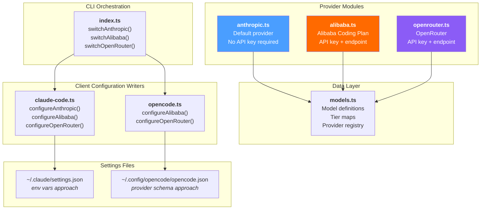
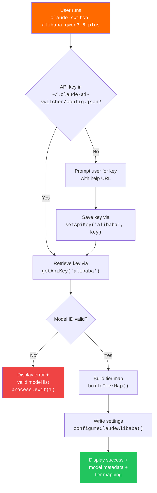

This page covers the three providers in claude-ai-switcher that communicate **directly** with remote API endpoints — no local proxy, no LiteLLM intermediary, no background process management. These providers represent the simplest integration path: the tool writes authentication credentials and endpoint URLs into client configuration files, and the client application connects straight to the provider's cloud API. Understanding this direct-path architecture is essential because it contrasts sharply with the proxy-based providers (Ollama, Gemini) covered in [LiteLLM Proxy Providers (Ollama on Port 4000, Gemini on Port 4001)](10-litellm-proxy-providers-ollama-on-port-4000-gemini-on-port-4001).

Sources: [anthropic.ts](src/providers/anthropic.ts#L1-L24), [alibaba.ts](src/providers/alibaba.ts#L1-L44), [openrouter.ts](src/providers/openrouter.ts#L1-L43)

## What Makes a Provider "Direct"?

A **direct API provider** is one where claude-ai-switcher only needs to configure *where* and *how* the client connects — it never starts a local process. The switch operation is purely a configuration write: environment variables for Claude Code (`~/.claude/settings.json`) or provider objects for OpenCode (`~/.config/opencode/opencode.json`). After the write completes, the client application itself opens an HTTPS connection to the provider's endpoint. This means the switch is instant, requires zero infrastructure, and the only runtime dependency is network connectivity.

Sources: [claude-code.ts](src/clients/claude-code.ts#L139-L216), [opencode.ts](src/clients/opencode.ts#L69-L303)

## Architectural Overview

The following diagram shows how the three direct providers share a common integration pattern. Each provider module exports configuration constants and factory functions, which the CLI orchestration layer in `index.ts` consumes to write the correct values into client settings files.



Sources: [index.ts](src/index.ts#L126-L242), [models.ts](src/models.ts#L309-L344)

## The Three Providers at a Glance

| Property | **Anthropic** | **Alibaba** | **OpenRouter** |
|---|---|---|---|
| CLI command | `claude-switch anthropic` | `claude-switch alibaba [model]` | `claude-switch openrouter [model]` |
| API key required | No (uses `ANTHROPIC_API_KEY` env) | Yes — DashScope API key | Yes — OpenRouter API key |
| Key storage | External (env var) | `~/.claude-ai-switcher/config.json` | `~/.claude-ai-switcher/config.json` |
| Default model | `claude-opus-4-6-20250205` | `qwen3.6-plus` | `qwen/qwen3.6-plus:free` |
| API endpoint | Native Anthropic API | `coding-intl.dashscope.aliyuncs.com` | `openrouter.ai/api/v1` |
| API compatibility | Native | Anthropic-compatible | Anthropic-compatible |
| Model count | 5 models | 9 models | 2 models |
| Tier mapping | None (removed on switch) | Dynamic — changes with selected model | Static `OPENROUTER_DEFAULT_TIER_MAP` |
| Claude Code mechanism | Delete env overrides | Write `ANTHROPIC_AUTH_TOKEN`, `ANTHROPIC_BASE_URL`, `ANTHROPIC_MODEL` | Write `ANTHROPIC_AUTH_TOKEN`, `ANTHROPIC_BASE_URL`, `ANTHROPIC_MODEL` |
| OpenCode support | Removes providers | Writes `bailian-coding-plan` provider | Writes `openrouter` provider |
| Local infrastructure | None | None | None |

Sources: [models.ts](src/models.ts#L30-L34), [models.ts](src/models.ts#L50-L69), [models.ts](src/models.ts#L270-L344), [config.ts](src/config.ts#L14-L20)

## Anthropic: The Zero-Config Default

Anthropic is the identity provider — the baseline configuration that Claude Code and OpenCode ship with. Switching to Anthropic is conceptually a **clearing operation**: the tool removes any previously-set provider overrides from settings files rather than writing new ones. This design is intentional because Anthropic's own API is the native target for both clients; when no overrides exist, the client connects directly to Anthropic's servers using the standard `ANTHROPIC_API_KEY` environment variable.

The provider module in [anthropic.ts](src/providers/anthropic.ts) is deliberately minimal — only 24 lines. It exports a single `getAnthropicConfig()` function that returns a config object with the provider name and a default model pulled from `ANTHROPIC_MODEL` env (falling back to `claude-opus-4-6-20250205`). There is no endpoint constant because Anthropic is the built-in endpoint.

**For Claude Code**, the `configureAnthropic()` function in [claude-code.ts](src/clients/claude-code.ts#L159-L178) performs three cleanup actions: (1) deletes `alibaba-coding-plan` and `glm-coding-plan` MCP server entries, (2) removes `ANTHROPIC_AUTH_TOKEN`, `ANTHROPIC_BASE_URL`, and `ANTHROPIC_MODEL` from the `env` block, and (3) clears the tier map environment variables (`ANTHROPIC_DEFAULT_OPUS_MODEL`, `ANTHROPIC_DEFAULT_SONNET_MODEL`, `ANTHROPIC_DEFAULT_HAIKU_MODEL`). The result is a clean settings file that lets Claude Code use its default connection logic.

**For OpenCode**, the `configureAnthropic()` function in [opencode.ts](src/clients/opencode.ts#L217-L246) removes all provider entries (`bailian-coding-plan`, `openrouter`, `ollama`, `gemini`) from the provider object. If the provider object becomes empty, it is deleted entirely, restoring OpenCode to its default Anthropic connection.

```typescript
// The Anthropic switch clears all provider overrides — a "reset to factory" operation
settings.env?.["ANTHROPIC_BASE_URL"]    // ← deleted
settings.env?.["ANTHROPIC_AUTH_TOKEN"]  // ← deleted
settings.env?.["ANTHROPIC_MODEL"]       // ← deleted
settings.env?.[TIER_ENV_KEYS.opus]      // ← deleted
settings.env?.[TIER_ENV_KEYS.sonnet]    // ← deleted
settings.env?.[TIER_ENV_KEYS.haiku]     // ← deleted
```

Sources: [anthropic.ts](src/providers/anthropic.ts#L1-L24), [claude-code.ts](src/clients/claude-code.ts#L159-L178), [opencode.ts](src/clients/opencode.ts#L217-L246)

## Alibaba: The Multi-Model Powerhouse

Alibaba's Coding Plan is the most feature-rich direct provider, offering **9 models** from four different AI vendors (Alibaba's own Qwen family, Zhipu's GLM series, Moonshot's Kimi, and MiniMax). All models are accessed through a single Anthropic-compatible endpoint at `https://coding-intl.dashscope.aliyuncs.com/apps/anthropic`, which means Claude Code treats the connection identically to a native Anthropic session — only the endpoint URL and authentication token differ.

### Configuration Constants

The provider module defines two critical URLs. `ALIBABA_ENDPOINT` is the base URL written into Claude Code's `ANTHROPIC_BASE_URL` env var for actual inference requests. `ALIBABA_VERIFY_URL` points to the OpenAI-compatible `/v1/models` endpoint on a different subdomain (`dashscope.aliyuncs.com`) used by the key verification system — a lightweight GET request that confirms the API key is valid without consuming tokens.

Sources: [alibaba.ts](src/providers/alibaba.ts#L19-L20), [verify.ts](src/verify.ts#L35-L57)

### The Dynamic Tier Map

Unlike OpenRouter's static tier map, Alibaba uses a **dynamic tier map** generated by `getAlibabaTierMap()` in [models.ts](src/models.ts#L53-L69). The function's logic branches on whether the selected model is the default `qwen3.6-plus`:

| Selected Model | Opus Tier | Sonnet Tier | Haiku Tier |
|---|---|---|---|
| `qwen3.6-plus` (default) | `qwen3.6-plus` | `kimi-k2.5` | `glm-5` |
| Any other model | *selected model* | `qwen3.6-plus` | `kimi-k2.5` |

This design ensures that when a user selects a specialized model (e.g., `qwen3-coder-next`), that model becomes the Opus-tier primary, while the balanced `qwen3.6-plus` is promoted to Sonnet — a sensible fallback hierarchy that preserves capability across all three tiers.

Sources: [models.ts](src/models.ts#L50-L69)

### Available Models

| Model ID | Name | Context Window | Key Capabilities |
|---|---|---|---|
| `qwen3.6-plus` | Qwen3.6-Plus | 1M tokens | Text, Deep Thinking, Visual Understanding |
| `qwen3-max-2026-01-23` | Qwen3-Max | 262K tokens | Text, Deep Thinking |
| `qwen3-coder-next` | Qwen3-Coder-Next | 262K tokens | Text, Coding Agent |
| `qwen3-coder-plus` | Qwen3-Coder-Plus | 1M tokens | Text, Coding |
| `glm-5` | GLM-5 | 200K tokens | Text, Deep Thinking |
| `glm-4.7` | GLM-4.7 | 256K tokens | Text, Deep Thinking |
| `glm-4.7-flash` | GLM-4.7-Flash | 256K tokens | Text, Fast Inference |
| `kimi-k2.5` | Kimi K2.5 | 1M tokens | Text, Deep Thinking, Visual Understanding |
| `MiniMax-M2.5` | MiniMax-M2.5 | 256K tokens | Text, Deep Thinking |

Sources: [models.ts](src/models.ts#L82-L146)

### OpenCode Integration Nuance

For OpenCode, the Alibaba provider is registered under the key `bailian-coding-plan` (not `alibaba`) and uses the `@ai-sdk/anthropic` npm package for SDK compatibility. The configuration is significantly more detailed than the Claude Code version — each model entry specifies input/output modalities, optional thinking configuration with `budgetTokens`, and explicit context/output limits. This richer schema is required by OpenCode's provider configuration format.

Sources: [opencode.ts](src/clients/opencode.ts#L73-L211)

## OpenRouter: The Free-Tier Gateway

OpenRouter provides access to models through a unified API endpoint at `https://openrouter.ai/api/v1`, following the OpenAI-compatible protocol (though Claude Code accesses it through the same `ANTHROPIC_BASE_URL` mechanism). The provider currently offers **2 models**, making it the most focused direct provider — optimized for users who need a free or low-cost alternative without managing multiple vendor relationships.

### Configuration Pattern

OpenRouter's provider module mirrors Alibaba's structure almost exactly: a config interface, an endpoint constant, a factory function, and model lookup helpers. The `getOpenRouterConfig()` function requires an API key parameter (no optional path) and defaults to `qwen/qwen3.6-plus:free` when no model is specified. The model ID format uses the `vendor/model:variant` convention (`qwen/qwen3.6-plus:free`) that OpenRouter requires for routing.

Sources: [openrouter.ts](src/providers/openrouter.ts#L1-L43)

### Static Tier Map

OpenRouter uses a fixed tier map defined at module level in [models.ts](src/models.ts#L30-L34), unlike Alibaba's dynamic approach. The `sonnet` and `haiku` tiers both resolve to `openrouter/free`, which means the two lighter tiers share the same model — a pragmatic choice given the limited model catalog.

```typescript
export const OPENROUTER_DEFAULT_TIER_MAP: ModelTierMap = {
  opus: "qwen/qwen3.6-plus:free",
  sonnet: "openrouter/free",
  haiku: "openrouter/free"
};
```

Sources: [models.ts](src/models.ts#L30-L34)

### Available Models

| Model ID | Name | Context Window | Key Capabilities |
|---|---|---|---|
| `qwen/qwen3.6-plus:free` | Qwen3.6 Plus (Free) | 131K tokens | Text, Deep Thinking |
| `openrouter/free` | OpenRouter Free | 131K tokens | Text |

For OpenCode, the OpenRouter provider uses `@ai-sdk/openai` (not `@ai-sdk/anthropic` like Alibaba), reflecting OpenRouter's OpenAI-compatible API surface. The provider is registered under the key `openrouter` in the settings file.

Sources: [models.ts](src/models.ts#L195-L210), [opencode.ts](src/clients/opencode.ts#L261-L303)

## The Common Switching Mechanism: Environment Variables

All three direct providers configure Claude Code through the same three environment variables in `~/.claude/settings.json`:

| Environment Variable | Anthropic | Alibaba | OpenRouter |
|---|---|---|---|
| `ANTHROPIC_AUTH_TOKEN` | *deleted* | DashScope API key | OpenRouter API key |
| `ANTHROPIC_BASE_URL` | *deleted* | `https://coding-intl.dashscope.aliyuncs.com/apps/anthropic` | `https://openrouter.ai/api/v1` |
| `ANTHROPIC_MODEL` | *deleted* | Selected model ID | Selected model ID |

Additionally, Alibaba and OpenRouter both write tier alias variables that map Claude Code's internal Opus/Sonnet/Haiku tiers to specific model IDs:

| Tier Variable | Purpose |
|---|---|
| `ANTHROPIC_DEFAULT_OPUS_MODEL` | Overrides which model Claude Code uses for "opus" tier |
| `ANTHROPIC_DEFAULT_SONNET_MODEL` | Overrides which model Claude Code uses for "sonnet" tier |
| `ANTHROPIC_DEFAULT_HAIKU_MODEL` | Overrides which model Claude Code uses for "haiku" tier |

The `applyTierMap()` function in [claude-code.ts](src/clients/claude-code.ts#L41-L46) writes these three variables in a single operation. The inverse operation — `clearTierMap()` — removes them and cleans up the `env` object entirely if it becomes empty.

Sources: [claude-code.ts](src/clients/claude-code.ts#L35-L57), [claude-code.ts](src/clients/claude-code.ts#L139-L216)

## API Key Lifecycle for Direct Providers

The key management flow for Alibaba and OpenRouter follows an identical pattern, orchestrated by the `switchAlibaba()` and `switchOpenRouter()` functions in [index.ts](src/index.ts#L138-L242):



The `UserConfig` interface in [config.ts](src/config.ts#L14-L20) stores keys as `alibabaApiKey` and `openrouterApiKey` fields in a JSON file at `~/.claude-ai-switcher/config.json`. The Anthropic provider does not appear in this config because it relies on the standard `ANTHROPIC_API_KEY` environment variable that Claude Code already reads natively.

Sources: [config.ts](src/config.ts#L14-L65), [index.ts](src/index.ts#L138-L175), [index.ts](src/index.ts#L205-L242)

## Provider Detection: How the System Identifies Active State

The `getCurrentProvider()` function in [claude-code.ts](src/clients/claude-code.ts#L255-L341) uses a **URL-matching heuristic** to identify which direct provider is currently active. It reads `ANTHROPIC_BASE_URL` from the settings file and checks for known substrings:

| Substring Match | Detected Provider |
|---|---|
| `coding-intl.dashscope.aliyuncs.com` | Alibaba |
| `openrouter.ai` | OpenRouter |
| *(no BASE_URL present)* | Anthropic (default) |

This approach means the detection order matters — the function checks Alibaba before OpenRouter before falling through to Anthropic. Each match returns the provider ID, the configured model, the endpoint URL, and any active tier mapping. For OpenCode, detection works differently: the function checks for specific provider keys (`bailian-coding-plan` for Alibaba, `openrouter` for OpenRouter) in the settings JSON.

Sources: [claude-code.ts](src/clients/claude-code.ts#L255-L341), [opencode.ts](src/clients/opencode.ts#L450-L495)

## API Key Verification

Both Alibaba and OpenRouter support lightweight key verification through dedicated functions in [verify.ts](src/verify.ts). The verification pattern is identical: a `GET` request to the provider's `/models` endpoint with the API key in an `Authorization: Bearer` header, subject to a 5-second timeout via `AbortController`. A 200 response confirms validity, 401/403 indicates an invalid key, and any other status or network error is reported accordingly. The `verifyAllKeys()` function runs all provider checks in parallel using `Promise.all()`, providing a comprehensive status dashboard in a single operation.

Sources: [verify.ts](src/verify.ts#L1-L85), [verify.ts](src/verify.ts#L150-L197)

## Provider Module Interface Pattern

All three direct providers conform to a consistent module interface that enables the CLI orchestration layer to treat them uniformly. Each module exports:

| Export | Type | Purpose |
|---|---|---|
| `*_PROVIDER` | `Provider` constant | Metadata from the central provider registry |
| `*Config` | TypeScript interface | Type-safe configuration contract |
| `*_ENDPOINT` | `string` constant | The API base URL |
| `get*Config()` | Factory function | Builds a typed config object with defaults |
| `getAvailableModels()` | `() => Model[]` | Returns the model catalog |
| `findModel()` | `(id: string) => Model \| undefined` | Looks up a model by ID |

The Anthropic provider is the sole exception — it has no endpoint constant and its config factory takes no parameters, reflecting its zero-dependency status.

Sources: [anthropic.ts](src/providers/anthropic.ts#L1-L24), [alibaba.ts](src/providers/alibaba.ts#L1-L44), [openrouter.ts](src/providers/openrouter.ts#L1-L43)

## Where to Go Next

- **Understand the proxy-based alternative**: [LiteLLM Proxy Providers (Ollama on Port 4000, Gemini on Port 4001)](10-litellm-proxy-providers-ollama-on-port-4000-gemini-on-port-4001) — compares the direct approach against the LiteLLM-mediated architecture.
- **Deep dive into client configuration**: [Claude Code Client: Settings, Environment Variables, and Backups](12-claude-code-client-settings-environment-variables-and-backups) — explains the `settings.json` structure and backup mechanism used by all providers.
- **Understand the tier alias system**: [Model Tier Alias Mapping (Opus/Sonnet/Haiku)](15-model-tier-alias-mapping-opus-sonnet-haiku) — covers how the `applyTierMap()` function translates provider models into Claude Code's tier system.
- **Extend the system**: [Adding a New Provider: Step-by-Step Implementation Guide](23-adding-a-new-provider-step-by-step-implementation-guide) — walks through creating a new provider module following these same patterns.