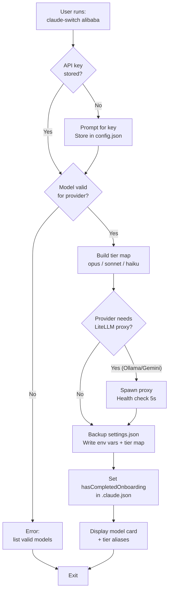

**Claude AI Switcher** is a command-line tool that lets you redirect **Claude Code** — Anthropic's terminal-based coding assistant — to use AI models from *other* providers without modifying any application code. With a single command like `claude-switch alibaba`, you swap the underlying model powering your AI coding session from Claude to a Qwen, GLM, Gemini, Llama, or DeepSeek model. The tool also provides helper commands to manage provider configurations for **OpenCode**, an alternative open-source coding client.

## The Problem: Why This Tool Exists

Claude Code communicates with Anthropic's servers using a specific API format called the **Anthropic Messages API**. Out of the box, it only knows how to talk to Anthropic endpoints. If you want to use a cheaper model, a local model for privacy, or a free model from OpenRouter, you would need to manually edit JSON configuration files, set the correct environment variables, understand which models map to which performance tiers, and potentially stand up a protocol-translation proxy. **Claude AI Switcher automates all of this.** It writes the right environment variables into `~/.claude/settings.json`, maps Claude Code's internal model tiers (Opus, Sonnet, Haiku) to your chosen provider's equivalent models, and even spawns a LiteLLM proxy when a provider speaks a different API protocol.

Sources: [README.md](README.md#L1-L20), [ARCHITECTURE.md](ARCHITECTURE.md#L1-L22)

## Six Providers, One Command

The tool currently supports six AI providers, each integrated through one of three architectural strategies. Understanding these strategies is the key to understanding how the tool works at a glance.

| Provider | Integration Strategy | API Key Required | Protocol | Key Benefit |
|----------|---------------------|-----------------|----------|-------------|
| **Anthropic** | Native (default) | Optional | Anthropic Messages API | Baseline — clears all overrides |
| **Alibaba (Qwen)** | Direct endpoint | Yes | Anthropic Messages API | 1M context, deep thinking models |
| **GLM / Z.AI** | coding-helper MCP | No (CLI-managed) | MCP server | Visual programming, multimodal |
| **OpenRouter** | Direct endpoint | Yes | Anthropic Messages API | Free models, multi-provider access |
| **Ollama** | LiteLLM proxy (port 4000) | No (local) | OpenAI → translated | Fully local, private inference |
| **Gemini (Google)** | LiteLLM proxy (port 4001) | Yes | OpenAI → translated | 1M context, multimodal |

**Direct API providers** (Alibaba, OpenRouter) expose Anthropic-compatible endpoints, so Claude AI Switcher simply writes the `ANTHROPIC_BASE_URL` and `ANTHROPIC_AUTH_TOKEN` environment variables to point Claude Code at the alternative server. **LiteLLM proxy providers** (Ollama, Gemini) speak the OpenAI Chat Completions format, which Claude Code cannot understand directly — the tool automatically spawns a [LiteLLM](https://github.com/BerriAI/litellm) translation proxy that converts between protocols on the fly. **GLM/Z.AI** uses a different approach entirely: it leverages the `coding-helper` MCP (Model Context Protocol) server, which manages its own connection independently of environment-variable routing.

Sources: [ARCHITECTURE.md](ARCHITECTURE.md#L26-L51), [src/models.ts](src/models.ts#L316-L352), [src/clients/claude-code.ts](src/clients/claude-code.ts#L141-L153)

## How It Works: The Switch Flow

When you run a switch command, the tool follows a deterministic pipeline — validate credentials, resolve model tiers, optionally start a proxy, then write configuration with a safety backup. Here is the end-to-end flow:



Every write operation creates a timestamped backup of the existing `settings.json` before modifications, so you can always roll back if something goes wrong. The tool also automatically sets `hasCompletedOnboarding: true` in `~/.claude.json` to prevent a known "Unable to connect to Anthropic services" error that occurs when Claude Code tries to phone home during provider switching.

Sources: [src/clients/claude-code.ts](src/clients/claude-code.ts#L100-L153), [ARCHITECTURE.md](ARCHITECTURE.md#L54-L86)

## The Model Tier Alias System

Claude Code internally references three model tiers — **Opus** (most capable), **Sonnet** (balanced), and **Haiku** (fastest) — through three environment variables. When you switch to a non-Anthropic provider, Claude AI Switcher maps these tiers to the provider's closest equivalent models. This means Claude Code's internal logic — which decides when to use a "heavy" model versus a "light" one — continues to function correctly, just with different underlying models.

| Tier Env Var | Alibaba Default | GLM Default | OpenRouter Default | Ollama Default | Gemini Default |
|---|---|---|---|---|---|
| `ANTHROPIC_DEFAULT_OPUS_MODEL` | `qwen3.7-plus` | `glm-5.2[1m]` | `qwen/qwen3.6-plus:free` | `deepseek-r1:latest` | `gemini-2.5-pro` |
| `ANTHROPIC_DEFAULT_SONNET_MODEL` | `qwen3.6-plus` | `glm-5-turbo` | `openrouter/free` | `qwen2.5-coder:latest` | `gemini-2.5-flash` |
| `ANTHROPIC_DEFAULT_HAIKU_MODEL` | `kimi-k2.5` | `glm-5v-turbo` | `openrouter/free` | `llama3.1:latest` | `gemini-2.5-flash-lite` |

You can override any individual tier at switch time using `--opus`, `--sonnet`, and `--haiku` flags. Switching back to Anthropic clears all three tier variables, restoring native Claude model routing.

Sources: [src/models.ts](src/models.ts#L16-L70), [src/clients/claude-code.ts](src/clients/claude-code.ts#L35-L57), [ARCHITECTURE.md](ARCHITECTURE.md#L88-L111)

## Project Structure at a Glance

The codebase follows a clean separation of concerns: command routing in `index.ts`, provider definitions in `models.ts`, client adapters that write to disk, provider-specific integration logic, and supporting modules for configuration, verification, display, and hooks.

```
claude-ai-switcher/
├── src/
│   ├── index.ts              ← Commander.js CLI router (all commands)
│   ├── models.ts             ← Provider/model definitions + tier maps
│   ├── config.ts             ← API key storage (~/.claude-ai-switcher/)
│   ├── verify.ts             ← Lightweight HTTP key validation
│   ├── display.ts            ← Terminal formatting (chalk-based)
│   ├── clients/
│   │   ├── claude-code.ts    ← Writes ~/.claude/settings.json + .claude.json
│   │   └── opencode.ts       ← Writes ~/.config/opencode/opencode.json
│   ├── providers/
│   │   ├── anthropic.ts      ← Default provider (clears overrides)
│   │   ├── alibaba.ts        ← Direct API endpoint
│   │   ├── openrouter.ts     ← Direct API endpoint
│   │   ├── glm.ts            ← coding-helper MCP integration
│   │   ├── ollama.ts         ← LiteLLM proxy (port 4000)
│   │   └── gemini.ts         ← LiteLLM proxy (port 4001)
│   └── hooks/
│       ├── index.ts          ← Hook installer/remover
│       ├── token-tracker.js  ← Context window usage bar
│       └── visual-enhancements.js ← Model card display
├── scripts/
│   └── copy-hooks.js         ← Build step: copies hooks to dist/
├── package.json              ← Dependencies: commander, chalk, ora, fs-extra
└── tsconfig.json             ← TypeScript config (ES2022, NodeNext)
```

Sources: [package.json](package.json#L1-L57), [ARCHITECTURE.md](ARCHITECTURE.md#L148-L163)

## Where Everything Lives on Disk

The tool manages four distinct files across your home directory. Understanding this separation is essential — Claude Code's own settings are kept separate from the switcher's API key store, so uninstalling the tool never loses your provider credentials.

| File | Purpose | Written By |
|------|---------|-----------|
| `~/.claude/settings.json` | Environment variables for provider routing + model tier aliases | `claude-code.ts` |
| `~/.claude.json` | Onboarding flag to prevent connection errors | `claude-code.ts` |
| `~/.config/opencode/opencode.json` | OpenCode provider and model configuration | `opencode.ts` |
| `~/.claude-ai-switcher/config.json` | API keys per provider (Alibaba, OpenRouter, Gemini) | `config.ts` |

API keys are never written into Claude Code's settings — they are stored in the switcher's own config file and injected as environment variables at switch time. The `status` command verifies all stored keys in parallel using lightweight HTTP requests to each provider's model-listing endpoint, giving you a single-glance health check.

Sources: [src/config.ts](src/config.ts#L1-L65), [src/verify.ts](src/verify.ts#L1-L30), [ARCHITECTURE.md](ARCHITECTURE.md#L148-L163)

## Beyond Switching: Hooks and Visual Enhancements

Claude AI Switcher also installs optional **hooks** into Claude Code's `~/.claude/` directory. The **Token Tracker** hook monitors context window usage and displays a visual percentage bar, so you know when you are approaching your model's context limit. The **Visual Enhancements** hook renders a model card showing the active provider, model name, and context consumption after each interaction. These hooks are standalone JavaScript files that integrate with Claude Code's hook system and can be installed or removed independently.

Sources: [src/hooks/index.ts](src/hooks/index.ts#L1-L30), [README.md](README.md#L15-L16)

## Cross-Platform by Design

The tool works on macOS, Linux, and Windows 11. All filesystem paths use `path.join()` and `os.homedir()` rather than hardcoded Unix paths. The `clean` script uses `rimraf` instead of `rm -rf`. Platform-specific commands like `which`/`where` are resolved dynamically. This means the same `npm link` installation produces a working `claude-switch` binary regardless of your operating system.

Sources: [README.md](README.md#L33-L47), [ARCHITECTURE.md](ARCHITECTURE.md#L157-L163), [src/verify.ts](src/verify.ts#L91-L116)

## Where to Go Next

Now that you understand what Claude AI Switcher does and the architecture behind it, here is the recommended reading path through the documentation:

**If you want to start using the tool right now:**
1. [Quick Start: Installation and First Provider Switch](2-quick-start-installation-and-first-provider-switch) — Get the CLI installed and run your first switch in under five minutes
2. [Interactive Setup Wizard: Configuring API Keys](3-interactive-setup-wizard-configuring-api-keys) — Use the guided `setup` command to configure all your provider keys at once
3. [Command Reference: Complete CLI Cheatsheet](4-command-reference-complete-cli-cheatsheet) — Every command, flag, and option in one reference table

**If you want to understand how the internals work:**
1. [System Architecture and Module Responsibilities](5-system-architecture-and-module-responsibilities) — Deep dive into the module graph and data flow
2. [Provider Switching Flow: From Command to Settings Write](6-provider-switching-flow-from-command-to-settings-write) — Trace a single switch command through every function call
3. [Configuration File Map: Where Everything Lives on Disk](7-configuration-file-map-where-everything-lives-on-disk) — Complete file-level reference

**If you want to add support for a new provider:**
1. [Adding a New Provider: Step-by-Step Implementation Guide](27-adding-a-new-provider-step-by-step-implementation-guide) — The canonical extension guide