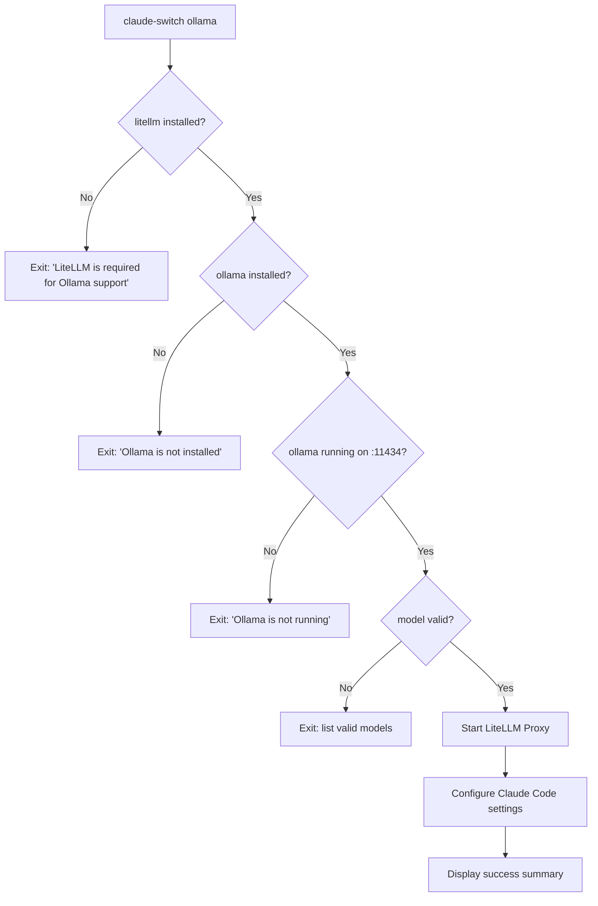
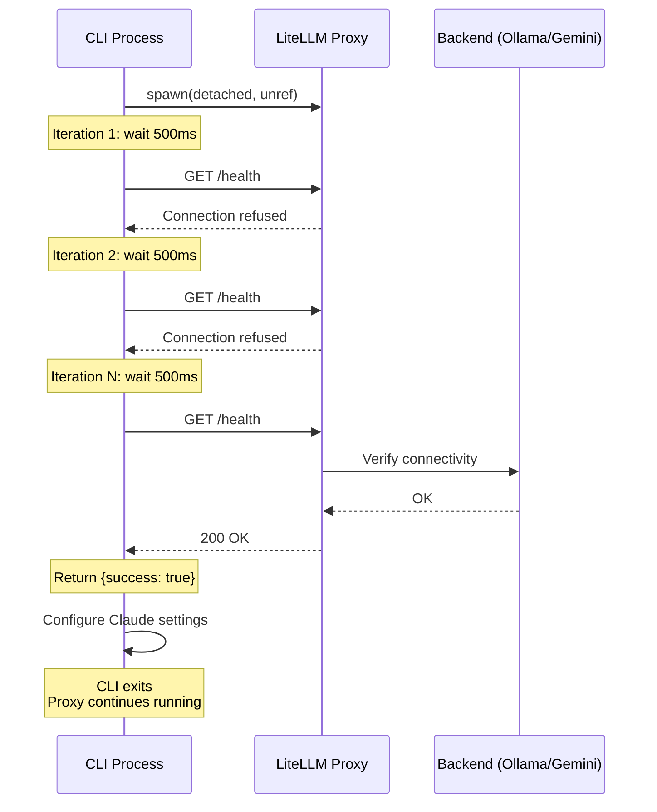
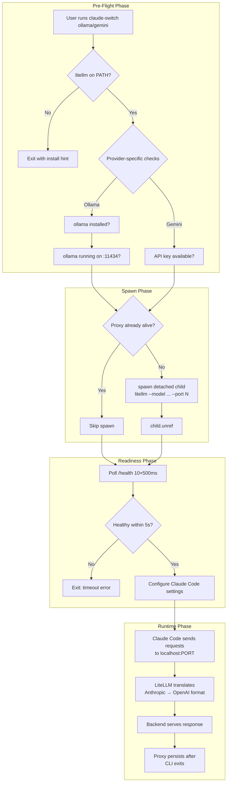

Claude AI Switcher bridges Claude Code's Anthropic Messages API expectations with providers that only speak OpenAI-compatible protocols by deploying **LiteLLM as a local translation proxy**. This page dissects the complete lifecycle of that proxy — from pre-flight dependency validation through detached process spawning, readiness polling, port allocation, and the critical behavioral divergences between the Ollama and Gemini implementations. Understanding this lifecycle is essential for debugging connection failures, reasoning about process cleanup, and extending the system with new proxy-backed providers.

---

## Port Allocation Strategy: Static Dedication Per Provider

The system assigns each proxy-backed provider a fixed localhost port rather than discovering an ephemeral port at runtime. This is a deliberate architectural choice: static ports simplify provider detection (the [Provider Detection](19-provider-detection-inferring-active-provider-from-settings) logic matches on `ANTHROPIC_BASE_URL` containing the port number), eliminate port-range scanning overhead, and allow already-running proxies to be reused across CLI invocations without state persistence.

| Provider | Proxy Port | Endpoint Constant | Model Prefix | Requires API Key |
|----------|-----------|-------------------|--------------|-----------------|
| Ollama   | `4000`    | `OLLAMA_ENDPOINT` | `ollama/`    | No              |
| Gemini   | `4001`    | `GEMINI_ENDPOINT` | `gemini/`    | Yes             |

The Ollama provider also allocates a well-known port for its native runtime at `11434` — this is the daemon that LiteLLM forwards requests to, not a proxy port itself. The Gemini provider has no secondary port because LiteLLM connects directly to Google's remote API using the injected `GEMINI_API_KEY`. Both proxy ports default to their constants but are parameterized in the spawn functions, meaning a hypothetical third proxy provider could reuse either function with a different port argument.

Sources: [ollama.ts](src/providers/ollama.ts#L25-L27), [gemini.ts](src/providers/gemini.ts#L25-L26)

---

## Pre-Flight Dependency Gates

Before any proxy process is spawned, the switch handlers in `index.ts` execute a cascading series of dependency checks. Each gate performs a fail-fast `process.exit(1)` with a diagnostic message, ensuring the user never encounters a silent proxy spawn failure. The gates differ between Ollama and Gemini based on their respective infrastructure requirements.

### Ollama Pre-Flight Cascade

The Ollama switch function validates three independent dependencies in strict order. First, it confirms the `litellm` executable is discoverable on the system PATH using a platform-aware `where`/`which` lookup. Second, it verifies the `ollama` binary is installed. Third, it probes Ollama's native API at `http://localhost:11434/api/tags` with a 3-second `AbortController` timeout to confirm the daemon is actively serving. Only after all three gates pass does the proxy spawn proceed.

Sources: [index.ts](src/index.ts#L264-L323), [ollama.ts](src/providers/ollama.ts#L48-L94)

### Gemini Pre-Flight Cascade

The Gemini cascade is leaner because Gemini is a cloud service — there is no local daemon to check. The function verifies `litellm` is installed, validates the user-supplied model ID against the known model list, and prompts for a Gemini API key if one isn't already stored in the [local configuration](16-api-key-storage-and-local-configuration-management). Notably, the Gemini switch does **not** pre-validate the API key against Google's servers at switch time; that validation is deferred to the `isGeminiKeyValid()` utility used only during the interactive setup wizard.

Sources: [index.ts](src/index.ts#L325-L378), [gemini.ts](src/providers/gemini.ts#L48-L79)

---

## Process Spawning: Detached Background Daemons

Both proxy spawn functions follow the same structural pattern but diverge in three critical ways. The shared lifecycle is: check if the proxy is already alive (idempotency guard), spawn a detached child process, call `child.unref()` to decouple it from the parent's event loop, then poll the health endpoint for readiness.

### Idempotency Guard

Before spawning, each function calls `isLitellmProxyRunning(port)` which issues an HTTP GET to `http://localhost:{port}/health` with a 3-second timeout. If the health check succeeds, the function returns `{ success: true }` immediately without spawning a new process. This is what makes the proxy **persistent across CLI invocations** — the detached process from a previous `claude-switch ollama` command survives and is detected by subsequent runs.

Sources: [ollama.ts](src/providers/ollama.ts#L116-L121), [gemini.ts](src/providers/gemini.ts#L101-L110)

### Spawn Configuration Comparison

The two implementations share `detached: true` and `stdio: "ignore"` but diverge on shell mode and environment injection — differences driven by the distinct authentication requirements of each provider:

| Parameter | Ollama (`startLitellmProxy`) | Gemini (`startGeminiLitellmProxy`) |
|-----------|------------------------------|-------------------------------------|
| **Shell mode** | `false` (direct exec) | `true` (shell-wrapped) |
| **Model argument** | `ollama/${model}` | `gemini/${model}` |
| **Environment** | Inherits `process.env` unchanged | `process.env` + `GEMINI_API_KEY` |
| **API key handling** | Dummy token `"ollama"` set in Claude settings | Real key injected into proxy env + Claude settings |
| **Port default** | `4000` | `4001` |

The Ollama spawn uses `shell: false` because the target model is entirely local — LiteLLM connects to `localhost:11434` with no authentication, so no secrets need to traverse a shell. The Gemini spawn uses `shell: true` because LiteLLM reads `GEMINI_API_KEY` from the environment, and the shell wrapper ensures the key propagates correctly across platforms (particularly on Windows, where environment variable inheritance to detached processes can be unreliable without shell mediation). The actual API key is also written into Claude Code's `settings.json` as the `ANTHROPIC_AUTH_TOKEN`, but the proxy needs it in its own process environment to authenticate upstream calls to Google.

Sources: [ollama.ts](src/providers/ollama.ts#L123-L129), [gemini.ts](src/providers/gemini.ts#L112-L119), [claude-code.ts](src/clients/claude-code.ts#L221-L250)

### Detachment Semantics

The `child.unref()` call is the mechanism that transforms the proxy from a child process into an **orphaned daemon**. When the parent Node.js process (the CLI) exits, the kernel reparents the LiteLLM child to PID 1 (or the Windows equivalent), and it continues running indefinitely. The `stdio: "ignore"` option discards all stdout/stderr from the proxy, which means **diagnostic output from LiteLLM is permanently lost** — a deliberate trade-off for clean CLI output at the cost of debuggability. There is no PID file, no log redirection, and no built-in shutdown command; the proxy must be killed manually via `taskkill` (Windows) or `pkill` (Unix) if it needs to be restarted.

Sources: [ollama.ts](src/providers/ollama.ts#L124-L129), [gemini.ts](src/providers/gemini.ts#L113-L119)

---

## Health Check Protocol: Readiness Polling

After spawning, both functions enter an identical readiness polling loop. The loop runs **10 iterations** with a **500ms delay** between each check, yielding a **5-second maximum wait window**. Each iteration calls `isLitellmProxyRunning(port)`, which performs an HTTP GET to `/health` with a 3-second `AbortController` timeout.

The health endpoint is LiteLLM's built-in `/health` route, which returns HTTP 200 when the proxy is ready to serve requests. This is distinct from a mere port-binding check — LiteLLM's `/health` verifies that the upstream model provider is reachable, meaning the poll effectively confirms end-to-end connectivity from proxy to backend.

If all 10 iterations fail, the function returns `{ success: false, error: "LiteLLM proxy did not start within 5 seconds" }`, which the switch handler in `index.ts` surfaces as a fatal error via `displayError()` and terminates the process. The user is left with no proxy running and no Claude Code configuration change.

**Important timing note**: The worst-case wall-clock time is not exactly 5 seconds. Each poll iteration includes the 500ms sleep *plus* the health check's own latency (up to 3 seconds on timeout). In practice, if the proxy is slow to start, the actual wait can extend to approximately 5 + (10 × connection-refused latency), which is typically near-instant since refused connections return immediately. The 3-second health-check timeout only becomes a factor if the port is open but the proxy isn't responding — a scenario that would consume significant wall-clock time across multiple iterations.

Sources: [ollama.ts](src/providers/ollama.ts#L99-L111), [ollama.ts](src/providers/ollama.ts#L131-L139), [gemini.ts](src/providers/gemini.ts#L84-L96), [gemini.ts](src/providers/gemini.ts#L121-L129)

---

## Post-Spawn Configuration: Wiring Claude Code to the Proxy

Once the proxy is confirmed healthy, the switch handler delegates to the Claude Code client adapter to write the proxy endpoint into `~/.claude/settings.json`. The `configureOllama()` function sets `ANTHROPIC_BASE_URL` to `http://localhost:4000` and uses a dummy `ANTHROPIC_AUTH_TOKEN` of `"ollama"` — LiteLLM in Ollama mode doesn't validate the auth token since the backend is unauthenticated. The `configureGemini()` function sets `ANTHROPIC_BASE_URL` to `http://localhost:4001` and writes the real Gemini API key as the auth token, which LiteLLM then extracts from the incoming request headers and uses to authenticate against Google's API upstream.

Both functions also apply the tier map — three environment variables (`ANTHROPIC_DEFAULT_OPUS_MODEL`, `ANTHROPIC_DEFAULT_SONNET_MODEL`, `ANTHROPIC_DEFAULT_HAIKU_MODEL`) that tell Claude Code which model IDs to send for each tier. For Ollama, these map to local model tags like `deepseek-r1:latest`; for Gemini, they map to Google model IDs like `gemini-2.5-pro`.

Sources: [claude-code.ts](src/clients/claude-code.ts#L221-L250), [models.ts](src/models.ts#L37-L49)

---

## Provider Detection via Port Matching

The `getCurrentProvider()` function in the Claude Code client uses the `ANTHROPIC_BASE_URL` value to identify which proxy-backed provider is active. It performs substring matching against the port number embedded in the URL: `localhost:4000` → Ollama, `localhost:4001` → Gemini. This is why the static port allocation strategy is not merely convenient but **functionally required** — the detection layer depends on port uniqueness to disambiguate providers. If two providers shared the same port, the detection logic would return the wrong provider.

This detection mechanism also means that manually editing the `ANTHROPIC_BASE_URL` in `settings.json` to use a non-standard port would break provider detection while potentially still functioning for actual API traffic.

Sources: [claude-code.ts](src/clients/claude-code.ts#L293-L311)

---

## Lifecycle Limitations and Operational Considerations

| Limitation | Impact | Workaround |
|------------|--------|------------|
| **No graceful shutdown** | Proxy runs until killed or system reboot | `taskkill /f /im litellm.exe` (Windows) or `pkill -f litellm` (Unix) |
| **No log capture** | `stdio: "ignore"` discards all proxy output | Manually run `litellm --model ollama/... --port 4000` to see logs |
| **No PID tracking** | Cannot programmatically stop a specific proxy instance | Use port number to identify which proxy to kill |
| **Fixed 5s timeout** | Large model downloads on first Ollama request may exceed this | Pre-pull models with `ollama pull` before switching |
| **Shell divergence** | Gemini uses `shell: true` for env propagation reliability | May behave differently under restricted shell environments |
| **Single-model binding** | Each proxy instance serves one model; switching models requires a new spawn | Idempotency guard means re-running the switch command spawns a fresh proxy only if the old one died |

The single-model binding is a particularly subtle constraint. LiteLLM is invoked with `--model ollama/deepseek-r1:latest`, which means that proxy instance only knows how to serve that specific model. If the tier map sends a different model ID (e.g., `qwen2.5-coder:latest` for the sonnet tier), LiteLLM will reject the request because it wasn't started with that model. In practice, Claude Code sends the tier-mapped model IDs as the `model` parameter, but LiteLLM's Ollama integration typically ignores the incoming model field and routes all traffic to the model specified at startup — meaning all three tiers effectively hit the same underlying model regardless of the tier map. This is a known architectural trade-off documented in [LiteLLM Proxy Providers: Ollama and Gemini Protocol Translation](9-litellm-proxy-providers-ollama-and-gemini-protocol-translation).

Sources: [ollama.ts](src/providers/ollama.ts#L124-L128), [gemini.ts](src/providers/gemini.ts#L113-L118)

---

## Complete Lifecycle Summary

Sources: [index.ts](src/index.ts#L264-L378), [ollama.ts](src/providers/ollama.ts#L1-L147), [gemini.ts](src/providers/gemini.ts#L1-L137), [claude-code.ts](src/clients/claude-code.ts#L221-L250)

---

## Related Pages

- **[LiteLLM Proxy Providers: Ollama and Gemini Protocol Translation](9-litellm-proxy-providers-ollama-and-gemini-protocol-translation)** — How LiteLLM translates between Anthropic Messages API and OpenAI Chat Completions format for each provider
- **[System Architecture and Module Responsibilities](5-system-architecture-and-module-responsibilities)** — Where proxy providers fit in the overall module graph
- **[Provider Detection: Inferring Active Provider from Settings](19-provider-detection-inferring-active-provider-from-settings)** — How port-based URL matching identifies the active provider
- **[Claude Code Client: Writing Environment Variables and MCP Servers](20-claude-code-client-writing-environment-variables-and-mcp-servers)** — How proxy endpoints are written into Claude Code's settings
- **[Cross-Platform Compatibility: macOS, Linux, and Windows](26-cross-platform-compatibility-macos-linux-and-windows)** — Platform-specific considerations for the shell divergence between Ollama and Gemini spawns