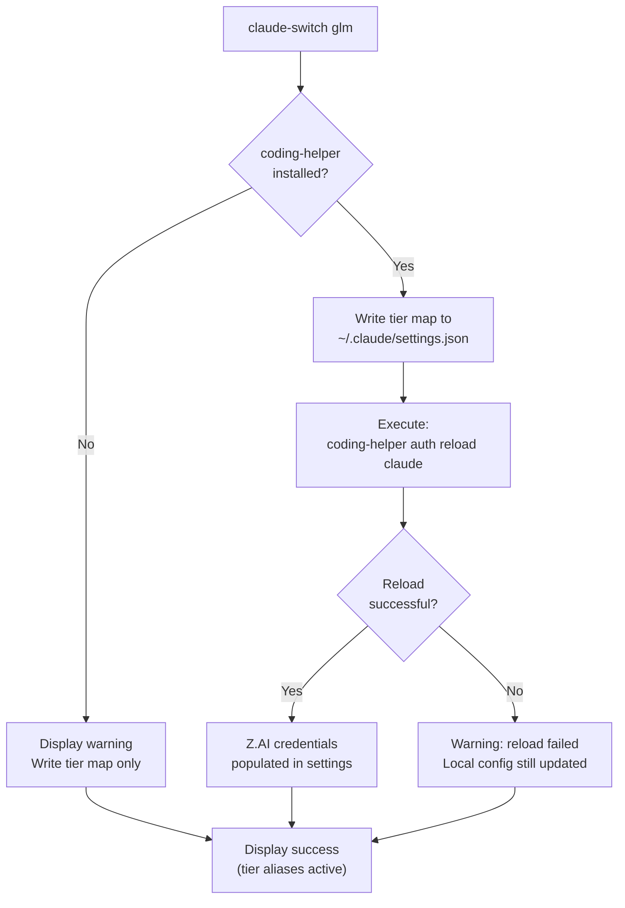
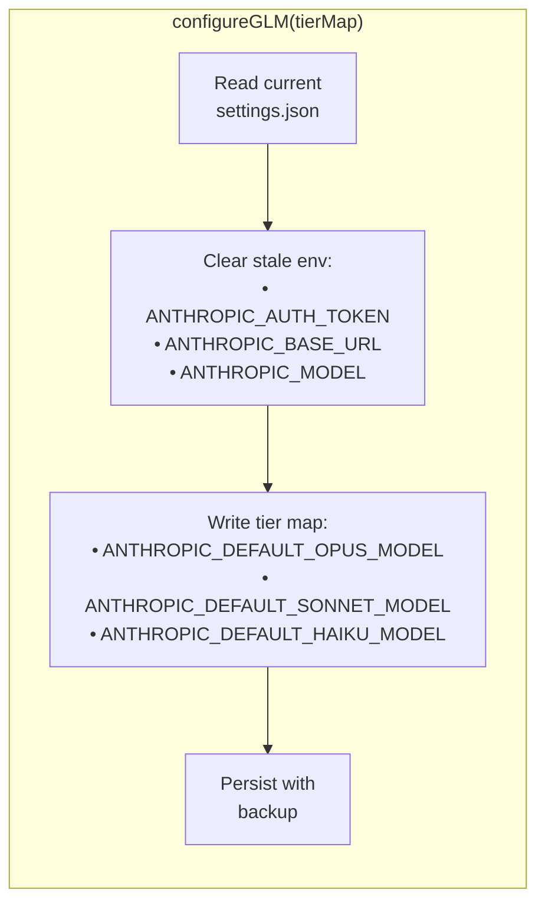
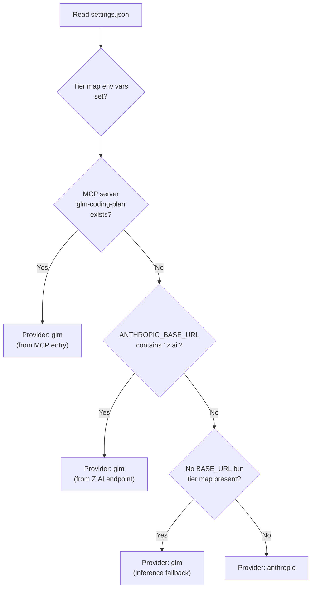
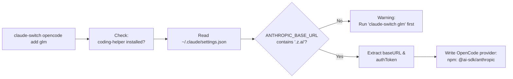

The GLM/Z.AI provider occupies a unique position in Claude AI Switcher's architecture: it is the **only provider that delegates authentication and endpoint management to an external CLI tool** (`@z_ai/coding-helper`). Rather than setting `ANTHROPIC_BASE_URL` and `ANTHROPIC_AUTH_TOKEN` directly — as every other provider does — the GLM switch writes only the tier map aliases into `~/.claude/settings.json` and then invokes `coding-helper auth reload claude` to populate the actual Z.AI credentials. This design means the switcher acts as an orchestrator rather than a credential store, making GLM integration fundamentally different from the direct-API or LiteLLM-proxy patterns used elsewhere.

Sources: [glm.ts](src/providers/glm.ts#L1-L61), [index.ts](src/index.ts#L197-L223)

## Architectural Model: The Delegation Pattern

The flowchart above illustrates the **two-phase write** that distinguishes GLM from all other providers. Phase one is the switcher's own responsibility: clearing any stale Alibaba env vars, applying the GLM tier map (`ANTHROPIC_DEFAULT_OPUS_MODEL`, `SONNET_MODEL`, `HAIKU_MODEL`), and persisting `~/.claude/settings.json` with a backup. Phase two is delegated entirely: the switcher shells out to `coding-helper auth reload claude`, trusting that tool to inject the Z.AI `ANTHROPIC_BASE_URL` (containing `.z.ai`) and `ANTHROPIC_AUTH_TOKEN` into the same settings file.

Sources: [claude-code.ts](src/clients/claude-code.ts#L184-L198), [index.ts](src/index.ts#L197-L223)

## The coding-helper Dependency: Detection and Prerequisites

Before any configuration writes occur, the switcher probes the system PATH for the `coding-helper` binary. The detection logic is platform-aware: on Windows it runs `where coding-helper`, while on macOS/Linux it runs `which coding-helper`. A non-zero exit code from either command signals absence. When the binary is missing, the switcher does **not** abort — it issues a warning, prints installation instructions, and proceeds with the local tier-map write anyway. This graceful degradation means the tier aliases are always applied, even if the coding-helper reload later fails.

Sources: [glm.ts](src/providers/glm.ts#L29-L41), [index.ts](src/index.ts#L198-L205)

| Aspect | Detail |
|---|---|
| **Package name** | `@z_ai/coding-helper` |
| **Install command** | `npm install -g @z_ai/coding-helper` |
| **First-time auth** | `coding-helper auth` |
| **Reload trigger** | `coding-helper auth reload claude` |
| **PATH detection (Windows)** | `where coding-helper` |
| **PATH detection (Unix)** | `which coding-helper` |
| **Env var for model override** | `ZHIPUAI_MODEL` or `ZAI_MODEL` |
| **Default model** | `glm-5.1` |

Sources: [glm.ts](src/providers/glm.ts#L19-L24), [glm.ts](src/providers/glm.ts#L29-L41), [glm.ts](src/providers/glm.ts#L46-L60), [index.ts](src/index.ts#L201-L204)

## GLM Model Catalog and Tier Mapping

Zhipu's GLM family spans six models, from the flagship 1M-context `glm-5.2[1m]` down to the economical `glm-4.7-flash`. The default tier map — derived from Z.AI's official devpack documentation — assigns the most capable model to the opus tier, a fast turbo variant to sonnet, and the multimodal vision model to haiku.

| Tier Alias | Default Model | Model Name | Context Window | Key Capabilities |
|---|---|---|---|---|
| **Opus** | `glm-5.2[1m]` | GLM-5.2 (1M Context) | 1,000,000 | Text Generation, Deep Thinking |
| **Sonnet** | `glm-5-turbo` | GLM-5-Turbo | 200,000 | Text Generation, Deep Thinking, Fast Responses |
| **Haiku** | `glm-5v-turbo` | GLM-5V-Turbo | 200,000 | Text Generation, Visual Understanding, Visual Programming |

The full available catalog extends beyond these three tier defaults:

| Model ID | Name | Context | Capabilities |
|---|---|---|---|
| `glm-5.2[1m]` | GLM-5.2 (1M Context) | 1,000,000 | Text Generation, Deep Thinking |
| `glm-5v-turbo` | GLM-5V-Turbo | 200,000 | Text Generation, Deep Thinking, Visual Understanding, Visual Programming |
| `glm-5-turbo` | GLM-5-Turbo | 200,000 | Text Generation, Deep Thinking, Fast Responses |
| `glm-5.1` | GLM-5.1 | 200,000 | Text Generation, Deep Thinking |
| `glm-4.7` | GLM-4.7 | 256,000 | Text Generation, Deep Thinking |
| `glm-4.7-flash` | GLM-4.7-Flash | 256,000 | Text Generation, Fast Inference |

Sources: [models.ts](src/models.ts#L24-L28), [models.ts](src/models.ts#L157-L200), [models.ts](src/models.ts#L329-L333)

## Configuration Write: What configureGLM Actually Does

The `configureGLM` function in the Claude Code client performs a **surgical edit** of `~/.claude/settings.json`. Unlike `configureAlibaba` or `configureOpenRouter`, it does **not** write `ANTHROPIC_BASE_URL` or `ANTHROPIC_AUTH_TOKEN` — those fields are coding-helper's domain. Instead, it focuses exclusively on two tasks: clearing stale credentials from other providers, and writing the three tier-map environment variables.

This separation of concerns is deliberate. The `applyTierMap` helper (shared across all providers) sets three environment variables that tell Claude Code which model ID to use when the user requests the opus, sonnet, or haiku tier. By clearing the other provider's env vars first, `configureGLM` ensures that no lingering Alibaba or OpenRouter endpoint remains — only the tier aliases and whatever coding-helper subsequently injects.

Sources: [claude-code.ts](src/clients/claude-code.ts#L41-L57), [claude-code.ts](src/clients/claude-code.ts#L180-L198)

## Provider Detection: Three GLM Signatures

After configuration, detecting whether GLM is the active provider requires checking three distinct fingerprints in `~/.claude/settings.json`. The `getCurrentProvider` function evaluates these in priority order, falling back through increasingly indirect signals.

| Detection Path | Signal in settings.json | Reliability | When It Appears |
|---|---|---|---|
| **MCP server entry** | `mcpServers["glm-coding-plan"]` with `.model` field | High | Legacy/alternative coding-helper setup |
| **Z.AI endpoint** | `env.ANTHROPIC_BASE_URL` contains `.z.ai` | High | After successful `coding-helper auth reload claude` |
| **Tier map only** | Tier env vars set, no `ANTHROPIC_BASE_URL` | Medium (inferred) | After switcher write, before coding-helper reload |

The third path — inferring GLM from tier-map-only state — is the most interesting. When `configureGLM` writes tier aliases but coding-helper hasn't yet populated the endpoint, the switcher still correctly identifies the provider by the absence of any other provider's `ANTHROPIC_BASE_URL` combined with the presence of tier-map entries. This inference works because **no other provider writes tier aliases without also setting a base URL**, making the combination uniquely GLM's fingerprint.

Sources: [claude-code.ts](src/clients/claude-code.ts#L313-L337)

## The reloadGLMConfig Bridge

After the switcher writes its tier map, `reloadGLMConfig` shells out to `coding-helper auth reload claude`. This command instructs the coding-helper tool to read its own authentication state (established during `coding-helper auth`) and inject the Z.AI endpoint and API token into Claude Code's settings. The function returns a structured result: `{ success: true }` on exit code zero, or `{ success: false, error: message }` on failure.

The switcher handles failure non-fatally. If `reloadGLMConfig` fails, the switcher prints a warning ("coding-helper reload failed, but local config updated") and still reports success for the overall switch operation. This design acknowledges that the tier aliases are already in place — Claude Code will use them the next time coding-helper successfully reloads, and the user's session isn't blocked by a transient coding-helper issue.

Sources: [glm.ts](src/providers/glm.ts#L46-L60), [index.ts](src/index.ts#L210-L215)

## GLM in OpenCode: Auth Passthrough

When adding GLM to OpenCode via `claude-switch opencode add glm`, the switcher **reads credentials from Claude Code's settings** rather than prompting the user for an API key. This is possible because `coding-helper auth reload claude` writes `ANTHROPIC_BASE_URL` and `ANTHROPIC_AUTH_TOKEN` into `~/.claude/settings.json`, and the OpenCode add command reuses those values.

The OpenCode provider configuration uses the `@ai-sdk/anthropic` npm adapter — the same Anthropic SDK package used for the Alibaba provider — because Z.AI exposes an Anthropic-compatible API surface. The provider key is `"glm"` and includes five model definitions with thinking-mode enabled (8,192 budget tokens) and explicit context/output limits.

Sources: [opencode.ts](src/clients/opencode.ts#L270-L339), [index.ts](src/index.ts#L659-L697)

## Verification: CLI-Based Health Check

GLM verification diverges from the pattern used by other providers. Instead of making an HTTP request to a REST endpoint (as Alibaba and OpenRouter do), `verifyGLM` performs a **two-stage CLI check**: first confirming that `coding-helper` is installed on the PATH, then checking whether the `ZHIPUAI_MODEL` or `ZAI_MODEL` environment variables are set. The function never contacts the Z.AI API directly — it trusts the coding-helper CLI as the source of truth for authentication state.

| Verification Stage | What It Checks | Failure Message |
|---|---|---|
| Binary existence | `where`/`which coding-helper` exits zero | "coding-helper not installed" |
| Env var presence | `ZHIPUAI_MODEL` or `ZAI_MODEL` is set | (No failure — status "ok" regardless) |
| API connectivity | — | Not performed |

This approach means verification confirms **readiness** (is the tool installed?) rather than **liveness** (can the API actually respond?). The tradeoff is intentional: testing the Z.AI API directly would require either hardcoded credentials or parsing coding-helper's internal auth state, both of which would violate the delegation principle.

Sources: [verify.ts](src/verify.ts#L87-L116)

## Comparison: GLM vs. Other Provider Patterns

| Dimension | GLM/Z.AI | Direct API (Alibaba, OpenRouter) | LiteLLM Proxy (Ollama, Gemini) |
|---|---|---|---|
| **Credential management** | Delegated to `coding-helper` CLI | Switcher writes API key to settings env | Switcher writes API key to proxy config |
| **Endpoint** | Set by coding-helper (`.z.ai`) | Hardcoded in `configure*` function | `localhost:PORT` proxy |
| **External dependency** | `@z_ai/coding-helper` (npm global) | None | LiteLLM Python package |
| **Settings write scope** | Tier map only (no `BASE_URL`/`TOKEN`) | Full env block | Full env block + proxy process |
| **Model selection** | Tier aliases via env vars | `ANTHROPIC_MODEL` + tier aliases | `ANTHROPIC_MODEL` + tier aliases |
| **Provider detection** | 3-tier inference (MCP → endpoint → tier-only) | Endpoint string match | Port number match |
| **Failure behavior** | Non-fatal (tier map written, reload warned) | Fatal (API key required) | Fatal (proxy must start) |

Sources: [glm.ts](src/providers/glm.ts#L1-L61), [claude-code.ts](src/clients/claude-code.ts#L141-L153), [claude-code.ts](src/clients/claude-code.ts#L220-L233)

## CLI Commands Reference

| Command | Scope | Description |
|---|---|---|
| `claude-switch glm` | Claude Code | Switch to GLM/Z.AI with default tier map |
| `claude-switch glm --opus <model>` | Claude Code | Override opus tier model |
| `claude-switch glm --sonnet <model>` | Claude Code | Override sonnet tier model |
| `claude-switch glm --haiku <model>` | Claude Code | Override haiku tier model |
| `claude-switch claude glm` | Claude Code (explicit) | Same as above, explicit Claude targeting |
| `claude-switch opencode add glm` | OpenCode | Add GLM provider (reads auth from Claude settings) |
| `claude-switch opencode remove glm` | OpenCode | Remove GLM provider from OpenCode |

Sources: [index.ts](src/index.ts#L409-L420), [index.ts](src/index.ts#L494-L505), [index.ts](src/index.ts#L659-L697)

## Related Pages

- **[Provider Switching Flow: From Command to Settings Write](6-provider-switching-flow-from-command-to-settings-write)** — How all provider switches traverse the shared `buildTierMap` → `configureClaude*` → `writeClaudeSettings` pipeline
- **[Direct API Providers: Anthropic, Alibaba, and OpenRouter](8-direct-api-providers-anthropic-alibaba-and-openrouter)** — Contrast with providers that manage credentials directly
- **[Claude Code Client: Writing Environment Variables and MCP Servers](20-claude-code-client-writing-environment-variables-and-mcp-servers)** — The shared client layer that `configureGLM` builds upon
- **[Provider Detection: Inferring Active Provider from Settings](19-provider-detection-inferring-active-provider-from-settings)** — Deep dive into the three-path GLM detection logic
- **[Model Tier Aliases: Opus, Sonnet, and Haiku Mapping](13-model-tier-aliases-opus-sonnet-and-haiku-mapping)** — How tier maps translate Claude Code's model selection to GLM model IDs
- **[API Key Verification: Lightweight HTTP Health Checks](17-api-key-verification-lightweight-http-health-checks)** — Why GLM verification uses CLI checks instead of HTTP requests