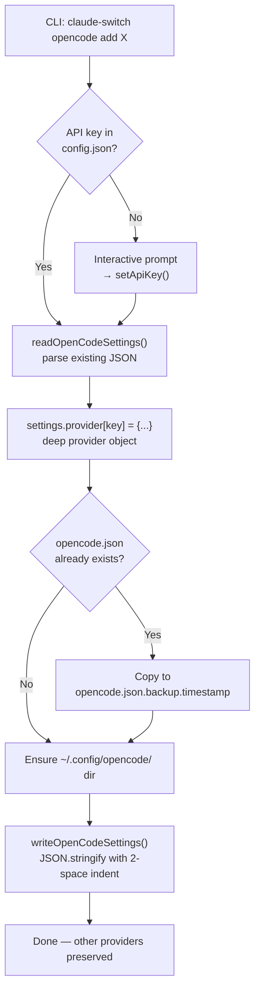
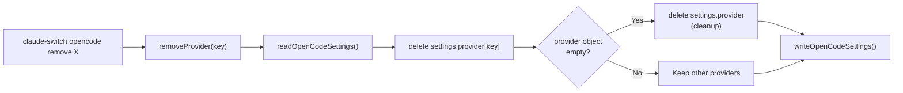

Claude AI Switcher extends its provider-switching capabilities beyond Claude Code by offering a dedicated **OpenCode helper** subsystem. This module manages the `opencode.json` configuration file at `~/.config/opencode/opencode.json`, allowing developers to inject or remove AI provider definitions — including model catalogs, modality declarations, and thinking-budget options — through simple CLI commands without manually editing JSON.

## How the OpenCode Helper Differs from Claude Code Switching

The Claude Code switching pipeline (`claude-switch alibaba`, `claude-switch glm`, etc.) operates on `~/.claude.json` and writes environment variables plus MCP server entries. The OpenCode helper is a **separate, additive** system: instead of swapping one active provider for another, it **inserts or removes individual provider blocks** within a single JSON object, enabling multiple providers to coexist. This reflects OpenCode's own design, where the `provider` field is a dictionary keyed by provider name rather than a single string.

The two subsystems share API key storage (both read from `~/.claude-ai-switcher/config.json`), but the OpenCode helper never writes tier maps or environment variables — it only shapes the `provider` and `$schema` fields in the OpenCode config.

Sources: [index.ts](src/index.ts#L546-L556), [opencode.ts](src/clients/opencode.ts#L1-L17)

## Command Structure: The `opencode` Subcommand Tree

All OpenCode operations live under the `claude-switch opencode` parent command, branching into `add` and `remove` sub-groups:

| Command | Action | Provider Key Written |
|---|---|---|
| `claude-switch opencode add alibaba` | Add Alibaba Coding Plan | `bailian-coding-plan` |
| `claude-switch opencode add openrouter` | Add OpenRouter | `openrouter` |
| `claude-switch opencode add ollama` | Add Ollama (local) | `ollama` |
| `claude-switch opencode add gemini` | Add Gemini (via LiteLLM) | `gemini` |
| `claude-switch opencode add glm` | Add GLM/Z.AI | `glm` |
| `claude-switch opencode remove alibaba` | Remove Alibaba | `bailian-coding-plan` |
| `claude-switch opencode remove openrouter` | Remove OpenRouter | `openrouter` |
| `claude-switch opencode remove ollama` | Remove Ollama | `ollama` |
| `claude-switch opencode remove gemini` | Remove Gemini | `gemini` |
| `claude-switch opencode remove glm` | Remove GLM/Z.AI | `glm` |

Each `add` command ensures the API key is present before writing — if no key is stored in `~/.claude-ai-switcher/config.json`, the command prompts interactively and persists the key. Each `remove` command targets a single provider key, leaving all other providers intact.

Sources: [index.ts](src/index.ts#L550-L786)

## The Read-Modify-Write Lifecycle

Every OpenCode configuration operation follows a consistent three-phase lifecycle. Understanding this pattern is critical for reasoning about why multiple `add` calls accumulate rather than overwrite:



The critical design choice is that `readOpenCodeSettings()` returns the full existing JSON object, and each `configure*` function mutates only its own key within `settings.provider`. This means calling `claude-switch opencode add alibaba` followed by `claude-switch opencode add openrouter` results in **both** providers appearing in the config — they do not displace each other.

Sources: [opencode.ts](src/clients/opencode.ts#L38-L47), [opencode.ts](src/clients/opencode.ts#L52-L67)

## Provider Schema: The Anatomy of a Provider Block

Every provider added to OpenCode follows the same structural contract. The OpenCode config uses the official schema URL (`https://opencode.ai/config.json`) and organizes providers as named entries under the `provider` key. Each entry contains an npm SDK package reference, connection options, and a model dictionary:

```json
{
  "$schema": "https://opencode.ai/config.json",
  "provider": {
    "bailian-coding-plan": {
      "npm": "@ai-sdk/anthropic",
      "name": "Model Studio Coding Plan",
      "options": {
        "baseURL": "https://coding-intl.dashscope.aliyuncs.com/apps/anthropic/v1",
        "apiKey": "sk-..."
      },
      "models": {
        "qwen3.7-plus": {
          "name": "Qwen3.7 Plus",
          "modalities": { "input": ["text", "image"], "output": ["text"] },
          "options": { "thinking": { "type": "enabled", "budgetTokens": 8192 } },
          "limit": { "context": 1000000, "output": 65536 }
        }
      }
    }
  }
}
```

The `npm` field determines which AI SDK adapter OpenCode loads — `@ai-sdk/anthropic` for Anthropic-compatible endpoints (Alibaba, GLM) and `@ai-sdk/openai` for OpenAI-compatible endpoints (OpenRouter, Ollama, Gemini). This mapping is baked into each `configure*` function.

| Provider | npm Package | Endpoint Type | Auth Source |
|---|---|---|---|
| Alibaba (`bailian-coding-plan`) | `@ai-sdk/anthropic` | Direct API | API key from config |
| GLM (`glm`) | `@ai-sdk/anthropic` | Direct API | From Claude Code settings |
| OpenRouter (`openrouter`) | `@ai-sdk/openai` | Direct API | API key from config |
| Ollama (`ollama`) | `@ai-sdk/openai` | LiteLLM proxy `:4000` | Static `"ollama"` |
| Gemini (`gemini`) | `@ai-sdk/openai` | LiteLLM proxy `:4001` | API key from config |

Sources: [opencode.ts](src/clients/opencode.ts#L73-L105), [opencode.ts](src/clients/opencode.ts#L274-L286), [opencode.ts](src/clients/opencode.ts#L377-L391), [opencode.ts](src/clients/opencode.ts#L424-L436), [opencode.ts](src/clients/opencode.ts#L491-L503)

## Adding Providers: Provider-by-Provider Breakdown

### Alibaba Coding Plan

The `add alibaba` command writes a provider entry under the key `bailian-coding-plan` with nine models spanning Qwen, GLM, and MiniMax families. All models that support thinking mode carry an `options.thinking` block with `budgetTokens: 8192`. Context windows range from 200K (GLM-5, Kimi K2.5) to 1M (Qwen3.7-Plus, Qwen3.6-Plus, Qwen3-Coder-Plus). The API key is retrieved from local config or prompted interactively.

Sources: [opencode.ts](src/clients/opencode.ts#L73-L228), [index.ts](src/index.ts#L558-L583)

### OpenRouter

The `add openrouter` command registers a provider under the key `openrouter` with two models — `qwen/qwen3.6-plus:free` and `openrouter/free` — both with 131K context and 32K output limits. It uses the `@ai-sdk/openai` adapter pointed at `https://openrouter.ai/api/v1`. The API key is sourced from local config, matching the key used by Claude Code switching.

Sources: [opencode.ts](src/clients/opencode.ts#L377-L419), [index.ts](src/index.ts#L585-L610)

### Ollama (Local)

The `add ollama` command writes a provider under the key `ollama` targeting `http://localhost:4000/v1` — the LiteLLM proxy port. It ships with four models: DeepSeek R1, Qwen 2.5 Coder, Llama 3.1, and Code Llama. The API key is a static placeholder `"ollama"` since LiteLLM handles upstream authentication. No interactive key prompt is needed, but the CLI warns that a LiteLLM proxy must be running on port 4000.

Sources: [opencode.ts](src/clients/opencode.ts#L424-L486), [index.ts](src/index.ts#L612-L629)

### Gemini (Via LiteLLM Proxy)

The `add gemini` command creates a `gemini` provider pointing at `http://localhost:4001/v1` with three Gemini 2.5 variants (Pro, Flash, Flash-Lite), all supporting 1M context windows. Like the Ollama path, it uses `@ai-sdk/openai` since the LiteLLM proxy translates the OpenAI-compatible protocol. The API key is stored locally and also passed to the provider block for proxy authentication.

Sources: [opencode.ts](src/clients/opencode.ts#L491-L542), [index.ts](src/index.ts#L631-L657)

### GLM/Z.AI

The `add glm` command has a unique auth path. Rather than prompting for a key, it **reads GLM credentials from Claude Code's settings file** (`~/.claude.json`) — specifically the `ANTHROPIC_BASE_URL` and `ANTHROPIC_AUTH_TOKEN` environment variables that were set by the coding-helper tool. This means you must run `claude-switch glm` first to configure coding-helper auth in Claude Code before you can add GLM to OpenCode. The command validates that `baseURL` contains `.z.ai` and aborts with a warning if GLM is not yet configured.

The GLM provider block ships with five models (GLM-5.1, GLM-5V-Turbo, GLM-5-Turbo, GLM-4.7, GLM-4.7-Flash), using the `@ai-sdk/anthropic` adapter since GLM exposes an Anthropic-compatible API.

Sources: [opencode.ts](src/clients/opencode.ts#L274-L371), [index.ts](src/index.ts#L659-L697)

## Removing Providers: Surgical Deletion

Each `remove` subcommand calls a single shared function — `removeProvider(providerKey)` — which performs a clean delete on the target key within `settings.provider`. The function then checks whether the `provider` object is empty and, if so, removes the entire `provider` key to keep the config tidy. This is in contrast to `configureAnthropic()`, which removes **all** custom providers at once and is used only by the Claude Code `anthropic` switching path (not exposed via the OpenCode remove commands).



The mapping from CLI command to provider key is worth noting — the `remove alibaba` command deletes `bailian-coding-plan`, not a key called `alibaba`. This asymmetry between the user-facing name and the internal key is intentional, matching the key used during the `add` phase.

| CLI Remove Command | Internal Provider Key Deleted |
|---|---|
| `remove alibaba` | `bailian-coding-plan` |
| `remove openrouter` | `openrouter` |
| `remove ollama` | `ollama` |
| `remove gemini` | `gemini` |
| `remove glm` | `glm` |

Sources: [opencode.ts](src/clients/opencode.ts#L544-L561), [index.ts](src/index.ts#L699-L786)

## Safe Configuration: Automatic Backup

Before any write to `opencode.json`, the `writeOpenCodeSettings()` function creates a timestamped backup copy at `opencode.json.backup.{Date.now()}`. This ensures that if a provider addition or removal produces an unexpected result, the previous state can be recovered. The backup is created unconditionally whenever the config file already exists — there is no cap on the number of backups, so they accumulate over time.

Sources: [opencode.ts](src/clients/opencode.ts#L52-L67)

## Provider Detection for OpenCode

The `getCurrentProvider()` function reads `opencode.json` and checks for the presence of each provider key in a priority order. It returns the **first match** found, meaning if multiple providers are configured (which is the expected state after multiple `add` commands), only the highest-priority one is reported in `claude-switch status`. The detection order is: `bailian-coding-plan` → `openrouter` → `ollama` → `gemini` → `glm` → default to `anthropic`. If no OpenCode settings file exists, it reports `anthropic` as the implicit default.

Sources: [opencode.ts](src/clients/opencode.ts#L566-L619), [index.ts](src/index.ts#L823-L836)

## Practical Worked Example: Multi-Provider Setup

A developer who wants Alibaba and Gemini available side-by-side in OpenCode can run:

```bash
claude-switch opencode add alibaba    # Adds bailian-coding-plan with 9 models
claude-switch opencode add gemini     # Adds gemini with 3 models
claude-switch status                   # Shows OpenCode: Provider: alibaba (first match)
```

The resulting `opencode.json` contains **both** `bailian-coding-plan` and `gemini` entries under `provider`. To later remove only Gemini while keeping Alibaba:

```bash
claude-switch opencode remove gemini   # Deletes only the gemini key
```

Each operation generates a timestamped backup, so the pre-removal state is preserved on disk.

Sources: [index.ts](src/index.ts#L558-L657), [index.ts](src/index.ts#L754-L769)

## Related Pages

- **[OpenCode Client: Provider Schema and JSON Configuration](21-opencode-client-provider-schema-and-json-configuration)** — Deep dive into the `OpenCodeSettings` interface and the full JSON schema
- **[Adding a New Provider: Step-by-Step Implementation Guide](27-adding-a-new-provider-step-by-step-implementation-guide)** — How to extend the helper with a brand-new provider
- **[Safe Configuration: Backup Strategy and Onboarding Auto-Set](18-safe-configuration-backup-strategy-and-onboarding-auto-set)** — The backup mechanism shared across both client adapters
- **[Provider Detection: Inferring Active Provider from Settings](19-provider-detection-inferring-active-provider-from-settings)** — The detection logic for both Claude Code and OpenCode