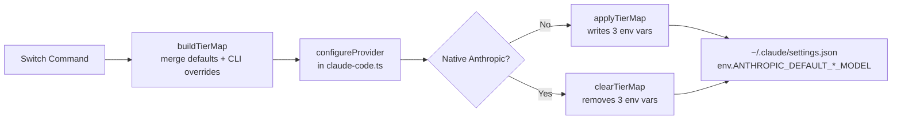
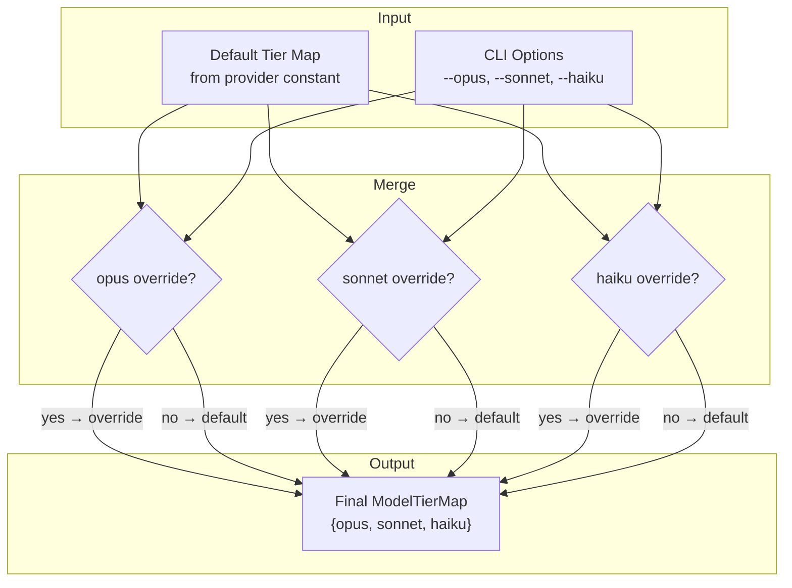

Claude Code internally classifies every request into one of three capability tiers — **Opus** (maximum reasoning power), **Sonnet** (balanced performance), and **Haiku** (fast and lightweight). When you run Claude Code against Anthropic's native API, these tiers resolve to Claude's own models automatically. But when Claude AI Switcher redirects traffic to a third-party provider like Alibaba, GLM, or Ollama, something must translate those tier names into the equivalent model from the target provider's catalog. That translation layer is the **Model Tier Map** — a three-field structure that assigns a concrete model identifier to each abstract tier slot, then writes those assignments as environment variables into Claude Code's `settings.json`.

## The Tier Abstraction: Why Three Slots Exist

Claude Code never sends a single "model" field upstream. Instead, it dynamically selects among three tiers depending on the complexity of the current operation: deep multi-file refactoring triggers Opus, routine code completion falls to Sonnet, and quick lookups dispatch to Haiku. This design allows the tool to optimize cost and latency without user intervention. For non-Anthropic providers, the tier map bridges this internal decision-making to the external model catalog by populating three well-known environment variables that Claude Code reads at startup.

Sources: [claude-code.ts](src/clients/claude-code.ts#L35-L46)

The environment variable names that Claude Code expects are fixed constants, defined in a single lookup object within the Claude Code client module:

Sources: [claude-code.ts](src/clients/claude-code.ts#L35-L39)

| Tier Alias | Environment Variable | Semantic Role |
|---|---|---|
| **opus** | `ANTHROPIC_DEFAULT_OPUS_MODEL` | Maximum capability — complex reasoning, large-context analysis |
| **sonnet** | `ANTHROPIC_DEFAULT_SONNET_MODEL` | Balanced performance — day-to-day coding, tool calling |
| **haiku** | `ANTHROPIC_DEFAULT_HAIKU_MODEL` | Fast and lightweight — quick lookups, simple completions |

## The ModelTierMap Interface

The tier map is modeled as a simple TypeScript interface with three string fields, each holding a provider-native model identifier. There are no nested objects, no metadata, and no validation at the type level — the interface is intentionally minimal because each provider fills it differently, sometimes dynamically.

```typescript
export interface ModelTierMap {
  opus: string;
  sonnet: string;
  haiku: string;
}
```

Sources: [models.ts](src/models.ts#L16-L20)

This interface flows through the entire provider-switching pipeline: it is constructed in `src/models.ts`, merged with CLI overrides in `src/index.ts`, applied to `settings.json` in `src/clients/claude-code.ts`, and read back during provider detection. Every function signature along the way accepts `ModelTierMap` as a parameter, making the three-slot contract a universal exchange type across modules.

## How Tier Maps Are Written to Disk

When a provider switch executes, the `applyTierMap` function injects all three tier values into the `env` object within `~/.claude/settings.json`. The function is idempotent — it creates the `env` object if missing, then unconditionally sets all three keys. This means a single switch call always produces a complete tier configuration, never a partial one.

Sources: [claude-code.ts](src/clients/claude-code.ts#L41-L46)

Conversely, switching back to native Anthropic requires the inverse operation. The `clearTierMap` function deletes all three keys from `env` and, if the `env` object becomes empty as a result, removes the `env` key entirely to keep the settings file clean. Native Anthropic does not use tier overrides because Claude Code's built-in defaults already point to the correct Claude models.

Sources: [claude-code.ts](src/clients/claude-code.ts#L48-L57)



## Default Tier Maps: Static Assignments Per Provider

Five of the six providers ship with a hardcoded tier map constant exported from `src/models.ts`. Each constant is a `ModelTierMap` that assigns the provider's models to tiers based on their relative capability — the strongest model leads Opus, a mid-tier model fills Sonnet, and the fastest or lightest model serves Haiku.

Sources: [models.ts](src/models.ts#L24-L49)

| Provider | Opus (Max Power) | Sonnet (Balanced) | Haiku (Fast/Light) |
|---|---|---|---|
| **GLM/Z.AI** | `glm-5.2[1m]` | `glm-5-turbo` | `glm-5v-turbo` |
| **OpenRouter** | `qwen/qwen3.6-plus:free` | `openrouter/free` | `openrouter/free` |
| **Ollama** | `deepseek-r1:latest` | `qwen2.5-coder:latest` | `llama3.1:latest` |
| **Gemini** | `gemini-2.5-pro` | `gemini-2.5-flash` | `gemini-2.5-flash-lite` |

Note that OpenRouter collapses Sonnet and Haiku into the same model (`openrouter/free`), which is a deliberate trade-off — the free tier lacks a distinct lightweight model, so both tiers route to the same endpoint. Each switch function in `src/index.ts` selects its corresponding constant and passes it to `buildTierMap` before calling the provider's configure function.

Sources: [index.ts](src/index.ts#L207-L208), [index.ts](src/index.ts#L248), [index.ts](src/index.ts#L309), [index.ts](src/index.ts#L364)

## The Alibaba Exception: Dynamic Tier Maps

Unlike the other four providers, Alibaba does not use a static constant. Instead, it generates its tier map at runtime through the `getAlibabaTierMap` function, which takes the user's selected model as input and restructures all three tiers accordingly. This design recognizes that Alibaba's DashScope API hosts over ten models with widely varying capabilities, so a single fixed mapping would be suboptimal.

Sources: [models.ts](src/models.ts#L54-L70)

The function follows a two-branch strategy:

| Condition | Opus | Sonnet | Haiku |
|---|---|---|---|
| Default model (`qwen3.7-plus`) | `qwen3.7-plus` | `qwen3.6-plus` | `kimi-k2.5` |
| Any other model selected | *selected model* | `qwen3.7-plus` | `qwen3.6-plus` |

When the user selects a non-default model (e.g., `qwen3-coder-plus`), that model is promoted to the Opus tier while the remaining tiers cascade down — the default model shifts to Sonnet, and what was previously Sonnet drops to Haiku. This ensures the user's chosen model always occupies the highest-priority slot, with sensible fallbacks for the other two tiers.

Sources: [models.ts](src/models.ts#L62-L69)

## The Tier Map Merge Function

Before any tier map reaches the configure function, it passes through `buildTierMap`, which overlays optional CLI overrides onto the provider's default. The function checks each of the three fields independently: if a CLI override exists for that tier, it wins; otherwise the default value carries through.

Sources: [index.ts](src/index.ts#L120-L129)



This merge is field-wise, not all-or-nothing. A user can override just the Haiku tier while leaving Opus and Sonnet at the provider's defaults — each flag operates independently. For deeper coverage of the `--opus`, `--sonnet`, and `--haiku` CLI flags themselves, see [Custom Tier Overrides with --opus, --sonnet, --haiku Flags](14-custom-tier-overrides-with-opus-sonnet-haiku-flags).

## Tier Map Application Across Providers

Every non-Anthropic provider configuration function in the Claude Code client accepts a `ModelTierMap` as its final parameter and applies it identically via `applyTierMap`. The tier map is provider-agnostic — the same three-string structure works whether the models route through a direct HTTP API (Alibaba, OpenRouter), a LiteLLM proxy (Ollama, Gemini), or an MCP server (GLM). Only the surrounding endpoint and auth configuration differ per provider.

Sources: [claude-code.ts](src/clients/claude-code.ts#L141-L153), [claude-code.ts](src/clients/claude-code.ts#L184-L198), [claude-code.ts](src/clients/claude-code.ts#L204-L216), [claude-code.ts](src/clients/claude-code.ts#L221-L233), [claude-code.ts](src/clients/claude-code.ts#L238-L250)

The Anthropic configure function is the sole exception: it calls `clearTierMap` instead, removing any tier overrides so Claude Code falls back to its internal model defaults. This asymmetry is intentional — the tier system exists only to serve non-native providers, and returning to Anthropic should produce a pristine state.

Sources: [claude-code.ts](src/clients/claude-code.ts#L159-L178)

## Display: How Tier Maps Appear to the User

After every successful switch, the `displayTierMap` function prints the resolved tier map to the console, showing each environment variable name alongside its assigned model. This output serves as a verification checkpoint — the user can immediately confirm that Claude Code will interpret `opus`, `sonnet`, and `haiku` as the expected models.

Sources: [index.ts](src/index.ts#L131-L136)

Example output after `claude-switch glm`:

```
  Claude model aliases:
    ANTHROPIC_DEFAULT_OPUS_MODEL   → glm-5.2[1m]
    ANTHROPIC_DEFAULT_SONNET_MODEL → glm-5-turbo
    ANTHROPIC_DEFAULT_HAIKU_MODEL  → glm-5v-turbo
```

## Tier Maps and Provider Detection

The tier map also plays a role in reverse — when Claude AI Switcher reads back `settings.json` to determine the active provider, it extracts any present tier values as part of the detection payload. The `getCurrentProvider` function reads all three `ANTHROPIC_DEFAULT_*_MODEL` keys from `env` and includes them in its return object. Notably, if tier aliases are present but no `ANTHROPIC_BASE_URL` is set, the detector infers GLM as the active provider — because GLM is the only provider that can operate through tier maps alone without an explicit base URL override.

Sources: [claude-code.ts](src/clients/claude-code.ts#L267-L271), [claude-code.ts](src/clients/claude-code.ts#L332-L337)

## Scope Exclusivity: Claude Code Only

The tier map system operates exclusively within the Claude Code client. The OpenCode client (`src/clients/opencode.ts`) does not reference `ModelTierMap`, `TIER_ENV_KEYS`, or any tier-related concept — OpenCode's provider schema uses a flat model list rather than a tiered abstraction. This architectural boundary means tier aliases are meaningful only when configuring `~/.claude/settings.json`, and have no effect on OpenCode's `~/.opencode/config.json`.

Sources: [index.ts](src/index.ts#L384-L395)

## Next Steps

- Learn how to override individual tier slots at the command line in [Custom Tier Overrides with --opus, --sonnet, --haiku Flags](14-custom-tier-overrides-with-opus-sonnet-haiku-flags)
- See the full TypeScript type definitions backing this system in [Model and Provider Type Definitions](15-model-and-provider-type-definitions)
- Understand how tier maps feed into provider switching in [Provider Switching Flow: From Command to Settings Write](6-provider-switching-flow-from-command-to-settings-write)