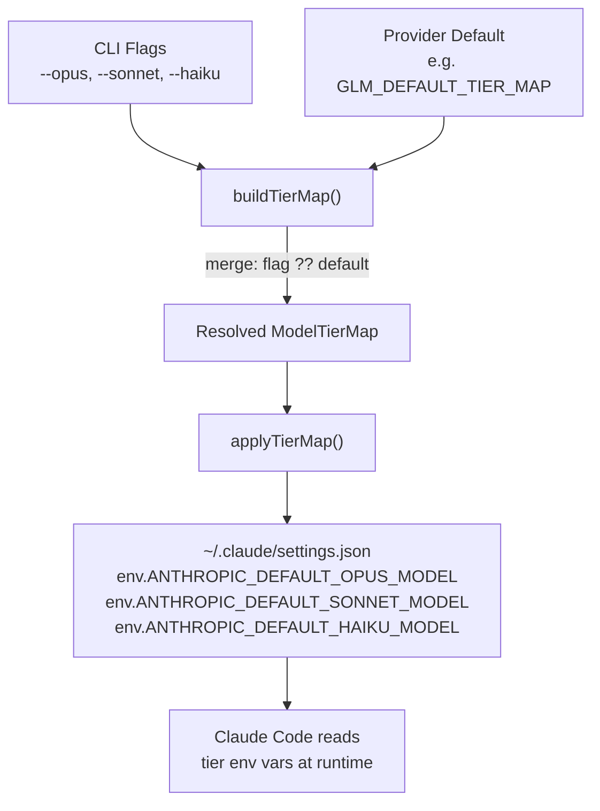

Claude Code internally resolves the abstract model tiers — **opus**, **sonnet**, and **haiku** — through three environment variables: `ANTHROPIC_DEFAULT_OPUS_MODEL`, `ANTHROPIC_DEFAULT_SONNET_MODEL`, and `ANTHROPIC_DEFAULT_HAIKU_MODEL`. When you switch to a non-Anthropic provider, Claude AI Switcher populates these variables so that Claude Code's tier-based model selection (e.g., "use a fast model for simple tasks") routes to the correct third-party model. The `--opus`, `--sonnet`, and `--haiku` CLI flags let you override any of these three mappings on a per-invocation basis, giving you granular control over which model identifier each tier resolves to without editing configuration files.

Sources: [claude-code.ts](src/clients/claude-code.ts#L35-L46), [index.ts](src/index.ts#L120-L143)

## How Tier Overrides Work

### The Override Pipeline

Every provider switch command that supports tier overrides follows the same three-stage pipeline. First, a **provider-specific default tier map** is resolved — either a static constant or, in Alibaba's case, a function of the selected model. Second, the `buildTierMap` helper merges any CLI-supplied `--opus`, `--sonnet`, or `--haiku` values over the defaults using simple per-key fallback: if a flag is provided, its value wins; otherwise the default persists. Third, the resolved map is written into `~/.claude/settings.json` as environment variables via the `applyTierMap` function.



The merge logic is intentionally minimal — a single `||` fallback per key — which means flags are **ephemeral**: they only persist if you re-supply them on the next switch command. There is no persistent override store; the last switch command's resolved tier map is what remains on disk.

Sources: [index.ts](src/index.ts#L120-L129), [claude-code.ts](src/clients/claude-code.ts#L41-L46)

### The `addTierOptions` Helper

The `addTierOptions` function is the single point where the three options are attached to any commander command. It accepts a `Command` instance and chains three `.option()` calls, each declaring a string argument that represents the raw model identifier to inject:

```typescript
function addTierOptions(cmd: Command): Command {
  return cmd
    .option("--opus <model>", "Override opus tier model alias")
    .option("--sonnet <model>", "Override sonnet tier model alias")
    .option("--haiku <model>", "Override haiku tier model alias");
}
```

This function is applied uniformly to every provider command that writes tier maps. The result is that all of the following commands accept the same three flags: `alibaba`, `glm`, `openrouter`, `ollama`, `gemini`, and their equivalents under the `claude` subcommand namespace.

Sources: [index.ts](src/index.ts#L138-L143)

## Flag Syntax and Semantics

### Usage Pattern

Each flag expects a single string argument — the model identifier as the provider's API expects it. The flags are independent and composable: you can override one, two, or all three tiers in the same invocation. Unspecified tiers fall back to the provider's default mapping.

| Flag | Argument | Env Var Written | Purpose |
|------|----------|-----------------|---------|
| `--opus <model>` | Provider model ID string | `ANTHROPIC_DEFAULT_OPUS_MODEL` | Overrides what Claude Code resolves when it selects the "opus" tier (heavyweight reasoning tasks) |
| `--sonnet <model>` | Provider model ID string | `ANTHROPIC_DEFAULT_SONNET_MODEL` | Overrides the "sonnet" tier (balanced everyday coding) |
| `--haiku <model>` | Provider model ID string | `ANTHROPIC_DEFAULT_HAIKU_MODEL` | Overrides the "haiku" tier (fast, lightweight operations) |

### Concrete Examples

```bash
# Override only the haiku tier for GLM — use the multimodal vision model for fast tasks
claude-switch glm --haiku glm-5v-turbo

# Override all three tiers for Alibaba, pointing opus at a coder model
claude-switch alibaba qwen3.7-plus --opus qwen3-coder-plus --sonnet qwen3.6-plus --haiku kimi-k2.5

# Swap opus to a local DeepSeek model while keeping Ollama defaults for sonnet/haiku
claude-switch ollama --opus deepseek-r1:latest

# Use Gemini Flash for both sonnet and haiku tiers
claude-switch gemini --sonnet gemini-2.5-flash --haiku gemini-2.5-flash-lite
```

The model identifiers passed via these flags are **not validated** against the provider's model list — they are written verbatim to the settings file. This is intentional: it allows injecting model IDs that the switcher's built-in catalog may not yet know about, at the cost of requiring you to spell them correctly.

Sources: [index.ts](src/index.ts#L120-L129), [claude-code.ts](src/clients/claude-code.ts#L35-L46)

## Provider-Specific Default Tier Maps

When no override flags are supplied, each provider falls back to a hardcoded default `ModelTierMap`. The following table documents all five default maps and the special dynamic behavior of Alibaba's tier resolution.

| Provider | Opus Default | Sonnet Default | Haiku Default | Source |
|----------|-------------|----------------|---------------|--------|
| **GLM/Z.AI** | `glm-5.2[1m]` | `glm-5-turbo` | `glm-5v-turbo` | Static constant |
| **OpenRouter** | `qwen/qwen3.6-plus:free` | `openrouter/free` | `openrouter/free` | Static constant |
| **Ollama** | `deepseek-r1:latest` | `qwen2.5-coder:latest` | `llama3.1:latest` | Static constant |
| **Gemini** | `gemini-2.5-pro` | `gemini-2.5-flash` | `gemini-2.5-flash-lite` | Static constant |
| **Alibaba (default model)** | `qwen3.7-plus` | `qwen3.6-plus` | `kimi-k2.5` | Dynamic — `getAlibabaTierMap()` |
| **Alibaba (custom model)** | *selected model* | `qwen3.7-plus` | `qwen3.6-plus` | Dynamic — `getAlibabaTierMap()` |
| **Anthropic** | *(cleared)* | *(cleared)* | *(cleared)* | Tier vars deleted entirely |

### Alibaba's Dynamic Tier Logic

Alibaba is the only provider whose default tier map is computed at runtime rather than referenced from a static constant. The `getAlibabaTierMap` function inspects the selected model and branches: when the default model (`qwen3.7-plus`) is used, it returns a curated map with Qwen models filling all three tiers. When any other model is explicitly selected, that model is promoted to the opus slot while the remaining tiers fall back to Qwen3.7-Plus and Qwen3.6-Plus respectively. This dynamic default is resolved *before* `buildTierMap` applies any CLI overrides, so `--opus`, `--sonnet`, and `--haiku` always take final precedence regardless of which Alibaba model was selected.

Sources: [models.ts](src/models.ts#L24-L70), [index.ts](src/index.ts#L181)

## Commands That Support Tier Overrides

Tier options are attached via `addTierOptions` to six commands across two command namespaces. The `anthropic` command deliberately does **not** receive tier options — switching to Anthropic clears all tier env vars to restore native Claude model resolution.

| Command Path | Accepts `[model]`? | Accepts Tier Flags? | Notes |
|-------------|-------------------|---------------------|-------|
| `alibaba [model]` | Yes | Yes | Tier defaults are dynamic via `getAlibabaTierMap` |
| `glm` | No | Yes | No model argument; tier map is the primary configuration lever |
| `openrouter [model]` | Yes | Yes | |
| `ollama [model]` | Yes | Yes | |
| `gemini [model]` | Yes | Yes | |
| `anthropic` | No | **No** | Clears all tier env vars via `clearTierMap()` |
| `claude alibaba [model]` | Yes | Yes | Identical to top-level, explicit Claude Code targeting |
| `claude glm` | No | Yes | |
| `claude openrouter [model]` | Yes | Yes | |
| `claude ollama [model]` | Yes | Yes | |
| `claude gemini [model]` | Yes | Yes | |
| `claude anthropic` | No | **No** | Clears tier env vars |

Sources: [index.ts](src/index.ts#L384-L544)

## Environment Variable Lifecycle

### Write Path

When a provider switch succeeds, the `applyTierMap` function writes three keys into the `env` object of `~/.claude/settings.json`. The mapping between tier names and env var names is defined by the `TIER_ENV_KEYS` constant, which serves as the single source of truth for this relationship:

```typescript
const TIER_ENV_KEYS = {
  opus: "ANTHROPIC_DEFAULT_OPUS_MODEL",
  sonnet: "ANTHROPIC_DEFAULT_SONNET_MODEL",
  haiku: "ANTHROPIC_DEFAULT_HAIKU_MODEL"
} as const;
```

The function lazily initializes `settings.env` if it doesn't exist, then assigns each tier value directly. There is no partial update mechanism — all three keys are always written together, even if only one was overridden via a CLI flag.

### Clear Path

Switching back to Anthropic triggers `clearTierMap`, which deletes all three env var keys individually and then removes the `env` object entirely if it has become empty. This ensures no stale tier aliases linger when native Claude model resolution should take over.

### Read Path (Status Display)

The `status` command and `getCurrentProvider` both read the tier map back from disk. The `getCurrentProvider` function extracts the three env var values into an optional `tierMap` object on its return type, which the status command then renders as dimmed alias lines:

```
    Aliases:
      opus   → glm-5.2[1m]
      sonnet → glm-5-turbo
      haiku  → glm-5v-turbo
```

This round-trip — write via `applyTierMap`, read via `getCurrentProvider` — is how you can verify that your `--opus`/`--sonnet`/`--haiku` overrides took effect: run `claude-switch status` immediately after switching and inspect the displayed aliases.

Sources: [claude-code.ts](src/clients/claude-code.ts#L35-L57), [claude-code.ts](src/clients/claude-code.ts#L255-L340), [index.ts](src/index.ts#L808-L813)

## Post-Switch Display

After every successful provider switch, the `displayTierMap` function prints the resolved tier aliases to the console. This serves as immediate confirmation of which overrides (if any) were applied:

```
  Claude model aliases:
    ANTHROPIC_DEFAULT_OPUS_MODEL   → glm-5.2[1m]
    ANTHROPIC_DEFAULT_SONNET_MODEL → glm-5-turbo
    ANTHROPIC_DEFAULT_HAIKU_MODEL  → glm-5v-turbo
```

Because `buildTierMap` resolves overrides before this display runs, the printed values always reflect the final merged result — not the raw defaults. If you passed `--haiku glm-5v-turbo`, the haiku line will show your override while opus and sonnet show their provider defaults.

Sources: [index.ts](src/index.ts#L131-L136), [index.ts](src/index.ts#L193)

## Practical Patterns and Edge Cases

### Mixing Model Selection with Tier Overrides

The `[model]` argument (accepted by Alibaba, OpenRouter, Ollama, and Gemini) and the tier override flags operate on different layers. The `[model]` argument sets the `ANTHROPIC_MODEL` env var — the default model Claude Code uses when no tier-specific alias applies. The tier flags set the three `ANTHROPIC_DEFAULT_*_MODEL` env vars independently. This means you can select one model as the general default while mapping the three tiers to entirely different models:

```bash
# Use qwen3-coder-next as the default model, but map opus to the largest Qwen
claude-switch alibaba qwen3-coder-next --opus qwen3.7-plus
```

In this scenario, `ANTHROPIC_MODEL` would be `qwen3-coder-next`, while `ANTHROPIC_DEFAULT_OPUS_MODEL` would be `qwen3.7-plus`.

### Alibaba's Dual Override Interaction

Because Alibaba's default tier map is dynamic — `getAlibabaTierMap(selectedModel)` shifts the selected model into the opus slot — overriding `--opus` effectively discards the dynamic promotion while keeping the dynamic sonnet/haiku defaults. This is generally the desired behavior: if you explicitly say `--opus X`, you want `X` in the opus slot regardless of what model argument you passed.

### GLM's Tier-Only Configuration Model

GLM is unique among providers in that it accepts **no** `[model]` argument. The `claude-switch glm` command configures Claude Code exclusively through tier aliases — there is no `ANTHROPIC_MODEL` set, and the `coding-helper` infrastructure handles base URL and authentication independently. This makes the tier flags the primary and only mechanism for customizing which GLM models Claude Code uses at each tier.

Sources: [index.ts](src/index.ts#L158-L222), [claude-code.ts](src/clients/claude-code.ts#L184-L198)

## Related Pages

- **[Model Tier Aliases: Opus, Sonnet, and Haiku Mapping](13-model-tier-aliases-opus-sonnet-and-haiku-mapping)** — Covers the default tier maps and the `ModelTierMap` type in depth, complementing this page's focus on runtime overrides.
- **[Claude Code Client: Writing Environment Variables and MCP Servers](20-claude-code-client-writing-environment-variables-and-mcp-servers)** — Details the full `settings.json` schema, including the `env` block where tier overrides are persisted.
- **[Provider Detection: Inferring Active Provider from Settings](19-provider-detection-inferring-active-provider-from-settings)** — Explains how `getCurrentProvider` reads tier env vars as part of provider identification.
- **[Command Reference: Complete CLI Cheatsheet](4-command-reference-complete-cli-cheatsheet)** — Quick reference for all commands and their accepted flags.