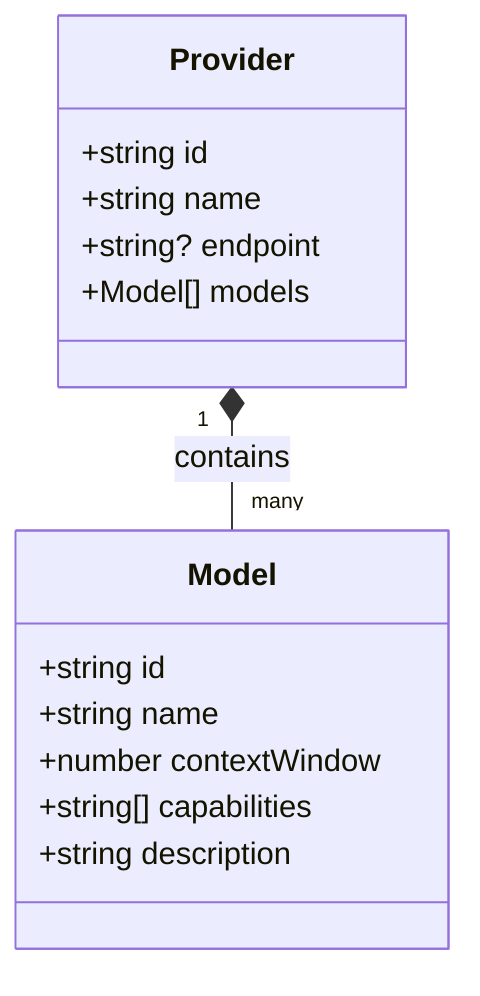
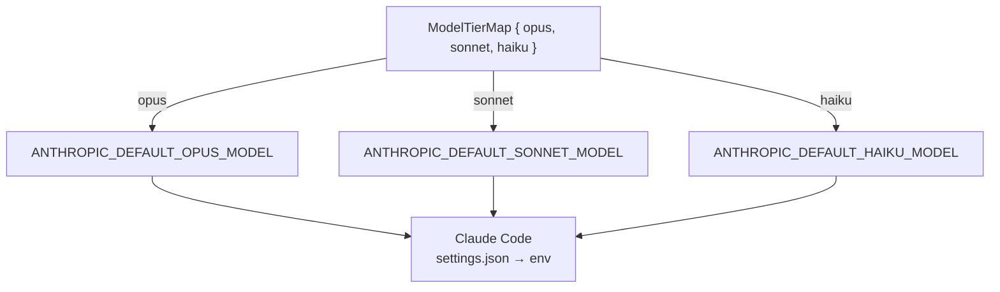
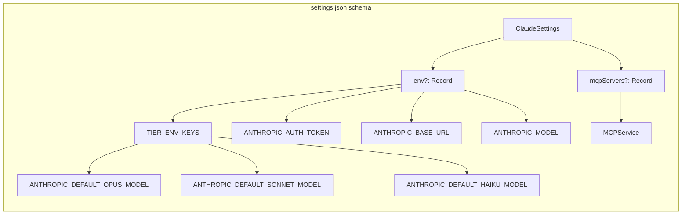
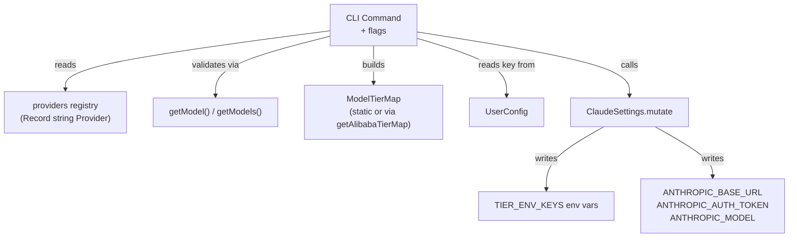

Claude AI Switcher's type system rests on three load-bearing interfaces — `Model`, `Provider`, and `ModelTierMap` — that together encode every piece of information the tool needs to describe, select, and activate an AI backend. Understanding these types is essential for anyone extending the switcher with a new provider, debugging a model mismatch, or interpreting the output of the detection logic.

## Core Interfaces: Model and Provider

The foundational type hierarchy begins in `src/models.ts` with two interfaces that form a parent-child relationship. A `Provider` aggregates a list of `Model` objects, while each `Model` carries the metadata that powers the CLI's display layer and validation checks.

The `Model` interface has five fields. The `id` field is the canonical model identifier used in API calls and configuration files (e.g., `"qwen3.7-plus"`, `"gemini-2.5-pro"`). The `name` field is a human-readable label rendered in CLI output. The `contextWindow` field stores the maximum token context as a raw integer, formatted for display via the `formatContext()` helper. The `capabilities` array holds descriptive tags like `"Text Generation"`, `"Deep Thinking"`, and `"Coding Agent"` that surface in the model listing. The `description` field provides a prose summary shown beneath each model entry.

The `Provider` interface wraps a collection of models with provider-level metadata. The `id` field serves as the dictionary key throughout the codebase. The optional `endpoint` field stores the base URL for API access — present for providers like Alibaba (`https://coding-intl.dashscope.aliyuncs.com/apps/anthropic`) and OpenRouter (`https://openrouter.ai/api/v1`), but omitted for Anthropic (native) and GLM (MCP-based, no direct endpoint). The `models` array holds the full catalog of supported models for that provider.

Sources: [models.ts](src/models.ts#L1-L14), [models.ts](src/models.ts#L72-L80)

## The ModelTierMap Interface and Default Tier Maps

The `ModelTierMap` interface is the bridge between Claude Code's native three-tier alias system and third-party model identifiers. Claude Code internally references models through the `opus`, `sonnet`, and `haiku` tiers via environment variables (`ANTHROPIC_DEFAULT_OPUS_MODEL`, `ANTHROPIC_DEFAULT_SONNET_MODEL`, `ANTHROPIC_DEFAULT_HAIKU_MODEL`). The `ModelTierMap` assigns a string model ID to each tier, enabling any provider's models to transparently fill these slots.

Four providers use **static default tier maps** defined as exported constants, while Alibaba uses a **dynamic function** that adjusts its mappings based on the selected model. This distinction reflects a deliberate design choice: Alibaba's model catalog spans vendors (Qwen, GLM, Kimi, MiniMax) and the tier strategy shifts depending on whether the user selected the default model or a specific alternative.

| Provider | Constant/Function | Opus Tier | Sonnet Tier | Haiku Tier |
|---|---|---|---|---|
| GLM/Z.AI | `GLM_DEFAULT_TIER_MAP` | `glm-5.2[1m]` | `glm-5-turbo` | `glm-5v-turbo` |
| OpenRouter | `OPENROUTER_DEFAULT_TIER_MAP` | `qwen/qwen3.6-plus:free` | `openrouter/free` | `openrouter/free` |
| Ollama | `OLLAMA_DEFAULT_TIER_MAP` | `deepseek-r1:latest` | `qwen2.5-coder:latest` | `llama3.1:latest` |
| Gemini | `GEMINI_DEFAULT_TIER_MAP` | `gemini-2.5-pro` | `gemini-2.5-flash` | `gemini-2.5-flash-lite` |
| Alibaba (default model) | `getAlibabaTierMap("qwen3.7-plus")` | `qwen3.7-plus` | `qwen3.6-plus` | `kimi-k2.5` |
| Alibaba (custom model) | `getAlibabaTierMap(model)` | *selected model* | `qwen3.7-plus` | `qwen3.6-plus` |

The `getAlibabaTierMap()` function implements a branching strategy: when the user selects the default model (`qwen3.7-plus`), the tier map distributes distinct Qwen/Kimi models across all three tiers. When a different model is selected, that model is promoted to the opus tier while the default Qwen models shift down to sonnet and haiku. This ensures the user's explicit choice always occupies the most capable slot.

Sources: [models.ts](src/models.ts#L16-L70)

## The Provider Registry: Static Catalog Definition

All six providers are registered in a single `Record<string, Provider>` object exported as `providers`. This registry serves as the canonical source of truth that every module in the codebase imports when it needs provider metadata, model lists, or display information.

| Provider ID | Display Name | Endpoint | Model Count |
|---|---|---|---|
| `anthropic` | Anthropic (Default) | — *(native)* | 5 |
| `alibaba` | Alibaba Coding Plan | `https://coding-intl.dashscope.aliyuncs.com/apps/anthropic` | 10 |
| `glm` | GLM/Z.AI | — *(via MCP)* | 6 |
| `openrouter` | OpenRouter | `https://openrouter.ai/api/v1` | 2 |
| `ollama` | Ollama (Local) | `http://localhost:4000` | 4 |
| `gemini` | Gemini (Google) | `http://localhost:4001` | 3 |

Two companion helper functions operate on this registry. `getModel(providerId, modelId)` performs a lookup across a provider's model array and returns the `Model` object (or `undefined`), while `getModels(providerId)` returns the full array for iteration. These functions are used during command processing to validate user-supplied model IDs before configuration is written.

Sources: [models.ts](src/models.ts#L316-L367)

## Client Configuration Types

The Claude Code client defines three TypeScript interfaces that model the structure of the files it reads and writes on disk. The `ClaudeSettings` interface represents `~/.claude/settings.json` — the primary configuration file where provider switches are persisted. It uses a permissive index signature (`[key: string]: any`) to accommodate unknown keys while explicitly declaring the `mcpServers` field as `Record<string, any>` for type-safe access during GLM configuration.

The `ClaudeJson` interface models `~/.claude.json`, whose critical field for the switcher is `hasCompletedOnboarding`. Setting this to `true` prevents the "Unable to connect to Anthropic services" error when using third-party endpoints. The `MCPService` interface describes the structure of entries within the `mcpServers` record, capturing the `type`, `command`, `args`, `env`, `url`, and `headers` fields used by coding-helper MCP integrations.

The `TIER_ENV_KEYS` constant maps the three tier names to their corresponding environment variable names in Claude settings. This constant is consumed by `applyTierMap()` and `clearTierMap()` — two internal functions that write and remove tier alias entries respectively. The `clearTierMap()` function additionally performs cleanup: if removing the three tier keys leaves `settings.env` empty, it deletes the entire `env` object to keep the settings file clean.

Sources: [claude-code.ts](src/clients/claude-code.ts#L12-L57)

## Provider-Specific Configuration Types

The Ollama and Gemini provider modules each define a discriminated union type that encapsulates runtime configuration distinct from the static registry data. `OllamaConfig` is a simple structure with a literal `provider: "ollama"` discriminator, a `model` string, and an `endpoint` string. `GeminiConfig` mirrors this shape but adds an `apiKey` field, since Gemini requires authentication through the proxy.

These interfaces are produced by factory functions — `getOllamaConfig(model?)` and `getGeminiConfig(apiKey, model?)` — that supply default values (Ollama defaults to `deepseek-r1:latest`, Gemini defaults to `gemini-2.5-pro`). The factory pattern keeps provider instantiation consistent: callers always receive a fully populated object without needing to know which fields have defaults. Each provider module also exports endpoint and port constants (`OLLAMA_ENDPOINT`, `OLLAMA_LITELLM_PORT = 4000`, `GEMINI_ENDPOINT`, `GEMINI_LITELLM_PORT = 4001`) that are used by the LiteLLM proxy lifecycle code.

Sources: [ollama.ts](src/providers/ollama.ts#L19-L35), [gemini.ts](src/providers/gemini.ts#L18-L35)

## User Configuration and Verification Types

The `UserConfig` interface in `src/config.ts` defines the shape of the switcher's own persistent state stored at `~/.claude-ai-switcher/config.json`. It contains four optional fields: three API key fields (`alibabaApiKey`, `openrouterApiKey`, `geminiApiKey`) and two preference fields (`defaultProvider`, `defaultModel`). Notably, Anthropic and GLM keys are not stored here — Anthropic uses the standard `ANTHROPIC_API_KEY` environment variable, and GLM authentication flows through the `coding-helper` CLI tool.

The `VerifyResult` interface in `src/verify.ts` captures the outcome of an API key health check. Its `status` field is a string literal union with five possible values:

| Status | Meaning |
|---|---|
| `"ok"` | Key validated successfully against the provider's API |
| `"invalid"` | Provider returned 401/403 — authentication failed |
| `"missing"` | No API key stored for this provider |
| `"error"` | Network error, unexpected HTTP status, or tool not installed |
| `"skipped"` | Provider check intentionally omitted (e.g., GLM without `checkGLM` flag) |

The `verifyAllKeys()` function accepts a parameter object with optional keys for each provider and returns a `Promise<VerifyResult[]>`, running all checks in parallel via `Promise.all`. Providers without a provided key are immediately resolved with `"missing"` or `"skipped"` status without making a network request.

Sources: [config.ts](src/config.ts#L14-L20), [verify.ts](src/verify.ts#L9-L13), [verify.ts](src/verify.ts#L150-L197)

## OpenCode Settings Type

For the OpenCode client adapter, the `OpenCodeSettings` interface models the structure of `~/.config/opencode/opencode.json`. It declares three explicit optional fields — `$schema` (for OpenCode's JSON schema URL), `provider` (a `Record<string, any>` holding provider configurations keyed by provider name), and `mcpServers`/`agents` records — while the index signature `[key: string]: any` preserves compatibility with OpenCode's evolving schema. Unlike Claude settings, where provider configuration is scattered across `env` entries, OpenCode's provider configuration is a structured nested object with model definitions that include `modalities`, `options` (like thinking mode with budget tokens), and `limit` (context and output caps).

Sources: [opencode.ts](src/clients/opencode.ts#L11-L17)

## Type System Interaction Summary

The following diagram illustrates how the core types flow through the system during a provider switch operation:

The type system enforces a clean separation of concerns: `Model` and `Provider` describe **what exists**, `ModelTierMap` describes **how models map to Claude's tiers**, `ClaudeSettings` describes **what gets written to disk**, and `UserConfig` describes **what the switcher persists for its own use**. This separation allows each module to evolve independently — adding a model to a provider's array requires no changes to the tier mapping or settings-writing logic.

Sources: [models.ts](src/models.ts#L1-L367), [claude-code.ts](src/clients/claude-code.ts#L12-L57), [config.ts](src/config.ts#L14-L20), [verify.ts](src/verify.ts#L9-L13)

## Next Steps

- **See how tier aliases translate into concrete environment variables**: [Custom Tier Overrides with --opus, --sonnet, --haiku Flags](14-custom-tier-overrides-with-opus-sonnet-haiku-flags)
- **Understand the default tier mappings in practice**: [Model Tier Aliases: Opus, Sonnet, and Haiku Mapping](13-model-tier-aliases-opus-sonnet-and-haiku-mapping)
- **Learn how these types feed into the detection logic**: [Provider Detection: Inferring Active Provider from Settings](19-provider-detection-inferring-active-provider-from-settings)
- **Extend the type system with a new provider**: [Adding a New Provider: Step-by-Step Implementation Guide](27-adding-a-new-provider-step-by-step-implementation-guide)