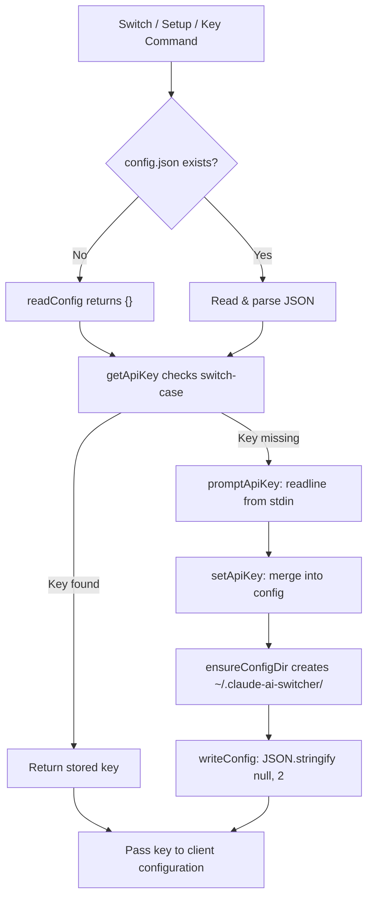
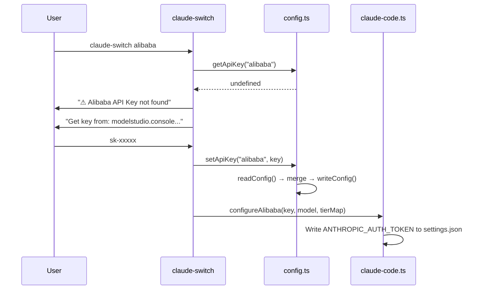

Claude AI Switcher maintains a **centralized key store** at `~/.claude-ai-switcher/config.json` that decouples API credential management from the active client configuration files (`~/.claude/settings.json`, `~/.config/opencode/opencode.json`). This separation means you set a key once, and every subsequent provider switch or OpenCode provider addition reuses it without re-prompting. The store is a simple plaintext JSON file — no OS keychain integration, no encryption layer — designed for developer convenience on local machines where the home directory already serves as the de facto secrets boundary.

Sources: [config.ts](src/config.ts#L1-L12)

## The `UserConfig` Data Model

All persisted configuration lives behind a single TypeScript interface. Five optional fields cover three API key slots, a default provider hint, and a default model hint:

```typescript
export interface UserConfig {
  alibabaApiKey?: string;
  openrouterApiKey?: string;
  geminiApiKey?: string;
  defaultProvider?: string;
  defaultModel?: string;
}
```

The key-per-provider naming convention (`<provider>ApiKey`) aligns directly with the switch-case logic in `getApiKey()` and `setApiKey()`, so adding a new provider to the store is a matter of adding a field and a case branch — no schema migration needed. Note that **not all providers appear here**: Anthropic credentials are read from the `ANTHROPIC_API_KEY` environment variable at runtime, GLM authentication is delegated to the `coding-helper` MCP tool, and Ollama requires no key at all.

Sources: [config.ts](src/config.ts#L14-L20), [config.ts](src/config.ts#L52-L86), [index.ts](src/index.ts#L845)

### Which Providers Store Keys Where

| Provider | Stored in `config.json`? | Alternative Source | Key Used As |
|---|---|---|---|
| Alibaba | ✓ (`alibabaApiKey`) | Prompted on first switch | `ANTHROPIC_AUTH_TOKEN` env var |
| OpenRouter | ✓ (`openrouterApiKey`) | Prompted on first switch | `ANTHROPIC_AUTH_TOKEN` env var |
| Gemini | ✓ (`geminiApiKey`) | Prompted on first switch | LiteLLM proxy `GEMINI_API_KEY` + `ANTHROPIC_AUTH_TOKEN` |
| Anthropic | ✗ | `process.env.ANTHROPIC_API_KEY` | Native Claude auth |
| GLM/Z.AI | ✗ | `coding-helper auth` (MCP-managed) | `ANTHROPIC_BASE_URL` + `.z.ai` token |
| Ollama | ✗ | None (local, no auth) | Dummy `"ollama"` token |

Sources: [index.ts](src/index.ts#L843-L846), [claude-code.ts](src/clients/claude-code.ts#L227)

## File Lifecycle: Read, Write, and Directory Bootstrap

Every interaction with the config store follows a three-stage pattern: **ensure directory → read existing JSON → merge → write back**. The `ensureConfigDir()` function creates `~/.claude-ai-switcher/` via `fs-extra`'s `ensureDir` on first write, and `readConfig()` returns an empty object `{}` when the file doesn't yet exist — so callers never need null checks. The write path serializes with `JSON.stringify(config, null, 2)` for human-readable formatting, making the file directly inspectable and editable.



Sources: [config.ts](src/config.ts#L25-L47), [config.ts](src/config.ts#L70-L86)

## The Four API Key Management Entry Points

There are **three distinct ways** a key enters the system, plus a read-only status view. Understanding which entry point to use depends on workflow stage:

### 1. Interactive Setup Wizard (`claude-switch setup`)

The wizard iterates through Alibaba, OpenRouter, and Gemini in sequence. For each provider, it calls `hasApiKey()` first — if a key is already stored, it skips that provider entirely. Keys entered here are optional (Enter to skip), making it safe to run incrementally as you accumulate credentials.

Sources: [index.ts](src/index.ts#L1022-L1077)

### 2. Direct Key Command (`claude-switch key <provider> [apikey]`)

This command provides explicit CRUD-like control. Calling with a provider name only (no key argument) checks existence and reports set/unset status. Calling with both arguments writes directly via `setApiKey()` without any validation round-trip. The supported provider values are `"alibaba"`, `"openrouter"`, and `"gemini"` — any other string silently no-ops because the `switch` in `setApiKey()` has no `default` branch.

Sources: [index.ts](src/index.ts#L998-L1020), [config.ts](src/config.ts#L70-L86)

### 3. On-Demand Prompting During Provider Switch

Every switch function that requires a key follows the same lazy-evaluation pattern: call `getApiKey()`, and if the result is falsy, invoke `promptApiKey()` which opens a readline interface, displays the provider's key-obtainment URL, and blocks on stdin. The entered key is immediately persisted via `setApiKey()` before proceeding to client configuration, so the prompt only fires once per provider across the tool's lifetime.



Sources: [index.ts](src/index.ts#L100-L118), [index.ts](src/index.ts#L158-L171), [claude-code.ts](src/clients/claude-code.ts#L141-L153)

### 4. Status Verification (`claude-switch status`)

The status command reads keys from both `config.json` and the `ANTHROPIC_API_KEY` environment variable, then passes them to `verifyAllKeys()`. In the output, each key is displayed using `maskKey()` — a utility that reveals only the first four and last four characters of the key, replacing the middle with `...`. Keys shorter than 8 characters are fully masked as `****`. This masked display is purely a presentation-layer concern; the actual keys remain unmasked in the config file.

Sources: [index.ts](src/index.ts#L843-L897), [verify.ts](src/verify.ts#L15-L18)

## Key Propagation: From Store to Runtime Config

Once a key is retrieved from the store, it flows into the **active client configuration** through provider-specific functions in the client adapter modules. The key is never held in a global variable or cache — each command invocation performs a fresh `readConfig()` from disk, ensuring edits made out-of-band (e.g., manually editing `config.json`) take effect immediately.

For **Claude Code**, the key is written as `ANTHROPIC_AUTH_TOKEN` inside the `env` block of `~/.claude/settings.json`. Every provider that uses an Anthropic-compatible API (Alibaba, OpenRouter, Gemini via proxy, Ollama via proxy) follows this identical pattern — the only variation is the `ANTHROPIC_BASE_URL` value that accompanies it.

For **OpenCode**, the key is embedded directly into the provider's `options.apiKey` field within `~/.config/opencode/opencode.json`, structured per the OpenCode provider schema.

| Target Client | File | Key Field | Format |
|---|---|---|---|
| Claude Code | `~/.claude/settings.json` | `env.ANTHROPIC_AUTH_TOKEN` | Flat string |
| OpenCode | `~/.config/opencode/opencode.json` | `provider.<id>.options.apiKey` | Nested JSON object |

Sources: [claude-code.ts](src/clients/claude-code.ts#L141-L153), [claude-code.ts](src/clients/claude-code.ts#L204-L216), [opencode.ts](src/clients/opencode.ts#L73-L88)

## Security Posture and `.gitignore` Protection

The config store uses **plaintext storage with directory-level isolation** — there is no encryption, no OS keyring integration, and no access control beyond filesystem permissions on the home directory. This is a deliberate trade-off: the tool targets local developer workstations where the home directory already contains SSH keys, `.npmrc` tokens, and other plaintext secrets. The `.gitignore` file explicitly excludes `~/.claude-ai-switcher/` alongside `~/.claude/` and `~/.opencode.json` to prevent accidental commits, though these entries only protect against committing the tool's own repository — the actual config files live outside the repo at the user's home path.

The `getConfigPath()` export provides a single accessor for the config file path, allowing other modules (or future tooling) to reference the location without hardcoding `os.homedir()` joins.

Sources: [config.ts](src/config.ts#L96-L101), [.gitignore](.gitignore#L31-L36)

## API Reference Summary

| Function | Signature | Returns | Side Effect |
|---|---|---|---|
| `readConfig()` | `() => Promise<UserConfig>` | Parsed JSON or `{}` | None |
| `writeConfig(config)` | `(UserConfig) => Promise<void>` | — | Creates dir + writes file |
| `getApiKey(provider)` | `(string) => Promise<string \| undefined>` | Key or undefined | None |
| `setApiKey(provider, apiKey)` | `(string, string) => Promise<void>` | — | Read-merge-write |
| `hasApiKey(provider)` | `(string) => Promise<boolean>` | `true`/`false` | None |
| `getConfigPath()` | `() => string` | Absolute file path | None |
| `maskKey(key)` | `(string) => string` | Masked display string | None |

Sources: [config.ts](src/config.ts#L32-L101), [verify.ts](src/verify.ts#L15-L18)

## What's Next

Now that you understand how keys are stored and retrieved, explore how they're validated and consumed:

- **[API Key Verification: Lightweight HTTP Health Checks](17-api-key-verification-lightweight-http-health-checks)** — How `verifyAllKeys()` probes each provider's `/models` endpoint with masked-key display
- **[Configuration File Map: Where Everything Lives on Disk](7-configuration-file-map-where-everything-lives-on-disk)** — Complete atlas of every file the tool reads and writes
- **[Safe Configuration: Backup Strategy and Onboarding Auto-Set](18-safe-configuration-backup-strategy-and-onboarding-auto-set)** — How `writeClaudeSettings()` timestamps backups before overwriting, and why `ensureOnboardingComplete()` matters
- **[Provider Detection: Inferring Active Provider from Settings](19-provider-detection-inferring-active-provider-from-settings)** — How the tool reverse-engineers which provider is active from `ANTHROPIC_BASE_URL` patterns