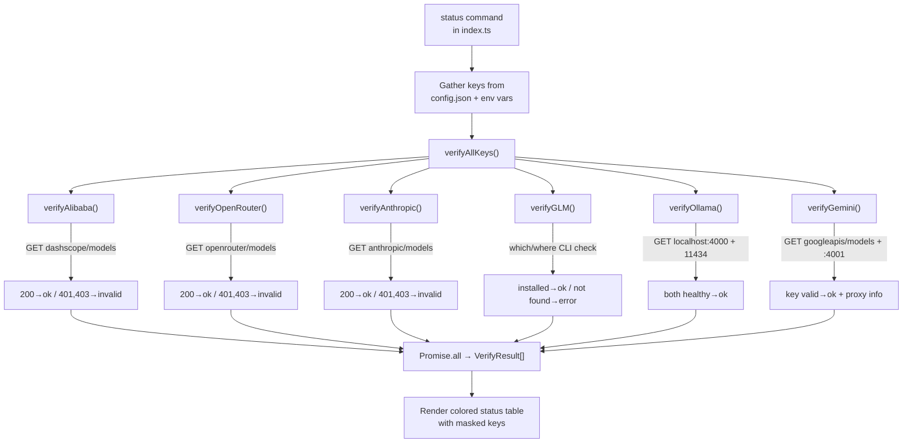

The verification module provides a **single entry point** — `verifyAllKeys()` — that fans out parallel, timeout-guarded HTTP requests across every supported provider to confirm API keys are live before a developer trusts them in production. Rather than sending expensive chat completion payloads, each probe targets a **read-only models-list or health endpoint**, keeping verification fast and cost-free. The system distills results into a five-state status enum (`ok`, `invalid`, `missing`, `error`, `skipped`), making it trivial for the caller to render a uniform diagnostic table.

Sources: [verify.ts](src/verify.ts#L1-L13), [index.ts](src/index.ts#L793-L908)

## Architecture: The Verification Pipeline

Understanding the verification flow requires three conceptual layers: the **caller** (the `status` CLI command), the **orchestrator** (`verifyAllKeys`), and the **per-provider checkers** (six functions, each with a different network strategy). The caller gathers all available keys from local config and environment variables, passes them as a flat object to the orchestrator, and receives back an ordered array of `VerifyResult` entries.



The orchestrator builds an array of `Promise<VerifyResult>` entries — one per provider — and resolves them all with `Promise.all`. Providers with no key configured are immediately resolved to a `missing` status without any network call, while providers explicitly flagged as optional (GLM, Ollama) default to `skipped` when the flag isn't set. This means the wall-clock time of a full verification run is bounded by the **slowest single check**, not the sum of all checks.

Sources: [verify.ts](src/verify.ts#L150-L197), [index.ts](src/index.ts#L843-L908)

## The `fetchWithTimeout` Abstraction

Every HTTP-based verifier routes through a single shared network utility rather than calling `fetch` directly. This function wraps the native `fetch` API with an `AbortController` that aborts after a hardcoded **5-second timeout**, preventing a hung or slow provider endpoint from blocking the entire status command indefinitely.

The implementation is deliberately minimal: it creates an `AbortController`, sets a timer for `TIMEOUT_MS` (5000 ms), and merges the abort signal into whatever `RequestInit` the caller passes. The `finally` block guarantees the timer is cleared whether the fetch succeeds, fails, or times out — eliminating a subtle memory leak that would otherwise accumulate pending timers across rapid successive calls.

Sources: [verify.ts](src/verify.ts#L7-L30)

## Provider Verification Strategies

Each provider demands a distinct verification approach dictated by its API authentication scheme and infrastructure topology. The table below summarizes all six strategies, their endpoints, HTTP methods, and what constitutes a valid versus invalid response.

| Provider | Endpoint | Method | Auth Header | Valid (200) | Invalid (401/403) | Additional Checks |
|---|---|---|---|---|---|---|
| **Alibaba** | `dashscope.aliyuncs.com/compatible-mode/v1/models` | GET | `Authorization: Bearer` | → `ok` | → `invalid` | None |
| **OpenRouter** | `openrouter.ai/api/v1/models` | GET | `Authorization: Bearer` | → `ok` | → `invalid` | None |
| **Anthropic** | `api.anthropic.com/v1/models` | GET | `x-api-key` + `anthropic-version` | → `ok` | → `invalid` | None |
| **Gemini** | `generativelanguage.googleapis.com/v1beta/models` | GET | `x-goog-api-key` | → `ok` | → `invalid` (also 400) | LiteLLM proxy on `:4001` |
| **GLM/Z.AI** | N/A (local CLI) | N/A | N/A | `coding-helper` found | N/A | Env vars `ZHIPUAI_MODEL`/`ZAI_MODEL` |
| **Ollama** | `localhost:4000/health` + `localhost:11434/api/tags` | GET | None | Both 200 → `ok` | N/A | Two-stage local service check |

Three of the six providers — Alibaba, OpenRouter, and Anthropic — follow an **identical pattern**: hit a models-listing endpoint with the API key in the appropriate header, then classify the HTTP status code. Gemini follows the same HTTP pattern for key validation but layers in a secondary LiteLLM proxy health check on port 4001, appending the proxy status as an informational suffix to the result message. GLM and Ollama diverge entirely from the HTTP-key model: GLM verifies a local CLI tool installation, and Ollama performs a two-stage local service liveness check.

Sources: [verify.ts](src/verify.ts#L35-L57), [verify.ts](src/verify.ts#L62-L85), [verify.ts](src/verify.ts#L121-L145), [verify.ts](src/verify.ts#L232-L258), [verify.ts](src/verify.ts#L91-L116), [verify.ts](src/verify.ts#L202-L227)

### Direct API Key Probes (Alibaba, OpenRouter, Anthropic)

The three direct-API providers share a uniform code structure. Each function calls `fetchWithTimeout` against a read-only models endpoint, then applies a three-way classification: HTTP 200 maps to `ok`, HTTP 401 or 403 maps to `invalid`, and any other status code maps to `error` with the raw HTTP code in the message. Network failures (DNS, timeout, connection refused) are caught by the outer `try/catch` and reported as `error` with the message `"Connection failed"`.

The Anthropic checker differs only in its header construction: it requires the proprietary `x-api-key` header for the API token and the `anthropic-version: 2023-06-01` header for API version negotiation, rather than the standard `Authorization: Bearer` scheme used by Alibaba and OpenRouter.

Sources: [verify.ts](src/verify.ts#L35-L57), [verify.ts](src/verify.ts#L62-L85), [verify.ts](src/verify.ts#L121-L145)

### Gemini: Key Validation Plus Proxy Status

Gemini's verification is the most nuanced of the HTTP-based checks. After confirming the key is valid against the Google Generative Language API (using the `x-goog-api-key` header), it makes a **secondary** `fetchWithTimeout` call to `localhost:4001/health` — the Gemini LiteLLM proxy port. This second call is purely informational: the result message is augmented with either `", proxy running"` or `", proxy not running"`, but the overall status remains `ok` as long as the key itself is valid. The key check treats HTTP 400 as an authentication failure alongside 401 and 403, accounting for Gemini's slightly different error semantics.

Sources: [verify.ts](src/verify.ts#L232-L258)

### GLM/Z.AI: CLI Tool Presence Check

GLM verification bypasses HTTP entirely. Because the GLM provider operates through the `coding-helper` CLI tool rather than raw API keys, the verification function uses `child_process.exec` to run `which coding-helper` (on macOS/Linux) or `where coding-helper` (on Windows). If the binary is not found, the result is immediately `error` with the message `"coding-helper not installed"`. When the binary exists, the function additionally checks whether `ZHIPUAI_MODEL` or `ZAI_MODEL` environment variables are set, enriching the success message with `"env vars set"` if so.

Sources: [verify.ts](src/verify.ts#L91-L116), [glm.ts](src/providers/glm.ts#L29-L41)

### Ollama: Two-Stage Local Service Liveness

Ollama verification performs a **sequential two-stage check** — not parallel — because the LiteLLM proxy on port 4000 is a hard prerequisite and its failure short-circuits the Ollama service check. Stage one fetches `http://localhost:4000/health`; if it fails or returns a non-OK status, the function returns `error` immediately without testing Ollama itself. Stage two fetches `http://localhost:11434/api/tags` to confirm the Ollama daemon is responsive and serving model metadata. Only when both services pass does the result become `ok` with the combined message `"Ollama + LiteLLM proxy running"`.

Sources: [verify.ts](src/verify.ts#L202-L227), [ollama.ts](src/providers/ollama.ts#L25-L27)

## The `VerifyResult` Contract and Status Semantics

The `VerifyResult` interface is the lingua franca of the verification system — every checker returns one, and the status command iterates over the resulting array to produce the terminal output. The five status values map to specific real-world conditions and receive distinct visual treatments.

| Status | Meaning | Icon | Color | When It Occurs |
|---|---|---|---|---|
| `ok` | Key validated or service healthy | ✓ | Green | HTTP 200 from provider, or CLI tool found |
| `invalid` | Key rejected by provider | ✗ | Red | HTTP 401/403 (400 for Gemini) |
| `missing` | No key configured locally | ○ | Dim/gray | Key absent from `config.json` or env vars |
| `error` | Network failure, service down, or unexpected HTTP code | ⚠ | Yellow | Timeout, connection refused, HTTP 500, etc. |
| `skipped` | Provider check not requested | – | Dim/gray | GLM/Ollama flags not set to `true` |

The distinction between `missing` and `skipped` is deliberate and meaningful. A provider with `missing` status means the user has not configured a key — a actionable gap. A `skipped` status means the orchestrator was told not to check that provider — typically because GLM and Ollama checks require explicit opt-in via the `checkGLM` and `checkOllama` boolean flags, rather than a key string.

Sources: [verify.ts](src/verify.ts#L9-L13), [verify.ts](src/verify.ts#L160-L197), [index.ts](src/index.ts#L863-L900)

## Key Masking for Display

The `maskKey` function provides a minimal security primitive for rendering API keys in terminal output. Keys shorter than 9 characters are fully masked as `"****"`. Longer keys are truncated to show only the **first 4 and last 4 characters**, with `"..."` in between — for example, `sk-1234567890abcdef` becomes `sk-1...cdef`. This is sufficient for visual identification (confirming you saved the right key) without exposing the full secret to shoulder-surfing or terminal scrollback capture.

The `status` command in `index.ts` applies `maskKey` only to providers that actually have a key present, appending the masked value in dim text after the status detail. Providers with `missing` or `skipped` status receive no key display at all.

Sources: [verify.ts](src/verify.ts#L15-L20), [index.ts](src/index.ts#L887-L900)

## Integration: The `status` Command

The `status` CLI command is the sole consumer of `verifyAllKeys`. It performs three phases: configuration display (reading Claude Code and OpenCode settings), key gathering, and verification rendering. During key gathering, it reads Alibaba and OpenRouter keys from `~/.claude-ai-switcher/config.json` via `getApiKey`, pulls the Anthropic key directly from `process.env.ANTHROPIC_API_KEY`, reads the Gemini key from config, and enables both GLM and Ollama checks unconditionally.

A spinner from the `ora` library wraps the `verifyAllKeys` call, providing visual feedback during the network round-trips. After results resolve, the spinner stops and each result is rendered as a single line with a colored icon, the provider name (padded to 12 characters), the status detail message, and optionally the masked key.

```
=== Claude AI Switcher Status ===

  Claude Code:
    Provider: alibaba
    Model: qwen3.7-plus
    ...

  API Key Verification:
──────────────────────────────────────────────────
    ✓ alibaba       Key valid (sk-1...cdef)
    ✓ openrouter    Key valid (sk-o...3a7b)
    ○ anthropic     No key configured
    ✓ glm           coding-helper installed, env vars set
    ⚠ ollama        LiteLLM proxy not running on port 4000
    ✓ gemini        Key valid, proxy running (AI...4z9x)
──────────────────────────────────────────────────
```

Sources: [index.ts](src/index.ts#L793-L908), [config.ts](src/config.ts#L52-L65)

## Error Handling Philosophy

The verification system follows a **fail-soft** philosophy: no individual provider check can crash the overall verification run. Every per-provider function wraps its entire body in a `try/catch` block, ensuring that an unexpected exception (e.g., a malformed response body, an unhandled redirect) degrades gracefully to an `error` result rather than propagating up through `Promise.all` and aborting all other in-flight checks. The `status` command itself adds another layer of protection with its own `try/catch`, so even an orchestrator-level failure produces a clean error message and `process.exit(1)` instead of an unhandled rejection.

Sources: [verify.ts](src/verify.ts#L35-L56), [index.ts](src/index.ts#L904-L907)

## Related Pages

- **[API Key Storage and Local Configuration Management](16-api-key-storage-and-local-configuration-management)** — How keys are persisted in `config.json` and retrieved by the verification system
- **[LiteLLM Proxy Lifecycle: Spawning, Health Checks, and Port Allocation](10-litellm-proxy-lifecycle-spawning-health-checks-and-port-allocation)** — The proxy services that Ollama and Gemini verifiers depend on
- **[Direct API Providers: Anthropic, Alibaba, and OpenRouter](8-direct-api-providers-anthropic-alibaba-and-openrouter)** — The provider configurations whose keys this module validates
- **[GLM/Z.AI Provider: coding-helper MCP Integration](11-glm-z-ai-provider-coding-helper-mcp-integration)** — The CLI tool whose presence the GLM checker verifies
- **[Command Reference: Complete CLI Cheatsheet](4-command-reference-complete-cli-cheatsheet)** — All CLI commands including `status` and `current`