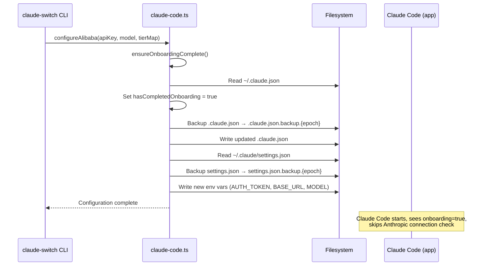

When Claude AI Switcher modifies configuration files on disk, it does so with two safety mechanisms that operate beneath the surface of every provider switch: **timestamped file backups** before each write, and **automatic onboarding completion** to prevent a well-known Claude Code startup error. Together, these patterns ensure that switching providers never results in unrecoverable data loss or a broken Claude Code session.

## The Backup Contract: Copy Before Overwrite

Every configuration write in the codebase follows a three-step contract — *ensure directory exists, copy existing file to a timestamped backup, then write the new content*. This contract is implemented identically across all three client adapter files, differing only in the target file path.

### Claude Code: Two Files, Two Backup Streams

The Claude Code client manages two distinct files: `~/.claude/settings.json` (provider environment variables, MCP server definitions, tier model aliases) and `~/.claude.json` (onboarding state, user preferences). Each file gets its own independent backup stream.

```mermaid
flowchart TD
    A[configure* function called] --> B[ensureOnboardingComplete]
    B --> C{~/.claude.json exists?}
    C -- Yes --> D[Copy to .claude.json.backup.{epoch}]
    C -- No --> E[Skip backup]
    D --> F[Write hasCompletedOnboarding=true]
    E --> F
    F --> G[Read ~/.claude/settings.json]
    G --> H[Apply provider env vars / tier map]
    H --> I{settings.json exists?}
    I -- Yes --> J[Copy to settings.json.backup.{epoch}]
    I -- No --> K[Skip backup]
    J --> L[Write new settings.json]
    K --> L
```

The backup filename is generated using `Date.now()`, which produces an epoch-millisecond integer. This guarantees uniqueness across rapid successive switches and provides a natural chronological ordering when listing backup files on disk. The backup is only created when the target file already exists — first-time configurations write directly without producing an empty or stale backup artifact.

The `writeClaudeSettings` function ensures the `~/.claude` directory exists via `fs.ensureDir` before performing the backup-and-write sequence. The `writeClaudeJson` function does not call `ensureDir` because `~/.claude.json` lives directly in the home directory, which is guaranteed to exist.

Sources: [claude-code.ts](src/clients/claude-code.ts#L97-L126)

### OpenCode: Same Pattern, Different Path

The OpenCode client applies the identical backup contract to `~/.config/opencode/opencode.json`. The `writeOpenCodeSettings` function calls `fs.ensureDir` on the config directory (since `~/.config/opencode/` may not exist on first run), checks for an existing file, creates a timestamped copy if present, then writes the new configuration.

Sources: [opencode.ts](src/clients/opencode.ts#L50-L67)

### Where Backups Are *Not* Created

The local configuration manager (`config.ts`) writes API keys and default preferences to `~/.claude-ai-switcher/config.json`. This write function does **not** implement the backup contract — it calls `ensureDir` and overwrites in place. This is an intentional asymmetry: the local config file stores only the switcher's own state (API keys, default provider/model), not Claude Code's operational settings. A corrupted local config is easily reconstructed through the [Interactive Setup Wizard](3-interactive-setup-wizard-configuring-api-keys), whereas a corrupted `settings.json` could lock a user out of their entire Claude Code environment.

Sources: [config.ts](src/config.ts#L44-L47)

## Backup Pattern Comparison Across Clients

| Aspect | Claude Code settings.json | Claude Code .claude.json | OpenCode opencode.json | Switcher config.json |
|---|---|---|---|---|
| **File path** | `~/.claude/settings.json` | `~/.claude.json` | `~/.config/opencode/opencode.json` | `~/.claude-ai-switcher/config.json` |
| **Backup implemented** | Yes | Yes | Yes | **No** |
| **Backup suffix** | `.backup.{epoch_ms}` | `.backup.{epoch_ms}` | `.backup.{epoch_ms}` | N/A |
| **Directory ensured** | Yes (`~/.claude/`) | No (home dir) | Yes (`~/.config/opencode/`) | Yes (`~/.claude-ai-switcher/`) |
| **Conditional backup** | Only if file exists | Only if file exists | Only if file exists | N/A |
| **Content risk** | High — provider env vars, MCP servers | Medium — onboarding state | High — full provider schema | Low — API keys only |

## Onboarding Auto-Set: Bypassing the Connection Check

### The Problem It Solves

When Claude Code starts, it checks `~/.claude.json` for the `hasCompletedOnboarding` flag. If this flag is absent or `false`, Claude Code attempts to connect to Anthropic's servers to run its onboarding flow. For users who have switched to a third-party provider (Alibaba, OpenRouter, Ollama, Gemini, GLM), the `ANTHROPIC_BASE_URL` environment variable no longer points to Anthropic — it points to a proxy or alternative endpoint. This mismatch triggers the error: *"Unable to connect to Anthropic services."*

### The Solution: Silent Onboarding Completion

The `ensureOnboardingComplete` function is called as the **first operation** in every `configure*` function within the Claude Code client. It reads the current `~/.claude.json`, unconditionally sets `hasCompletedOnboarding` to `true`, and writes the file back (triggering a backup in the process). This is idempotent — if the flag is already `true`, the write still occurs but produces an identical file.



Sources: [claude-code.ts](src/clients/claude-code.ts#L128-L136)

### Onboarding Coverage by Provider

Every provider switch function in the Claude Code client calls `ensureOnboardingComplete` as its opening statement. The OpenCode client does **not** implement onboarding auto-set, because OpenCode does not perform the same startup connection check that Claude Code does.

| Provider Function | Calls `ensureOnboardingComplete` | File |
|---|---|---|
| `configureAnthropic` | Yes — line 160 | [claude-code.ts](src/clients/claude-code.ts#L159-L178) |
| `configureAlibaba` | Yes — line 142 | [claude-code.ts](src/clients/claude-code.ts#L141-L153) |
| `configureGLM` | Yes — line 185 | [claude-code.ts](src/clients/claude-code.ts#L184-L198) |
| `configureOpenRouter` | Yes — line 205 | [claude-code.ts](src/clients/claude-code.ts#L204-L216) |
| `configureOllama` | Yes — line 222 | [claude-code.ts](src/clients/claude-code.ts#L221-L233) |
| `configureGemini` | Yes — line 239 | [claude-code.ts](src/clients/claude-code.ts#L238-L250) |
| All OpenCode `configure*` | **No** | [opencode.ts](src/clients/opencode.ts) |

## Practical Implications and Recovery

### What Ends Up on Disk

After three consecutive provider switches (e.g., Anthropic → Alibaba → GLM), the `~/.claude/` directory will accumulate the following artifacts:

```
~/.claude/
├── settings.json                          ← current active config
├── settings.json.backup.1718550123456     ← snapshot before Alibaba switch
├── settings.json.backup.1718550189999     ← snapshot before GLM switch
└── ...
~/.claude.json                             ← current onboarding state
~/.claude.json.backup.1718550123456
~/.claude.json.backup.1718550189999
```

There is **no automatic cleanup** mechanism. Backup files persist indefinitely, which provides an audit trail but requires manual disk management over time. The epoch-millisecond timestamps make it straightforward to identify the most recent backup or sort chronologically.

### Manual Recovery Procedure

If a provider switch produces unexpected behavior, recovery is a simple file copy:

1. Identify the most recent backup by timestamp in the filename
2. Copy the backup back over the active file:

```bash
# Restore Claude Code settings
cp ~/.claude/settings.json.backup.1718550123456 ~/.claude/settings.json

# Restore Claude Code onboarding state
cp ~/.claude.json.backup.1718550123456 ~/.claude.json

# Restore OpenCode settings (if applicable)
cp ~/.config/opencode/opencode.json.backup.1718550123456 ~/.config/opencode/opencode.json
```

Because backups are captured **atomically** (copy-then-write, not in-place modification), the backup file always represents a consistent, complete configuration state — never a partially written file.

## Design Rationale: Why These Two Mechanisms Work Together

The backup strategy and onboarding auto-set form a complementary safety pair. Backups protect against the **user's mistake** — switching to a provider that doesn't work and wanting to revert. Onboarding auto-set protects against a **systemic failure** — Claude Code refusing to start at all because it cannot reach Anthropic's servers. Without the onboarding bypass, switching to any non-Anthropic provider would render Claude Code unlaunchable on next start, and the user would need to manually edit `~/.claude.json` to recover — defeating the purpose of a CLI switcher.

The absence of backups for the local `config.json` (`~/.claude-ai-switcher/config.json`) reflects a deliberate risk-tiered approach. Only files whose corruption could break a downstream application receive backup protection. The switcher's own state file is treated as expendable because it contains only keyed preferences that can be re-entered through the CLI.

Sources: [claude-code.ts](src/clients/claude-code.ts#L97-L136), [config.ts](src/config.ts#L44-L47), [opencode.ts](src/clients/opencode.ts#L50-L67)

## Related Pages

- [API Key Storage and Local Configuration Management](16-api-key-storage-and-local-configuration-management) — covers the non-backed-up `config.json` in detail
- [Provider Switching Flow: From Command to Settings Write](6-provider-switching-flow-from-command-to-settings-write) — the end-to-end flow where these safety mechanisms fire
- [Configuration File Map: Where Everything Lives on Disk](7-configuration-file-map-where-everything-lives-on-disk) — full inventory of all files managed by the switcher
- [Claude Code Client: Writing Environment Variables and MCP Servers](20-claude-code-client-writing-environment-variables-and-mcp-servers) — how `writeClaudeSettings` is consumed by provider-specific configure functions