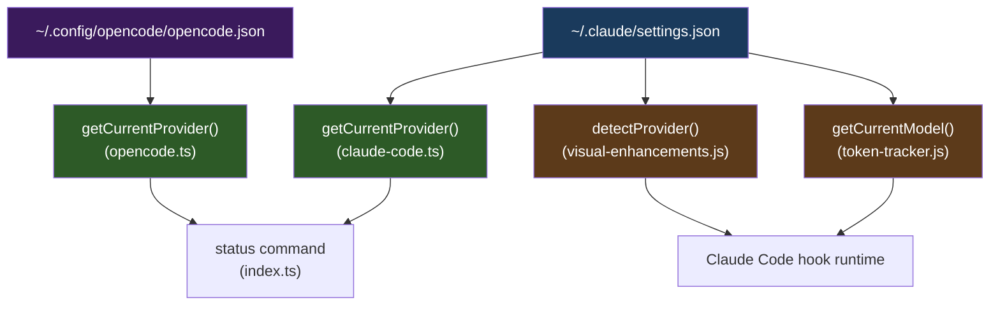
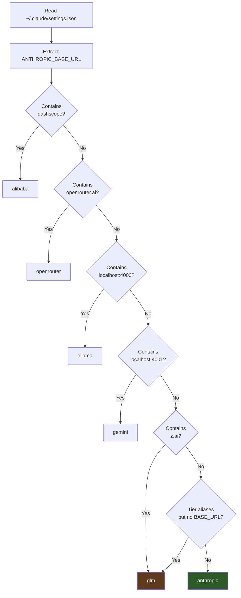
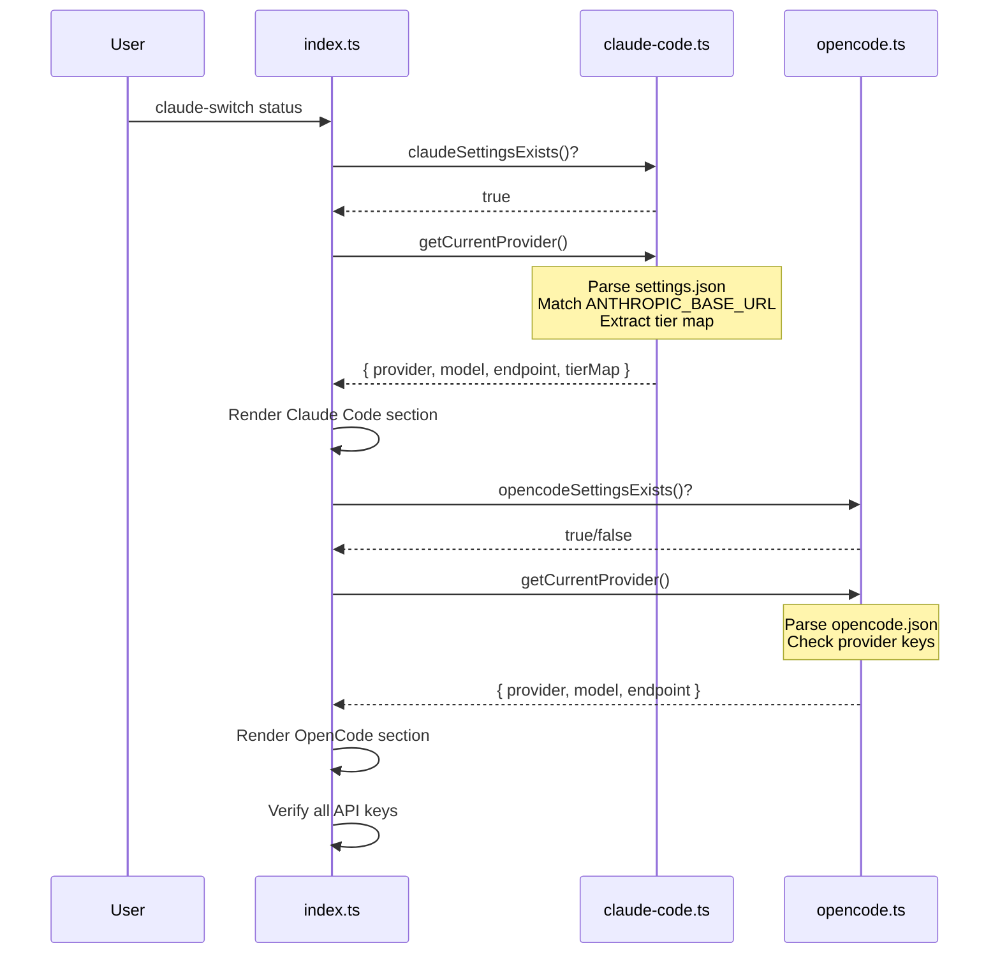

Claude AI Switcher doesn't persist a "current provider" field anywhere. Instead, it **reverse-engineers** the active provider by inspecting the configuration files it writes — `~/.claude/settings.json` for Claude Code, `~/.config/opencode/opencode.json` for OpenCode, and the same settings file at runtime for hooks. This page explains the three parallel detection implementations, their matching strategies, and the subtle ordering constraints that make detection deterministic.

## The Core Problem: Stateless Inference

When a user runs `claude-switch status`, the CLI needs to answer a simple question: *which provider is currently active?* Yet the switcher never writes a metadata field like `"activeProvider": "alibaba"` into any configuration file. The reason is architectural — Claude Code reads `settings.json` as its source of truth, and injecting unknown keys could cause validation errors or be silently dropped. The switcher therefore infers the provider from **observable side-effects** of its own writes: the `ANTHROPIC_BASE_URL` env var value, the presence of specific MCP server entries, and the tier map alias keys.

This creates three independent detection sites that must stay in sync:



Each detection site reads the same configuration files but uses a different matching strategy. The Claude Code client uses substring matching on `ANTHROPIC_BASE_URL`. The OpenCode client checks for the presence of named provider keys. The hooks replicate the substring approach in synchronous JavaScript because they execute inside Claude Code's Node process without async I/O support.

Sources: [claude-code.ts](src/clients/claude-code.ts#L255-L340), [visual-enhancements.js](src/hooks/visual-enhancements.js#L100-L134), [opencode.ts](src/clients/opencode.ts#L566-L618)

## Claude Code Detection: Substring Matching on Base URL

The `getCurrentProvider()` function in `claude-code.ts` is the authoritative detection for Claude Code. It reads `~/.claude/settings.json`, extracts the `env` block, and performs a cascading series of substring checks against `ANTHROPIC_BASE_URL`. **Match order is critical** — each check short-circuits, so the first matching pattern wins.

### Detection Cascade

| Priority | Provider | Match Condition | Match Signal |
|----------|----------|----------------|--------------|
| 1 | Alibaba | `ANTHROPIC_BASE_URL` contains `coding-intl.dashscope.aliyuncs.com` | Cloud endpoint URL |
| 2 | OpenRouter | `ANTHROPIC_BASE_URL` contains `openrouter.ai` | Cloud endpoint URL |
| 3 | Ollama | `ANTHROPIC_BASE_URL` contains `localhost:4000` | LiteLLM proxy port |
| 4 | Gemini | `ANTHROPIC_BASE_URL` contains `localhost:4001` | LiteLLM proxy port |
| 5 | GLM (MCP) | `mcpServers["glm-coding-plan"]` exists | MCP server entry |
| 6 | GLM (z.ai) | `ANTHROPIC_BASE_URL` contains `.z.ai` | coding-helper auth endpoint |
| 7 | GLM (tier-only) | No `ANTHROPIC_BASE_URL` but tier map aliases exist | Env var footprint |
| 8 | Anthropic | None of the above match | Default fallback |

The cascade reflects a deliberate priority design: cloud-hosted providers with distinctive URLs are checked first because their URLs are unambiguous. The two LiteLLM proxy providers (Ollama on port 4000, Gemini on port 4001) are distinguished purely by port number. GLM detection is the most nuanced — it has three independent fallback paths because GLM's `coding-helper` tool manages the endpoint URL dynamically, and the switcher may have only written tier map aliases without a base URL.

Sources: [claude-code.ts](src/clients/claude-code.ts#L273-L339)

### The GLM Triple-Fallback

GLM/Z.AI detection deserves special attention because it employs **three distinct heuristics** in sequence. The first checks for an MCP server entry named `glm-coding-plan` — this is the path used when the switcher itself manages GLM configuration. The second checks for `.z.ai` in the base URL, which is what the `coding-helper auth` command writes after authentication. The third is the most indirect: if `ANTHROPIC_BASE_URL` is absent but tier map aliases (`ANTHROPIC_DEFAULT_OPUS_MODEL`, etc.) are present, the switcher infers GLM because **no other provider writes tier aliases without also writing a base URL**.

This third fallback works because of a structural invariant in the switcher's own write logic. Alibaba, OpenRouter, Ollama, and Gemini all set `ANTHROPIC_BASE_URL` as part of their configuration. GLM's `configureGLM()` function deliberately clears the base URL (deleting `ANTHROPIC_AUTH_TOKEN`, `ANTHROPIC_BASE_URL`, and `ANTHROPIC_MODEL`) while still applying the tier map. The presence of tier aliases without a base URL is therefore a unique fingerprint for GLM.

Sources: [claude-code.ts](src/clients/claude-code.ts#L313-L337), [claude-code.ts](src/clients/claude-code.ts#L184-L198)

### Return Shape and Tier Map Extraction

Before the cascade begins, the function extracts the tier map from the settings environment in a single pass:

```typescript
const tierMap = settings.env ? {
  opus: settings.env[TIER_ENV_KEYS.opus],
  sonnet: settings.env[TIER_ENV_KEYS.sonnet],
  haiku: settings.env[TIER_ENV_KEYS.haiku]
} : undefined;
```

The `TIER_ENV_KEYS` constant maps tier names to their Claude Code env var names — `ANTHROPIC_DEFAULT_OPUS_MODEL`, `ANTHROPIC_DEFAULT_SONNET_MODEL`, and `ANTHROPIC_DEFAULT_HAIKU_MODEL`. Every provider match in the cascade attaches this tier map to the return object, so the caller gets a complete picture of both the provider identity and the active model aliases in a single call.

Sources: [claude-code.ts](src/clients/claude-code.ts#L267-L271), [claude-code.ts](src/clients/claude-code.ts#L35-L39)

## OpenCode Detection: Provider Key Presence

The OpenCode client uses a fundamentally different detection strategy. OpenCode's configuration format stores providers as named keys under a top-level `provider` object — for example, `settings.provider["bailian-coding-plan"]` for Alibaba or `settings.provider["openrouter"]` for OpenRouter. Detection is therefore a series of **key existence checks** rather than substring matching.

| Priority | Provider | Key Checked | Endpoint Source |
|----------|----------|-------------|-----------------|
| 1 | Alibaba | `provider["bailian-coding-plan"]` | `options.baseURL` from settings |
| 2 | OpenRouter | `provider["openrouter"]` | Hardcoded `openrouter.ai/api/v1` |
| 3 | Ollama | `provider["ollama"]` | Hardcoded `localhost:4000/v1` |
| 4 | Gemini | `provider["gemini"]` | Hardcoded `localhost:4001/v1` |
| 5 | GLM | `provider["glm"]` | `options.baseURL` from settings |
| 6 | Anthropic | None match | Default fallback |

Note that OpenCode detection returns **no tier map** — OpenCode doesn't use the tier alias system. The return shape is simpler: `{ provider, model?, endpoint? }`. Only Alibaba and GLM endpoints are read dynamically from the settings; the others are hardcoded because they never change.

Sources: [opencode.ts](src/clients/opencode.ts#L566-L618)

## Hook-Based Detection: Synchronous Mirrors

Both the visual enhancements hook and the token tracker hook need to identify the current provider or model **at runtime inside Claude Code's process**. Since these hooks are plain JavaScript files installed to `~/.claude/`, they can't import the compiled TypeScript modules. Each hook therefore reimplements detection independently.

### Visual Enhancements: `detectProvider()`

The `detectProvider()` function in `visual-enhancements.js` mirrors the Claude Code client's substring cascade almost exactly, with one structural simplification: it omits the MCP server check for GLM. The hook operates on the assumption that if `coding-helper` is managing GLM, it has already written a `.z.ai` base URL or tier aliases — the MCP server entry alone isn't sufficient for the hook's lightweight synchronous detection.



The function wraps the entire detection in a try/catch, defaulting to `'anthropic'` on any error. This defensive posture is essential — a corrupted settings file must never crash Claude Code's startup.

Sources: [visual-enhancements.js](src/hooks/visual-enhancements.js#L100-L134)

### Token Tracker: Model Detection

The token tracker hook focuses on **model identity** rather than provider identity. Its `getCurrentModel()` function checks `ANTHROPIC_MODEL` first, then falls back to the opus tier alias (`ANTHROPIC_DEFAULT_OPUS_MODEL`). If neither is present, it defaults to `'claude-opus-4-6-20250205'`. The model ID is then used to look up the context window from a hardcoded table, which drives the context usage bar.

This two-step fallback mirrors a structural difference between provider configurations: Alibaba, OpenRouter, Ollama, and Gemini all set `ANTHROPIC_MODEL` directly. GLM does not — it relies solely on tier aliases. The opus alias fallback therefore serves the same purpose as the tier-only GLM detection in the main client.

Sources: [token-tracker.js](src/hooks/token-tracker.js#L63-L85)

## Detection in Practice: The `status` Command

The `status` command in `index.ts` is the primary consumer of both detection implementations. It calls `getClaudeProvider()` and `getOpenCodeProvider()` sequentially, displaying the results in separate sections. For Claude Code, it renders the provider name, model, endpoint, and tier map aliases. For OpenCode, it shows provider name, model, and endpoint.



The detection functions are also called implicitly by the hooks during every Claude Code session, making provider detection a continuously active process rather than an on-demand query.

Sources: [index.ts](src/index.ts#L792-L836)

## Design Tradeoffs and Limitations

The stateless inference approach carries inherent tradeoffs that shape its implementation:

| Aspect | Benefit | Risk |
|--------|--------|------|
| **No metadata field** | Settings stay compatible with Claude Code's own validation; no risk of rejected unknown keys | Provider identity must always be reconstructed from indirect signals |
| **Substring matching** | Resilient to URL path changes; a provider that moves endpoints still matches by domain | Ambiguous substrings could misidentify providers if a new service uses a similar domain |
| **Order-dependent cascade** | Deterministic output — the same settings always yield the same provider | A single misordered check could mask a later match; order changes require careful analysis |
| **Triple GLM fallback** | Handles GLM's dynamic configuration where `coding-helper` rewrites settings | Most complex detection path; three code paths must stay consistent |
| **Hook reimplementation** | Hooks are self-contained, zero-dependency JavaScript files | Detection logic is duplicated across TypeScript and JavaScript; any change requires updating all copies |

The most significant practical implication is the **duplication across three codebases**. When a new provider is added, the `getCurrentProvider()` function in `claude-code.ts`, the `detectProvider()` function in `visual-enhancements.js`, and the `PROVIDER_INFO` dictionary must all be updated. The token tracker's model table must also receive the new provider's model IDs and context windows. For a step-by-step guide to this process, see [Adding a New Provider: Step-by-Step Implementation Guide](27-adding-a-new-provider-step-by-step-implementation-guide).

## Related Pages

- [Claude Code Client: Writing Environment Variables and MCP Servers](20-claude-code-client-writing-environment-variables-and-mcp-servers) — How the settings that detection reads are written
- [Configuration File Map: Where Everything Lives on Disk](7-configuration-file-map-where-everything-lives-on-disk) — The filesystem layout of all settings files
- [Visual Enhancements Hook: Model Cards and Provider Display](23-visual-enhancements-hook-model-cards-and-provider-display) — How the hook uses detection at runtime
- [Provider Switching Flow: From Command to Settings Write](6-provider-switching-flow-from-command-to-settings-write) — The complete flow that creates the detectable signals