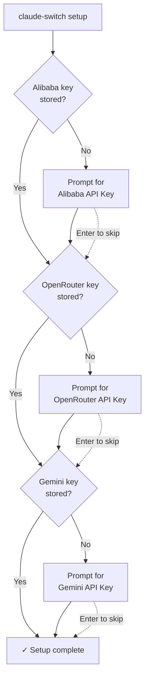
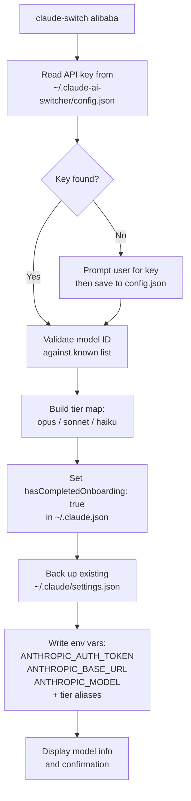

This guide takes you from a fresh clone of the repository to a working provider switch in under five minutes. You will install the CLI globally, run the interactive setup wizard to store your API keys, switch Claude Code to a non-Anthropic provider, verify the switch took effect, and then switch back to the default Anthropic provider. Each step includes the exact commands to run, the files that change on disk, and common pitfalls to avoid.

## Prerequisites

Before installing, confirm your environment meets the following baseline requirements. The tool is cross-platform but has a hard Node.js floor because it relies on native `fetch` (introduced in Node 18).

| Requirement | Minimum Version | Verification Command |
|---|---|---|
| **Node.js** | 18.0.0 or later | `node --version` |
| **npm** | Ships with Node 18+ | `npm --version` |
| **Claude Code** | Any recent version | Check that `~/.claude/` exists |
| **Terminal** | Git Bash, WSL, or PowerShell (Windows) | — |

The `engines` field in `package.json` enforces the Node.js floor: `"node": ">=18.0.0"`. Git itself is assumed since you will clone or pull the repository before building.

Sources: [package.json](package.json#L54-L56)

### Optional Provider-Specific Dependencies

Each provider you switch to has its own prerequisites beyond the core installation. You only need the dependencies for providers you actually plan to use.

| Provider | Extra Dependency | Install Command |
|---|---|---|
| **Alibaba** | API key from Alibaba Cloud | — (key obtained at modelstudio console) |
| **OpenRouter** | API key from OpenRouter | — (key obtained at openrouter.ai) |
| **Gemini** | API key + [LiteLLM](https://github.com/BerriAI/litellm) | `pip install 'litellm[proxy]'` |
| **Ollama** | [Ollama](https://ollama.com) + LiteLLM | Install both, then `ollama serve` |
| **GLM/Z.AI** | `@z_ai/coding-helper` | `npm install -g @z_ai/coding-helper` |

Sources: [README.md](README.md#L31-L46), [CLAUDE.md](CLAUDE.md#L214-L220)

## Step 1: Install the CLI Globally

The installation is a three-command sequence: install dependencies from the lockfile, compile TypeScript to JavaScript, and register the `claude-switch` command globally on your PATH.

```bash
cd claude-ai-switcher
npm ci
npm run build
npm link
```

Here is what each command accomplishes under the hood:

| Command | Purpose | Key Detail |
|---|---|---|
| `npm ci` | Install dependencies from `package-lock.json` | Reproducible — never modifies the lockfile |
| `npm run build` | Compile TypeScript → `dist/` and copy hook scripts | Runs `tsc` then `node scripts/copy-hooks.js` |
| `npm link` | Register `claude-switch` globally on your PATH | Creates a symlink to `./dist/index.js` |

The build step compiles every `.ts` file under `src/` into `dist/` using the TypeScript compiler configured in `tsconfig.json`, targeting ES2020 with CommonJS modules. The `copy-hooks.js` script then copies JavaScript hook files (token tracker, visual enhancements) from `src/hooks/` to `dist/hooks/` so they survive in the distributed package.

Sources: [package.json](package.json#L19-L25), [package.json](package.json#L6-L8), [tsconfig.json](tsconfig.json#L1-L19), [scripts/copy-hooks.js](scripts/copy-hooks.js#L1-L16)

> **Why `npm ci` instead of `npm install`?** The `ci` command installs *exactly* what the lockfile specifies — no drift, no surprise upgrades. Use `npm install <package>` only when you are intentionally adding or upgrading a dependency. This prevents lockfile conflicts on every pull.

### Verifying the Installation

After `npm link` completes, verify the CLI is on your PATH:

```bash
claude-switch --version
```

The version number is read dynamically from `package.json` at runtime — it pulls the `version` field by resolving the file path relative to the compiled entry point, so the displayed version always matches the installed package.

Sources: [src/index.ts](src/index.ts#L85-L94)

## Step 2: Run the Setup Wizard

The `setup` command launches an interactive wizard that prompts you for API keys for each cloud provider. Keys you skip (or have already stored) are silently passed over. This step is optional but strongly recommended for first-time users because it front-loads key entry so that subsequent `switch` commands run without interruption.

```bash
claude-switch setup
```

The wizard walks through three providers sequentially:



Each key you enter is persisted to `~/.claude-ai-switcher/config.json` — a local JSON file that the tool creates on first write. The file maps provider names to their stored keys, and no keys ever leave your machine.

| Provider | API Key Source URL | Config Field |
|---|---|---|
| Alibaba | `https://modelstudio.console.alibabacloud.com/` | `alibabaApiKey` |
| OpenRouter | `https://openrouter.ai/settings/keys` | `openrouterApiKey` |
| Gemini | `https://aistudio.google.com/apikey` | `geminiApiKey` |

> **Security note:** API keys are stored in plaintext at `~/.claude-ai-switcher/config.json`. The file is never transmitted anywhere. Treat it with the same care as an SSH private key — add it to your backup strategy but never commit it to version control.

Sources: [src/index.ts](src/index.ts#L1022-L1111), [src/config.ts](src/config.ts#L1-L47), [src/config.ts](src/config.ts#L70-L86)

## Step 3: Switch to Your First Provider

This is the core action. Running `claude-switch <provider>` writes environment variables into `~/.claude/settings.json` that redirect Claude Code's API calls to your chosen provider's endpoint. Let's walk through a concrete example using Alibaba's Coding Plan.

### Example: Switch to Alibaba

```bash
claude-switch alibaba
```

If you did not run the setup wizard, the CLI will pause and prompt you for your Alibaba API key on the spot. Once a key is available — either from the wizard or from the inline prompt — the switch proceeds automatically.

Here is the internal flow from command invocation to settings file write:



The key transformation happens in the `configureAlibaba` function inside the Claude Code client adapter. It reads your existing `settings.json`, injects three routing variables and three tier-alias variables, and writes the merged result back:

| Environment Variable | Value Set | Purpose |
|---|---|---|
| `ANTHROPIC_AUTH_TOKEN` | Your Alibaba API key | Authentication with the Alibaba endpoint |
| `ANTHROPIC_BASE_URL` | `https://coding-intl.dashscope.aliyuncs.com/apps/anthropic` | Redirects Claude Code's API calls |
| `ANTHROPIC_MODEL` | `qwen3.7-plus` (default) | The primary model Claude Code requests |
| `ANTHROPIC_DEFAULT_OPUS_MODEL` | Tier alias (e.g. `qwen3.7-plus`) | Model used when Claude Code selects "Opus" |
| `ANTHROPIC_DEFAULT_SONNET_MODEL` | Tier alias (e.g. `qwen3.6-plus`) | Model used when Claude Code selects "Sonnet" |
| `ANTHROPIC_DEFAULT_HAIKU_MODEL` | Tier alias (e.g. `kimi-k2.5`) | Model used when Claude Code selects "Haiku" |

Before any write occurs, the existing `settings.json` is backed up with a timestamp suffix (e.g. `settings.json.backup.1713984000000`), ensuring every modification is reversible. The function also sets `hasCompletedOnboarding: true` in `~/.claude.json` to prevent the "Unable to connect to Anthropic services" error that Claude Code throws during first-time setup.

Sources: [src/index.ts](src/index.ts#L158-L195), [src/clients/claude-code.ts](src/clients/claude-code.ts#L100-L153), [src/clients/claude-code.ts](src/clients/claude-code.ts#L128-L136), [src/models.ts](src/models.ts#L54-L70)

### Specifying a Custom Model

You can override the default model by passing it as a positional argument. The CLI validates the model ID against a known list before proceeding — an invalid ID exits with an error and displays valid options.

```bash
# Before: default model
claude-switch alibaba
# → Uses qwen3.7-plus

# After: specific model
claude-switch alibaba qwen3.6-plus
# → Uses qwen3.6-plus
```

When you specify a non-default model, the tier map shifts automatically: the selected model becomes the Opus alias, `qwen3.7-plus` takes the Sonnet slot, and `qwen3.6-plus` fills Haiku. This logic is encapsulated in the `getAlibabaTierMap()` function, which branches on whether the provided model matches the default.

Sources: [src/models.ts](src/models.ts#L54-L70)

### All Supported Providers at a Glance

| Command | Provider | Default Model | Endpoint | Extra Requirement |
|---|---|---|---|---|
| `claude-switch alibaba [model]` | Alibaba Coding Plan | `qwen3.7-plus` | Alibaba DashScope | API key |
| `claude-switch openrouter [model]` | OpenRouter | `qwen/qwen3.6-plus:free` | `openrouter.ai/api/v1` | API key |
| `claude-switch glm` | GLM/Z.AI | GLM tier map | Via `coding-helper` | `@z_ai/coding-helper` |
| `claude-switch ollama [model]` | Ollama (local) | `deepseek-r1:latest` | `localhost:4000` (proxy) | Ollama + LiteLLM |
| `claude-switch gemini [model]` | Gemini (Google) | `gemini-2.5-pro` | `localhost:4001` (proxy) | API key + LiteLLM |
| `claude-switch anthropic` | Anthropic (default) | Native Claude | `api.anthropic.com` | None |

Sources: [src/index.ts](src/index.ts#L158-L378), [src/clients/claude-code.ts](src/clients/claude-code.ts#L141-L250), [src/models.ts](src/models.ts#L24-L49)

## Step 4: Verify the Switch

After switching, confirm that Claude Code is now pointing at your new provider. Two commands provide this visibility:

```bash
# Quick check — shows provider, model, and endpoint for both clients
claude-switch current

# Full check — adds API key verification with live HTTP health checks
claude-switch status
```

The `status` command goes beyond reading configuration files. For each provider that has a stored key, it makes a lightweight GET request to the provider's models endpoint with a 5-second timeout. The result is displayed as a color-coded table:

| Status Icon | Meaning | Description |
|---|---|---|
| ✓ (green) | `ok` | Key is valid — API responded with HTTP 200 |
| ✗ (red) | `invalid` | Key rejected — API returned 401 or 403 |
| ○ (dim) | `missing` | No key configured for this provider |
| ⚠ (yellow) | `error` | Network error or unexpected HTTP status |

Keys are masked in the output using the format `firs...last` (first four + last four characters) so you can confirm *which* key is stored without exposing it.

Sources: [src/index.ts](src/index.ts#L790-L908), [src/verify.ts](src/verify.ts#L1-L57), [src/verify.ts](src/verify.ts#L15-L20)

## Step 5: Switch Back to Anthropic

When you want to return to native Claude models, a single command clears all provider-specific environment variables and tier aliases:

```bash
claude-switch anthropic
```

This performs three cleanup operations on `~/.claude/settings.json`:

1. **Removes routing variables** — `ANTHROPIC_AUTH_TOKEN`, `ANTHROPIC_BASE_URL`, and `ANTHROPIC_MODEL` are deleted, so Claude Code falls back to its native Anthropic endpoint
2. **Clears tier aliases** — `ANTHROPIC_DEFAULT_OPUS_MODEL`, `ANTHROPIC_DEFAULT_SONNET_MODEL`, and `ANTHROPIC_DEFAULT_HAIKU_MODEL` are removed, restoring native Claude model selection per tier
3. **Cleans MCP server overrides** — Removes `alibaba-coding-plan` and `glm-coding-plan` MCP server entries if present

| Variable | Before (Alibaba active) | After (Anthropic restored) |
|---|---|---|
| `ANTHROPIC_AUTH_TOKEN` | `sk-xxxxx` | *(deleted)* |
| `ANTHROPIC_BASE_URL` | `https://coding-intl...` | *(deleted)* |
| `ANTHROPIC_MODEL` | `qwen3.7-plus` | *(deleted)* |
| `ANTHROPIC_DEFAULT_OPUS_MODEL` | `qwen3.7-plus` | *(deleted)* |
| `ANTHROPIC_DEFAULT_SONNET_MODEL` | `qwen3.6-plus` | *(deleted)* |
| `ANTHROPIC_DEFAULT_HAIKU_MODEL` | `kimi-k2.5` | *(deleted)* |

As with every switch, a timestamped backup of the previous `settings.json` is created before any modification.

Sources: [src/clients/claude-code.ts](src/clients/claude-code.ts#L155-L178), [src/clients/claude-code.ts](src/clients/claude-code.ts#L100-L112)

## Troubleshooting

| Problem | Likely Cause | Solution |
|---|---|---|
| `command not found: claude-switch` | `npm link` failed or PATH not refreshed | Re-run `npm link` in the project directory; open a new terminal |
| `LiteLLM is required for Ollama support` | LiteLLM not installed | Run `pip install 'litellm[proxy]'` |
| `Ollama is not running` | Ollama daemon not started | Run `ollama serve` in a separate terminal |
| `coding-helper not found` | GLM helper not installed | Run `npm install -g @z_ai/coding-helper` then `coding-helper auth` |
| "Unable to connect to Anthropic services" | Claude Code onboarding flag unset | Any switch command auto-sets `hasCompletedOnboarding: true` |
| `Invalid model: <name>` | Model ID not in the known list | Run `claude-switch models <provider>` to see valid IDs |
| Settings not taking effect | Claude Code was open during switch | Restart Claude Code after switching |

Sources: [src/index.ts](src/index.ts#L264-L307), [src/index.ts](src/index.ts#L197-L205), [src/clients/claude-code.ts](src/clients/claude-code.ts#L128-L136)

## What's Next

You now have the CLI installed, API keys configured, and hands-on experience switching providers. Here is the logical reading progression to deepen your understanding:

- **[Interactive Setup Wizard: Configuring API Keys](3-interactive-setup-wizard-configuring-api-keys)** — Explore the setup wizard in depth, including inline key prompts and the `key` management command
- **[Command Reference: Complete CLI Cheatsheet](4-command-reference-complete-cli-cheatsheet)** — Every command, flag, and option in one reference table
- **[System Architecture and Module Responsibilities](5-system-architecture-and-module-responsibilities)** — Understand how providers, clients, and models modules interact
- **[Model Tier Aliases: Opus, Sonnet, and Haiku Mapping](13-model-tier-aliases-opus-sonnet-and-haiku-mapping)** — Master the tier system and `--opus`/`--sonnet`/`--haiku` overrides
- **[Configuration File Map: Where Everything Lives on Disk](7-configuration-file-map-where-everything-lives-on-disk)** — Full inventory of every file the tool reads and writes