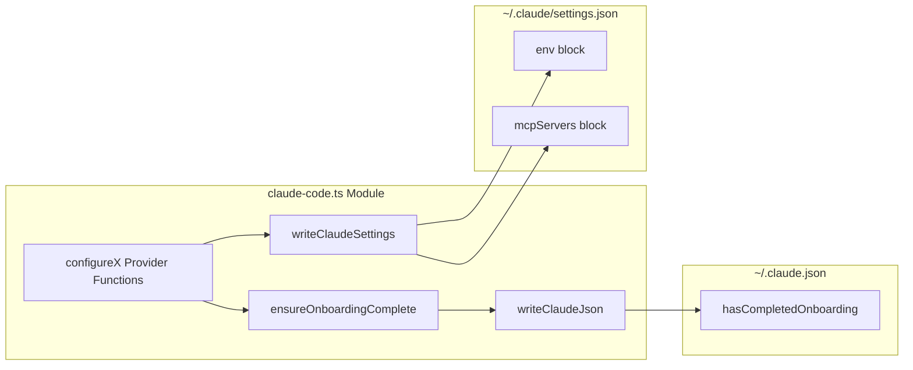
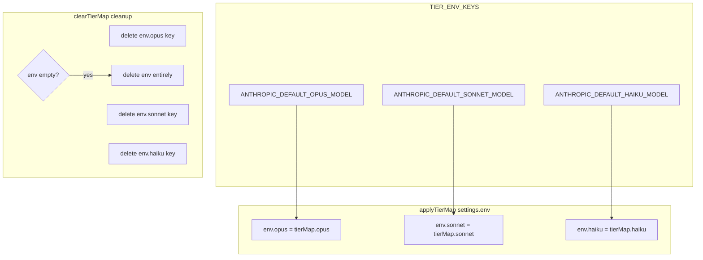

The Claude Code client adapter is the write-side bridge between `claude-switch` commands and Claude Code's own configuration files. Every provider switch funnels through this module, which translates high-level intent — "use Alibaba," "use GLM," "reset to Anthropic" — into precise mutations of two JSON files on disk: `~/.claude/settings.json` (environment variables, MCP server definitions, and tier aliases) and `~/.claude.json` (onboarding state). Understanding this adapter is essential for anyone extending the provider system or debugging configuration drift.

## Dual-File Architecture

The module operates on two distinct files with separate concerns. `settings.json` lives inside the `~/.claude` directory and holds all runtime environment overrides and MCP server registrations. `~/.claude.json` sits at the home directory root and manages Claude Code's onboarding flag. Both paths are resolved once at module load time using `os.homedir()`.

Every `configure*` function follows the same three-step protocol: call `ensureOnboardingComplete()` first, read the current settings, mutate the `env` and/or `mcpServers` blocks, then write back through `writeClaudeSettings()`. This sequencing guarantees that the onboarding flag is never stale after a provider switch.

Sources: [claude-code.ts](src/clients/claude-code.ts#L31-L33), [claude-code.ts](src/clients/claude-code.ts#L100-L136)

## Type Definitions and the Settings Schema

The module exports three interfaces that define the contract between the adapter and Claude Code's configuration format.

**`ClaudeSettings`** is intentionally permissive — it declares `mcpServers` as an optional record and allows arbitrary additional keys via an index signature. This design accommodates Claude Code's evolving schema without requiring adapter updates for unrelated settings keys.

**`ClaudeJson`** mirrors this pattern with `hasCompletedOnboarding` as its single declared field, again allowing arbitrary extensions.

**`MCPService`** defines the shape of individual MCP server entries. It supports two transport modes: stdio-based (using `command`, `args`, and `env`) and HTTP-based (using `url` and `headers`). This dual-mode interface is what allows the adapter to represent both local process servers and remote endpoint servers in the same `mcpServers` map.

Sources: [claude-code.ts](src/clients/claude-code.ts#L12-L29)

## The Three Provider Environment Variables

All non-Anthropic, non-GLM providers write the same trio of environment variables into `settings.env`. The adapter treats these as the canonical routing mechanism for Claude Code.

| Environment Variable | Purpose | Who Sets It |
|---|---|---|
| `ANTHROPIC_AUTH_TOKEN` | Bearer token for the upstream API | Alibaba, OpenRouter, Ollama (placeholder), Gemini |
| `ANTHROPIC_BASE_URL` | Anthropic-compatible API endpoint | Alibaba, OpenRouter, Ollama (`localhost:4000`), Gemini (`localhost:4001`) |
| `ANTHROPIC_MODEL` | Default model identifier sent in requests | Alibaba, OpenRouter, Ollama, Gemini |

Ollama is a notable case — it sets `ANTHROPIC_AUTH_TOKEN` to the literal string `"ollama"` because the LiteLLM proxy running on port 4000 does not validate the token. The real model routing happens through the proxy layer.

GLM is the exception to this pattern. `configureGLM()` **deletes** all three variables rather than setting them, clearing any residual Alibaba or OpenRouter routing before applying only the tier map. The actual GLM authentication and base URL are managed externally by the `coding-helper` MCP server, which writes its own values into the settings file independently. This separation is why GLM detection has multiple fallback strategies in `getCurrentProvider()`.

Sources: [claude-code.ts](src/clients/claude-code.ts#L141-L250), [glm.ts](src/providers/glm.ts#L46-L60)

## Model Tier Map: Opus, Sonnet, Haiku Aliasing

Claude Code supports three internal model tiers — opus, sonnet, and haiku — each mapping to a specific model identifier. The adapter manages these through three dedicated environment variable keys, collected in the `TIER_ENV_KEYS` constant.

Two helper functions manage the tier map lifecycle. `applyTierMap()` unconditionally writes all three keys, initializing `settings.env` if it doesn't exist. `clearTierMap()` performs a careful cleanup: it deletes the three tier keys and, if the resulting `env` object is now empty, removes the `env` key entirely to avoid leaving a dangling empty object in the settings file. This defensive cleanup is critical when switching back to Anthropic, where no tier overrides should persist.

The tier map values themselves originate from provider-specific defaults defined in `models.ts`, optionally overridden per-invocation by `--opus`, `--sonnet`, or `--haiku` CLI flags that flow through `buildTierMap()`.

Sources: [claude-code.ts](src/clients/claude-code.ts#L35-L57), [index.ts](src/index.ts#L120-L129), [models.ts](src/models.ts#L16-L49)

## MCP Server Lifecycle

The `mcpServers` key in `settings.json` holds named server registrations that Claude Code launches as tool-providing subprocesses or connects to via HTTP. The adapter's interaction with MCP servers is narrowly scoped — it only removes them, never adds them directly.

The `configureAnthropic()` function is the sole cleanup point. When switching to native Anthropic, it deletes both `alibaba-coding-plan` and `glm-coding-plan` entries from `mcpServers`. This ensures that switching back to the default provider removes any third-party MCP integrations that were registered during provider switches.

GLM's coding-helper integration follows a different path. The `configureGLM()` function in the adapter only handles tier maps and env cleanup — it does **not** write the MCP server entry itself. Instead, the GLM MCP server registration is handled by the external `coding-helper auth reload claude` command, which is invoked separately in `switchGLM()` after the adapter finishes. This two-phase approach means the adapter's settings write and coding-helper's MCP registration are decoupled operations.

Sources: [claude-code.ts](src/clients/claude-code.ts#L159-L178), [claude-code.ts](src/clients/claude-code.ts#L184-L198), [index.ts](src/index.ts#L197-L223)

## Provider Detection from Settings

The `getCurrentProvider()` function performs reverse inference — reading back from the settings file to determine which provider is currently active. This is the read-side counterpart to the configure functions and is critical for the `claude-switch current` and `claude-switch status` commands.

The detection uses a cascading chain of substring checks against `ANTHROPIC_BASE_URL`, followed by structural checks on `mcpServers` and tier env vars.

| Detection Step | Condition | Resulting Provider |
|---|---|---|
| 1 | `BASE_URL` contains `coding-intl.dashscope.aliyuncs.com` | `alibaba` |
| 2 | `BASE_URL` contains `openrouter.ai` | `openrouter` |
| 3 | `BASE_URL` contains `localhost:4000` | `ollama` |
| 4 | `BASE_URL` contains `localhost:4001` | `gemini` |
| 5 | `mcpServers["glm-coding-plan"]` exists | `glm` |
| 6 | `BASE_URL` contains `.z.ai` | `glm` |
| 7 | No `BASE_URL` but tier env vars are set | `glm` |
| 8 | None of the above | `anthropic` |

The GLM detection spans three separate checks (steps 5–7) because GLM can be configured in multiple states: with an MCP server present, with a direct `.z.ai` endpoint set by coding-helper's auth reload, or with only tier aliases and no base URL at all. This complexity is a direct consequence of GLM's delegated configuration model.

If `settings.json` doesn't exist at all, the function returns `{ provider: "anthropic" }` as the safe default.

Sources: [claude-code.ts](src/clients/claude-code.ts#L255-L340)

## Onboarding Guard

Claude Code refuses to connect to any API endpoint — including third-party ones — until `hasCompletedOnboarding` is `true` in `~/.claude.json`. Without this flag, users encounter the misleading "Unable to connect to Anthropic services" error even when targeting a valid Alibaba or OpenRouter endpoint.

The `ensureOnboardingComplete()` function is called at the start of every `configure*` function. It reads the current `~/.claude.json`, force-sets `hasCompletedOnboarding` to `true`, and writes it back. This idempotent operation means it safely no-ops when the flag is already set, but guarantees correctness on fresh installations where Claude Code has never been launched interactively.

Sources: [claude-code.ts](src/clients/claude-code.ts#L128-L136), [claude-code.ts](src/clients/claude-code.ts#L141-L250)

## Backup Strategy

Both write functions implement a timestamp-based backup pattern. Before overwriting `settings.json`, `writeClaudeSettings()` copies the existing file to `settings.json.backup.<Date.now()>`. The same pattern applies to `~/.claude.json`. This creates a monotonically named backup chain that preserves every prior configuration state, at the cost of accumulating backup files over time.

The backup is only created when the target file already exists. On first write (fresh installation), no backup is produced, and the function simply creates the directory via `fs.ensureDir()` and writes the new content.

Sources: [claude-code.ts](src/clients/claude-code.ts#L100-L126)

## Per-Provider Configuration Matrix

The following table summarizes how each `configure*` function mutates the settings file, providing a complete reference for the write-side semantics.

| Function | Auth Token | Base URL | Model | Tier Map | MCP Cleanup | Onboarding |
|---|---|---|---|---|---|---|
| `configureAnthropic` | Deleted | Deleted | Deleted | Cleared | Removes `alibaba-coding-plan`, `glm-coding-plan` | Ensured |
| `configureAlibaba` | Set to API key | `coding-intl.dashscope...` | Set to model | Applied | No change | Ensured |
| `configureOpenRouter` | Set to API key | `openrouter.ai/api/v1` | Set to model | Applied | No change | Ensured |
| `configureOllama` | Set to `"ollama"` | `localhost:4000` | Set to model | Applied | No change | Ensured |
| `configureGemini` | Set to API key | `localhost:4001` | Set to model | Applied | No change | Ensured |
| `configureGLM` | Deleted | Deleted | Deleted | Applied | No change | Ensured |

A key observation: `configureAnthropic()` is the only function that performs MCP cleanup, and `configureGLM()` is the only function that clears auth variables without setting new ones. GLM's configuration relies entirely on the tier map plus external `coding-helper` state, which is why its row looks unusual compared to the other providers.

Sources: [claude-code.ts](src/clients/claude-code.ts#L141-L250), [index.ts](src/index.ts#L197-L223)

## Next Steps

- To understand how the CLI commands dispatch into these configure functions, see [Provider Switching Flow: From Command to Settings Write](6-provider-switching-flow-from-command-to-settings-write).
- For the model tier system that supplies `ModelTierMap` values, see [Model Tier Aliases: Opus, Sonnet, and Haiku Mapping](13-model-tier-aliases-opus-sonnet-and-haiku-mapping).
- For the GLM coding-helper integration that writes MCP servers externally, see [GLM/Z.AI Provider: coding-helper MCP Integration](11-glm-z-ai-provider-coding-helper-mcp-integration).
- For the OpenCode equivalent of this adapter, see [OpenCode Client: Provider Schema and JSON Configuration](21-opencode-client-provider-schema-and-json-configuration).
- For the backup and safe-configuration patterns that complement this module, see [Safe Configuration: Backup Strategy and Onboarding Auto-Set](18-safe-configuration-backup-strategy-and-onboarding-auto-set).