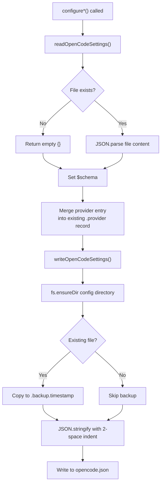
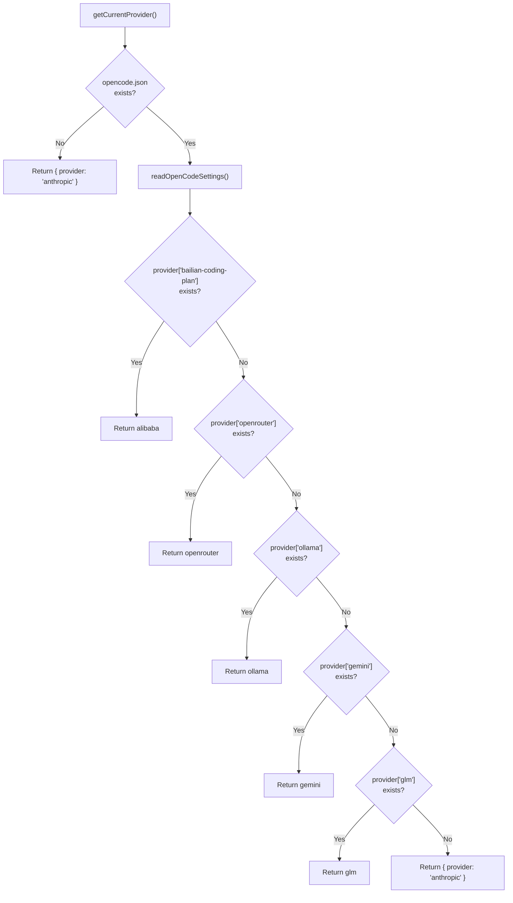

The OpenCode client adapter (`src/clients/opencode.ts`) is a parallel configuration handler that writes provider definitions into `~/.config/opencode/opencode.json`. Unlike the Claude Code client — which controls behavior via environment variables and MCP server entries — the OpenCode client uses a **declarative provider schema** where each provider is a self-contained block specifying the AI SDK npm package, the API endpoint, the auth key, and a catalog of available models with their capabilities and limits. This page dissects that schema, traces the read-modify-write lifecycle for every provider, and maps the CLI commands that expose these operations.

## Configuration File Location and Interface

OpenCode stores its configuration at a fixed path derived from the user's home directory. The function `getOpenCodeConfigPath()` resolves to `~/.config/opencode/opencode.json` using `os.homedir()` for cross-platform compatibility. The `OpenCodeSettings` interface defines the top-level shape: an optional `$schema` string for IDE validation, a `provider` record keyed by provider identifier, and optional `mcpServers` and `agents` records. The `[key: string]: any` index signature ensures that user-defined keys in the JSON file are preserved during read-modify-write cycles.

Sources: [opencode.ts](src/clients/opencode.ts#L1-L25)

## The Provider Schema Anatomy

Each provider entry in the `provider` record follows a consistent four-field structure. The `npm` field declares which Vercel AI SDK package OpenCode should load — either `@ai-sdk/anthropic` for Anthropic-compatible APIs (Alibaba, GLM) or `@ai-sdk/openai` for OpenAI-compatible APIs (OpenRouter, Ollama via LiteLLM, Gemini via LiteLLM). The `name` field provides a human-readable label. The `options` object carries `baseURL` and `apiKey` for authentication. Finally, `models` is a record of model definitions, each with its own sub-schema.

### Model Definition Structure

Every model within a provider's `models` record contains a `name` (display label), `modalities` (with `input` and `output` arrays — e.g., `["text", "image"]` for multimodal models), an optional `options.thinking` block (with `type: "enabled"` and `budgetTokens` for extended reasoning), and a `limit` object specifying `context` (context window in tokens) and `output` (max output tokens). This schema is uniform across all providers, meaning the only differentiators are the npm package, the base URL, and the model catalog.

Sources: [opencode.ts](src/clients/opencode.ts#L81-L105)

The following table summarizes how each provider maps to its npm SDK, endpoint, and provider key:

| Provider Key | CLI Name | npm Package | Base URL | Auth Source |
|---|---|---|---|---|
| `bailian-coding-plan` | alibaba | `@ai-sdk/anthropic` | `https://coding-intl.dashscope.aliyuncs.com/apps/anthropic/v1` | Stored API key |
| `glm` | glm | `@ai-sdk/anthropic` | Read from Claude Code settings | coding-helper auth |
| `openrouter` | openrouter | `@ai-sdk/openai` | `https://openrouter.ai/api/v1` | Stored API key |
| `ollama` | ollama | `@ai-sdk/openai` | `http://localhost:4000/v1` | Hardcoded `"ollama"` |
| `gemini` | gemini | `@ai-sdk/openai` | `http://localhost:4001/v1` | Stored API key |
| *(none)* | anthropic | *(native)* | *(native)* | *(native)* |

Sources: [opencode.ts](src/clients/opencode.ts#L81-L95), [opencode.ts](src/clients/opencode.ts#L280-L286), [opencode.ts](src/clients/opencode.ts#L385-L391), [opencode.ts](src/clients/opencode.ts#L430-L436), [opencode.ts](src/clients/opencode.ts#L497-L503)

## Read-Modify-Write Lifecycle

All configuration functions follow an identical pattern: read the existing settings file (returning `{}` if absent), set the `$schema` to `"https://opencode.ai/config.json"`, merge the new provider entry into the existing `provider` record (preserving other providers), and write the result back. The `writeOpenCodeSettings()` function ensures the config directory exists via `fs.ensureDir()`, creates a timestamped backup of any existing file (e.g., `opencode.json.backup.1699999999999`), and serializes with two-space indentation. This **non-destructive merge** is the critical design property — adding an OpenRouter provider does not clobber a pre-existing GLM provider entry.

Sources: [opencode.ts](src/clients/opencode.ts#L38-L67), [opencode.ts](src/clients/opencode.ts#L73-L81)

This flowchart illustrates the non-destructive merge lifecycle. Notice that the existing `provider` record is never replaced wholesale — new entries are merged in, and other providers survive the write.

Sources: [opencode.ts](src/clients/opencode.ts#L52-L67)

## Provider-Specific Configuration Functions

### Alibaba (bailian-coding-plan)

The `configureAlibaba()` function creates the most extensive model catalog — nine models spanning Qwen, GLM, MiniMax, and Kimi families. The base URL points to Alibaba's Anthropic-compatible endpoint at `coding-intl.dashscope.aliyuncs.com`. Models with thinking support (qwen3.7-plus, qwen3.6-plus, MiniMax-M2.5, glm-5, glm-4.7, kimi-k2.5) include the `options.thinking` block with `budgetTokens: 8192`. Multimodal models (qwen3.7-plus, qwen3.6-plus, kimi-k2.5) declare `"image"` in their input modalities array.

Sources: [opencode.ts](src/clients/opencode.ts#L73-L228)

### GLM/Z.AI

The `configureGLM()` function is architecturally distinct from other providers: it does **not** accept an API key parameter directly. Instead, the caller (in `index.ts`) reads `ANTHROPIC_BASE_URL` and `ANTHROPIC_AUTH_TOKEN` from Claude Code's `settings.json` — values set by the `coding-helper` authentication flow. The function validates that the base URL contains `.z.ai` before proceeding. The model catalog includes five GLM variants (glm-5.1, glm-5v-turbo, glm-5-turbo, glm-4.7, glm-4.7-flash), with `glm-4.7-flash` being the only model without a thinking configuration.

Sources: [opencode.ts](src/clients/opencode.ts#L274-L371), [index.ts](src/index.ts#L659-L697)

### OpenRouter

The `configureOpenRouter()` function writes two free-tier models (`qwen/qwen3.6-plus:free` and `openrouter/free`) under the `@ai-sdk/openai` npm package, pointing at `https://openrouter.ai/api/v1`. Both models have a 131,072-token context window and 32,768-token output limit. Neither model includes a thinking configuration block.

Sources: [opencode.ts](src/clients/opencode.ts#L377-L419)

### Ollama (LiteLLM Proxy)

The `configureOllama()` function is the only provider configuration that takes **no parameters** — no API key is needed because LiteLLM acts as a local proxy on port 4000. The `apiKey` is hardcoded to `"ollama"`, and the base URL is `http://localhost:4000/v1`. The model catalog includes four local models: deepseek-r1, qwen2.5-coder, llama3.1 (the only one declaring `"image"` input modality), and codellama (with a reduced 100,000-token context window).

Sources: [opencode.ts](src/clients/opencode.ts#L424-L486)

### Gemini (LiteLLM Proxy)

The `configureGemini()` function points at the LiteLLM proxy on port 4001 (`http://localhost:4001/v1`) but still passes the actual Gemini API key through to the provider entry. All three models (gemini-2.5-pro, gemini-2.5-flash, gemini-2.5-flash-lite) share a 1,000,000-token context window and 65,536-token output limit. The pro and flash variants declare `"image"` in input modalities; flash-lite is text-only.

Sources: [opencode.ts](src/clients/opencode.ts#L491-L542)

### Anthropic (Native Reset)

The `configureAnthropic()` function serves as a **selective cleanup** operation — it removes all known custom provider keys (`bailian-coding-plan`, `openrouter`, `ollama`, `gemini`, `glm`) from the `provider` record. If the resulting `provider` object is empty, it deletes the key entirely, allowing OpenCode to fall back to its built-in Anthropic provider. This function preserves any unrecognized keys in the `provider` record and all non-provider top-level keys.

Sources: [opencode.ts](src/clients/opencode.ts#L234-L268)

## Provider Removal

The `removeProvider()` function provides granular deletion of a single provider entry by key. Unlike `configureAnthropic()` (which removes all known providers), `removeProvider()` targets one specific key and cleans up the empty `provider` object if it becomes vacant. The CLI exposes this through `claude-switch opencode remove <provider>`, which maps provider names to their JSON keys before calling this function.

Sources: [opencode.ts](src/clients/opencode.ts#L548-L561), [index.ts](src/index.ts#L699-L786)

## Active Provider Detection

The `getCurrentProvider()` function uses a **priority-ordered key check** to infer the active provider from the settings file. It sequentially tests for the presence of `bailian-coding-plan`, `openrouter`, `ollama`, `gemini`, and `glm` in the `provider` record, returning the first match with its provider identifier and endpoint. If none are found (or if the settings file doesn't exist), it returns `{ provider: "anthropic" }` as the default. This detection strategy means that only the first matching provider in the check order is reported — if multiple providers are configured simultaneously, only the highest-priority one appears in the status output.

Sources: [opencode.ts](src/clients/opencode.ts#L566-L619), [index.ts](src/index.ts#L823-L836)

This detection cascade reflects the priority ordering built into the sequential checks. The first match wins, which means the status command will only display one provider even if multiple are co-configured.

Sources: [opencode.ts](src/clients/opencode.ts#L566-L619)

## CLI Integration: Add and Remove Commands

The CLI surfaces OpenCode configuration through the `opencode` subcommand group with two branches: `add` and `remove`. Each branch mirrors the provider taxonomy — `alibaba`, `openrouter`, `ollama`, `gemini`, and `glm`. The `add` handlers follow a consistent pre-configuration step: they call `getApiKey()` to check for a stored key, and if absent, invoke `promptApiKey()` for interactive entry before persisting via `setApiKey()`. The GLM `add` handler is the exception — it checks for `coding-helper` installation and reads auth credentials from Claude Code settings rather than prompting for a key. The imports use aliased names (e.g., `configureAlibaba as configureOpenCodeAlibaba`) to disambiguate from the Claude Code client's identically named functions.

Sources: [index.ts](src/index.ts#L38-L46), [index.ts](src/index.ts#L550-L697)

## Architectural Comparison: OpenCode vs Claude Code Configuration

| Dimension | Claude Code Client | OpenCode Client |
|---|---|---|
| Config file | `~/.claude/settings.json` | `~/.config/opencode/opencode.json` |
| Provider mechanism | Environment variables + MCP servers | Declarative provider blocks with npm SDK |
| Model selection | Tier map env vars (`ANTHROPIC_MODEL`) | Inline model catalog with limits |
| Auth injection | `ANTHROPIC_AUTH_TOKEN` env var | `options.apiKey` in provider block |
| Proxy support | MCP servers (coding-helper) | Inline `baseURL` pointing to proxy |
| Multi-provider | Single active provider at a time | Multiple providers co-exist in JSON |
| Onboarding | `ensureOnboardingComplete()` side-effect | None required |

Sources: [claude-code.ts](src/clients/claude-code.ts#L1-L46), [opencode.ts](src/clients/opencode.ts#L1-L25)

The fundamental architectural difference is that the Claude Code client operates through **environment variable injection** — it sets `ANTHROPIC_AUTH_TOKEN`, `ANTHROPIC_BASE_URL`, and tier-mapping variables that Claude Code reads at startup. The OpenCode client instead declares a complete **provider specification** — the npm SDK package, the endpoint, the auth key, and every available model with its capabilities — in a single JSON document. This is why the OpenCode configuration files are significantly larger and more self-describing: they encode the entire model catalog inline rather than relying on external model resolution.

Sources: [opencode.ts](src/clients/opencode.ts#L73-L228), [claude-code.ts](src/clients/claude-code.ts#L141-L153)

## Next Steps

For the complete picture of how these two client adapters are orchestrated from the CLI entry point, see [System Architecture and Module Responsibilities](5-system-architecture-and-module-responsibilities). To understand how the GLM provider reads its credentials from Claude Code settings before writing them to OpenCode, see [GLM/Z.AI Provider: coding-helper MCP Integration](11-glm-z-ai-provider-coding-helper-mcp-integration). For the CLI command surface that exposes the `opencode add` and `opencode remove` operations, see [OpenCode Helper: Adding and Removing Providers](12-opencode-helper-adding-and-removing-providers).