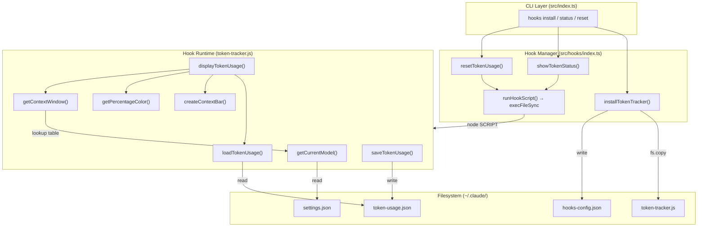
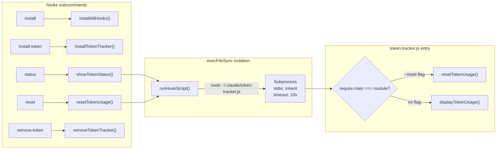

The Token Tracker is a standalone Node.js script that monitors cumulative token consumption across a Claude Code session and renders a real-time context-window usage bar directly in the terminal. Unlike the TypeScript application code, this hook ships as plain JavaScript so it can be copied verbatim into `~/.claude/` and executed by Claude Code's own Node runtime without any compilation step.

Sources: [token-tracker.js](src/hooks/token-tracker.js#L1-L8)

---

## Architecture Overview

The token tracker operates within a layered design: the **TypeScript Hook Manager** (`src/hooks/index.ts`) orchestrates installation, lifecycle, and CLI invocation, while the **runtime hook script** (`token-tracker.js`) performs the actual model detection, persistence, and rendering. These two layers communicate exclusively through the filesystem — the manager copies the script into place and launches it as a subprocess, while the script reads and writes JSON files that the manager never touches directly.

The hook script is purposefully decoupled from the compiled `dist/` output. During the build, a dedicated postbuild step ([copy-hooks.js](scripts/copy-hooks.js#L1-L16)) copies all `.js` files from `src/hooks/` into `dist/hooks/`, ensuring the hook ships with the published package without TypeScript transpilation overhead.

Sources: [index.ts](src/hooks/index.ts#L17-L22), [copy-hooks.js](scripts/copy-hooks.js#L1-L16)

---

## Model Detection and Context Window Resolution

The hook must determine which model is active and how large its context window is — entirely from disk, with zero access to the TypeScript application's in-memory state. It resolves the active model through a **three-tier fallback chain** that reads `~/.claude/settings.json`:

| Priority | Source Field | Condition |
|:--------:|-------------|-----------|
| 1 | `settings.env.ANTHROPIC_MODEL` | Direct model override |
| 2 | `settings.env.ANTHROPIC_DEFAULT_OPUS_MODEL` | Opus tier alias (proxy for primary model) |
| 3 | Hardcoded default | `claude-opus-4-6-20250205` (200K context) |

This mirrors how [Claude Code Client: Writing Environment Variables and MCP Servers](20-claude-code-client-writing-environment-variables-and-mcp-servers) writes configuration — the opus tier alias serves as a reliable indicator of the user's primary model selection across all providers.

Once the model ID is resolved, `getContextWindow()` performs a direct lookup against `MODEL_CONTEXT_WINDOWS`, a **statically duplicated** dictionary of 19 models spanning all six providers. This dictionary is manually synchronized with [src/models.ts](src/models.ts) rather than imported at runtime, because the hook runs in isolation outside the module graph. If the model ID is unrecognized, the function defaults to 200,000 tokens (the standard Anthropic context window).

Sources: [token-tracker.js](src/hooks/token-tracker.js#L17-L92), [models.ts](src/models.ts#L83-L314)

---

## Token Usage Persistence Layer

Token consumption data is persisted as a flat JSON document at `~/.claude/token-usage.json`. The schema is deliberately minimal:

| Field | Type | Purpose |
|-------|------|---------|
| `totalInputTokens` | `number` | Cumulative input (prompt) tokens consumed |
| `totalOutputTokens` | `number` | Cumulative output (completion) tokens consumed |
| `sessionStart` | `string` (ISO 8601) | Timestamp when the current session began |
| `lastUpdated` | `string` (ISO 8601) | Timestamp of the most recent token addition |

The persistence layer follows a **defensive-load / silent-fail** pattern. `loadTokenUsage()` validates that both token fields are present and numeric, returning a fresh zero-initialized object on any parse failure, missing file, or schema violation. Similarly, `saveTokenUsage()` swallows all errors — a design choice that prevents the tracker from ever crashing Claude Code itself. The comment is explicit: *"Silently fail - don't break Claude Code."*

The `addTokens()` function implements an atomic read-modify-write cycle: load current state, add the delta, stamp `lastUpdated`, and write back. There is no locking mechanism, which is acceptable given the single-process execution model within a Claude Code session.

Sources: [token-tracker.js](src/hooks/token-tracker.js#L94-L161)

---

## Visual Rendering System

The rendering subsystem transforms raw token counts into a **color-coded terminal dashboard** using ANSI escape sequences and Unicode box-drawing characters. The display is composed of three independent rendering functions:

**`createContextBar(percentage)`** generates a 20-character progress bar using `█` for filled segments and `░` for empty segments. The fill ratio is computed as `Math.round((percentage / 100) * 20)`, providing 5% granularity per cell.

**`getPercentageColor(percentage)`** maps utilization to a four-tier color threshold:

| Utilization | Color | ANSI Code | Semantic |
|:-----------:|:-----:|:---------:|----------|
| < 50% | Green | `\x1b[32m` | Healthy |
| 50% – 74% | Yellow | `\x1b[33m` | Moderate |
| 75% – 89% | Red | `\x1b[31m` | High |
| ≥ 90% | Magenta | `\x1b[35m` | Critical |

**`displayTokenUsage()`** orchestrates the final render, producing a bordered box (62 characters wide) that displays the active model name (title-cased and truncated at 38 characters), input/output/total token breakdown, and the context window utilization bar. Every structural element — borders, dividers, and the progress bar — is wrapped in the threshold color with explicit `\x1b[0m` resets to prevent color bleed across terminal lines.

The model name is reformatted by splitting on hyphens, capitalizing each segment, and rejoining with spaces (e.g., `gemini-2.5-flash` → `Gemini 2.5 Flash`), with truncation to 38 characters followed by `...` if the name exceeds the display width.

Sources: [token-tracker.js](src/hooks/token-tracker.js#L163-L232)

---

## Hook Lifecycle and CLI Integration

The hook's public API is exposed through the `claude-switch hooks` command group. The Hook Manager in `index.ts` wraps every hook operation with filesystem checks and subprocess isolation:

When `token-tracker.js` is invoked directly (via `require.main === module`), it checks `process.argv` for a `--reset` flag. If present, it zeroes the counters; otherwise, it renders the full usage display. This dual-mode entry point allows the same script to serve as both a standalone CLI tool and a library whose exported functions can be called programmatically.

The `runHookScript()` wrapper executes the hook via `execFileSync("node", [scriptPath, ...args])` with `stdio: "inherit"` (so ANSI colors pass through to the parent terminal) and a **10-second timeout** to prevent hanging. This subprocess isolation ensures that any crash within the hook script cannot corrupt the parent CLI process.

| CLI Command | Manager Function | Hook Action |
|-------------|-----------------|-------------|
| `hooks status` | `showTokenStatus()` | Runs script (no args) → displays dashboard |
| `hooks reset` | `resetTokenUsage()` | Runs script with `--reset` → zeros counters |
| `hooks install-token` | `installTokenTracker()` | Copies script to `~/.claude/`, updates config |
| `hooks remove-token` | `removeTokenTracker()` | Deletes script, updates config |

Sources: [index.ts](src/hooks/index.ts#L44-L59), [index.ts](src/hooks/index.ts#L152-L209), [token-tracker.js](src/hooks/token-tracker.js#L257-L281)

---

## Module API

The hook script exports eight functions via `module.exports`, enabling both standalone execution and programmatic integration:

| Export | Signature | Purpose |
|--------|-----------|---------|
| `onSessionStart()` | `() → void` | Resets counters and renders initial display |
| `onApiResponse(i, o)` | `(input: number, output: number) → void` | Accumulates tokens after each API call |
| `showStatus()` | `() → void` | Renders the current dashboard without mutation |
| `addTokens(i, o)` | `(input: number, output: number) → Usage` | Read-modify-write token accumulation |
| `loadTokenUsage()` | `() → Usage` | Loads persisted data with defensive fallback |
| `resetTokenUsage()` | `() → Usage` | Writes zero-initialized state to disk |
| `getCurrentModel()` | `() → string` | Resolves model ID from settings.json |
| `getContextWindow(id)` | `(modelId: string) → number` | Looks up context window size |

The `onApiResponse` and `onSessionStart` functions are designed for integration with Claude Code's event system — they represent the hook points where Claude Code would call into the tracker. The comment on `onApiResponse` notes that this *"would need to be integrated with Claude Code's response handler,"* indicating these are integration seams awaiting wiring.

Sources: [token-tracker.js](src/hooks/token-tracker.js#L234-L269)

---

## Configuration State

Installation state is tracked through `~/.claude/hooks-config.json`, managed exclusively by the TypeScript Hook Manager. This file records which hooks are active and when they were last installed:

| Field | Type | Purpose |
|-------|------|---------|
| `tokenTracking` | `boolean` | Token tracker installed state |
| `visualEnhancements` | `boolean` | Visual enhancements installed state |
| `customPrompts` | `boolean` | Reserved for future custom prompt hooks |
| `lastInstalled` | `string` (ISO 8601) | Timestamp of most recent installation |

The config file uses a **read-with-default** pattern: `readHooksConfig()` returns a fully-initialized default object (all `false`) if the file is missing or unparseable, ensuring the manager never throws on a fresh system.

Sources: [index.ts](src/hooks/index.ts#L23-L29), [index.ts](src/hooks/index.ts#L120-L149)

---

## Design Trade-offs

The token tracker embodies three deliberate architectural decisions worth noting:

**Static model registry duplication.** Rather than importing from the compiled `dist/models.js`, the hook maintains its own `MODEL_CONTEXT_WINDOWS` object with hardcoded values. This eliminates the runtime dependency on the application's module graph, ensuring the hook functions even if the `dist/` directory is absent — but it introduces a **manual synchronization burden**: any new model added to `models.ts` must also be added to the hook's lookup table, or it will fall back to the 200K default.

**Session-scoped tracking.** Token counters reset on `onSessionStart()` and are not persisted across sessions. There is no historical log, no aggregation, and no trend analysis. The design optimizes for the immediate question — "how much context budget remains?" — at the expense of longitudinal insight.

**Input + output as context consumption.** The utilization percentage is computed as `(inputTokens + outputTokens) / contextWindow`, treating both input and output tokens as contributing to the same context budget. This is an approximation of how context windows actually work (input grows with conversation history; output is generated within the budget), but it provides a useful heuristic for gauging session proximity to the context limit.

Sources: [token-tracker.js](src/hooks/token-tracker.js#L17-L58), [token-tracker.js](src/hooks/token-tracker.js#L197-L203)

---

## Next Steps

Now that you understand the token tracker's architecture, explore the broader hooks ecosystem:

- **[Visual Enhancements Hook: Model Cards and Provider Display](23-visual-enhancements-hook-model-cards-and-provider-display)** — the companion hook that renders provider cards and model metadata, sharing the same installation and lifecycle infrastructure.
- **[Hook Installation and Lifecycle Management](24-hook-installation-and-lifecycle-management)** — a comprehensive walkthrough of all install/remove/status commands and the `hooks-config.json` state machine.
- **[Model and Provider Type Definitions](15-model-and-provider-type-definitions)** — the canonical source of truth for model context windows that the hook's static registry mirrors.