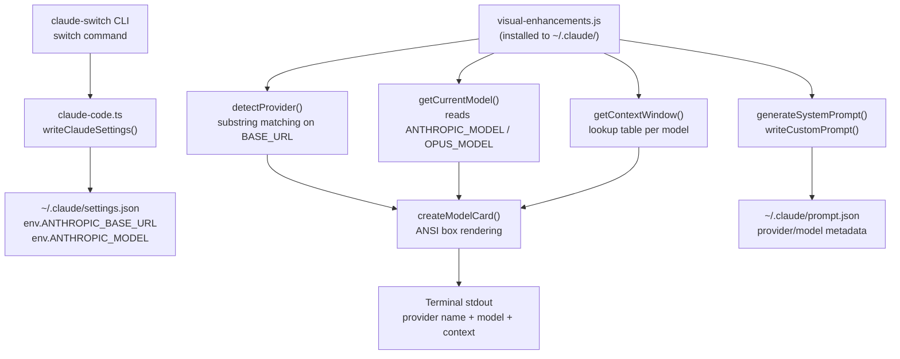

The **Visual Enhancements Hook** is a standalone Node.js script that transforms Claude Code's terminal output into an at-a-glance status dashboard. After every provider switch, it reads the live `~/.claude/settings.json`, infers the active provider and model, and renders a boxed ANSI-colored **model card** — complete with provider name, context window, and capability tags. It also generates a **custom system prompt** that informs the LLM itself about its current deployment context. This page covers the hook's internal architecture, its provider detection heuristics, the ANSI rendering pipeline, and the system prompt injection mechanism.

## Architecture Overview: How the Hook Plugs Into the Pipeline

The visual enhancements hook operates at the intersection of two distinct layers: the **TypeScript switcher CLI** (which writes `settings.json`) and the **runtime Claude Code process** (which consumes those settings). The hook itself is pure JavaScript — no TypeScript compilation, no npm dependencies — so it can run independently in a subprocess without the compiled CLI.



The hook reads settings that the CLI writes and produces two artifacts: terminal output for the human and `prompt.json` for the model. This dual-output design means the visual card and the injected system prompt always stay synchronized with whatever provider was last configured.

Sources: [visual-enhancements.js](src/hooks/visual-enhancements.js#L97-L335), [claude-code.ts](src/clients/claude-code.ts#L141-L153)

## Provider Detection: Inferring Identity from Environment Variables

The `detectProvider()` function uses a **fallthrough chain of substring checks** against the `ANTHROPIC_BASE_URL` environment variable in `settings.json`. Because Claude Code does not natively know which provider it's pointed at — it only sees an API endpoint — the hook reconstructs that knowledge by pattern-matching the URL fragments that each provider writes during configuration.

| Provider Key | Matched Substring in `ANTHROPIC_BASE_URL` | Detected Provider Name | Endpoint Display |
|---|---|---|---|
| `anthropic` | *(no base URL or no match)* | Anthropic | `api.anthropic.com` |
| `alibaba` | `coding-intl.dashscope.aliyuncs.com` | Alibaba Model Studio | `coding-intl.dashscope.aliyuncs.com` |
| `openrouter` | `openrouter.ai` | OpenRouter | `openrouter.ai` |
| `ollama` | `localhost:4000` | Ollama (Local) | `localhost:4000` |
| `gemini` | `localhost:4001` | Gemini (Google) | `localhost:4001` |
| `glm` | `z.ai` | GLM/Z.AI | `z.ai` |
| `glm` *(fallback)* | `ANTHROPIC_DEFAULT_OPUS_MODEL` set, no base URL | GLM/Z.AI | `z.ai` |

The final fallback path is worth noting: when GLM is configured via the coding-helper MCP integration, the `ANTHROPIC_BASE_URL` may be absent, so the hook checks for the presence of `ANTHROPIC_DEFAULT_OPUS_MODEL` as a secondary GLM indicator. Every detection failure — missing file, parse error, no match — safely defaults to `'anthropic'`.

Sources: [visual-enhancements.js](src/hooks/visual-enhancements.js#L100-L134)

## Provider Metadata Registry: Icons, Names, and Endpoints

Each detected provider resolves to a static metadata object in the `PROVIDER_INFO` constant. This registry provides the human-readable display name, the endpoint string shown in both the card and the system prompt, and a Unicode icon emoji used as a visual prefix in the card header. The icons serve as quick-scanning cues — a 🎭 for Anthropic, a 💎 for Gemini, a 🌐 for OpenRouter — making it immediately obvious which provider is active without reading the full text.

| Provider | Icon | Display Name | Endpoint |
|---|---|---|---|
| `anthropic` | 🎭 | Anthropic | `api.anthropic.com` |
| `alibaba` | 🤖 | Alibaba Model Studio | `coding-intl.dashscale.aliyuncs.com` |
| `glm` | 🤖 | GLM/Z.AI | `z.ai` |
| `openrouter` | 🌐 | OpenRouter | `openrouter.ai` |
| `ollama` | 🖥️ | Ollama (Local) | `localhost:4000` |
| `gemini` | 💎 | Gemini (Google) | `localhost:4001` |

Sources: [visual-enhancements.js](src/hooks/visual-enhancements.js#L21-L52)

## Model Capabilities Database: Tagging Models by Feature

Alongside provider metadata, the hook maintains a `MODEL_CAPABILITIES` lookup table that maps every known model ID to an array of descriptive capability tags. These tags — such as `Text Generation`, `Deep Thinking`, `Visual Understanding`, `1M Context`, `Coding Agent` — appear as a delimited list in the model card's third row. Only the first three tags are rendered (via `capabilities.slice(0, 3)`), so models with extensive feature sets are automatically truncated to the most salient capabilities.

The database covers all six provider families: Alibaba's Qwen lineup, GLM models, OpenRouter aliases, Ollama local models, Gemini variants, and Anthropic's Claude tier. This static catalog mirrors the model definitions in the TypeScript `models.ts` module but lives independently inside the hook's own scope — a deliberate design choice that keeps the hook self-contained at runtime without importing compiled TypeScript.

Sources: [visual-enhancements.js](src/hooks/visual-enhancements.js#L55-L95)

## Context Window Lookup: Per-Model Token Budgets

The `getContextWindow()` function returns the maximum context size in tokens for a given model ID, falling back to `200000` (the Claude default) when a model is unknown. This value drives both the context display in the model card and the context denominator in the system prompt. The lookup table duplicates the one found in the sibling token-tracker hook — both hooks maintain their own copies to preserve independence.

| Model Family | Representative Models | Context Range |
|---|---|---|
| Alibaba Qwen | qwen3.7-plus, qwen3-coder-plus | 262K – 1M |
| GLM | glm-4.7, glm-5.2[1m] | 200K – 1M |
| Gemini | gemini-2.5-pro, gemini-2.5-flash | 1M |
| Claude | claude-opus-4-6, claude-sonnet-4-6 | 200K |
| Ollama | deepseek-r1, qwen2.5-coder | 100K – 128K |
| OpenRouter | qwen3.6-plus:free | 131K |

Sources: [visual-enhancements.js](src/hooks/visual-enhancements.js#L164-L197)

## Model Card Rendering: ANSI Box Drawing

The `createModelCard()` function is the visual centerpiece of the hook. It assembles a fixed-width (63-character) box-drawn card using raw ANSI escape sequences — no `chalk` or terminal library dependency. This is a critical architectural decision: the hook is pure JavaScript with zero `require()` calls beyond Node's built-in `fs`, `path`, and `os` modules, ensuring it runs anywhere Node is available without `node_modules`.

The card is constructed line-by-line, with four ANSI color codes in play: **cyan** (`\x1b[36m`) for the header, **yellow** (`\x1b[33m`) for labels like `Model:` and `Context:`, **white** (`\x1b[37m`) for values, and **gray** (`\x1b[90m`) for the box border itself. Each line uses dynamic padding via `' '.repeat(Math.max(0, ...))` to ensure the right border always aligns regardless of model name length or capability string width.

```
┌─────────────────────────────────────────────────────────────┐
│ 🎭 Anthropic                                                │
├─────────────────────────────────────────────────────────────┤
│ Model: Claude opus 4 6 20250205                            │
│ Context: 200.0K tokens                                      │
│ Capabilities:                                               │
│ Text Generation • Code • Vision                             │
└─────────────────────────────────────────────────────────────┘
```

A notable transformation: Claude model IDs like `claude-opus-4-6-20250205` are humanized via a chained `.replace()` that strips the `claude-` prefix and converts hyphens to spaces, producing a cleaner display name. Non-Claude models are shown with their raw ID.

Sources: [visual-enhancements.js](src/hooks/visual-enhancements.js#L215-L250)

## Context Usage Bar: Color-Coded Threshold Visualization

The `createContextBar()` function renders a 30-character horizontal progress bar using the Unicode block characters `█` (filled) and `░` (empty). The bar's color shifts through four thresholds based on the percentage of context consumed, creating an instant visual urgency cue:

| Usage Range | Color | ANSI Code | Semantic |
|---|---|---|---|
| 0 – 49% | Green | `\x1b[32m` | Healthy |
| 50 – 74% | Yellow | `\x1b[33m` | Moderate |
| 75 – 89% | Red | `\x1b[31m` | High |
| 90 – 100% | Magenta | `\x1b[35m` | Critical |

The function guards against division-by-zero and negative inputs by returning an all-empty green bar with `0.0%` when `totalTokens` is falsy or non-positive. This defensive check ensures the bar never throws even when context data is unavailable — a scenario that occurs before the first message exchange in a new session.

While `createContextBar()` is exported in the module's public API, the current `displayStatus()` function only calls `createModelCard()`. The context bar is available for consumers (such as the token-tracker hook or external integrations) that want to combine it with live usage data.

Sources: [visual-enhancements.js](src/hooks/visual-enhancements.js#L255-L283)

## System Prompt Injection: Writing to prompt.json

Beyond visual display, the hook generates a structured system prompt and writes it to `~/.claude/prompt.json`. The `generateSystemPrompt()` function builds a multi-line string that declares the provider name, model ID, endpoint, and context window — effectively giving the LLM self-awareness of its own deployment configuration. The prompt format is a JSON object with a single `system` key containing a newline-joined string array.

The `writeCustomPrompt()` wrapper handles the filesystem write with a try/catch guard, returning `true` on success and silently `false` on failure. This failure-tolerant design ensures that a broken `prompt.json` write (e.g., permissions issue) never crashes the hook or prevents the model card from rendering.

Both `init()` and `update()` call `displayStatus()` followed by `writeCustomPrompt()`, meaning every invocation refreshes both the visual card and the system prompt in lockstep. The auto-run guard at the bottom of the file — `if (require.main === module) { init(); }` — allows the hook to be executed directly via `node ~/.claude/visual-enhancements.js` while also being safely `require()`-able by other modules.

Sources: [visual-enhancements.js](src/hooks/visual-enhancements.js#L296-L365)

## Lifecycle Entry Points: init, update, and displayStatus

The hook exposes three lifecycle functions that orchestrate its dual-output behavior. These functions represent the intended call surface for external invokers — whether the hook manager's subprocess runner or a direct `require()` import.

| Function | Renders Card | Writes prompt.json | Primary Use Case |
|---|---|---|---|
| `init()` | ✅ | ✅ | Session start, first-run |
| `update()` | ✅ | ✅ | After provider switch |
| `displayStatus()` | ✅ | ❌ | View-only status check |

The distinction between `init()` and `update()` is semantic rather than functional — both perform identical operations. The naming convention mirrors Claude Code's own hook lifecycle terminology, allowing the hook manager to call the conceptually appropriate entry point depending on context (initial load vs. post-switch refresh).

Sources: [visual-enhancements.js](src/hooks/visual-enhancements.js#L329-L365), [index.ts](src/hooks/index.ts#L180-L191)

## Module Export Surface and External Integration

The hook's `module.exports` object exposes nine functions, providing both high-level lifecycle entry points and low-level building blocks for compositional use:

| Export | Purpose | Parameters |
|---|---|---|
| `init` | Full initialization (card + prompt) | none |
| `update` | Post-switch refresh (card + prompt) | none |
| `displayStatus` | Render model card only | none |
| `createModelCard` | Return card as string | none |
| `createContextBar` | Return context bar string | `(usedTokens, totalTokens)` |
| `generateSystemPrompt` | Return prompt object | none |
| `writeCustomPrompt` | Write prompt.json to disk | none |
| `detectProvider` | Return provider key string | none |
| `getCurrentModel` | Return model ID string | none |
| `getContextWindow` | Return token count | `(modelId)` |

The hook manager in `src/hooks/index.ts` invokes this hook via `execFileSync("node", [VISUAL_ENHANCEMENTS_DEST])`, running it as an isolated subprocess with a 10-second timeout and inherited stdio. This isolation boundary means a crash in the hook never propagates to the CLI process.

Sources: [visual-enhancements.js](src/hooks/visual-enhancements.js#L348-L359), [index.ts](src/hooks/index.ts#L154-L159), [index.ts](src/hooks/index.ts#L180-L191)

## Build and Deployment Pipeline

The hook begins its life as a source file at `src/hooks/visual-enhancements.js` alongside the TypeScript source tree. During the npm `build` script (`tsc && npm run copy-hooks`), the TypeScript compiler processes `.ts` files while the `scripts/copy-hooks.js` script copies all `.js` files from `src/hooks/` into `dist/hooks/`. This dual-path build ensures the JavaScript hooks survive the compilation step that would otherwise ignore non-TypeScript files.

When a user runs `claude-switch hooks install-visual`, the hook manager copies the file from its compiled location to `~/.claude/visual-enhancements.js`, overwriting any previous version. The manager also updates `~/.claude/hooks-config.json` with a timestamp and the `visualEnhancements: true` flag, providing a persistent record of installation state.

| Stage | Source Path | Destination Path | Trigger |
|---|---|---|---|
| Build copy | `src/hooks/visual-enhancements.js` | `dist/hooks/visual-enhancements.js` | `npm run build` |
| Installation | `dist/hooks/visual-enhancements.js` | `~/.claude/visual-enhancements.js` | `claude-switch hooks install-visual` |
| Config update | — | `~/.claude/hooks-config.json` | Installation (automatic) |
| Runtime | `~/.claude/visual-enhancements.js` | stdout + `~/.claude/prompt.json` | `node visual-enhancements.js` |

Sources: [copy-hooks.js](scripts/copy-hooks.js#L1-L16), [index.ts](src/hooks/index.ts#L64-L76), [index.ts](src/hooks/index.ts#L1164-L1177)

## CLI Wiring: hooks Commands

The `hooks` command group in the main CLI entry point provides eight subcommands for managing visual enhancements and the companion token tracker. The visual-specific commands route directly to the hook manager's install/remove/show functions.

| Command | Effect | Related Hook Manager Function |
|---|---|---|
| `hooks install-visual` | Install only visual enhancements | `installVisualEnhancements()` |
| `hooks install` | Install both hooks | `installAllHooks()` |
| `hooks remove-visual` | Remove visual enhancements | `removeVisualEnhancements()` |
| `hooks remove` | Remove both hooks | `removeAllHooks()` |
| `hooks status` | Show installed status + run both | `areHooksInstalled()` + `showVisualStatus()` |

When `hooks status` is executed and visual enhancements are installed, the manager calls `showVisualStatus()`, which runs the deployed hook script as a subprocess. This produces the model card output directly in the terminal, giving users a live snapshot of their current provider configuration without launching Claude Code itself.

Sources: [index.ts](src/index.ts#L1164-L1261)

## Design Philosophy: Zero-Dependency Independence

The visual-enhancements hook embodies a deliberate architectural principle: **runtime isolation through dependency-free JavaScript**. Unlike the TypeScript CLI — which depends on `commander`, `chalk`, `fs-extra`, and `ora` — the hook uses only Node.js built-in modules. ANSI colors are hardcoded as escape sequences, box borders are Unicode characters, and all I/O uses the synchronous `fs` API. This means the hook can be copied to any machine with Node.js and executed immediately, with no `npm install` required.

This design also explains why the hook duplicates data (context windows, capabilities) that already exists in the compiled TypeScript `models.ts` module. The duplication is intentional: the hook must operate independently of the npm package's `dist/` directory once deployed to `~/.claude/`, and importing compiled TypeScript would introduce a fragile path dependency that could break across versions or installations.

Sources: [visual-enhancements.js](src/hooks/visual-enhancements.js#L1-L19), [token-tracker.js](src/hooks/token-tracker.js#L1-L58)

## Next Steps

- To understand the companion hook that tracks live token consumption and feeds data into the context bar, see [Token Tracker Hook: Context Usage Monitoring](22-token-tracker-hook-context-usage-monitoring).
- For the full installation, removal, and configuration lifecycle of both hooks, see [Hook Installation and Lifecycle Management](24-hook-installation-and-lifecycle-management).
- To learn how the settings.json file that this hook reads gets written during provider switches, see [Provider Switching Flow: From Command to Settings Write](6-provider-switching-flow-from-command-to-settings-write).
- For details on the provider detection logic used by the CLI itself (which the hook mirrors), see [Provider Detection: Inferring Active Provider from Settings](19-provider-detection-inferring-active-provider-from-settings).