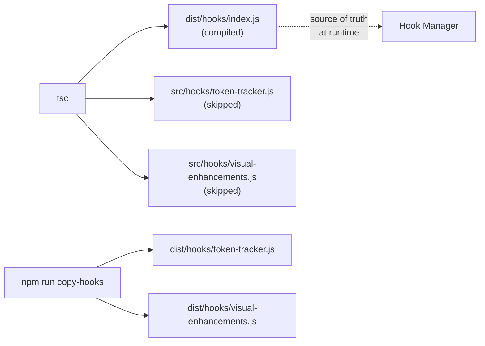
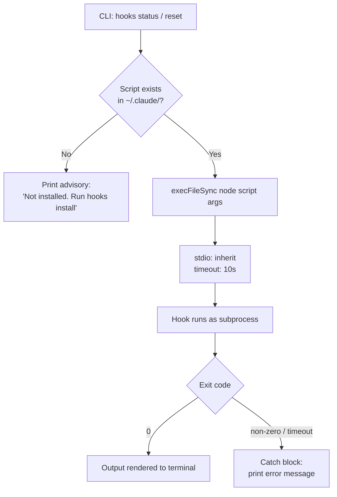

Claude AI Switcher ships two standalone hook scripts — a **Token Tracker** and **Visual Enhancements** — that extend the Claude Code runtime with context-bar overlays and provider-aware model cards. Unlike the TypeScript application code, these hooks are plain JavaScript files designed to live directly inside `~/.claude/` and be invoked by the host environment. This page covers the complete lifecycle: how hook scripts are bundled at build time, how they are copied into place at install time, how their installation state is tracked, and how the CLI orchestrates execution through isolated subprocesses.

## Build-Time Pipeline: From Source to Distribution

The hook scripts live as `.js` files alongside the TypeScript manager in `src/hooks/`. Because `tsc` only compiles `.ts` files, the build pipeline includes a dedicated post-compilation step that manually copies hook JavaScript into the `dist/` output tree. The `npm run build` script chains both operations.



The copy script uses `fs-extra`'s `copySync` with a filter that preserves only `.js` files — this prevents TypeScript-specific artifacts or unrelated source from leaking into the distribution. The filter inspects each entry with `statSync().isDirectory()` to allow directories to recurse, then applies an extension check on files.

Sources: [copy-hooks.js](scripts/copy-hooks.js#L1-L16), [package.json](package.json#L19-L24)

## Installation Flow: Writing Hooks into `~/.claude/`

At install time, the Hook Manager acts as the bridge between the packaged distribution and the user's Claude Code configuration directory. It resolves source paths relative to its own compiled location (`__dirname/../hooks/`) and writes to well-known destinations under `CLAUDE_DIR` (`~/.claude/`).

| Artifact | Source (at runtime) | Destination |
|---|---|---|
| Token Tracker | `dist/hooks/token-tracker.js` | `~/.claude/token-tracker.js` |
| Visual Enhancements | `dist/hooks/visual-enhancements.js` | `~/.claude/visual-enhancements.js` |
| Hooks Config | — (generated) | `~/.claude/hooks-config.json` |

Each install function follows an identical four-step protocol: validate that the source file exists (guarding against stale builds), ensure the target directory exists, copy with `overwrite: true`, then update the configuration state file. The source-existence check throws a user-facing error — `"Token tracker source not found. Please rebuild the project."` — when the copy-hooks step was skipped or the distribution is corrupt.

Sources: [index.ts](src/hooks/index.ts#L17-L84)

## Configuration State: The `hooks-config.json` Manifest

Beyond the raw script files, the Hook Manager persists a structured manifest at `~/.claude/hooks-config.json`. This file serves as the **source of truth for installation state** — it records which hooks are active and when they were last touched.

The `HooksConfig` interface defines three boolean flags — `tokenTracking`, `visualEnhancements`, and `customPrompts` — plus an optional `lastInstalled` ISO timestamp. When the config file is missing or unparseable, `readHooksConfig` returns a conservative all-false default, ensuring that a corrupted or absent manifest never produces false-positive status reports.

```typescript
export interface HooksConfig {
  tokenTracking: boolean;
  visualEnhancements: boolean;
  customPrompts: boolean;
  lastInstalled?: string;
}
```

Every install and remove operation mutates this manifest. The install path sets the relevant flag to `true` and stamps `lastInstalled`; the remove path sets the flag to `false` without touching the timestamp. This split means that the timestamp reflects the **last successful install**, not the last modification — a design choice that preserves an audit trail even after removals.

Sources: [index.ts](src/hooks/index.ts#L24-L29), [index.ts](src/hooks/index.ts#L120-L149)

## CLI Command Tree: The Full Hooks Subsystem

The CLI exposes a nested `hooks` command group with seven leaf commands, giving users granular control over individual hooks as well as bulk operations. The command tree is structured so that `install` and `remove` operate on both hooks simultaneously, while the `install-token`, `install-visual`, `remove-token`, and `remove-visual` variants provide surgical single-hook control.

| Command | Action | Delegate Function |
|---|---|---|
| `hooks install` | Install both hooks | `installAllHooks()` |
| `hooks install-token` | Install token tracker only | `installTokenTracker()` |
| `hooks install-visual` | Install visual enhancements only | `installVisualEnhancements()` |
| `hooks status` | Check installation + run both displays | `areHooksInstalled()` → `showTokenStatus()` + `showVisualStatus()` |
| `hooks reset` | Zero out token counters | `resetTokenUsage()` |
| `hooks remove` | Remove both hooks | `removeAllHooks()` |
| `hooks remove-token` | Remove token tracker only | `removeTokenTracker()` |
| `hooks remove-visual` | Remove visual enhancements only | `removeVisualEnhancements()` |

The `hooks install` command wraps the operation in an `ora` spinner with a fallback to `null` if the optional dependency fails to load — a defensive pattern that ensures the install proceeds even on environments where `ora` isn't available. The spinner is explicitly stopped before output, preventing a stuck indicator on error.

The `hooks status` command is unique in that it combines **detection** (`areHooksInstalled`) with **execution**: if a hook is installed, it is immediately run to produce live output. When neither hook is installed, the command surfaces a yellow advisory pointing the user to `claude-switch hooks install`.

Sources: [index.ts](src/index.ts#L1113-L1262)

## Execution Model: Subprocess Isolation via `execFileSync`

Installed hooks are never `require`'d directly into the Claude AI Switcher process. Instead, they are launched as **independent Node.js subprocesses** through a dedicated runner. This architectural decision has three consequences: hook crashes cannot destabilize the parent CLI, hooks run with their own `process.argv` and `require.main` semantics, and execution is hard-bounded by a 10-second timeout.



The `runHookScript` helper encapsulates this pattern, taking a script path and optional args array. It uses `stdio: "inherit"` so the hook's ANSI-colored output streams directly to the user's terminal without buffering. The `showTokenStatus` and `showVisualStatus` functions wrap this call in a try/catch that translates subprocess errors into human-readable messages.

The `resetTokenUsage` function leverages the same mechanism but passes a `--reset` flag, demonstrating how the subprocess boundary doubles as a **command protocol** — the hook script inspects `process.argv` to select between its display mode and its reset mode.

Sources: [index.ts](src/hooks/index.ts#L151-L208), [token-tracker.js](src/hooks/token-tracker.js#L271-L281)

## Hook Script Self-Execution Pattern

Both hook scripts follow an identical entry-point convention: they export a rich API through `module.exports` for programmatic integration, but also include a **self-invocation guard** at the bottom that activates when the script is executed directly via `node`. This dual-mode design allows the hooks to function both as importable libraries and as standalone executables.

The token tracker checks `require.main === module` and then branches on `process.argv`: the `--reset` flag triggers `resetTokenUsage()`, while absence of any flag triggers `displayTokenUsage()`. The visual enhancements script takes a simpler path — direct execution always calls `init()`, which combines `displayStatus()` (model card output) with `writeCustomPrompt()` (writing to `~/.claude/prompt.json`).

```javascript
// token-tracker.js — dual-mode entry point
if (require.main === module) {
  const args = process.argv.slice(2);
  if (args.includes('--reset')) {
    resetTokenUsage();
    console.log('Token usage reset.');
  } else {
    displayTokenUsage();
  }
}
```

This pattern is what makes the `execFileSync` execution model work seamlessly: the subprocess invocation hits the `require.main` branch, and the script never needs to know whether it was launched by Claude AI Switcher's Hook Manager or by the host environment directly.

Sources: [token-tracker.js](src/hooks/token-tracker.js#L257-L281), [visual-enhancements.js](src/hooks/visual-enhancements.js#L328-L365)

## Removal Lifecycle: Safe Teardown

Hook removal is deliberately conservative. Each `remove*` function first checks whether the destination file exists before attempting deletion, avoiding errors on partial installations where the config manifest and the actual files have drifted out of sync. The configuration flag is always updated regardless of whether the file was present — this self-heals any state drift.

`removeAllHooks` simply chains the two individual removal functions in sequence. There is no rollback mechanism or two-phase commit: if one removal fails (e.g., a file is locked by another process), the exception propagates to the CLI handler, which prints the error and exits with code 1. The other hook's config flag may already be cleared, but the file copy is atomic per-hook.

Sources: [index.ts](src/hooks/index.ts#L86-L118)

## Installation Detection: The `areHooksInstalled` Probe

Before running any hook, the system needs to know whether it is actually present. The `areHooksInstalled` function performs a **file-existence probe** rather than reading the config manifest. This is a deliberate design choice: it returns ground-truth about the filesystem, not potentially stale config state.

The function returns an object with `tokenTracking` and `visualEnhancements` booleans, each backed by `fs.pathExists` on the respective destination path. The `hooks status` CLI command uses this probe to decide which subprocess executions to attempt, ensuring that it never invokes `runHookScript` on a missing file.

This separation between **detection** (filesystem probe) and **state** (config manifest) means that manually deleting a hook file from `~/.claude/` will correctly cause `areHooksInstalled` to report `false`, even though the config manifest still claims the hook is installed — a minor inconsistency that the next `install` or `remove` cycle resolves automatically.

Sources: [index.ts](src/hooks/index.ts#L31-L42), [index.ts](src/index.ts#L1179-L1207)

## Next Steps

Now that you understand how hooks are installed, managed, and executed, explore the individual hook implementations in detail:

- **[Token Tracker Hook: Context Usage Monitoring](22-token-tracker-hook-context-usage-monitoring)** — Deep dive into the token counting logic, context bar rendering, and the model-to-context-window mapping table.
- **[Visual Enhancements Hook: Model Cards and Provider Display](23-visual-enhancements-hook-model-cards-and-provider-display)** — How provider detection and ANSI model cards are constructed at runtime.
- **[Build Toolchain: TypeScript Configuration and npm Scripts](25-build-toolchain-typescript-configuration-and-npm-scripts)** — The `copy-hooks` step's role in the broader build pipeline.