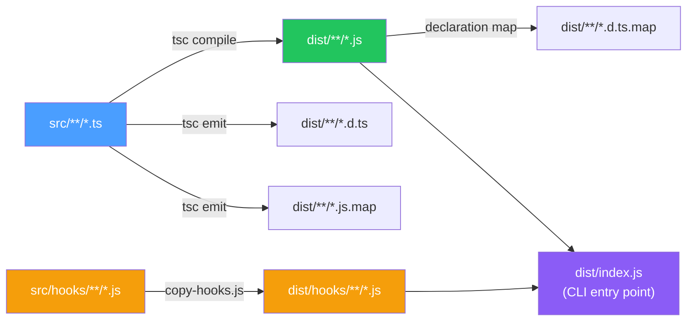
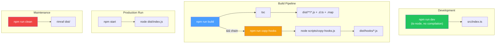

Claude AI Switcher ships as a TypeScript CLI application that compiles to CommonJS JavaScript before distribution. The build pipeline involves two distinct stages — TypeScript compilation via `tsc`, followed by a custom Node.js script that copies pre-written JavaScript hook files into the output directory. Understanding this pipeline is essential for contributors who need to modify build behavior, debug compilation issues, or add new source artifacts to the project.

## TypeScript Compiler Configuration

The project's TypeScript settings live in [tsconfig.json](tsconfig.json#L1-L19) and establish a strict, ES2020-targeted compilation environment. Every compiler option serves a specific purpose within the CLI tooling context.



The compiler targets **ES2020** with the **CommonJS** module system, producing JavaScript compatible with Node.js 18+ without requiring any transpilation layer. The `rootDir` is set to `./src` and `outDir` to `./dist`, creating a clean source-to-output mapping. The `include` glob `src/**/*` captures all TypeScript files recursively, while `exclude` prevents recompilation of `node_modules` and the `dist` output directory itself.

### Compiler Options Reference

| Option | Value | Rationale |
|--------|-------|-----------|
| `target` | `ES2020` | Matches the Node.js 18+ runtime baseline; supports optional chaining, nullish coalescing natively |
| `module` | `commonjs` | Required for Node.js `require()` interop; `fs-extra`, `commander` expect CommonJS consumers |
| `lib` | `["ES2020"]` | Restricts type definitions to the standard library — no DOM types, since this is a pure Node CLI |
| `strict` | `true` | Enables all strict type-checking flags (`noImplicitAny`, `strictNullChecks`, etc.) |
| `esModuleInterop` | `true` | Allows default-import style for CommonJS modules like `fs-extra` |
| `skipLibCheck` | `true` | Skips type checking of `.d.ts` files from third-party packages for faster builds |
| `forceConsistentCasingInFileNames` | `true` | Prevents case-sensitivity bugs between macOS/Linux (case-sensitive) and Windows (case-insensitive) |
| `resolveJsonModule` | `true` | Enables direct `import` of JSON files — used for reading provider configuration data |
| `declaration` / `declarationMap` | `true` | Emits `.d.ts` files with source maps, enabling IntelliSense for consumers who install the package |
| `sourceMap` | `true` | Emits `.js.map` files for stack trace debugging in the compiled `dist/` output |

Sources: [tsconfig.json](tsconfig.json#L1-L19)

### The Dual-Stage Compilation Problem

A critical architectural decision drives the build pipeline's complexity: the hooks subsystem contains **plain JavaScript files** that are not TypeScript. The files [src/hooks/token-tracker.js](src/hooks/token-tracker.js#L1-L5) and [src/hooks/visual-enhancements.js](src/hooks/visual-enhancements.js#L1-L5) are hand-written JavaScript designed to run as standalone Node.js scripts inside the `~/.claude/` directory at runtime. The TypeScript compiler's `include` glob (`src/**/*`) only processes `.ts` files by default, so these `.js` files are silently skipped during compilation — they never appear in `dist/`.

This is why the build cannot rely on `tsc` alone. The `copy-hooks` script bridges the gap by copying JavaScript hook files verbatim from source to output, preserving them as executable artifacts alongside the compiled TypeScript.

Sources: [tsconfig.json](tsconfig.json#L17-L18), [src/hooks/token-tracker.js](src/hooks/token-tracker.js#L1-L5)

## npm Scripts: The Complete Lifecycle

The `scripts` section of [package.json](package.json#L19-L25) defines five npm scripts that form the complete development and build lifecycle.



### Script Reference Table

| Script | Command | Purpose | When to Use |
|--------|---------|---------|-------------|
| `build` | `tsc && npm run copy-hooks` | Full production build: compile TypeScript then copy hook files | Before publishing, before `npm link`, before `npm start` |
| `copy-hooks` | `node scripts/copy-hooks.js` | Copies `src/hooks/*.js` → `dist/hooks/` | Run automatically by `build`; rarely invoked directly |
| `start` | `node dist/index.js` | Execute the compiled CLI from the `dist/` output | After `npm run build`; tests the production binary |
| `dev` | `ts-node src/index.ts` | Run TypeScript directly without compilation | Rapid iteration during development |
| `clean` | `rimraf dist` | Delete the entire `dist/` directory | Before a fresh rebuild; troubleshooting stale builds |

Sources: [package.json](package.json#L19-L25)

### The `&&` Chaining Pattern

The `build` script uses the shell `&&` operator to create a sequential two-stage pipeline. The first stage (`tsc`) compiles all TypeScript source files to JavaScript with declaration files and source maps. Only if `tsc` succeeds (exit code 0) does the second stage (`npm run copy-hooks`) execute, copying the JavaScript hook files into the freshly created `dist/` tree. This ordering is deliberate: the `dist/hooks/` target directory must exist before `copy-hooks` runs, and `tsc` creates the base `dist/` structure during compilation.

Note that this `&&` chaining relies on shell semantics. On Windows, npm uses `cmd.exe` which supports `&&` natively, so this pattern works across all supported platforms without additional tooling.

Sources: [package.json](package.json#L20)

## The Hook Copying Script: `copy-hooks.js`

The build pipeline's second stage lives in [scripts/copy-hooks.js](scripts/copy-hooks.js#L1-L16), a 15-line Node.js script that uses `fs-extra` to mirror JavaScript hook files from source to distribution.

The script resolves paths relative to its own location using `__dirname`, making it position-independent. It constructs a source directory pointing at `src/hooks/` and a destination at `dist/hooks/`. The `fs.ensureDirSync` call creates the destination directory if it does not exist (which is the case on a clean build, since `tsc` only processes `.ts` files and leaves the hooks subdirectory uncreated).

The `copySync` operation uses a **filter function** that allows directories to pass through unconditionally but restricts file copies to those with a `.js` extension. This means any TypeScript files, JSON files, or other artifacts that might appear in `src/hooks/` are excluded — only executable JavaScript hooks are propagated to the output.

Sources: [scripts/copy-hooks.js](scripts/copy-hooks.js#L1-L16)

## Development Workflow: `ts-node` vs Compiled Output

The `dev` script leverages [ts-node](https://typestrong.org/ts-node/) to execute TypeScript source files directly via Node.js, bypassing the compilation step entirely. This eliminates the build latency during iterative development — developers can modify a `.ts` file and immediately re-run the CLI without waiting for `tsc`.

However, `ts-node` does **not** handle the hook files either. The `dev` script runs `ts-node src/index.ts`, which means `__dirname` resolves to the `src/hooks/` directory at runtime. The hook manager in [src/hooks/index.ts](src/hooks/index.ts#L18-L19) constructs source paths using `path.join(__dirname, "..", "hooks", ...)`, which correctly points to `src/hooks/` under `ts-node` and to `dist/hooks/` under the compiled binary. This dual-path resolution is what allows the hook installation logic to function identically in both development and production modes.

Sources: [package.json](package.json#L23), [src/hooks/index.ts](src/hooks/index.ts#L18-L19)

## Package Distribution: The `files` Allowlist

When published to npm, the package includes only the files enumerated in the [`files` array](package.json#L9-L18). This allowlist controls exactly what consumers download.

| Included Path | Type | Purpose |
|---------------|------|---------|
| `dist/` | Compiled output | The actual executable JavaScript |
| `src/` | TypeScript source | Source maps reference back to `.ts` files for debugging |
| `scripts/` | Build scripts | Allows post-install customization if needed |
| `tsconfig.json` | Compiler config | Lets consumers extend the project's type settings |
| `AGENTS.md`, `ARCHITECTURE.md`, `CLAUDE.md`, `QWEN.md` | Documentation | AI agent instructions and architecture docs |

The `main` field points to `dist/index.js` as the module entry point, while the `bin` field registers the `claude-switch` command. The shebang line `#!/usr/bin/env node` at the top of [src/index.ts](src/index.ts#L1) is preserved through TypeScript compilation — `tsc` passes it through to the output `.js` file, making `dist/index.js` directly executable when symlinked via `npm link` or installed globally.

Sources: [package.json](package.json#L5-L18), [src/index.ts](src/index.ts#L1)

## Dependencies and the Runtime Contract

### Runtime Dependencies

| Package | Version | Role in the Application |
|---------|---------|------------------------|
| `commander` | `^11.1.0` | CLI argument parsing, subcommand routing |
| `fs-extra` | `^11.2.0` | Promise-based file system operations (used by config, hooks, and build script) |
| `chalk` | `^5.3.0` | Terminal color output for status displays |
| `ora` | `^8.0.1` | Spinner animations for async operations |

### Development Dependencies

| Package | Version | Role in the Build |
|---------|---------|-------------------|
| `typescript` | `^5.3.0` | The `tsc` compiler itself |
| `ts-node` | `^10.9.2` | Direct TypeScript execution for the `dev` script |
| `rimraf` | `^5.0.0` | Cross-platform `rm -rf` for the `clean` script |
| `@types/node` | `^20.10.0` | Node.js type definitions for TypeScript |
| `@types/fs-extra` | `^11.0.4` | Type definitions for `fs-extra` |

The `engines` field enforces **Node.js >= 18.0.0**, which aligns with the ES2020 compilation target. This guarantees that all emitted JavaScript features (optional chaining, `Promise.allSettled`, `BigInt` literals) are natively supported by the runtime without polyfills.

Sources: [package.json](package.json#L41-L56)

## Build Output Structure

After a successful `npm run build`, the `dist/` directory mirrors the `src/` structure with additional emitted artifacts:

```
dist/
├── index.js              # Compiled CLI entry point (with shebang)
├── index.d.ts            # Type declarations
├── index.js.map          # Source map for debugging
├── config.js             # Compiled config module
├── config.d.ts
├── models.js
├── verify.js
├── display.ts
├── clients/
│   ├── claude-code.js
│   ├── claude-code.d.ts
│   └── opencode.js
├── providers/
│   ├── anthropic.js
│   ├── alibaba.js
│   ├── gemini.js
│   ├── glm.js
│   ├── ollama.js
│   └── openrouter.js
└── hooks/                # ← Copied by copy-hooks.js, NOT compiled by tsc
    ├── index.js          # Compiled from index.ts
    ├── token-tracker.js  # Plain JS, copied verbatim
    └── visual-enhancements.js  # Plain JS, copied verbatim
```

The `dist/` directory is listed in [.gitignore](.gitignore#L10-L11), so it is never committed to version control. Every clone requires a fresh `npm install && npm run build` to produce the executable binary.

Sources: [.gitignore](.gitignore#L10-L11), [tsconfig.json](tsconfig.json#L4-L7), [scripts/copy-hooks.js](scripts/copy-hooks.js#L4-L5)

## Common Build Issues and Troubleshooting

| Symptom | Root Cause | Resolution |
|---------|-----------|------------|
| `Error: Cannot find module 'dist/hooks/token-tracker.js'` | Ran `npm start` without building, or build failed before `copy-hooks` ran | Run `npm run build` from project root |
| `dist/hooks/` directory missing after build | `copy-hooks` script failed silently or `tsc` errored | Check that `tsc` exits with code 0; inspect the full build output |
| `src/` TypeScript files appear in `dist/` | Old cache from `tsc` with different settings | Run `npm run clean && npm run build` |
| Hook installation reports "source not found" | Running `dev` mode but hooks expect `dist/` paths | Ensure `__dirname` resolution matches the execution mode |
| Shebang line missing from `dist/index.js` | Extremely old TypeScript versions stripped it | Confirm `typescript >= 5.3.0` is installed |

Sources: [package.json](package.json#L20-L24), [src/hooks/index.ts](src/hooks/index.ts#L48-L49)

## Related Pages

- **[Hook Installation and Lifecycle Management](24-hook-installation-and-lifecycle-management)** — Detailed coverage of how the copied hook files are installed, tracked, and removed at runtime
- **[Cross-Platform Compatibility: macOS, Linux, and Windows](26-cross-platform-compatibility-macos-linux-and-windows)** — How the `&&` chaining pattern, `rimraf`, and `path` module usage ensure cross-platform builds
- **[Adding a New Provider: Step-by-Step Implementation Guide](27-adding-a-new-provider-step-by-step-guides)** — When adding providers, understand how new `.ts` files in `src/providers/` are automatically included by the `tsc` glob without build changes
- **[System Architecture and Module Responsibilities](5-system-architecture-and-module-responsibilities)** — High-level overview of how each compiled module fits into the overall CLI architecture