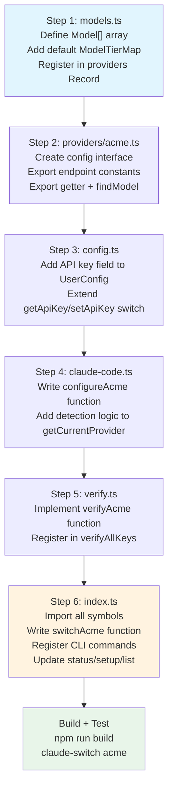

This guide walks through the exact sequence of file modifications required to integrate a new AI provider into Claude AI Switcher. The codebase follows a strict **layered registration pattern**: each provider must be wired through six architectural layers — type definitions, provider module, client adapter, configuration manager, verification, and CLI entry point. Missing any layer produces a partial integration that silently fails at runtime.

## Prerequisites: Understanding the Three Provider Archetypes

Before writing any code, identify which of the three integration archetypes your new provider follows. The archetype determines how many files you'll modify and what infrastructure is required.

| Archetype | Example Providers | API Compatibility | Infrastructure Required |
|---|---|---|---|
| **Direct API** | Alibaba, OpenRouter | Anthropic-compatible endpoint (Messages API) | API key only |
| **LiteLLM Proxy** | Ollama, Gemini | Non-Anthropic format (OpenAI, Google) | LiteLLM + port allocation + proxy lifecycle management |
| **External Delegation** | GLM/Z.AI | Managed by third-party tool | External CLI tool (e.g., `coding-helper`) |

The most common scenario is the **Direct API** archetype. This guide uses a hypothetical provider called "AcmeAI" with an Anthropic-compatible endpoint as the running example, with callouts for the other two archetypes where they diverge.

Sources: [anthropic.ts](src/providers/anthropic.ts#L1-L24), [alibaba.ts](src/providers/alibaba.ts#L1-L44), [ollama.ts](src/providers/ollama.ts#L1-L27), [gemini.ts](src/providers/gemini.ts#L1-L26), [glm.ts](src/providers/glm.ts#L1-L25)

## Implementation Flow Overview

The following diagram traces the six touchpoints and their dependency ordering. Each step depends on the exports of the previous step, so the implementation order is non-commutative.



Sources: [models.ts](src/models.ts#L316-L367), [alibaba.ts](src/providers/alibaba.ts#L1-L44), [config.ts](src/config.ts#L14-L65), [claude-code.ts](src/clients/claude-code.ts#L141-L153), [verify.ts](src/verify.ts#L35-L57), [index.ts](src/index.ts#L158-L195)

## Step 1: Define Models and Register the Provider

**File:** `src/models.ts`

This file is the single source of truth for provider metadata. Three modifications are required: a model array, a default tier map, and an entry in the `providers` Record.

**1a. Declare a model array** following the `Model` interface. Each entry needs an `id` (the exact string Claude Code will send as `ANTHROPIC_MODEL`), a human-readable `name`, `contextWindow` in tokens, a `capabilities` array, and a `description`.

```typescript
export const acmeModels: Model[] = [
  {
    id: "acme-pro",
    name: "Acme Pro",
    contextWindow: 200000,
    capabilities: ["Text Generation", "Deep Thinking", "Code"],
    description: "Acme's flagship reasoning model with 200K context."
  },
  {
    id: "acme-fast",
    name: "Acme Fast",
    contextWindow: 128000,
    capabilities: ["Text Generation", "Fast Responses"],
    description: "Acme's low-latency model for quick tasks."
  }
];
```

**1b. Declare a default tier map** that maps the three Claude Code model tiers — `opus`, `sonnet`, and `haiku` — to specific model IDs from your array. Claude Code reads these as environment variables `ANTHROPIC_DEFAULT_OPUS_MODEL`, `ANTHROPIC_DEFAULT_SONNET_MODEL`, and `ANTHROPIC_DEFAULT_HAIKU_MODEL`.

```typescript
export const ACME_DEFAULT_TIER_MAP: ModelTierMap = {
  opus: "acme-pro",
  sonnet: "acme-fast",
  haiku: "acme-fast"
};
```

**1c. Register the provider** in the `providers` Record at the bottom of the file. The key must match the provider ID used across the entire codebase.

```typescript
export const providers: Record<string, Provider> = {
  // ...existing providers...
  acme: {
    id: "acme",
    name: "Acme AI",
    endpoint: "https://api.acme.ai/v1",
    models: acmeModels
  }
};
```

| Field | Type | Purpose | Used By |
|---|---|---|---|
| `id` | `string` | Canonical provider key | `getModels()`, `getModel()`, CLI routing |
| `name` | `string` | Display name | `displayProviders()`, `displayModels()` |
| `endpoint` | `string?` | API base URL | Optional — informational in the provider Record; the actual endpoint used by Claude Code is set in Step 4 |
| `models` | `Model[]` | Model catalog | `list` command, `models [provider]` command |

> **Dynamic tier maps:** Alibaba uses a function (`getAlibabaTierMap`) instead of a constant because its tier assignments depend on the user's selected model. If your provider needs conditional tier logic, follow that pattern instead of declaring a static `ModelTierMap`.

Sources: [models.ts](src/models.ts#L1-L70), [models.ts](src/models.ts#L316-L367)

## Step 2: Create the Provider Module

**File:** `src/providers/acme.ts` (new file)

Every provider has its own module under `src/providers/` that exports a config interface, endpoint constants, a config getter, and optionally a `findModel` helper. This module is the import surface that `index.ts` and `claude-code.ts` consume.

```typescript
/**
 * Acme AI Provider Configuration
 */

import { providers, acmeModels } from "../models";

export const ACME_PROVIDER = providers.acme;

export interface AcmeConfig {
  provider: "acme";
  apiKey: string;
  model: string;
  endpoint: string;
}

export const ACME_ENDPOINT = "https://api.acme.ai/v1";

export function getAcmeConfig(apiKey: string, model?: string): AcmeConfig {
  return {
    provider: "acme",
    apiKey,
    model: model || "acme-pro",
    endpoint: ACME_ENDPOINT
  };
}

export function getAvailableModels() {
  return acmeModels;
}

export function findModel(modelId: string) {
  return acmeModels.find(m => m.id === modelId);
}
```

**For the LiteLLM proxy archetype**, this module must additionally export infrastructure functions: `isLitellmInstalled()`, `isLitellmProxyRunning()`, and `startLitellmProxy()`. These functions handle spawning the proxy as a detached process, polling the `/health` endpoint, and allocating a port. Study [ollama.ts](src/providers/ollama.ts#L48-L146) and [gemini.ts](src/providers/gemini.ts#L48-L136) for the complete pattern.

**For the external delegation archetype** (GLM), the module exports functions like `isCodingHelperInstalled()` and `reloadGLMConfig()` that shell out to the external tool. See [glm.ts](src/providers/glm.ts#L29-L60).

Sources: [alibaba.ts](src/providers/alibaba.ts#L1-L44), [openrouter.ts](src/providers/openrouter.ts#L1-L43), [ollama.ts](src/providers/ollama.ts#L48-L146), [glm.ts](src/providers/glm.ts#L29-L60)

## Step 3: Extend the Configuration Manager

**File:** `src/config.ts`

The `UserConfig` interface stores API keys in `~/.claude-ai-switcher/config.json`. Add a field for your provider's key, then extend the `getApiKey` and `setApiKey` switch statements.

**Before:**

```typescript
export interface UserConfig {
  alibabaApiKey?: string;
  openrouterApiKey?: string;
  geminiApiKey?: string;
  defaultProvider?: string;
  defaultModel?: string;
}
```

**After:**

```typescript
export interface UserConfig {
  alibabaApiKey?: string;
  openrouterApiKey?: string;
  geminiApiKey?: string;
  acmeApiKey?: string;  // ← new field
  defaultProvider?: string;
  defaultModel?: string;
}
```

Then add a `case` to both `getApiKey` (around line 55) and `setApiKey` (around line 73):

```typescript
// In getApiKey switch:
case "acme":
  return config.acmeApiKey;

// In setApiKey switch:
case "acme":
  config.acmeApiKey = apiKey;
  break;
```

> **Providers without API keys** (Anthropic, Ollama, GLM) skip this step entirely. Anthropic uses the `ANTHROPIC_API_KEY` environment variable; Ollama runs locally without authentication; GLM delegates to `coding-helper`.

Sources: [config.ts](src/config.ts#L14-L20), [config.ts](src/config.ts#L52-L86)

## Step 4: Add the Client Adapter Function

**File:** `src/clients/claude-code.ts`

This file manages `~/.claude/settings.json`. Two modifications are needed: a `configureAcme` function and a detection branch in `getCurrentProvider`.

**4a. Write the configure function.** Each Direct API provider follows an identical pattern: call `ensureOnboardingComplete()`, read existing settings, set three environment variables (`ANTHROPIC_AUTH_TOKEN`, `ANTHROPIC_BASE_URL`, `ANTHROPIC_MODEL`), apply the tier map, and write settings with backup.

```typescript
export async function configureAcme(
  apiKey: string,
  model: string,
  tierMap: ModelTierMap
): Promise<void> {
  await ensureOnboardingComplete();

  const settings = await readClaudeSettings();

  settings.env = settings.env || {};
  settings.env["ANTHROPIC_AUTH_TOKEN"] = apiKey;
  settings.env["ANTHROPIC_BASE_URL"] = "https://api.acme.ai/v1";
  settings.env["ANTHROPIC_MODEL"] = model;

  applyTierMap(settings, tierMap);
  await writeClaudeSettings(settings);
}
```

The following table shows how each provider archetype populates these three environment variables:

| Provider | `ANTHROPIC_AUTH_TOKEN` | `ANTHROPIC_BASE_URL` | `ANTHROPIC_MODEL` |
|---|---|---|---|
| Alibaba | User API key | `https://coding-intl.dashscope...` | Selected model ID |
| OpenRouter | User API key | `https://openrouter.ai/api/v1` | Selected model ID |
| Ollama | `"ollama"` (dummy) | `http://localhost:4000` | Selected model ID |
| Gemini | User API key | `http://localhost:4001` | Selected model ID |
| GLM | *(cleared — managed by coding-helper)* | *(cleared)* | *(cleared)* |
| Anthropic | *(cleared)* | *(cleared)* | *(cleared)* |

**4b. Add detection logic** in `getCurrentProvider()`. This function inspects `settings.json` to infer the active provider by pattern-matching the `ANTHROPIC_BASE_URL` value. Add a branch that matches your endpoint:

```typescript
// Check for Acme via env vars
if (settings.env?.["ANTHROPIC_BASE_URL"]?.includes("api.acme.ai")) {
  return {
    provider: "acme",
    model: settings.env["ANTHROPIC_MODEL"],
    endpoint: settings.env["ANTHROPIC_BASE_URL"],
    tierMap
  };
}
```

The detection order matters: more specific patterns must come before generic ones. Currently, GLM has the most nuanced detection — it checks three independent signals: the `.z.ai` URL pattern, the MCP server entry, and the tier-map-without-URL case.

Sources: [claude-code.ts](src/clients/claude-code.ts#L141-L178), [claude-code.ts](src/clients/claude-code.ts#L204-L250), [claude-code.ts](src/clients/claude-code.ts#L255-L340)

## Step 5: Implement API Key Verification

**File:** `src/verify.ts`

The `status` command calls `verifyAllKeys()` to health-check every provider. Add a verification function and register it.

**5a. Implement the verifier.** Direct API providers make a lightweight GET request to a models-listing endpoint:

```typescript
async function verifyAcme(apiKey: string): Promise<VerifyResult> {
  try {
    const res = await fetchWithTimeout(
      "https://api.acme.ai/v1/models",
      {
        method: "GET",
        headers: { "Authorization": `Bearer ${apiKey}` }
      }
    );

    if (res.ok) {
      return { provider: "acme", status: "ok", message: "Key valid" };
    }
    if (res.status === 401 || res.status === 403) {
      return { provider: "acme", status: "invalid", message: "Authentication failed" };
    }
    return { provider: "acme", status: "error", message: `HTTP ${res.status}` };
  } catch {
    return { provider: "acme", status: "error", message: "Connection failed" };
  }
}
```

**5b. Register in `verifyAllKeys()`.** Add a conditional check following the existing pattern — if the key is provided, push the verification promise; otherwise push a "missing" result:

```typescript
if (keys.acme) {
  checks.push(verifyAcme(keys.acme));
} else {
  checks.push(Promise.resolve({ provider: "acme", status: "missing" }));
}
```

Also extend the `verifyAllKeys` parameter type to include `acme?: string`.

> **Local providers** (Ollama) skip the API key path and instead verify that both the LiteLLM proxy and the local service are reachable via HTTP health checks. See [verify.ts](src/verify.ts#L200-L227).

Sources: [verify.ts](src/verify.ts#L9-L13), [verify.ts](src/verify.ts#L35-L57), [verify.ts](src/verify.ts#L150-L197)

## Step 6: Wire Up CLI Commands

**File:** `src/index.ts`

This is the largest integration step. The entry point imports from all previous layers and wires commands through Commander.js. Five sub-tasks are required.

**6a. Add imports** at the top of the file. Import the tier map from `models.ts`, the configure function from `claude-code.ts`, and any provider-specific functions from your new module:

```typescript
import {
  // ...existing imports...
  ACME_DEFAULT_TIER_MAP
} from "./models";

import {
  // ...existing imports...
  configureAcme as configureClaudeAcme,
} from "./clients/claude-code";

// Optional: from your provider module
import { findModel as findAcmeModel } from "./providers/acme";
```

**6b. Write the `switchAcme` function.** This orchestrates the full provider switch: resolve the API key (prompting if missing), validate the model, build the tier map, call the configure function, and display results. Every switch function follows this skeleton:

```typescript
async function switchAcme(
  model: string | undefined,
  tierOpts: { opus?: string; sonnet?: string; haiku?: string }
): Promise<void> {
  const selectedModel = model || "acme-pro";

  // 1. Resolve API key
  let apiKey = await getApiKey("acme");
  if (!apiKey) {
    apiKey = await promptApiKey("Acme AI", "https://console.acme.ai/api-keys");
    await setApiKey("acme", apiKey);
  }

  // 2. Validate model
  const acmeModels = getModels("acme");
  const validModel = acmeModels.find((m) => m.id === selectedModel);
  if (!validModel) {
    displayError(`Invalid model: ${selectedModel}`);
    console.log(chalk.dim("  Valid models: ") + acmeModels.map((m) => m.id).join(", "));
    process.exit(1);
  }

  // 3. Build tier map with overrides
  const tierMap = buildTierMap(ACME_DEFAULT_TIER_MAP, tierOpts);

  // 4. Configure Claude Code
  await configureClaudeAcme(apiKey, selectedModel, tierMap);

  // 5. Display results
  console.log(chalk.green(`\n✓ Switched to: Acme AI`));
  console.log(chalk.dim("─".repeat(60)));
  console.log(`  ${chalk.cyan.bold("Model:")} ${chalk.white(validModel.name)}`);
  console.log(`  ${chalk.cyan.bold("Context:")} ${chalk.yellow(formatContext(validModel.contextWindow))}`);
  console.log(`  ${chalk.cyan.bold("Endpoint:")} ${chalk.dim("https://api.acme.ai/v1")}`);
  console.log(`  ${chalk.cyan.bold("Capabilities:")} ${chalk.gray(validModel.capabilities.join(", "))}`);
  console.log(chalk.dim(`  ${validModel.description}`));
  console.log();
  displayTierMap(tierMap);
  console.log();
}
```

**6c. Register the top-level command.** Use `addTierOptions()` to attach `--opus`, `--sonnet`, and `--haiku` flags:

```typescript
addTierOptions(
  program
    .command("acme [model]")
    .description("Switch Claude Code to Acme AI")
).action(async (model, options) => {
  try {
    await switchAcme(model, options);
  } catch (error) {
    displayError(error instanceof Error ? error.message : "Failed to switch to Acme AI");
    process.exit(1);
  }
});
```

**6d. Register the explicit-targeting subcommand** under the `claude` command group (for `claude-switch claude acme [model]`). This is a copy of the top-level command with the same action handler.

**6e. Update the informational commands:**

- **`status` command** (around line 843): Add `const acmeKey = await getApiKey("acme");` and include it in the `verifyAllKeys` call.
- **`setup` command** (around line 1031): Add an interactive key-entry block following the pattern used for other providers.
- **`list` / `models` command**: No code changes needed — these iterate over the `providers` Record dynamically, so your Step 1 registration automatically appears.

Sources: [index.ts](src/index.ts#L16-L83), [index.ts](src/index.ts#L100-L143), [index.ts](src/index.ts#L158-L195), [index.ts](src/index.ts#L384-L459), [index.ts](src/index.ts#L843-L858), [index.ts](src/index.ts#L1022-L1077)

## Optional: OpenCode Client Integration

**File:** `src/clients/opencode.ts` and `src/index.ts`

If you want your provider to work with the `opencode add/remove` commands, you must add a `configureAcme` function to the OpenCode client and register the corresponding subcommands. The OpenCode provider schema differs significantly from Claude Code's — it uses a nested JSON structure with `npm` package references, model modalities, and limit specifications:

```typescript
export async function configureAcme(apiKey: string): Promise<void> {
  const settings = await readOpenCodeSettings();
  settings.$schema = "https://opencode.ai/config.json";
  settings.provider = settings.provider || {};
  settings.provider["acme"] = {
    npm: "@ai-sdk/anthropic",
    name: "Acme AI",
    options: {
      baseURL: "https://api.acme.ai/v1",
      apiKey: apiKey
    },
    models: {
      "acme-pro": {
        name: "Acme Pro",
        modalities: { input: ["text"], output: ["text"] },
        limit: { context: 200000, output: 32768 }
      }
    }
  };
  await writeOpenCodeSettings(settings);
}
```

Then register `opencode add acme` and `opencode remove acme` subcommands in `index.ts`, following the exact pattern of the existing add/remove commands.

Sources: [opencode.ts](src/clients/opencode.ts#L73-L67), [index.ts](src/index.ts#L554-L786)

## LiteLLM Proxy Integration Checklist

For providers that speak a non-Anthropic format and require a LiteLLM translation proxy, the following additional work is required beyond the standard six steps:

| Task | Reference Implementation | Key Details |
|---|---|---|
| Allocate a dedicated port | Ollama: `4000`, Gemini: `4001` | Must not conflict with existing proxies |
| Implement `isLitellmInstalled()` | [ollama.ts#L48-L60](src/providers/ollama.ts#L48-L60) | Cross-platform `where`/`which` check |
| Implement `isLitellmProxyRunning()` | [ollama.ts#L99-L111](src/providers/ollama.ts#L99-L111) | Polls `/health` endpoint with 3s timeout |
| Implement `startLitellmProxy()` | [ollama.ts#L116-L146](src/providers/ollama.ts#L116-L146) | Spawns detached process, polls for 5 seconds |
| Add pre-flight checks in switch function | [index.ts#L269-L290](src/index.ts#L269-L290) | Verify LiteLLM + provider service before proceeding |
| Pass API key via environment | [gemini.ts#L112-L119](src/providers/gemini.ts#L112-L119) | `env: { ...process.env, GEMINI_API_KEY: apiKey }` |

Sources: [ollama.ts](src/providers/ollama.ts#L96-L146), [gemini.ts](src/providers/gemini.ts#L98-L136), [index.ts](src/index.ts#L264-L323)

## Build and Verify

After all modifications, build the project and test the new provider:

```bash
npm run build
```

Then verify each integration point works end-to-end:

| Test Command | What It Verifies | Expected Touchpoint |
|---|---|---|
| `claude-switch acme` | Default model switch | Steps 1, 2, 4, 6 |
| `claude-switch acme acme-fast` | Model selection | Step 1 model validation |
| `claude-switch acme --opus acme-pro` | Tier override | Step 6b tier map building |
| `claude-switch key acme <key>` | Key storage | Step 3 config manager |
| `claude-switch status` | Key verification + detection | Steps 4b, 5 |
| `claude-switch list` | Provider visibility | Step 1c registration |
| `claude-switch models acme` | Model catalog | Step 1a model array |
| `claude-switch current` | Active provider detection | Step 4b getCurrentProvider |

Sources: [index.ts](src/index.ts#L960-L996), [index.ts](src/index.ts#L998-L1020)

## Common Pitfalls

**Forgetting `ensureOnboardingComplete()`**: Every `configure*` function in `claude-code.ts` must call this first. Without it, Claude Code shows "Unable to connect to Anthropic services" because `hasCompletedOnboarding` in `~/.claude.json` defaults to false when settings are modified externally.

**Detection ordering in `getCurrentProvider`**: If two providers could match the same URL pattern, only the first branch fires. Always place more specific patterns (e.g., `coding-intl.dashscope.aliyuncs.com`) before generic ones (e.g., any URL containing a port number).

**Missing the `addTierOptions` wrapper**: Commands that support model selection must wrap the Commander chain in `addTierOptions()`. Without it, `--opus`, `--sonnet`, and `--haiku` flags silently fail to register, and the `options` object arrives empty in the action handler.

**Port collisions for proxy providers**: The LiteLLM proxy ports are hardcoded as module-level constants (`OLLAMA_LITELLM_PORT = 4000`, `GEMINI_LITELLM_PORT = 4001`). A new proxy provider must use a different port, or the health check will find the wrong proxy and return stale results.

Sources: [claude-code.ts](src/clients/claude-code.ts#L132-L136), [claude-code.ts](src/clients/claude-code.ts#L273-L339), [index.ts](src/index.ts#L138-L143), [ollama.ts](src/providers/ollama.ts#L25-L27)

## Modification Summary: Files to Touch

The complete checklist of files modified for a Direct API provider integration:

| # | File | Changes Required |
|---|---|---|
| 1 | `src/models.ts` | Model array, tier map constant, `providers` Record entry |
| 2 | `src/providers/acme.ts` | **New file** — config interface, endpoint, getter, findModel |
| 3 | `src/config.ts` | `UserConfig` field, `getApiKey` case, `setApiKey` case |
| 4 | `src/clients/claude-code.ts` | `configureAcme` function, `getCurrentProvider` branch |
| 5 | `src/verify.ts` | `verifyAcme` function, `verifyAllKeys` parameter + registration |
| 6 | `src/index.ts` | Imports, `switchAcme` function, 2 CLI command registrations, status/setup updates |
| 7 | `src/clients/opencode.ts` | *(Optional)* `configureAcme` for OpenCode support |
| 8 | `src/index.ts` | *(Optional)* `opencode add acme` and `opencode remove acme` subcommands |

For deeper context on the architecture these steps fit into, see [System Architecture and Module Responsibilities](5-system-architecture-and-module-responsibilities). For details on the provider switching flow from command to settings write, see [Provider Switching Flow: From Command to Settings Write](6-provider-switching-flow-from-command-to-settings-write). For the specific patterns used by existing Direct API providers, see [Direct API Providers: Anthropic, Alibaba, and OpenRouter](8-direct-api-providers-anthropic-alibaba-and-openrouter).