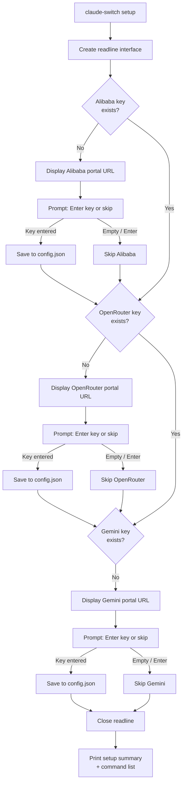
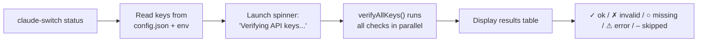

The `claude-switch setup` command launches a guided, step-by-step wizard that walks you through entering API keys for every cloud-based provider. It is designed for first-time users who want to configure all their keys in one pass, but it also serves as a convenient re-entry point whenever you obtain a new key. Each prompt can be skipped with a single keystroke, so you only configure what you need and defer the rest.

Sources: [index.ts](src/index.ts#L1022-L1111)

## Which Providers Need API Keys?

Not every provider requires an API key stored in the switcher's local configuration. The table below maps each provider to its authentication mechanism, the registration portal for obtaining credentials, and whether the setup wizard covers it.

| Provider | Key Stored In Switcher? | Auth Mechanism | Registration URL |
|----------|:-----------------------:|----------------|------------------|
| **Alibaba** (Qwen / Bailian Coding Plan) | ✅ Yes | Bearer token in `~/.claude-ai-switcher/config.json` | `https://modelstudio.console.alibabacloud.com/` |
| **OpenRouter** | ✅ Yes | Bearer token in `~/.claude-ai-switcher/config.json` | `https://openrouter.ai/settings/keys` |
| **Gemini** (Google) | ✅ Yes | API key in `~/.claude-ai-switcher/config.json` | `https://aistudio.google.com/apikey` |
| **Anthropic** | ❌ No | Read from `ANTHROPIC_API_KEY` environment variable | `https://console.anthropic.com/` |
| **GLM / Z.AI** | ❌ No | Managed by `coding-helper` CLI (separate `auth` flow) | N/A — `npm install -g @z_ai/coding-helper` |
| **Ollama** | ❌ No | Local service — no authentication required | N/A |

The setup wizard only prompts for the three providers that store keys locally: **Alibaba**, **OpenRouter**, and **Gemini**. Anthropic relies on the standard `ANTHROPIC_API_KEY` environment variable (which Claude Code reads directly), GLM authenticates through the `coding-helper` CLI tool, and Ollama runs entirely on your machine with no credentials needed.

Sources: [index.ts](src/index.ts#L1022-L1077), [config.ts](src/config.ts#L14-L20), [index.ts](src/index.ts#L164-L171)

## How the Wizard Works: Step-by-Step Flow

The wizard is a sequential, single-session process. It opens one readline interface, checks whether a key already exists for each provider, and only prompts you if the key slot is empty. This means re-running `setup` after configuring some keys will skip those already saved — a no-redundancy design.



Sources: [index.ts](src/index.ts#L1022-L1111)

## Walking Through Each Step

### Step 1: Alibaba API Key

The wizard begins with Alibaba (also known as Qwen / Bailian Coding Plan). If no key is found, it prints a yellow heading, displays the registration portal URL, and prompts for your key. The prompt text explicitly tells you that pressing Enter without typing anything will skip this provider.

```
=== Claude AI Switcher Setup ===

Alibaba Coding Plan Setup
  Get your API key from: https://modelstudio.console.alibabacloud.com/

Enter your Alibaba API Key (or press Enter to skip):
```

If you enter a value, the wizard trims whitespace and calls `setApiKey("alibaba", answer.trim())`, which writes it into the `alibabaApiKey` field of `~/.claude-ai-switcher/config.json`. A green confirmation message appears: **"✓ Alibaba API key saved"**. If you press Enter, the wizard moves on silently — no error, no warning.

Sources: [index.ts](src/index.ts#L1031-L1045), [config.ts](src/config.ts#L70-L86)

### Step 2: OpenRouter API Key

The same pattern repeats for OpenRouter. The `hasApiKey("openrouter")` check guards the prompt, so if you already configured this key (either via the wizard or via `claude-switch key openrouter <key>`), the entire section is skipped. The portal URL shown is `https://openrouter.ai/settings/keys`.

```
OpenRouter Setup
  Get your API key from: https://openrouter.ai/settings/keys

Enter your OpenRouter API Key (or press Enter to skip):
```

Sources: [index.ts](src/index.ts#L1047-L1061), [config.ts](src/config.ts#L56-L64)

### Step 3: Gemini API Key

The final provider covered by the wizard is Google Gemini. The portal URL is `https://aistudio.google.com/apikey`. Like the previous steps, the key is stored in `config.json` under the `geminiApiKey` field and can be skipped freely.

```
Gemini Setup
  Get your API key from: https://aistudio.google.com/apikey

Enter your Gemini API Key (or press Enter to skip):
```

After all three prompts are processed, the readline interface is closed and the wizard prints a comprehensive list of all available `claude-switch` commands, serving as a quick-reference card for your next actions.

Sources: [index.ts](src/index.ts#L1063-L1077), [index.ts](src/index.ts#L1079-L1106)

## Inline Key Prompting During Provider Switches

Beyond the dedicated wizard, Claude AI Switcher provides a second, just-in-time entry point for API keys. Every time you run a provider switch command (e.g., `claude-switch alibaba` or `claude-switch gemini`), the tool checks whether a key exists in local storage. If it doesn't, an inline prompt appears automatically:

```
⚠ Alibaba API Key not found
  Get your API key from: https://modelstudio.console.alibabacloud.com/

Enter your Alibaba API Key:
```

This inline prompt differs from the wizard in two important ways. First, it is **mandatory** — pressing Enter without entering a key causes an immediate error and process exit with the message "API Key is required." Second, it uses a separate `promptApiKey()` function that creates its own readline interface per call, rather than sharing one across multiple providers.

| Aspect | `setup` Wizard | Inline `promptApiKey()` |
|--------|:--------------:|:-----------------------:|
| **Trigger** | Manual: `claude-switch setup` | Automatic: key missing during switch |
| **Can skip?** | ✅ Yes (press Enter) | ❌ No (key required) |
| **Providers covered** | Alibaba, OpenRouter, Gemini | The specific provider being switched to |
| **Readline lifecycle** | Single interface, reused | New interface per call |
| **Stores key?** | ✅ Yes, via `setApiKey()` | ✅ Yes, via `setApiKey()` |

Both paths ultimately call the same `setApiKey()` function, so keys entered through either mechanism land in the same `config.json` file.

Sources: [index.ts](src/index.ts#L100-L118), [index.ts](src/index.ts#L164-L171), [index.ts](src/index.ts#L231-L238), [index.ts](src/index.ts#L348-L355)

## Manual Key Management with the `key` Command

For users who prefer non-interactive workflows — or who want to update a single key without re-running the full wizard — the `key` command provides direct read and write access.

```bash
# Set a key (non-interactive)
claude-switch key alibaba sk-your-key-here
claude-switch key openrouter sk-or-your-key-here
claude-switch key gemini AIza-your-key-here

# Check if a key is set (no value argument)
claude-switch key alibaba
```

When called with two arguments, the command writes the key immediately and prints a green confirmation. When called with just the provider name, it checks `hasApiKey()` and reports whether a key exists — without ever displaying the key itself.

| Command | Effect | Output Example |
|---------|--------|----------------|
| `claude-switch key alibaba <key>` | Saves key to config.json | `✓ API key set for alibaba` |
| `claude-switch key openrouter <key>` | Saves key to config.json | `✓ API key set for openrouter` |
| `claude-switch key gemini <key>` | Saves key to config.json | `✓ API key set for gemini` |
| `claude-switch key alibaba` (no value) | Checks existence | `✓ API key is set for alibaba` or `⚠ No API key set for alibaba` |

This command only works for providers that use the local config store. Attempting to set a key for `anthropic`, `glm`, or `ollama` will not produce an error but will have no effect, since `setApiKey()` has no `case` branch for those providers.

Sources: [index.ts](src/index.ts#L999-L1020), [config.ts](src/config.ts#L70-L94)

## Where Keys Are Stored on Disk

All API keys captured by the wizard, inline prompts, and `key` command are written to a single JSON file at `~/.claude-ai-switcher/config.json`. The configuration directory is created automatically on first write by `fs.ensureDir()`, so you never need to pre-create it.

The file structure is straightforward:

```json
{
  "alibabaApiKey": "sk-your-alibaba-key",
  "openrouterApiKey": "sk-or-your-openrouter-key",
  "geminiApiKey": "AIza-your-gemini-key",
  "defaultProvider": "alibaba",
  "defaultModel": "qwen3.7-plus"
}
```

The `defaultProvider` and `defaultModel` fields exist in the `UserConfig` interface but are not populated by the current wizard — they are reserved for future use. The three `*ApiKey` fields map directly to the providers that the wizard covers.

| Field | Set By | Purpose |
|-------|--------|---------|
| `alibabaApiKey` | Wizard, inline prompt, `key` command | Alibaba Bailian Coding Plan authentication |
| `openrouterApiKey` | Wizard, inline prompt, `key` command | OpenRouter API authentication |
| `geminiApiKey` | Wizard, inline prompt, `key` command | Google Gemini API authentication |
| `defaultProvider` | Reserved (not currently used) | Future default provider persistence |
| `defaultModel` | Reserved (not currently used) | Future default model persistence |

**Important:** This file contains plaintext API keys. It is never encrypted or obfuscated. Treat it with the same security posture as any `.env` file or credentials file on your system.

Sources: [config.ts](src/config.ts#L1-L20), [config.ts](src/config.ts#L24-L47), [config.ts](src/config.ts#L52-L65), [config.ts](src/config.ts#L70-L86)

## Verifying Your Keys After Setup

Once you have entered keys through any of the above methods, the `claude-switch status` command provides an end-to-end verification. It reads all configured keys, makes lightweight HTTP requests to each provider's API (a simple model-listing endpoint, not a full chat completion), and reports status with masked key display:



The verification function runs all checks concurrently via `Promise.all`, with a 5-second timeout per request. Each provider returns one of five status values:

| Status | Icon | Meaning |
|--------|:----:|---------|
| `ok` | ✓ (green) | Key is valid; API responded successfully |
| `invalid` | ✗ (red) | API rejected the key (HTTP 401 or 403) |
| `missing` | ○ (dim) | No key configured in config.json |
| `error` | ⚠ (yellow) | Network failure or unexpected HTTP status |
| `skipped` | – (dim) | Provider not applicable (e.g., GLM not installed) |

This makes `status` the ideal post-setup command to confirm everything is wired correctly before you switch providers.

Sources: [index.ts](src/index.ts#L792-L908), [verify.ts](src/verify.ts#L1-L30), [verify.ts](src/verify.ts#L150-L197)

## What's Next

Now that your API keys are configured, you are ready to switch providers and explore model tiers:

- **[Command Reference: Complete CLI Cheatsheet](4-command-reference-complete-cli-cheatsheet)** — Every command and flag at a glance
- **[API Key Verification: Lightweight HTTP Health Checks](17-api-key-verification-lightweight-http-health-checks)** — Deep dive into how each provider's key is validated
- **[API Key Storage and Local Configuration Management](16-api-key-storage-and-local-configuration-management)** — Detailed internals of the `config.json` read/write lifecycle