Every command in `claude-switch` lives in a single Commander.js program definition. The binary entry point is `claude-switch`, and all subcommands fall into five logical groups: **provider switching** (top-level shortcuts + explicit `claude` subcommand), **OpenCode helper** (`opencode add` / `opencode remove`), **information & diagnostics** (`status`, `current`, `list`, `models`), **key management** (`key`), and **hooks** (`hooks install` / `hooks status` / `hooks reset` / `hooks remove`). Understanding the group structure is the fastest way to internalize the entire CLI surface.

Sources: [index.ts](src/index.ts#L89-L94)

---

## Command Hierarchy at a Glance

The diagram below maps the complete tree of commands. Top-level shortcuts (e.g., `claude-switch alibaba`) are functionally identical to their explicit equivalents under the `claude` subcommand (e.g., `claude-switch claude alibaba`) — both call the same handler function.

```mermaid
graph TD
    Root["claude-switch"]
    
    Root --> SW["Provider Switches<br/>(Claude Code)"]
    Root --> OC["opencode"]
    Root --> INFO["Information"]
    Root --> KEY["key"]
    Root --> SETUP["setup"]
    Root --> HOOKS["hooks"]

    SW --> SW_A["alibaba &lt;model&gt;"]
    SW --> SW_AN["anthropic"]
    SW --> SW_G["glm"]
    SW --> SW_OR["openrouter &lt;model&gt;"]
    SW --> SW_OL["ollama &lt;model&gt;"]
    SW --> SW_GE["gemini &lt;model&gt;"]

    Root --> CL["claude<br/>(explicit targeting)"]
    CL --> CL_A["alibaba &lt;model&gt;"]
    CL --> CL_AN["anthropic"]
    CL --> CL_G["glm"]
    CL --> CL_OR["openrouter &lt;model&gt;"]
    CL --> CL_OL["ollama &lt;model&gt;"]
    CL --> CL_GE["gemini &lt;model&gt;"]

    OC --> OC_ADD["add"]
    OC --> OC_RM["remove"]
    OC_ADD --> A1["alibaba"]
    OC_ADD --> A2["openrouter"]
    OC_ADD --> A3["ollama"]
    OC_ADD --> A4["gemini"]
    OC_ADD --> A5["glm"]
    OC_RM --> R1["alibaba"]
    OC_RM --> R2["openrouter"]
    OC_RM --> R3["ollama"]
    OC_RM --> R4["gemini"]
    OC_RM --> R5["glm"]

    INFO --> ST["status"]
    INFO --> CU["current"]
    INFO --> LI["list"]
    INFO --> MO["models &lt;provider&gt;"]

    KEY --> K1["&lt;provider&gt; &lt;apikey&gt;"]

    HOOKS --> H1["install"]
    HOOKS --> H2["install-token"]
    HOOKS --> H3["install-visual"]
    HOOKS --> H4["status"]
    HOOKS --> H5["reset"]
    HOOKS --> H6["remove"]
    HOOKS --> H7["remove-token"]
    HOOKS --> H8["remove-visual"]
```



Sources: [index.ts](src/index.ts#L384-L1263)

---

## Provider Switch Commands (Top-Level Shortcuts)

These are the commands you will use most often. Each one rewrites Claude Code's `~/.claude/settings.json` file to point at a different AI backend. Commands that accept a `[model]` argument will fall back to a built-in default when you omit it.

| Command | Description | Model Arg? | Default Model | External Dependency |
|---|---|---|---|---|
| `claude-switch anthropic` | Switch to Anthropic native models | No | — | None |
| `claude-switch alibaba [model]` | Switch to Alibaba Coding Plan | Yes | `qwen3.7-plus` | API key |
| `claude-switch glm` | Switch to GLM/Z.AI via coding-helper | No | — | `@z_ai/coding-helper` |
| `claude-switch openrouter [model]` | Switch to OpenRouter | Yes | `qwen/qwen3.6-plus:free` | API key |
| `claude-switch ollama [model]` | Switch to local Ollama models | Yes | `deepseek-r1:latest` | LiteLLM + Ollama running |
| `claude-switch gemini [model]` | Switch to Google Gemini | Yes | `gemini-2.5-pro` | LiteLLM + API key |

Each switch command validates that the requested model exists in the provider's model registry before writing any configuration. If you pass an invalid model ID, the CLI prints the list of valid options and exits with a non-zero code.

Sources: [index.ts](src/index.ts#L384-L459) | [models.ts](src/models.ts#L316-L366)

### Tier Override Options

Six of the provider commands accept the **same three optional flags** to override which underlying model maps to each Claude tier alias. These flags are attached via the `addTierOptions()` helper.

| Flag | Effect | Example |
|---|---|---|
| `--opus <model>` | Override the Opus tier alias | `--opus qwen3-max-2026-01-23` |
| `--sonnet <model>` | Override the Sonnet tier alias | `--sonnet qwen3-coder-plus` |
| `--haiku <model>` | Override the Haiku tier alias | `--haiku glm-4.7-flash` |

The tier flags are available on `alibaba`, `glm`, `openrouter`, `ollama`, and `gemini` — both as top-level shortcuts and under the `claude` subcommand. The `anthropic` command does **not** accept tier overrides because it resets all aliases to Anthropic's native defaults.

```bash
# Example: switch to Alibaba with a custom Opus tier
claude-switch alibaba --opus qwen3-max-2026-01-23

# Example: explicit Claude Code targeting + tier overrides
claude-switch claude openrouter --opus anthropic/claude-3.5-sonnet --haiku openrouter/free
```

Sources: [index.ts](src/index.ts#L138-L143) | [index.ts](src/index.ts#L120-L129)

---

## Explicit `claude` Subcommand

The `claude` subcommand exists for **explicitness and readability**. It provides the identical six provider commands under a `claude` prefix, making scripts and CI pipelines unambiguous about which client is being configured. Every command under `claude` calls the exact same handler functions as the top-level shortcuts.

```bash
# These two commands are functionally identical:
claude-switch alibaba qwen3.7-plus
claude-switch claude alibaba qwen3.7-plus
```

| Command | Equivalent Shortcut |
|---|---|
| `claude-switch claude anthropic` | `claude-switch anthropic` |
| `claude-switch claude alibaba [model]` | `claude-switch alibaba [model]` |
| `claude-switch claude glm` | `claude-switch glm` |
| `claude-switch claude openrouter [model]` | `claude-switch openrouter [model]` |
| `claude-switch claude ollama [model]` | `claude-switch ollama [model]` |
| `claude-switch claude gemini [model]` | `claude-switch gemini [model]` |

All tier override flags (`--opus`, `--sonnet`, `--haiku`) apply identically under the `claude` prefix.

Sources: [index.ts](src/index.ts#L461-L544)

---

## `opencode` Subcommand

The `opencode` subcommand manages providers in OpenCode's configuration file (`~/.config/opencode/opencode.json`). Unlike the Claude Code switches which overwrite the active provider, OpenCode commands **add or remove** providers from a multi-provider list. OpenCode always retains all configured providers simultaneously.

### `opencode add <provider>`

| Command | Provider ID Written | API Key Required | Notes |
|---|---|---|---|
| `claude-switch opencode add alibaba` | `bailian-coding-plan` | Yes (Alibaba) | Includes 9 models |
| `claude-switch opencode add openrouter` | `openrouter` | Yes (OpenRouter) | Includes 2 models |
| `claude-switch opencode add ollama` | `ollama` | No (local) | Requires LiteLLM proxy on port 4000 |
| `claude-switch opencode add gemini` | `gemini` | Yes (Gemini) | Requires LiteLLM proxy on port 4001 |
| `claude-switch opencode add glm` | `glm` | No (auth via coding-helper) | Requires prior `claude-switch glm` run |

If an API key is not yet stored, `add` commands will prompt you interactively before writing the OpenCode configuration. The GLM add command specifically reads the `ANTHROPIC_BASE_URL` and `ANTHROPIC_AUTH_TOKEN` from Claude Code's settings, so you must run `claude-switch glm` first to establish the coding-helper authentication.

Sources: [index.ts](src/index.ts#L550-L697)

### `opencode remove <provider>`

| Command | Provider ID Removed |
|---|---|
| `claude-switch opencode remove alibaba` | `bailian-coding-plan` |
| `claude-switch opencode remove openrouter` | `openrouter` |
| `claude-switch opencode remove ollama` | `ollama` |
| `claude-switch opencode remove gemini` | `gemini` |
| `claude-switch opencode remove glm` | `glm` |

All five remove commands delegate to the same `removeProvider()` function from the OpenCode client module, which surgically removes only the specified provider entry while leaving all other providers intact.

Sources: [index.ts](src/index.ts#L699-L786) | [opencode.ts](src/clients/opencode.ts)

---

## Information & Diagnostic Commands

These commands are read-only and safe to run at any time. None of them modify configuration files.

| Command | What It Shows | Verifies API Keys? |
|---|---|---|
| `claude-switch status` | Current Claude Code + OpenCode config, tier aliases, **and live API key verification** with masked key display | **Yes** |
| `claude-switch current` | Current provider, model, endpoint, and tier aliases for both clients | No |
| `claude-switch list` | All six providers with their model counts and full model details | No |
| `claude-switch models <provider>` | Models for one specific provider only | No |

The `status` command is the most comprehensive diagnostic: it loads keys for all providers, runs HTTP health checks against each endpoint via `verifyAllKeys()`, and displays results with icons (`✓` valid, `✗` invalid, `○` missing, `⚠` error). It also checks for GLM coding-helper presence and Ollama availability.

```bash
# Quick health check with live API key validation
claude-switch status

# See what's currently active across both clients
claude-switch current

# Browse all available models for a specific provider
claude-switch models alibaba
```

Sources: [index.ts](src/index.ts#L792-L908) | [index.ts](src/index.ts#L910-L958) | [index.ts](src/index.ts#L960-L996)

---

## API Key Management

The `key` command provides a non-interactive way to store or check API keys for the three providers that require them. Keys are persisted in `~/.claude-ai-switcher/config.json` and are **never** written to Claude Code or OpenCode settings directly — they are retrieved by the switch commands at runtime.

| Command | Behavior |
|---|---|
| `claude-switch key alibaba` | Check if Alibaba key is set (no key printed) |
| `claude-switch key alibaba sk-xxxx` | Store Alibaba API key |
| `claude-switch key openrouter sk-or-xxxx` | Store OpenRouter API key |
| `claude-switch key gemini AIzaxxxx` | Store Gemini API key |

When called without an API key argument, the command only reports whether a key is configured — it never displays the actual key value. The valid provider names are `alibaba`, `openrouter`, and `gemini`. GLM and Anthropic keys are managed externally (coding-helper auth and environment variable respectively).

Sources: [index.ts](src/index.ts#L998-L1020) | [config.ts](src/config.ts#L52-L94)

---

## Interactive Setup Wizard

```bash
claude-switch setup
```

The `setup` command launches an interactive wizard that walks you through configuring API keys for **Alibaba**, **OpenRouter**, and **Gemini** in sequence. For each provider, it checks whether a key already exists; if not, it prompts you with the relevant signup URL and a text input field. You can press Enter to skip any provider. After collecting keys, it prints a comprehensive command cheatsheet to the terminal for immediate reference.

Sources: [index.ts](src/index.ts#L1022-L1111)

---

## Hooks Subcommand

Hooks extend Claude Code with **token tracking** and **visual enhancements** (model cards and provider banners). These are JavaScript files installed into `~/.claude/` and wired into Claude Code's hooks configuration.

### Installation Commands

| Command | What It Installs | Target Path |
|---|---|---|
| `claude-switch hooks install` | Both token tracker + visual enhancements | `~/.claude/` |
| `claude-switch hooks install-token` | Token tracker only | `~/.claude/token-tracker.js` |
| `claude-switch hooks install-visual` | Visual enhancements only | `~/.claude/visual-enhancements.js` |

### Status & Reset Commands

| Command | Behavior |
|---|---|
| `claude-switch hooks status` | Shows install state of both hooks, current token usage stats, and visual enhancement status |
| `claude-switch hooks reset` | Resets token usage counters to zero |

### Removal Commands

| Command | What It Removes |
|---|---|
| `claude-switch hooks remove` | Both hooks (token tracker + visual enhancements) |
| `claude-switch hooks remove-token` | Token tracker only |
| `claude-switch hooks remove-visual` | Visual enhancements only |

Sources: [index.ts](src/index.ts#L1117-L1261)

---

## Global Options

| Flag | Description |
|---|---|
| `claude-switch --version` | Print the installed version (read from package.json at runtime) |
| `claude-switch --help` | Show all available commands and options |
| `claude-switch <command> --help` | Show help for a specific subcommand |

The version is dynamically read from `package.json` at runtime by resolving the path relative to the compiled `dist/index.js` file, ensuring `--version` never drifts from the actual package version.

Sources: [index.ts](src/index.ts#L85-L94)

---

## Valid Model IDs by Provider

When using `[model]` arguments or `--opus` / `--sonnet` / `--haiku` flags, you must supply a valid model ID from the registry below.

| Provider | Valid Model IDs |
|---|---|
| **Alibaba** | `qwen3.7-plus`, `qwen3.6-plus`, `qwen3-max-2026-01-23`, `qwen3-coder-next`, `qwen3-coder-plus`, `glm-5`, `glm-4.7`, `glm-4.7-flash`, `kimi-k2.5`, `MiniMax-M2.5` |
| **GLM/Z.AI** | `glm-5.2[1m]`, `glm-5v-turbo`, `glm-5-turbo`, `glm-5.1`, `glm-4.7`, `glm-4.7-flash` |
| **OpenRouter** | `qwen/qwen3.6-plus:free`, `openrouter/free` |
| **Ollama** | `deepseek-r1:latest`, `qwen2.5-coder:latest`, `llama3.1:latest`, `codellama:latest` |
| **Gemini** | `gemini-2.5-pro`, `gemini-2.5-flash`, `gemini-2.5-flash-lite` |

Sources: [models.ts](src/models.ts#L83-L275)

---

## Quick Decision Guide

| You want to… | Run this |
|---|---|
| Switch Claude Code to a different provider | `claude-switch <provider> [model]` |
| Use explicit, scriptable syntax | `claude-switch claude <provider> [model]` |
| Add a provider to OpenCode | `claude-switch opencode add <provider>` |
| Remove a provider from OpenCode | `claude-switch opencode remove <provider>` |
| Check what's active + verify keys | `claude-switch status` |
| Override model tier aliases | Append `--opus <model>` / `--sonnet <model>` / `--haiku <model>` |
| Set an API key non-interactively | `claude-switch key <provider> <key>` |
| Install token tracking & visual polish | `claude-switch hooks install` |
| First-time setup with guided prompts | `claude-switch setup` |

---

## Where to Go Next

Now that you have the full command surface mapped, these pages dive deeper into the mechanics behind each command group:

- **[System Architecture and Module Responsibilities](5-system-architecture-and-module-responsibilities)** — Understand how commands flow through the module hierarchy.
- **[Provider Switching Flow: From Command to Settings Write](6-provider-switching-flow-from-command-to-settings-write)** — Trace exactly what happens when you run a switch command.
- **[Model Tier Aliases: Opus, Sonnet, and Haiku Mapping](13-model-tier-aliases-opus-sonnet-and-haiku-mapping)** — Deep dive into how the `--opus`, `--sonnet`, and `--haiku` flags resolve to model names.
- **[Hook Installation and Lifecycle Management](24-hook-installation-and-lifecycle-management)** — How the `hooks` subcommands install and manage JavaScript hooks.
- **[Quick Start: Installation and First Provider Switch](2-quick-start-installation-and-first-provider-switch)** — If you haven't installed yet, start here.