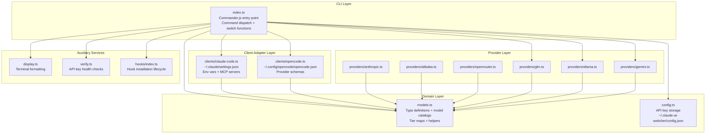

Claude AI Switcher is a Node.js CLI tool that reconfigures AI coding assistants — primarily **Claude Code** and **OpenCode** — to route their API traffic through alternative model providers. Rather than acting as a runtime proxy, it **rewrites configuration files on disk** so that the target tool natively connects to the chosen provider. Understanding this distinction is critical: the tool orchestrates a *switch*, not a *relay*.

The system is organized into five logical layers — CLI orchestration, domain models, client adapters, provider modules, and auxiliary services — that flow in a unidirectional dependency chain. This page maps each module's responsibilities, the data contracts between them, and the architectural patterns that govern the codebase.

Sources: [index.ts](src/index.ts#L1-L94), [package.json](package.json#L1-L57)

## High-Level Module Map

The diagram below illustrates how a single `claude-switch` command traverses the layered architecture. Each box represents a module (or module group); arrows indicate the direction of function calls at runtime. Notice that the CLI entry point is the sole orchestrator — it pulls from domain models, delegates writing to client adapters, and consults provider modules for environment checks before any file mutation occurs.



Sources: [index.ts](src/index.ts#L1-L94), [models.ts](src/models.ts#L1-L20), [clients/claude-code.ts](src/clients/claude-code.ts#L1-L15), [clients/opencode.ts](src/clients/opencode.ts#L1-L17), [hooks/index.ts](src/hooks/index.ts#L1-L22), [verify.ts](src/verify.ts#L1-L13)

## Module Responsibility Catalog

The table below summarizes every source module, its architectural role, and the files it manages on disk. The **Dependency Direction** column clarifies which way calls flow — for example, client adapters depend on `models.ts` for type definitions, never the reverse.

| Module | Lines | Role | Files on Disk | Depends On |
|---|---|---|---|---|
| `src/index.ts` | 1264 | CLI entry point — command parsing, switch orchestration, user prompts | None (reads only) | All other modules |
| `src/models.ts` | 367 | Type definitions, model catalogs, tier maps, format helpers | None | None (leaf node) |
| `src/config.ts` | 102 | API key persistence (Alibaba, OpenRouter, Gemini) | `~/.claude-ai-switcher/config.json` | `fs-extra`, `os` |
| `src/clients/claude-code.ts` | 341 | Writes Claude Code configuration — env vars, MCP servers, tier aliases | `~/.claude/settings.json`, `~/.claude.json` | `models.ts` |
| `src/clients/opencode.ts` | 619 | Writes OpenCode provider schemas with model definitions | `~/.config/opencode/opencode.json` | None |
| `src/display.ts` | 152 | Terminal output formatting — tables, status, color coding | None | `chalk` |
| `src/verify.ts` | 259 | Parallel HTTP health checks for API keys and proxy services | None | None |
| `src/hooks/index.ts` | 209 | Copies hook scripts to Claude Code directory, manages lifecycle | `~/.claude/token-tracker.js`, `~/.claude/visual-enhancements.js`, `~/.claude/hooks-config.json` | `fs-extra`, `child_process` |
| `src/providers/*.ts` | 24–147 | Per-provider config, endpoint constants, environment checks | None (stateless) | `models.ts` |

Sources: [index.ts](src/index.ts#L1-L1264), [models.ts](src/models.ts#L1-L367), [config.ts](src/config.ts#L1-L102), [clients/claude-code.ts](src/clients/claude-code.ts#L1-L341), [clients/opencode.ts](src/clients/opencode.ts#L1-L200), [display.ts](src/display.ts#L1-L152), [verify.ts](src/verify.ts#L1-L259), [hooks/index.ts](src/hooks/index.ts#L1-L209)

## The CLI Orchestration Layer

`src/index.ts` is the sole entry point and orchestrator. It uses **Commander.js** to parse arguments and dispatch to switch functions. The file follows a consistent internal structure: a set of `switch*` functions (lines 149–378) that perform the actual provider-switching logic, followed by **Commander command registrations** (lines 384–1263) that bind CLI verbs to those functions.

The CLI organizes commands into three tiers. **Top-level commands** (`alibaba`, `anthropic`, `glm`, `openrouter`, `ollama`, `gemini`) target Claude Code by default for backward compatibility. The **`claude` subcommand** (lines 465–544) provides the same operations with explicit targeting — useful when scripts need unambiguous intent. The **`opencode` subcommand** (lines 550+) follows an `add`/`remove` pattern since OpenCode supports multiple simultaneous providers rather than a single active one.

Each `switch*` function follows a predictable sequence: retrieve or prompt for the API key via `config.ts`, validate the selected model against `models.ts`, build a tier map from defaults and optional overrides, and then delegate the actual file mutation to the appropriate client adapter. For proxy-based providers (Ollama, Gemini), the function additionally calls provider modules to perform pre-flight environment checks and spawn LiteLLM before configuring the client.

Sources: [index.ts](src/index.ts#L149-L378), [index.ts](src/index.ts#L384-L459), [index.ts](src/index.ts#L465-L552)

## The Domain Layer: Models and Configuration

The domain layer consists of two leaf-node modules with zero outbound dependencies on other project source files. This makes them the stable foundation upon which all other layers build.

### Model Registry (`src/models.ts`)

This module defines three core interfaces — `Model`, `Provider`, and `ModelTierMap` — that flow through every other module in the system. The `Model` interface captures a model's `id`, display name, context window size, capabilities list, and human-readable description. The `Provider` interface bundles a provider identity with its model catalog and optional endpoint. `ModelTierMap` maps Claude Code's three tier aliases (opus, sonnet, haiku) to provider-specific model IDs.

The module also exports **static model catalogs** for all six providers (Alibaba, GLM, OpenRouter, Ollama, Gemini, Anthropic) and a `providers` registry object keyed by provider ID. Two helper functions — `getModels(providerId)` and `getModel(providerId, modelId)` — provide safe lookup with graceful degradation (returning `[]` or `undefined` for unknown providers).

Tier maps deserve special attention because they are the **bridge between Claude Code's naming conventions and third-party models**. Each provider has a default `ModelTierMap` constant, and Alibaba uniquely uses a function (`getAlibabaTierMap`) that adjusts tier assignments based on the selected model.

Sources: [models.ts](src/models.ts#L1-L70), [models.ts](src/models.ts#L316-L367)

### API Key Storage (`src/config.ts`)

This module manages a single JSON file at `~/.claude-ai-switcher/config.json`. It stores API keys for three providers that require them — Alibaba, OpenRouter, and Gemini. GLM delegates to the external `coding-helper` CLI (which manages its own credentials), Anthropic uses native env vars, and Ollama runs locally without keys. The `UserConfig` interface defines the shape, and three operations — `getApiKey`, `setApiKey`, `hasApiKey` — provide the full read-write API using a switch-on-provider pattern.

Sources: [config.ts](src/config.ts#L1-L102)

## The Client Adapter Layer

Client adapters are the **translation boundary** between provider-agnostic configuration and the specific file formats each AI coding tool expects. The system currently has two adapters, each targeting a different tool.

### Claude Code Adapter (`src/clients/claude-code.ts`)

This adapter manages two files: `~/.claude/settings.json` (the primary configuration) and `~/.claude.json` (the onboarding state file). The core mechanism is **environment variable injection** into `settings.json`'s `env` object. Three env vars control provider routing:

| Env Var | Purpose |
|---|---|
| `ANTHROPIC_AUTH_TOKEN` | Authentication credential for the target provider |
| `ANTHROPIC_BASE_URL` | API endpoint that Claude Code sends requests to |
| `ANTHROPIC_MODEL` | Default model identifier |

When switching to a provider, the adapter writes these three vars plus the tier alias vars (`ANTHROPIC_DEFAULT_OPUS_MODEL`, `ANTHROPIC_DEFAULT_SONNET_MODEL`, `ANTHROPIC_DEFAULT_HAIKU_MODEL`). When switching to Anthropic (the default), it **deletes** these vars to restore native behavior. The `getCurrentProvider` function performs reverse inference — it inspects which `ANTHROPIC_BASE_URL` value is present to determine the active provider.

Every write operation follows a **backup-before-write** safety pattern: if the target file exists, it is copied to a timestamped `.backup.` suffix before the new content is written. Additionally, `ensureOnboardingComplete()` is called before every provider switch to set `hasCompletedOnboarding: true` in `~/.claude.json`, preventing a "Unable to connect to Anthropic services" error when using non-Anthropic endpoints.

Sources: [clients/claude-code.ts](src/clients/claude-code.ts#L31-L57), [clients/claude-code.ts](src/clients/claude-code.ts#L96-L136), [clients/claude-code.ts](src/clients/claude-code.ts#L141-L250), [clients/claude-code.ts](src/clients/claude-code.ts#L255-L341)

### OpenCode Adapter (`src/clients/opencode.ts`)

OpenCode uses a fundamentally different configuration model. Rather than env-var injection, it expects a **full provider schema** with model definitions in `~/.config/opencode/opencode.json`. Each provider entry includes an npm SDK reference (e.g., `@ai-sdk/anthropic`), base URL, API key, and a nested `models` object where each model declares its modalities, thinking options, and context/output limits.

The adapter also follows the backup-before-write pattern and exposes `add`/`remove` operations since OpenCode supports multiple simultaneous providers (unlike Claude Code's single-active-provider model).

Sources: [clients/opencode.ts](src/clients/opencode.ts#L1-L67), [clients/opencode.ts](src/clients/opencode.ts#L73-L200)

## The Provider Module Layer

Provider modules exist in `src/providers/` and serve two purposes: defining **provider configuration interfaces and endpoint constants**, and performing **environment pre-flight checks** (binary existence, service health, proxy lifecycle). The table below categorizes providers by their connection strategy:

| Provider | Connection Strategy | Key Functions | Port |
|---|---|---|---|
| `anthropic.ts` | Native (no redirection) | `getAnthropicConfig()` | N/A |
| `alibaba.ts` | Direct API (Anthropic-compatible endpoint) | `getAlibabaConfig()`, `findModel()` | N/A |
| `openrouter.ts` | Direct API (Anthropic-compatible endpoint) | `getOpenRouterConfig()`, `findModel()` | N/A |
| `glm.ts` | External CLI delegation (`coding-helper`) | `isCodingHelperInstalled()`, `reloadGLMConfig()` | N/A |
| `ollama.ts` | LiteLLM proxy (protocol translation) | `startLitellmProxy()`, `isOllamaRunning()` | 4000 (proxy), 11434 (Ollama) |
| `gemini.ts` | LiteLLM proxy (protocol translation) | `startGeminiLitellmProxy()`, `isGeminiKeyValid()` | 4001 |

The **direct API providers** (Alibaba, OpenRouter) expose Anthropic-compatible endpoints natively, so no proxy is needed — the adapter simply writes the endpoint URL and API key into Claude Code's env vars. The **LiteLLM proxy providers** (Ollama, Gemini) require a local translation layer because Ollama and Gemini speak OpenAI format, not Anthropic's Messages API. Their provider modules contain spawn-and-health-check logic that starts a detached LiteLLM process and polls its `/health` endpoint for up to 5 seconds. The **GLM provider** is unique in delegating to the `@z_ai/coding-helper` CLI for authentication and configuration reload via `coding-helper auth reload claude`.

All provider modules share a consistent `is*Installed()` pattern using `which`/`where` commands (platform-aware) to verify external binary availability before attempting to use them.

Sources: [providers/anthropic.ts](src/providers/anthropic.ts#L1-L24), [providers/alibaba.ts](src/providers/alibaba.ts#L1-L44), [providers/openrouter.ts](src/providers/openrouter.ts#L1-L43), [providers/glm.ts](src/providers/glm.ts#L1-L61), [providers/ollama.ts](src/providers/ollama.ts#L1-L147), [providers/gemini.ts](src/providers/gemini.ts#L1-L137)

## Auxiliary Services

### Display Layer (`src/display.ts`)

A pure formatting module that wraps `chalk` for colored terminal output. It provides table rendering (`formatTableRow` with column-width calculation), structured display functions for model lists, provider lists, and current status. It also duplicates the `formatContext` helper from `models.ts` for display-specific formatting — a minor redundancy that keeps the display module self-contained.

Sources: [display.ts](src/display.ts#L1-L152)

### Verification Module (`src/verify.ts`)

This module performs **lightweight HTTP health checks** against each provider's API to validate stored API keys. It uses `fetch` with an `AbortController`-based 5-second timeout. The `verifyAllKeys` function aggregates individual verification promises and runs them via `Promise.all` for parallel execution. Each provider has a tailored verification strategy: Alibaba and OpenRouter hit their `/models` endpoints with Bearer auth; Anthropic uses the `x-api-key` header with an API version; Gemini checks the Google Generative Language API; GLM verifies `coding-helper` binary presence; Ollama checks both the LiteLLM proxy and native Ollama service health.

Sources: [verify.ts](src/verify.ts#L1-L197), [verify.ts](src/verify.ts#L200-L259)

### Hooks System (`src/hooks/index.ts`)

The hooks manager copies pre-built JavaScript hook scripts from the package's `dist/hooks/` directory into `~/.claude/`. Two hooks are available: `token-tracker.js` (context usage monitoring) and `visual-enhancements.js` (model cards and provider display). The module tracks installation state in `~/.claude/hooks-config.json` and can execute installed hooks in isolated subprocesses via `execFileSync` for status reporting.

Sources: [hooks/index.ts](src/hooks/index.ts#L1-L84), [hooks/index.ts](src/hooks/index.ts#L121-L209), [scripts/copy-hooks.js](scripts/copy-hooks.js#L1-L16)

## Architectural Patterns

Several consistent patterns emerge across the codebase that are worth documenting as design decisions:

**Backup-before-write** — Every configuration file mutation (both client adapters) creates a timestamped backup copy before overwriting. This ensures recovery is always possible, even if the tool crashes mid-write.

**Switch-then-side-effect ordering** — The `switch*` functions in `index.ts` always complete pre-flight checks (binary existence, service running, proxy startup) *before* mutating any configuration file. If a pre-flight check fails, the process exits with an error and no files are touched. This ordering is visible in the `switchOllama` function, which verifies LiteLLM, Ollama, and model validity before calling `configureClaudeOllama`.

**Reverse-inference detection** — Rather than persisting a "current provider" flag, the system infers the active provider by inspecting the `ANTHROPIC_BASE_URL` value in `settings.json`. This approach is more resilient to external edits but means detection logic must be updated whenever a new endpoint pattern is introduced.

**Parallel verification** — The `verifyAllKeys` function uses `Promise.all` to issue all health checks concurrently, with `Promise.resolve` for missing/skipped providers to maintain a uniform result array.

Sources: [clients/claude-code.ts](src/clients/claude-code.ts#L96-L112), [index.ts](src/index.ts#L264-L323), [clients/claude-code.ts](src/clients/claude-code.ts#L255-L341), [verify.ts](src/verify.ts#L150-L197)

## Dependency Graph Summary

The following table confirms the **strict unidirectional dependency flow** — no circular dependencies exist in the source tree:

```
index.ts ────────┬──> models.ts (leaf)
                 ├──> config.ts (leaf)
                 ├──> clients/claude-code.ts ──> models.ts
                 ├──> clients/opencode.ts (leaf)
                 ├──> providers/*.ts ──────────> models.ts
                 ├──> display.ts (leaf)
                 ├──> verify.ts (leaf)
                 └──> hooks/index.ts (leaf)
```

`models.ts` is the single shared dependency — every module that needs type definitions or model data imports from it. This makes it the most stable module in the system: any change to its interfaces ripples through all adapters and providers.

Sources: [models.ts](src/models.ts#L1-L20), [clients/claude-code.ts](src/clients/claude-code.ts#L1-L10), [providers/alibaba.ts](src/providers/alibaba.ts#L1-L10), [providers/ollama.ts](src/providers/ollama.ts#L1-L15)

## Where to Go Next

Now that you understand the module map and responsibility boundaries, these pages dive deeper into specific subsystems:

- [Provider Switching Flow: From Command to Settings Write](6-provider-switching-flow-from-command-to-settings-write) — traces a single `claude-switch alibaba` invocation through every function call, from CLI parsing to disk write
- [Model and Provider Type Definitions](15-model-and-provider-type-definitions) — exhaustive reference for the `Model`, `Provider`, and `ModelTierMap` interfaces
- [Configuration File Map: Where Everything Lives on Disk](7-configuration-file-map-where-everything-lives-on-disk) — catalog of every file the tool reads, writes, or creates