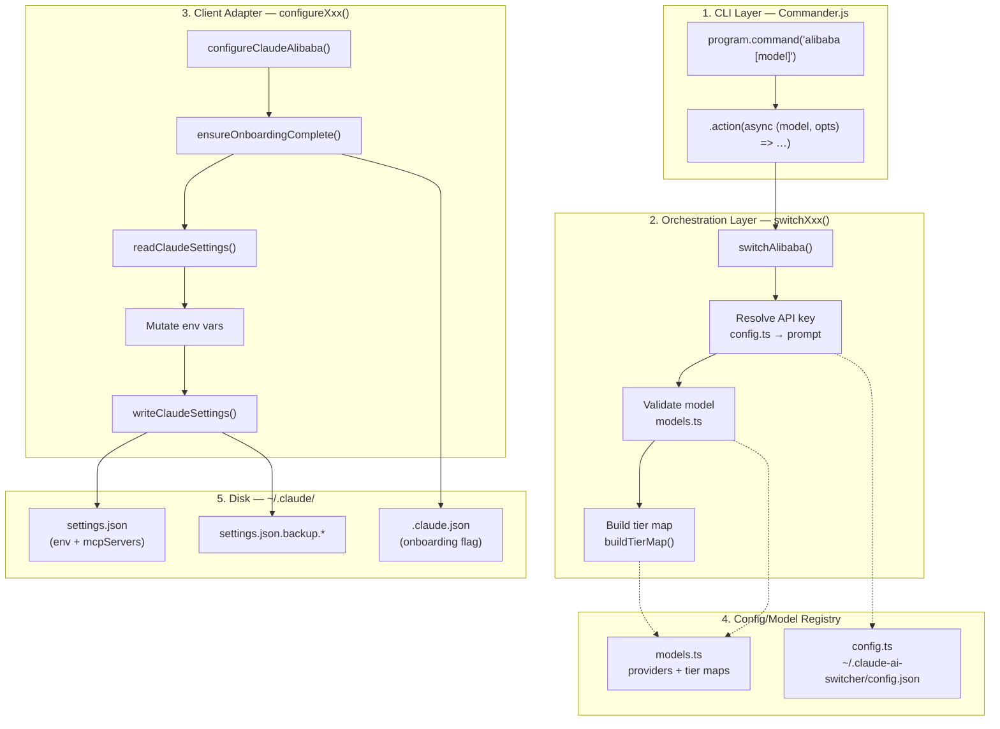
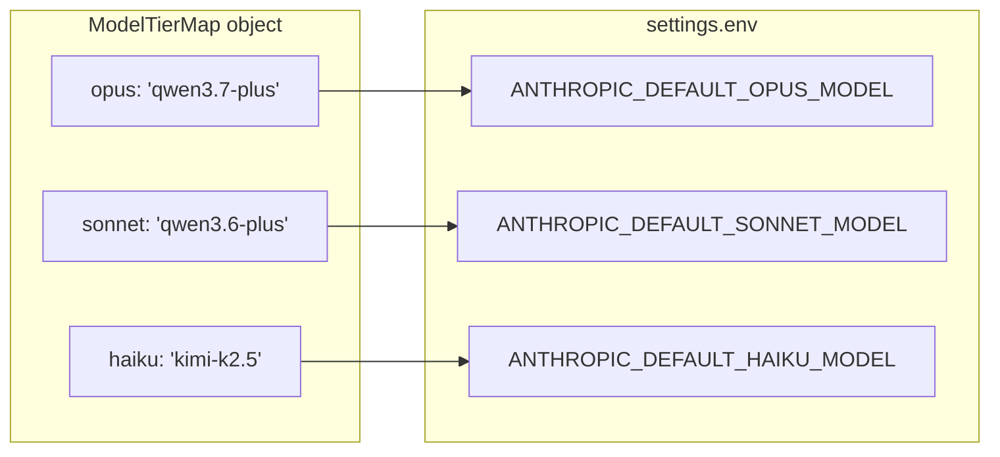
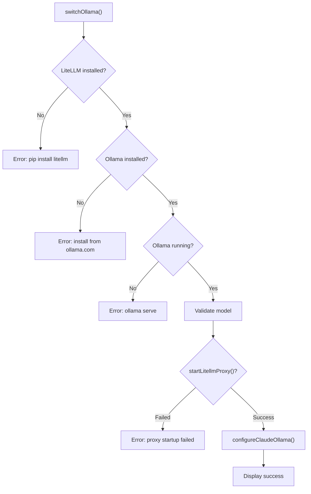

When a developer types `claude-switch alibaba qwen3.7-plus`, a precisely orchestrated pipeline springs into motion: Commander.js parses the command, the orchestration layer resolves credentials and validates the model, a tier map is assembled, and finally the Claude Code client adapter mutates `~/.claude/settings.json` with the exact environment variables that redirect Claude Code's traffic to a non-Anthropic backend. This page traces that pipeline end-to-end, mapping every function boundary and data transformation so you can reason about what each layer does, why it exists, and where things can go wrong.

## The Five-Layer Switching Architecture

The switching flow is not a single monolithic function — it is a **deliberate separation of concerns** across five distinct layers, each with a single responsibility. Understanding this layering is the key to debugging switch failures and extending the system with new providers.



The flow always moves **left-to-right**: the CLI layer never touches disk directly, the orchestration layer never writes to `~/.claude/`, and the client adapter is the sole component with write access to Claude Code's configuration files. This boundary means you can test provider resolution and tier mapping without ever modifying your live Claude Code settings.

Sources: [index.ts](src/index.ts#L384-L395), [claude-code.ts](src/clients/claude-code.ts#L141-L153)

## Layer 1: Command Registration and Argument Parsing

Commander.js serves as the entry point. Each provider gets a top-level command registered on the `program` instance, and most accept an optional `[model]` positional argument plus tier override flags via the shared `addTierOptions()` helper.

| Command | Signature | Model Optional? | Tier Flags? |
|---|---|---|---|
| `alibaba [model]` | Top-level + `claude` subcommand | Yes (default: `qwen3.7-plus`) | Yes |
| `anthropic` | Top-level + `claude` subcommand | No model needed | No |
| `glm` | Top-level + `claude` subcommand | No (uses tier map) | Yes |
| `openrouter [model]` | Top-level + `claude` subcommand | Yes (default: `qwen/qwen3.6-plus:free`) | Yes |
| `ollama [model]` | Top-level + `claude` subcommand | Yes (default: `deepseek-r1:latest`) | Yes |
| `gemini [model]` | Top-level + `claude` subcommand | Yes (default: `gemini-2.5-pro`) | Yes |

The `addTierOptions()` function attaches three optional flags — `--opus`, `--sonnet`, `--haiku` — each accepting a string model identifier. These flags are piped into the action handler's `options` object and passed downstream to the tier map builder.

Every command's `.action()` is a thin wrapper: it catches errors and delegates to the corresponding `switchXxx()` function. The duplication between top-level commands and the `claude` subcommand (e.g., `claude-switch alibaba` vs. `claude-switch claude alibaba`) is intentional — it provides both a shorthand and an explicit-targeting syntax, both invoking the identical underlying `switchAlibaba()` function.

Sources: [index.ts](src/index.ts#L138-L143), [index.ts](src/index.ts#L384-L459)

## Layer 2: The Orchestration Layer — switchXxx() Functions

Each `switchXxx()` function in `index.ts` follows a **convergent pattern** with four phases. While the specific details vary by provider, the skeletal structure is identical, making the code predictable and extensible.

### Phase 1: Credential Resolution

The function first attempts to read the API key from `~/.claude-ai-switcher/config.json` via the `getApiKey()` function. If no key is stored, it drops into an interactive readline prompt, persists the key for future use via `setApiKey()`, and continues. This lazy-prompt pattern means the tool never blocks during `setup` for keys you don't need — it only asks at switch time.

Anthropic is the exception: it requires no API key in the switcher's config because Claude Code uses its own native authentication (`ANTHROPIC_API_KEY` from the environment). GLM is similarly exempt — it delegates authentication to the `coding-helper` MCP server.

### Phase 2: Model Validation

The selected model ID (user-provided or default) is validated against the provider's model registry in `models.ts`. The `getModels()` function looks up the provider by ID in the `providers` record and returns its model array. If the ID doesn't match any entry, the function prints available models and exits with a non-zero code.

### Phase 3: Tier Map Assembly

The `buildTierMap()` helper merges a **provider-specific default tier map** with any CLI overrides. The default maps are defined as constants in `models.ts` (e.g., `OPENROUTER_DEFAULT_TIER_MAP`, `OLLAMA_DEFAULT_TIER_MAP`). Each override flag simply replaces its corresponding tier value — there is no validation that the override model ID is real, because Claude Code itself handles that at runtime.

```typescript
function buildTierMap(
  defaultMap: ModelTierMap,
  opts: { opus?: string; sonnet?: string; haiku?: string }
): ModelTierMap {
  return {
    opus: opts.opus || defaultMap.opus,
    sonnet: opts.sonnet || defaultMap.sonnet,
    haiku: opts.haiku || defaultMap.haiku
  };
}
```

### Phase 4: Client Adapter Invocation

Finally, the `switchXxx()` function calls the corresponding `configureXxx()` function from the client adapter, passing the resolved API key, validated model, and assembled tier map. After the adapter completes, the orchestration layer handles display output — printing model metadata, context window size, endpoint URL, capabilities, and the active tier map.

Sources: [index.ts](src/index.ts#L158-L195), [index.ts](src/index.ts#L120-L136), [models.ts](src/models.ts#L24-L70)

## Layer 3: Client Adapter — configureXxx() Functions

The `claude-code.ts` module is the **single write authority** over `~/.claude/settings.json`. Every `configureXxx()` function follows the same five-step internal protocol, which guarantees consistency regardless of which provider is being configured.

### The Universal Configuration Protocol

| Step | Function Called | Purpose |
|---|---|---|
| 1 | `ensureOnboardingComplete()` | Set `hasCompletedOnboarding: true` in `~/.claude.json` to suppress connection errors |
| 2 | `readClaudeSettings()` | Load existing `~/.claude/settings.json` (or empty object if absent) |
| 3 | Mutate `settings.env` | Set or clear provider-specific environment variables |
| 4 | `applyTierMap()` | Write the three `ANTHROPIC_DEFAULT_*_MODEL` aliases |
| 5 | `writeClaudeSettings()` | Persist with timestamped backup |

The `ensureOnboardingComplete()` step is a **critical safety net**. When Claude Code detects non-Anthropic endpoints without the onboarding flag, it throws "Unable to connect to Anthropic services." By forcing `hasCompletedOnboarding` to `true` on every switch, the adapter preemptively eliminates this failure mode.

Sources: [claude-code.ts](src/clients/claude-code.ts#L128-L153), [claude-code.ts](src/clients/claude-code.ts#L97-L136)

### Provider-Specific Environment Variable Patterns

Despite the shared protocol, each provider writes a **distinct set of environment variables** that determines where Claude Code sends its API requests. These three variables form the core routing mechanism:

| Provider | `ANTHROPIC_AUTH_TOKEN` | `ANTHROPIC_BASE_URL` | `ANTHROPIC_MODEL` |
|---|---|---|---|
| **Alibaba** | User API key | `coding-intl.dashscope.aliyuncs.com/apps/anthropic` | Selected model (e.g., `qwen3.7-plus`) |
| **OpenRouter** | User API key | `openrouter.ai/api/v1` | Selected model (e.g., `qwen/qwen3.6-plus:free`) |
| **Ollama** | `"ollama"` (sentinel) | `http://localhost:4000` | Selected model (e.g., `deepseek-r1:latest`) |
| **Gemini** | User API key | `http://localhost:4001` | Selected model (e.g., `gemini-2.5-pro`) |
| **GLM** | *(cleared)* | *(cleared)* | *(cleared — relies on coding-helper)* |
| **Anthropic** | *(deleted)* | *(deleted)* | *(deleted — returns to native)* |

The Anthropic case is the **inverse operation**: `configureAnthropic()` actively *removes* all three env vars, clears the tier map, and strips the `alibaba-coding-plan` and `glm-coding-plan` MCP server entries. This is how "switching back to Anthropic" works — it's not writing new values, it's surgically deleting the redirect layer.

GLM is unique in that it clears the routing env vars but **still applies a tier map**. This is because GLM/Z.AI authentication is handled externally by the `coding-helper` MCP server, which sets its own `ANTHROPIC_BASE_URL` pointing to a `.z.ai` endpoint. The switcher only controls the model tier aliases in that flow.

Sources: [claude-code.ts](src/clients/claude-code.ts#L141-L250), [claude-code.ts](src/clients/claude-code.ts#L159-L198)

### The Tier Map Write Mechanism

The `applyTierMap()` function is a focused utility that writes exactly three keys into the `settings.env` object. These keys correspond to Claude Code's internal model alias system, where "opus," "sonnet," and "haiku" are abstraction tiers that can be remapped to any model string.



The companion function `clearTierMap()` performs the reverse: it deletes all three keys and, if the `env` object becomes empty as a result, removes the `env` key entirely to keep the settings file clean.

Sources: [claude-code.ts](src/clients/claude-code.ts#L35-L57)

## Layer 4: Safe Persistence with Backup

The `writeClaudeSettings()` function implements a **non-destructive write strategy**. Before overwriting `~/.claude/settings.json`, it creates a timestamped backup copy at `settings.json.backup.<Date.now()>`. This means every switch operation produces a recoverable snapshot — you can always diff the backup against the current file or restore it manually.

The function also calls `fs.ensureDir()` to guarantee `~/.claude/` exists before writing, which handles the case of a fresh system where Claude Code has never been run. The write itself uses `JSON.stringify(settings, null, 2)` for human-readable formatting.

A parallel function, `writeClaudeJson()`, applies the same backup-first pattern to `~/.claude.json` (the onboarding file). Both functions are the **only code paths** that write to Claude Code's configuration directory, concentrating all mutation risk into a single auditable location.

Sources: [claude-code.ts](src/clients/claude-code.ts#L97-L126)

## The Ollama and Gemini Pre-Flight Detour

The Ollama and Gemini providers introduce an **additional orchestration phase** that other providers skip: proxy lifecycle management. Because Ollama speaks its own protocol and Gemini uses Google's API format, both require a LiteLLM proxy to translate requests into the Anthropic-compatible format Claude Code expects.

Before calling `configureClaudeOllama()` or `configureClaudeGemini()`, the respective `switchXxx()` functions perform a sequence of pre-flight checks and proxy startup:



This pre-flight sequence is why switching to Ollama feels slower than switching to Alibaba — the LiteLLM proxy needs to be spawned and health-checked before the settings write can proceed. The proxy URL (`localhost:4000` for Ollama, `localhost:4001` for Gemini) is what gets written into `ANTHROPIC_BASE_URL`, making the proxy transparent to Claude Code.

Sources: [index.ts](src/index.ts#L264-L323), [index.ts](src/index.ts#L325-L378)

## Complete Flow Walkthrough: `claude-switch alibaba qwen3.7-plus`

To solidify the conceptual model, here is the exact call sequence for a single concrete invocation:

| Step | Function | File | What Happens |
|---|---|---|---|
| 1 | Commander.js `.action()` | [index.ts](src/index.ts#L388-L395) | Parses `model="qwen3.7-plus"`, `options={}` |
| 2 | `switchAlibaba("qwen3.7-plus", {})` | [index.ts](src/index.ts#L158) | Enters orchestration layer |
| 3 | `getApiKey("alibaba")` | [config.ts](src/config.ts#L52-L65) | Reads `~/.claude-ai-switcher/config.json` |
| 4 | `getModels("alibaba")` | [models.ts](src/models.ts#L362-L366) | Returns Alibaba model array for validation |
| 5 | `getAlibabaTierMap("qwen3.7-plus")` | [models.ts](src/models.ts#L54-L70) | Produces `{opus:"qwen3.7-plus", sonnet:"qwen3.6-plus", haiku:"kimi-k2.5"}` |
| 6 | `buildTierMap(defaultMap, {})` | [index.ts](src/index.ts#L120-L129) | No overrides → default map passes through |
| 7 | `configureClaudeAlibaba(apiKey, "qwen3.7-plus", tierMap)` | [claude-code.ts](src/clients/claude-code.ts#L141-L153) | Enters client adapter |
| 8 | `ensureOnboardingComplete()` | [claude-code.ts](src/clients/claude-code.ts#L132-L136) | Writes `hasCompletedOnboarding: true` to `~/.claude.json` |
| 9 | `readClaudeSettings()` | [claude-code.ts](src/clients/claude-code.ts#L76-L83) | Loads existing `~/.claude/settings.json` |
| 10 | Mutate `settings.env` | [claude-code.ts](src/clients/claude-code.ts#L146-L151) | Sets `ANTHROPIC_AUTH_TOKEN`, `ANTHROPIC_BASE_URL`, `ANTHROPIC_MODEL` |
| 11 | `applyTierMap()` | [claude-code.ts](src/clients/claude-code.ts#L41-L46) | Sets three `ANTHROPIC_DEFAULT_*_MODEL` env vars |
| 12 | `writeClaudeSettings(settings)` | [claude-code.ts](src/clients/claude-code.ts#L100-L112) | Creates backup, writes JSON to disk |
| 13 | Display output | [index.ts](src/index.ts#L185-L194) | Prints model info, endpoint, tier map to console |

The resulting `settings.json` fragment after this switch would look like:

```json
{
  "env": {
    "ANTHROPIC_AUTH_TOKEN": "sk-xxxxxxxx",
    "ANTHROPIC_BASE_URL": "https://coding-intl.dashscope.aliyuncs.com/apps/anthropic",
    "ANTHROPIC_MODEL": "qwen3.7-plus",
    "ANTHROPIC_DEFAULT_OPUS_MODEL": "qwen3.7-plus",
    "ANTHROPIC_DEFAULT_SONNET_MODEL": "qwen3.6-plus",
    "ANTHROPIC_DEFAULT_HAIKU_MODEL": "kimi-k2.5"
  }
}
```

This is the complete, verifiable artifact of the switching flow — five environment variables that redirect Claude Code's entire API surface from Anthropic to Alibaba's DashScope endpoint while preserving the opus/sonnet/haiku tier abstraction.

Sources: [index.ts](src/index.ts#L158-L195), [claude-code.ts](src/clients/claude-code.ts#L141-L153), [config.ts](src/config.ts#L52-L65)

## Reverse Operation: Switching Back to Anthropic

The `configureAnthropic()` function is the **only configure function that deletes rather than writes**. It performs a surgical cleanup that mirrors what the other providers set up:

First, it removes the `alibaba-coding-plan` and `glm-coding-plan` entries from `settings.mcpServers` if they exist. Then it deletes `ANTHROPIC_AUTH_TOKEN`, `ANTHROPIC_BASE_URL`, and `ANTHROPIC_MODEL` from `settings.env`. Finally, `clearTierMap()` strips the three tier alias keys. The resulting settings file has no provider redirect at all — Claude Code falls back to its native Anthropic authentication and default model selection.

This inverse pattern means switching between providers is always **idempotent**: switching to the same provider twice produces the same final state, and switching to Anthropic always returns to a known-clean baseline regardless of what was configured before.

Sources: [claude-code.ts](src/clients/claude-code.ts#L159-L178), [claude-code.ts](src/clients/claude-code.ts#L48-L57)

## Next Steps

Now that you understand the end-to-end switching pipeline, these pages provide the logical next layers of depth:

- **[Configuration File Map: Where Everything Lives on Disk](7-configuration-file-map-where-everything-lives-on-disk)** — Explore the exact filesystem layout of all configuration files touched during a switch, including backup file naming conventions and cross-platform path resolution.

- **[Claude Code Client: Writing Environment Variables and MCP Servers](20-claude-code-client-writing-environment-variables-and-mcp-servers)** — Deep dive into the `claude-code.ts` module's full API surface, including the MCP server management functions not covered in the switching flow.

- **[Model Tier Aliases: Opus, Sonnet, and Haiku Mapping](13-model-tier-aliases-opus-sonnet-and-haiku-mapping)** — Understand how Claude Code's internal tier system works and why the switcher remaps these abstractions instead of setting a single model.

- **[Provider Detection: Inferring Active Provider from Settings](19-provider-detection-inferring-active-provider-from-settings)** — The reverse of this flow: how `getCurrentProvider()` reads back the settings file to determine which provider is currently active.