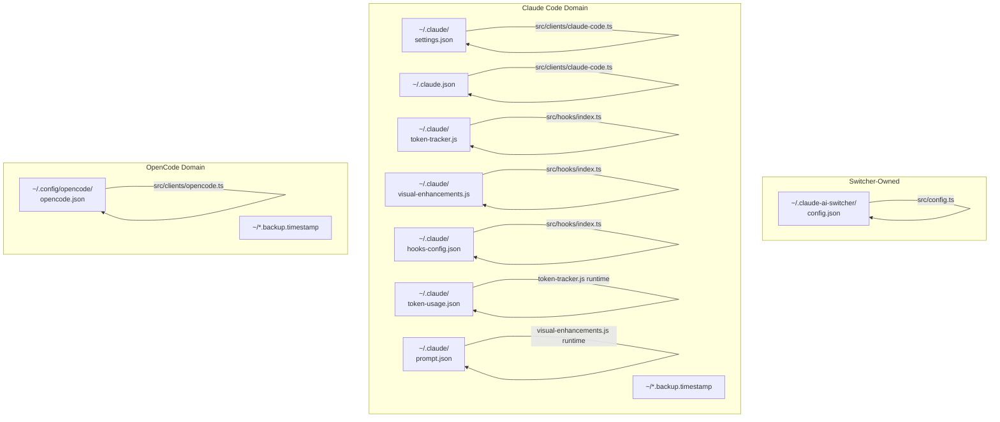

Claude AI Switcher distributes its state across **three distinct directory trees** in the user's home folder. Understanding which file holds what — and which module reads or writes each one — is essential for debugging provider-switching failures, auditing API key storage, or recovering from a corrupted settings file. This page maps every file the tool touches, categorized by ownership domain and lifecycle.

## Directory Architecture at a Glance

The tool writes to three primary locations on disk, each governed by a different source module with its own read/write semantics:



Each domain has independent backup, read, and write logic — a corruption in one does not cascade to the others.

Sources: [config.ts](src/config.ts#L11-L12), [claude-code.ts](src/clients/claude-code.ts#L31-L33), [opencode.ts](src/clients/opencode.ts#L24), [index.ts (hooks)](src/hooks/index.ts#L17-L22)

---

## The Switcher's Own Config: `~/.claude-ai-switcher/config.json`

This is the tool's private registry. It persists API keys for third-party providers and optional default selections. No other application reads this file. The directory is created lazily on first write — there is no initialization step required at install time.

| Field | Type | Purpose |
|-------|------|---------|
| `alibabaApiKey` | `string?` | Alibaba Model Studio API key |
| `openrouterApiKey` | `string?` | OpenRouter API key |
| `geminiApiKey` | `string?` | Google Gemini API key |
| `defaultProvider` | `string?` | Preferred provider name |
| `defaultModel` | `string?` | Preferred model identifier |

The `UserConfig` interface is intentionally sparse — only three providers store keys here because Anthropic uses native auth (no key needed), GLM delegates to the external `coding-helper` CLI, and Ollama runs locally without authentication. When `readConfig()` is called and the file does not exist, it returns an empty object rather than throwing, which means a fresh install gracefully falls back to prompting for keys at switch time.

Sources: [config.ts](src/config.ts#L1-L101)

---

## Claude Code Settings: `~/.claude/settings.json`

This is the **central switching surface**. Every provider switch writes provider-specific environment variables into the `env` object within this file. Claude Code reads these env vars at launch to determine which API endpoint to hit and which model to use.

The following environment variables are written, depending on the active provider:

| Env Var | Written By | Example Value |
|---------|-----------|---------------|
| `ANTHROPIC_AUTH_TOKEN` | Alibaba, OpenRouter, Ollama, Gemini | API key or `"ollama"` |
| `ANTHROPIC_BASE_URL` | All non-Anthropic providers | `https://coding-intl.dashscope.aliyuncs.com/apps/anthropic` |
| `ANTHROPIC_MODEL` | All non-Anthropic providers | `qwen3.7-plus` |
| `ANTHROPIC_DEFAULT_OPUS_MODEL` | All providers (tier map) | `qwen3.7-plus` |
| `ANTHROPIC_DEFAULT_SONNET_MODEL` | All providers (tier map) | `qwen3.6-plus` |
| `ANTHROPIC_DEFAULT_HAIKU_MODEL` | All providers (tier map) | `qwen3-coder-next` |

Switching back to Anthropic performs a **surgical cleanup**: it removes all six of these keys and deletes any `alibaba-coding-plan` or `glm-coding-plan` MCP server entries, restoring native Claude behavior. The tier map keys are removed via `clearTierMap()`, which also deletes the `env` object entirely if it becomes empty after cleanup — ensuring no orphaned empty objects pollute the settings.

Before every write, `writeClaudeSettings()` creates a timestamped backup copy at `~/.claude/settings.json.backup.<Date.now()>`, preserving the exact state before mutation.

Sources: [claude-code.ts](src/clients/claude-code.ts#L31-L57), [claude-code.ts](src/clients/claude-code.ts#L100-L112), [claude-code.ts](src/clients/claude-code.ts#L159-L178)

---

## Claude Onboarding File: `~/.claude.json`

This is Claude Code's top-level application config, not managed by the switcher's directory. The switcher touches exactly one field: `hasCompletedOnboarding`. Before any provider switch, `ensureOnboardingComplete()` reads this file, sets the boolean to `true`, and writes it back — this prevents the "Unable to connect to Anthropic services" onboarding prompt from appearing when a non-Anthropic provider is configured.

The same backup pattern applies: a timestamped copy is written to `~/.claude.json.backup.<Date.now()>` before each mutation. Over time, repeated provider switches accumulate multiple backup files in the home directory root.

Sources: [claude-code.ts](src/clients/claude-code.ts#L33), [claude-code.ts](src/clients/claude-code.ts#L117-L136)

---

## OpenCode Configuration: `~/.config/opencode/opencode.json`

OpenCode uses a different architectural model than Claude Code. Instead of environment variables, it reads a structured JSON schema with `provider` objects containing npm SDK references, base URLs, API keys, and model definitions with context limits and capability metadata.

The switcher writes provider blocks under the `provider` key using stable identifiers:

| Provider Key | npm Package | Base URL |
|-------------|------------|----------|
| `bailian-coding-plan` | `@ai-sdk/anthropic` | `coding-intl.dashscope.aliyuncs.com/apps/anthropic/v1` |
| `openrouter` | `@ai-sdk/openai` | `openrouter.ai/api/v1` |
| `ollama` | `@ai-sdk/openai` | `localhost:4000/v1` |
| `gemini` | `@ai-sdk/openai` | `localhost:4001/v1` |
| `glm` | `@ai-sdk/anthropic` | *(from coding-helper)* |

Each provider entry includes a full model catalog with context windows, output limits, and modality declarations. The `configureAnthropic()` function for OpenCode removes all five provider keys individually and then deletes the `provider` object entirely if it becomes empty — a multi-step cleanup that prevents stale provider definitions from lingering.

As with Claude Code settings, writes are guarded by timestamped backups at `~/.config/opencode/opencode.json.backup.<Date.now()>`.

Sources: [opencode.ts](src/clients/opencode.ts#L23-L67), [opencode.ts](src/clients/opencode.ts#L234-L268), [opencode.ts](src/clients/opencode.ts#L548-L561)

---

## Hook Files: Scripts and State in `~/.claude/`

The hooks subsystem installs two JavaScript files and maintains three JSON state files within the `~/.claude/` directory:

| File | Created By | Lifecycle | Contents |
|------|-----------|-----------|----------|
| `token-tracker.js` | `installTokenTracker()` | Copied from `dist/hooks/` | Token tracking script |
| `visual-enhancements.js` | `installVisualEnhancements()` | Copied from `dist/hooks/` | Model card + prompt generator |
| `hooks-config.json` | `installTokenTracker()` / `installVisualEnhancements()` | Updated on every install/remove | `{tokenTracking, visualEnhancements, customPrompts, lastInstalled}` |
| `token-usage.json` | `token-tracker.js` at runtime | Written during Claude Code sessions | `{totalInputTokens, totalOutputTokens, sessionStart, lastUpdated}` |
| `prompt.json` | `visual-enhancements.js` at runtime | Written on hook initialization | `{system: "..."}` custom system prompt |

The hook scripts are **plain JavaScript files copied verbatim** from the build output — they run independently via `node` subprocess invocation and do not depend on the switcher's TypeScript runtime. The `hooks-config.json` file serves as the switcher's own bookkeeping: `areHooksInstalled()` checks the physical existence of the `.js` files on disk rather than trusting this config, making the state file advisory rather than authoritative.

Sources: [index.ts (hooks)](src/hooks/index.ts#L17-L22), [index.ts (hooks)](src/hooks/index.ts#L34-L118), [token-tracker.js](src/hooks/token-tracker.js#L14), [visual-enhancements.js](src/hooks/visual-enhancements.js#L18)

---

## Backup File Accumulation Pattern

Every write operation across all three domains creates a timestamped backup using `Date.now()` as a suffix. This produces files like:

```
~/.claude/settings.json.backup.1719456789012
~/.claude.json.backup.1719456789012
~/.config/opencode/opencode.json.backup.1719456789012
```

Backups are **append-only** — there is no rotation or cleanup logic. Each provider switch generates two backup files (one for `settings.json`, one for `.claude.json`). Users who switch providers frequently will accumulate dozens of backup files in `~/.claude/` and `~/`.

Sources: [claude-code.ts](src/clients/claude-code.ts#L100-L126), [opencode.ts](src/clients/opencode.ts#L52-L67)

---

## Complete File Inventory

The table below enumerates every file the tool creates, reads, or writes, sorted by directory:

| Path | Read By | Written By | Format |
|------|---------|-----------|--------|
| `~/.claude-ai-switcher/config.json` | `config.ts` | `config.ts` | JSON |
| `~/.claude/settings.json` | `claude-code.ts`, `token-tracker.js`, `visual-enhancements.js` | `claude-code.ts` | JSON |
| `~/.claude/settings.json.backup.*` | — | `claude-code.ts` | JSON (copy) |
| `~/.claude.json` | `claude-code.ts` | `claude-code.ts` | JSON |
| `~/.claude.json.backup.*` | — | `claude-code.ts` | JSON (copy) |
| `~/.claude/token-tracker.js` | `index.ts (hooks)` (existence check) | `index.ts (hooks)` (copy) | JavaScript |
| `~/.claude/visual-enhancements.js` | `index.ts (hooks)` (existence check) | `index.ts (hooks)` (copy) | JavaScript |
| `~/.claude/hooks-config.json` | `index.ts (hooks)` | `index.ts (hooks)` | JSON |
| `~/.claude/token-usage.json` | `token-tracker.js` | `token-tracker.js` | JSON |
| `~/.claude/prompt.json` | — | `visual-enhancements.js` | JSON |
| `~/.config/opencode/opencode.json` | `opencode.ts` | `opencode.ts` | JSON |
| `~/.config/opencode/opencode.json.backup.*` | — | `opencode.ts` | JSON (copy) |

Notice that `settings.json` has three distinct readers: the TypeScript client (for provider switching), the token tracker hook (to detect the active model), and the visual enhancements hook (to detect provider and model for display). These hooks parse the file independently with their own fallback logic, meaning a malformed `settings.json` can produce inconsistent UI state without affecting the actual provider routing.

Sources: [claude-code.ts](src/clients/claude-code.ts#L76-L83), [token-tracker.js](src/hooks/token-tracker.js#L63-L85), [visual-enhancements.js](src/hooks/visual-enhancements.js#L100-L159)

---

## Cross-Platform Path Resolution

All paths are resolved at runtime using `os.homedir()`, which returns the user's home directory on all platforms. On Windows this is typically `C:\Users\<username>`; on macOS/Linux it's `/home/<username>` or `/Users/<username>`. The OpenCode path adds a `.config` subdirectory, following XDG conventions — note that on Windows this creates `~/.config/opencode/` rather than using `%APPDATA%`, which is an intentional choice matching OpenCode's own path resolution.

Sources: [config.ts](src/config.ts#L9-L12), [claude-code.ts](src/clients/claude-code.ts#L9), [opencode.ts](src/clients/opencode.ts#L9-L24)

---

## What to Read Next

- **[API Key Storage and Local Configuration Management](16-api-key-storage-and-local-configuration-management)** — Deep dive into the `config.json` schema, key masking, and the `getApiKey`/`setApiKey` lifecycle.
- **[Safe Configuration: Backup Strategy and Onboarding Auto-Set](18-safe-configuration-backup-strategy-and-onboarding-auto-set)** — How the timestamped backup pattern works and why `hasCompletedOnboarding` is force-set.
- **[Claude Code Client: Writing Environment Variables and MCP Servers](20-claude-code-client-writing-environment-variables-and-mcp-servers)** — The full write path from `configureX()` through `writeClaudeSettings()`.
- **[OpenCode Client: Provider Schema and JSON Configuration](21-opencode-client-provider-schema-and-json-configuration)** — How provider blocks are structured and why the npm SDK reference matters.
- **[Provider Detection: Inferring Active Provider from Settings](19-provider-detection-inferring-active-provider-from-settings)** — How `getCurrentProvider()` reverse-engineers the active provider by pattern-matching `ANTHROPIC_BASE_URL` values.