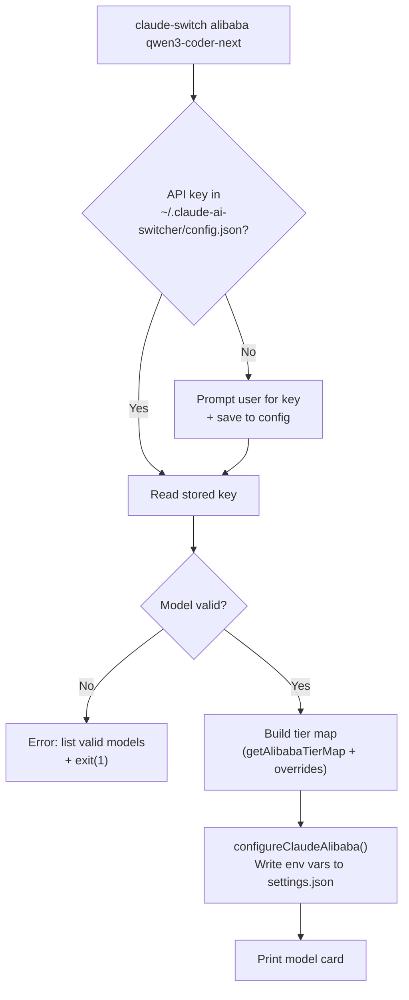

Three providers in Claude AI Switcher operate through **direct cloud API integration** — they require no local proxy process, no MCP server, and no model server. They work by injecting environment variables into `~/.claude/settings.json` that Claude Code reads at startup, routing all requests to an Anthropic-compatible HTTP endpoint. This makes them the simplest and most reliable provider category, with the fastest switching overhead and zero runtime dependencies.

## What Makes a Provider "Direct"

The defining characteristic of these three providers is their **endpoint-only architecture**. Unlike Ollama and Gemini (which spawn a local LiteLLM proxy), or GLM/Z.AI (which depends on the `coding-helper` MCP server), direct providers communicate exclusively with a remote HTTPS endpoint that already speaks the Anthropic Messages API protocol. The switch operation is a pure filesystem write — no process lifecycle management, no health checks, no port allocation.

Sources: [claude-code.ts](src/clients/claude-code.ts#L141-L216)

```mermaid
flowchart LR
    CLI["claude-switch\nCLI command"]
    
    subgraph Switch["Switch Functions (index.ts)"
        style Switch fill:#1a1a2e,stroke:#e94560
    }
        SA["switchAnthropic()"]
        SAL["switchAlibaba()"]
        SO["switchOpenRouter()"]
    end

    subgraph Client["Claude Code Client"
        style Client fill:#1a1a2e,stroke:#0f3460
    }
        CA["configureAnthropic()\nClear env vars"]
        CAL["configureAlibaba()\nSet env vars + tier map"]
        COR["configureOpenRouter()\nSet env vars + tier map"]
    end

    subgraph Settings["~/.claude/settings.json"
        style Settings fill:#1a1a2e,stroke:#16213e
    }
        ENV["env.ANTHROPIC_AUTH_TOKEN\nenv.ANTHROPIC_BASE_URL\nenv.ANTHROPIC_MODEL\nenv.ANTHROPIC_DEFAULT_OPUS_MODEL\nenv.ANTHROPIC_DEFAULT_SONNET_MODEL\nenv.ANTHROPIC_DEFAULT_HAIKU_MODEL"]
    end

    CLI --> SA --> CA --> Settings
    CLI --> SAL --> CAL --> Settings
    CLI --> SO --> COR --> Settings
```

The diagram above traces the call chain for all three providers. Every path terminates at the same destination: `~/.claude/settings.json`. Claude Code itself reads these environment variables at launch time and routes all subsequent API traffic accordingly.

Sources: [claude-code.ts](src/clients/claude-code.ts#L141-L216), [index.ts](src/index.ts#L149-L262)

## Provider Configuration Comparison

Despite sharing the same integration mechanism, each provider differs in authentication requirements, model catalog, and tier mapping strategy.

| Property | Anthropic | Alibaba Coding Plan | OpenRouter |
|---|---|---|---|
| **Provider ID** | `anthropic` | `alibaba` | `openrouter` |
| **Endpoint** | *(native — no override)* | `https://coding-intl.dashscope.aliyuncs.com/apps/anthropic` | `https://openrouter.ai/api/v1` |
| **API Key Required** | No | Yes (`alibabaApiKey`) | Yes (`openrouterApiKey`) |
| **Default Model** | `claude-opus-4-6-20250205` | `qwen3.7-plus` | `qwen/qwen3.6-plus:free` |
| **Model Count** | 5 | 10 | 2 |
| **Tier Map Behavior** | Clears tier env vars | Dynamic per selected model | Static default |
| **Verify Endpoint** | `https://api.anthropic.com/v1/models` | `https://dashscope.aliyuncs.com/compatible-mode/v1/models` | `https://openrouter.ai/api/v1/models` |
| **OpenCode Provider Key** | *(removes all providers)* | `bailian-coding-plan` | `openrouter` |

Sources: [models.ts](src/models.ts#L316-L352), [anthropic.ts](src/providers/anthropic.ts#L18-L23), [alibaba.ts](src/providers/alibaba.ts#L19-L29), [openrouter.ts](src/providers/openrouter.ts#L19-L28), [verify.ts](src/verify.ts#L35-L85)

## Anthropic: The Reset Provider

Anthropic is unique among all providers in Claude AI Switcher because its configuration function is primarily **destructive** — it does not set new values but instead strips away every override that other providers might have left behind. The `configureAnthropic()` function in the Claude Code client removes provider-specific environment variables (`ANTHROPIC_AUTH_TOKEN`, `ANTHROPIC_BASE_URL`, `ANTHROPIC_MODEL`), deletes MCP server entries for `alibaba-coding-plan` and `glm-coding-plan`, and clears all tier map aliases. This makes switching to Anthropic a guaranteed reset to native Claude Code behavior.

The provider module for Anthropic is correspondingly minimal. It exports a simple `AnthropicConfig` interface with an optional `apiKey` and `model` field, and a `getAnthropicConfig()` factory that reads the model from the `ANTHROPIC_MODEL` environment variable (falling back to `claude-opus-4-6-20250205`). No API key handling is performed by the switcher itself because Anthropic authentication is managed natively by Claude Code through its own onboarding and login flow.

Sources: [anthropic.ts](src/providers/anthropic.ts#L1-L24), [claude-code.ts](src/clients/claude-code.ts#L155-L178)

The CLI command takes no arguments and no tier override flags:

```bash
claude-switch anthropic
claude-switch claude anthropic   # explicit targeting
```

Sources: [index.ts](src/index.ts#L149-L156), [index.ts](src/index.ts#L397-L407)

## Alibaba: Multi-Model Aggregation

Alibaba's Coding Plan is the most feature-rich direct provider, offering **ten models** from four different vendors (Qwen, GLM, Kimi, MiniMax) through a single Anthropic-compatible endpoint. The DashScope API at `https://coding-intl.dashscope.aliyuncs.com/apps/anthropic` translates incoming Anthropic Messages API calls into the appropriate backend model format, making the integration transparent to Claude Code.

### Dynamic Tier Mapping

Unlike other providers with a static `ModelTierMap`, Alibaba uses a **model-dependent tier function** called `getAlibabaTierMap(model)`. When the default model `qwen3.7-plus` is selected, the tier map assigns Qwen models across all three tiers. When any other model is selected, that model becomes the opus tier while Qwen fills sonnet and haiku — a design choice that ensures the chosen model receives the most demanding workload.

| Selected Model | Opus Tier | Sonnet Tier | Haiku Tier |
|---|---|---|---|
| `qwen3.7-plus` (default) | `qwen3.7-plus` | `qwen3.6-plus` | `kimi-k2.5` |
| Any other model | *(selected model)* | `qwen3.7-plus` | `qwen3.6-plus` |

Sources: [models.ts](src/models.ts#L54-L70)

### Switch Flow

The `switchAlibaba` function follows a five-step sequence: retrieve the API key from local config (prompting interactively if missing), validate the model against the known catalog, build the tier map with optional `--opus`/`--sonnet`/`--haiku` overrides, call `configureClaudeAlibaba` to write settings, and print a formatted summary card.

Sources: [index.ts](src/index.ts#L158-L195)



Sources: [index.ts](src/index.ts#L158-L195), [claude-code.ts](src/clients/claude-code.ts#L141-L153)

### Available Models

| Model ID | Context Window | Capabilities |
|---|---|---|
| `qwen3.7-plus` | 1,000,000 | Text Generation, Deep Thinking, Visual Understanding |
| `qwen3.6-plus` | 1,000,000 | Text Generation, Deep Thinking, Visual Understanding |
| `qwen3-max-2026-01-23` | 262,144 | Text Generation, Deep Thinking |
| `qwen3-coder-next` | 262,144 | Text Generation, Coding Agent |
| `qwen3-coder-plus` | 1,000,000 | Text Generation, Coding |
| `glm-5` | 200,000 | Text Generation, Deep Thinking |
| `glm-4.7` | 256,000 | Text Generation, Deep Thinking |
| `glm-4.7-flash` | 256,000 | Text Generation, Fast Inference |
| `kimi-k2.5` | 200,000 | Text Generation, Deep Thinking, Visual Understanding |
| `MiniMax-M2.5` | 200,000 | Text Generation, Deep Thinking |

Sources: [models.ts](src/models.ts#L83-L154)

## OpenRouter: Gateway Abstraction

OpenRouter serves as a **routing layer** rather than a model host. Its API endpoint at `https://openrouter.ai/api/v1` accepts Anthropic-format requests and dispatches them to the appropriate backend provider. The switcher's OpenRouter implementation is intentionally lightweight — it ships with only two model definitions, both of which are free-tier entries, though the routing capability means any OpenRouter-supported model can be used via the `--opus`, `--sonnet`, or `--haiku` override flags.

The OpenRouter tier map is static: `qwen/qwen3.6-plus:free` for opus and `openrouter/free` for both sonnet and haiku. This is the only provider where sonnet and haiku share the same model alias.

Sources: [models.ts](src/models.ts#L31-L35), [models.ts](src/models.ts#L202-L218), [openrouter.ts](src/providers/openrouter.ts#L1-L43)

The switch flow mirrors Alibaba's pattern exactly — API key retrieval, model validation, tier map construction, configuration write, and display output — differing only in the endpoint, model catalog, and default model values.

Sources: [index.ts](src/index.ts#L225-L262)

## Environment Variable Injection Mechanism

All three providers ultimately converge on the same three core environment variables injected into `settings.env` within `~/.claude/settings.json`. The table below shows the state of each variable per provider:

| Env Variable | Anthropic | Alibaba | OpenRouter |
|---|---|---|---|
| `ANTHROPIC_AUTH_TOKEN` | *Deleted* | User API key | User API key |
| `ANTHROPIC_BASE_URL` | *Deleted* | `https://coding-intl.dashscope.aliyuncs.com/apps/anthropic` | `https://openrouter.ai/api/v1` |
| `ANTHROPIC_MODEL` | *Deleted* | Selected model ID | Selected model ID |
| `ANTHROPIC_DEFAULT_OPUS_MODEL` | *Deleted* | From tier map | `qwen/qwen3.6-plus:free` |
| `ANTHROPIC_DEFAULT_SONNET_MODEL` | *Deleted* | From tier map | `openrouter/free` |
| `ANTHROPIC_DEFAULT_HAIKU_MODEL` | *Deleted* | From tier map | `openrouter/free` |

Anthropic's "deletion" behavior is the key differentiator — when all six variables are absent, Claude Code falls back to its built-in defaults (native API endpoint, user's authenticated session, standard model aliases).

Sources: [claude-code.ts](src/clients/claude-code.ts#L35-L57), [claude-code.ts](src/clients/claude-code.ts#L141-L216)

## Provider Detection

The `getCurrentProvider()` function in the Claude Code client performs **string matching on the `ANTHROPIC_BASE_URL` value** to infer which direct provider is active. This pattern-matching approach is used because Claude Code's settings format has no explicit provider field. The detection order is significant — Alibaba is checked before OpenRouter, and both are checked before proxy-based providers (Ollama, Gemini) and GLM.

| Detection Pattern | Result |
|---|---|
| `ANTHROPIC_BASE_URL` contains `coding-intl.dashscope.aliyuncs.com` | `alibaba` |
| `ANTHROPIC_BASE_URL` contains `openrouter.ai` | `openrouter` |
| `ANTHROPIC_BASE_URL` contains `localhost:4000` | `ollama` |
| `ANTHROPIC_BASE_URL` contains `localhost:4001` | `gemini` |
| `ANTHROPIC_BASE_URL` contains `.z.ai` | `glm` |
| No `ANTHROPIC_BASE_URL` but tier map present | `glm` |
| Default fallback | `anthropic` |

Sources: [claude-code.ts](src/clients/claude-code.ts#L255-L340)

## API Key Verification

Both Alibaba and OpenRouter support lightweight key verification through `GET` requests to their respective model-listing endpoints. The verification module uses a 5-second timeout via `AbortController` and classifies responses into four states: `ok` (HTTP 200), `invalid` (HTTP 401/403), `error` (other HTTP status or network failure), or `missing` (no key stored). The `verifyAllKeys` function runs all checks in parallel using `Promise.all`.

| Provider | Verify URL | Auth Header |
|---|---|---|
| Alibaba | `https://dashscope.aliyuncs.com/compatible-mode/v1/models` | `Authorization: Bearer <key>` |
| OpenRouter | `https://openrouter.ai/api/v1/models` | `Authorization: Bearer <key>` |

Sources: [verify.ts](src/verify.ts#L7-L30), [verify.ts](src/verify.ts#L35-L85), [verify.ts](src/verify.ts#L150-L197)

Note that the Alibaba verification endpoint differs from the runtime endpoint — verification hits `dashscope.aliyuncs.com` while the coding plan endpoint is `coding-intl.dashscope.aliyuncs.com`. This is a deliberate design choice: the model-listing endpoint is a cheaper, faster check that validates key authenticity without initiating a coding session.

Sources: [alibaba.ts](src/providers/alibaba.ts#L19-L20), [verify.ts](src/verify.ts#L36-L45)

## OpenCode Client Integration

For OpenCode, the three direct providers follow a different configuration schema — JSON provider definitions rather than environment variable injection. Alibaba is registered under the key `bailian-coding-plan` with the `@ai-sdk/anthropic` npm package and a baseURL of `https://coding-intl.dashscope.aliyuncs.com/apps/anthropic/v1`. OpenRouter is registered under the key `openrouter` with the `@ai-sdk/openai` npm package. Anthropic in OpenCode mode removes all custom provider entries, leaving only the built-in Anthropic provider.

The key distinction is that Alibaba uses the **Anthropic SDK adapter** in OpenCode (because its API is Anthropic-compatible) while OpenRouter uses the **OpenAI SDK adapter** (because OpenRouter's `/v1` endpoint follows OpenAI conventions). This asymmetry is invisible when using Claude Code, where both providers use the same environment variable mechanism, but it surfaces in the OpenCode configuration as a different `npm` package reference.

Sources: [opencode.ts](src/clients/opencode.ts#L73-L228), [opencode.ts](src/clients/opencode.ts#L234-L268), [opencode.ts](src/clients/opencode.ts#L377-L419)

## Next Steps

Now that you understand how direct API providers work, explore how the other provider categories handle their more complex integration requirements:

- [LiteLLM Proxy Providers: Ollama and Gemini Protocol Translation](9-litellm-proxy-providers-ollama-and-gemini-protocol-translation) — contrast with the proxy-based approach
- [GLM/Z.AI Provider: coding-helper MCP Integration](11-glm-z-ai-provider-coding-helper-mcp-integration) — the third integration pattern
- [Model Tier Aliases: Opus, Sonnet, and Haiku Mapping](13-model-tier-aliases-opus-sonnet-and-haiku-mapping) — deep dive into the tier system used by all providers
- [API Key Verification: Lightweight HTTP Health Checks](17-api-key-verification-lightweight-http-health-checks) — full verification architecture across all providers