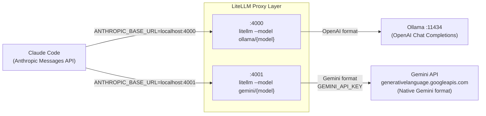
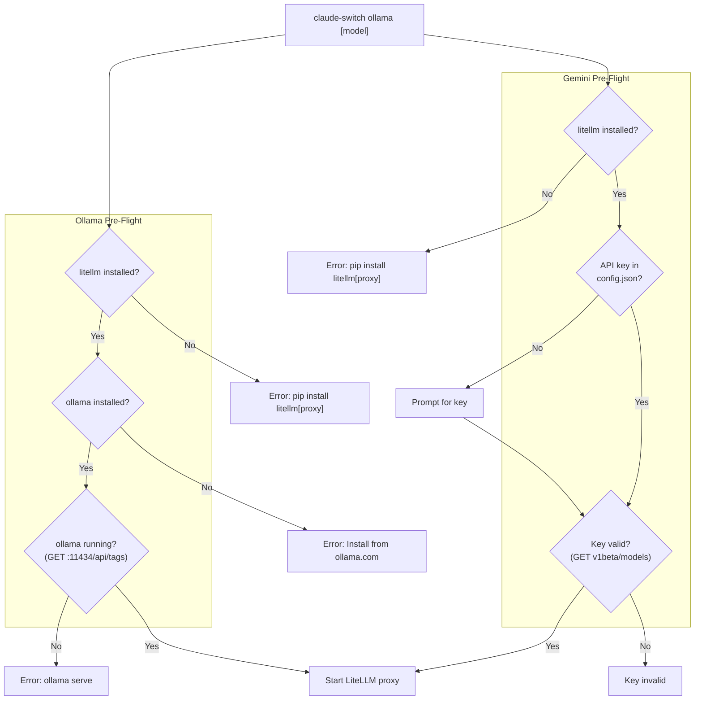
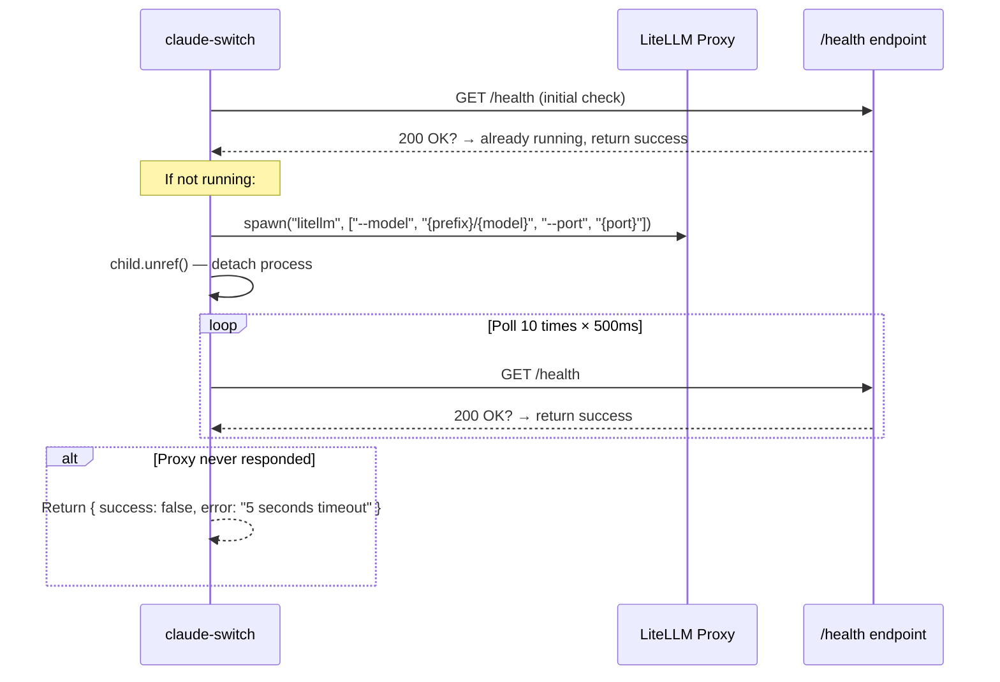

Claude Code communicates exclusively through the Anthropic Messages API, but neither Ollama nor Gemini natively speak that protocol. Ollama serves models via the OpenAI Chat Completions format, and Google's Gemini API uses its own proprietary format. Claude AI Switcher solves this impedance mismatch by inserting a **LiteLLM proxy** between Claude Code and the target model — a lightweight translation server that accepts Anthropic-formatted requests, converts them to the provider's native format, forwards them, and translates the response back. This page dissects how both providers are implemented, from port allocation and proxy spawning through to environment variable injection and cross-client configuration.

Sources: [ARCHITECTURE.md](ARCHITECTURE.md#L132-L146)

## The Protocol Translation Problem

Claude Code expects every provider endpoint to accept requests in the Anthropic Messages API format — structured message objects with `role`/`content` arrays, system prompts as separate parameters, and Anthropic-specific streaming semantics. Direct API providers like Alibaba and OpenRouter avoid this constraint by offering Anthropic-compatible endpoints natively. Ollama and Gemini cannot. Ollama's REST API at `localhost:11434` exposes only the OpenAI Chat Completions schema, and Google's Gemini API at `generativelanguage.googleapis.com` uses an entirely different request/response model centered around `contents` arrays and `part` objects.

LiteLLM closes this gap by running a local HTTP server that presents an Anthropic-compatible interface to Claude Code while internally routing to the upstream provider in its native format. The proxy handles streaming translation, tool-call schema conversion, and error-code mapping transparently.

Sources: [ollama.ts](src/providers/ollama.ts#L1-L12), [gemini.ts](src/providers/gemini.ts#L1-L12), [ARCHITECTURE.md](ARCHITECTURE.md#L49-L51)

## Architectural Overview

The diagram below shows how requests flow from Claude Code through the LiteLLM proxy layer to each provider's native backend. Two isolated proxy instances run on dedicated ports, each configured with a model prefix (`ollama/` or `gemini/`) that tells LiteLLM which upstream API format to target.

Each proxy is an independent process with its own model binding. Claude AI Switcher writes `ANTHROPIC_BASE_URL` in `~/.claude/settings.json` to point Claude Code at the correct local port, and LiteLLM handles the rest.

Sources: [ollama.ts](src/providers/ollama.ts#L25-L27), [gemini.ts](src/providers/gemini.ts#L25-L26), [claude-code.ts](src/clients/claude-code.ts#L221-L250)

## Port Allocation and Constants

The system reserves fixed ports for each proxy instance to avoid conflicts and simplify provider detection. The provider-detection logic in `getCurrentProvider()` identifies which LiteLLM-backed provider is active by matching the port number embedded in `ANTHROPIC_BASE_URL`.

| Constant | Port | Purpose |
|---|---|---|
| `OLLAMA_LITELLM_PORT` | 4000 | LiteLLM proxy for Ollama models |
| `OLLAMA_PORT` | 11434 | Native Ollama API server (pre-existing) |
| `GEMINI_LITELLM_PORT` | 4001 | LiteLLM proxy for Gemini models |

The `OLLAMA_ENDPOINT` and `GEMINI_ENDPOINT` constants store the full `http://localhost:{port}` URLs used both for proxy health checks and for writing into Claude Code's `ANTHROPIC_BASE_URL` environment variable.

Sources: [ollama.ts](src/providers/ollama.ts#L25-L27), [gemini.ts](src/providers/gemini.ts#L25-L26), [claude-code.ts](src/clients/claude-code.ts#L293-L311)

## Provider Comparison: Ollama vs Gemini

Though both providers share the same LiteLLM architecture, their implementations diverge in several important ways driven by their fundamentally different runtime characteristics — Ollama is a local, keyless service; Gemini is a remote, authenticated cloud API.

| Dimension | Ollama | Gemini |
|---|---|---|
| **Upstream location** | `localhost:11434` (local) | `generativelanguage.googleapis.com` (remote) |
| **API key required** | No — uses dummy `"ollama"` | Yes — `GEMINI_API_KEY` passed via env |
| **Model prefix** | `ollama/` | `gemini/` |
| **Spawn shell mode** | `shell: false` | `shell: true` |
| **Pre-flight checks** | LiteLLM installed, Ollama installed, Ollama running | LiteLLM installed, API key valid |
| **Key validation** | N/A (local) | Hits `v1beta/models` endpoint |
| **Default model** | `deepseek-r1:latest` | `gemini-2.5-pro` |
| **OpenCode SDK** | `@ai-sdk/openai` | `@ai-sdk/openai` |

The `shell: true` setting for Gemini's proxy spawn is notable — it allows the process to inherit environment variables more reliably on Windows, which is critical for passing the `GEMINI_API_KEY` through `process.env`. Ollama's spawn uses `shell: false` because it has no credentials to inject.

Sources: [ollama.ts](src/providers/ollama.ts#L116-L146), [gemini.ts](src/providers/gemini.ts#L101-L136), [claude-code.ts](src/clients/claude-code.ts#L221-L250)

## Pre-Flight Validation Pipeline

Both providers enforce a strict pre-flight check sequence before attempting to start the proxy or write settings. The checks gate on different conditions, and any failure exits the process with a diagnostic message and remediation hint.

Ollama's validation is purely infrastructure-focused — it verifies the toolchain (LiteLLM, Ollama binary) and runtime state (Ollama server listening on port 11434). The `isOllamaRunning()` function performs a lightweight `GET` against `/api/tags` with a 3-second timeout, which returns the list of locally installed models if the server is alive.

Gemini's validation is credential-focused. It skips the "is the binary installed" check entirely (there is no local binary) and instead validates the API key against Google's `v1beta/models` endpoint using the `x-goog-api-key` header, with a 5-second timeout.

Sources: [index.ts](src/index.ts#L264-L378), [ollama.ts](src/providers/ollama.ts#L48-L94), [gemini.ts](src/providers/gemini.ts#L48-L79)

## Proxy Spawning and Health-Check Lifecycle

Both providers follow an identical proxy-startup pattern with provider-specific parameters. The process uses Node.js `child_process.spawn` with `detached: true` and `stdio: "ignore"`, followed by `child.unref()` to allow the parent CLI process to exit without waiting for the proxy. The detached proxy then runs as an orphaned background process that persists across CLI invocations.

The health-check polling loop attempts 10 requests at 500-millisecond intervals (5 seconds total) against `/health` on the proxy port. LiteLLM exposes this endpoint natively — it returns `200 OK` once the proxy has initialized its model routing. If the proxy fails to respond within the polling window, the switch function receives a failure result and aborts the provider switch with an error.

A critical optimization: before spawning a new process, both `startLitellmProxy()` and `startGeminiLitellmProxy()` first check `isLitellmProxyRunning()`. If a proxy is already healthy on the target port — perhaps from a previous invocation — the function returns immediately without spawning a duplicate.

Sources: [ollama.ts](src/providers/ollama.ts#L116-L146), [gemini.ts](src/providers/gemini.ts#L101-L136)

For deeper coverage of the spawning mechanics, health-check internals, and port conflict handling, see [LiteLLM Proxy Lifecycle: Spawning, Health Checks, and Port Allocation](10-litellm-proxy-lifecycle-spawning-health-checks-and-port-allocation).

## Claude Code Settings Injection

Once the proxy is confirmed healthy, the switch function calls the client adapter to write environment variables into `~/.claude/settings.json`. Both providers use the same three environment variables — `ANTHROPIC_BASE_URL`, `ANTHROPIC_AUTH_TOKEN`, and `ANTHROPIC_MODEL` — plus the tier-map environment variables that alias Claude Code's `opus`, `sonnet`, and `haiku` tiers to provider-specific model IDs.

| Environment Variable | Ollama Value | Gemini Value |
|---|---|---|
| `ANTHROPIC_BASE_URL` | `http://localhost:4000` | `http://localhost:4001` |
| `ANTHROPIC_AUTH_TOKEN` | `"ollama"` (dummy) | Actual Gemini API key |
| `ANTHROPIC_MODEL` | Selected model (e.g., `deepseek-r1:latest`) | Selected model (e.g., `gemini-2.5-pro`) |
| `ANTHROPIC_DEFAULT_OPUS_MODEL` | `deepseek-r1:latest` | `gemini-2.5-pro` |
| `ANTHROPIC_DEFAULT_SONNET_MODEL` | `qwen2.5-coder:latest` | `gemini-2.5-flash` |
| `ANTHROPIC_DEFAULT_HAIKU_MODEL` | `llama3.1:latest` | `gemini-2.5-flash-lite` |

The dummy auth token for Ollama (`"ollama"`) exists because Claude Code requires *some* value in `ANTHROPIC_AUTH_TOKEN` to avoid falling back to the default Anthropic authentication flow. LiteLLM ignores the token entirely when routing to Ollama since the local Ollama server has no authentication.

Sources: [claude-code.ts](src/clients/claude-code.ts#L221-L250), [models.ts](src/models.ts#L38-L49), [ARCHITECTURE.md](ARCHITECTURE.md#L96-L109)

## Model Catalogs and Tier Maps

Each provider ships with a curated model catalog that informs model selection, context-window display, and capability reporting. The tier maps define how Claude Code's three abstraction levels — Opus (heavy reasoning), Sonnet (balanced), Haiku (fast) — map to concrete provider models.

### Ollama Models

| Model ID | Name | Context Window | Tier |
|---|---|---|---|
| `deepseek-r1:latest` | DeepSeek R1 | 128K | Opus |
| `qwen2.5-coder:latest` | Qwen 2.5 Coder | 128K | Sonnet |
| `llama3.1:latest` | Llama 3.1 | 128K | Haiku |
| `codellama:latest` | Code Llama | 100K | — |

### Gemini Models

| Model ID | Name | Context Window | Tier |
|---|---|---|---|
| `gemini-2.5-pro` | Gemini 2.5 Pro | 1M | Opus |
| `gemini-2.5-flash` | Gemini 2.5 Flash | 1M | Sonnet |
| `gemini-2.5-flash-lite` | Gemini 2.5 Flash Lite | 1M | Haiku |

Users can override any tier mapping at switch time using the `--opus`, `--sonnet`, and `--haiku` flags, which take precedence over the default maps. For details on this override mechanism, see [Custom Tier Overrides with --opus, --sonnet, --haiku Flags](14-custom-tier-overrides-with-opus-sonnet-haiku-flags).

Sources: [models.ts](src/models.ts#L220-L275), [models.ts](src/models.ts#L38-L49)

## OpenCode Client Configuration

When adding Ollama or Gemini to OpenCode, the adapter writes a provider entry into `~/.config/opencode/opencode.json` using the `@ai-sdk/openai` npm package — not `@ai-sdk/anthropic` as direct providers use. This reflects the fact that OpenCode talks to the LiteLLM proxy's OpenAI-compatible endpoint (`/v1` path), while Claude Code talks to the proxy's Anthropic-compatible endpoint (root path).

| Client | Endpoint Path | SDK Package | Why |
|---|---|---|---|
| Claude Code | `http://localhost:4000` (no `/v1`) | N/A (env vars only) | LiteLLM serves Anthropic format at root |
| OpenCode | `http://localhost:4000/v1` | `@ai-sdk/openai` | LiteLLM serves OpenAI format at `/v1` |

Both clients ultimately reach the same LiteLLM proxy process — LiteLLM supports both API formats simultaneously on different paths. This dual-format capability is a key reason the architecture works without running separate proxy instances per client format.

Sources: [opencode.ts](src/clients/opencode.ts#L421-L542), [claude-code.ts](src/clients/claude-code.ts#L221-L250)

## API Key Management Differences

The API key storage and retrieval paths differ significantly between the two providers. Gemini keys are persisted in `~/.claude-ai-switcher/config.json` under the `geminiApiKey` field, retrieved and stored via the generic `getApiKey("gemini")` / `setApiKey("gemini", key)` functions. The key is then passed to both the LiteLLM proxy (via `GEMINI_API_KEY` environment variable at spawn time) and the Claude Code settings (via `ANTHROPIC_AUTH_TOKEN`).

Ollama has no key management at all — the `UserConfig` interface in `config.ts` does not even include an `ollamaApiKey` field. The switch function never calls `getApiKey()` or `promptApiKey()`, and the dummy token `"ollama"` is hardcoded directly in `configureOllama()`.

Sources: [config.ts](src/config.ts#L14-L65), [index.ts](src/index.ts#L264-L378), [claude-code.ts](src/clients/claude-code.ts#L221-L233)

## Gemini-Specific Key Validation

Unlike Ollama (which validates infrastructure), Gemini validates credentials against Google's API before starting the proxy. The `isGeminiKeyValid()` function sends a `GET` request to `https://generativelanguage.googleapis.com/v1beta/models` with the `x-goog-api-key` header set to the provided key. A `200 OK` response confirms the key is active and authorized. This check uses a 5-second timeout (longer than the 3-second timeouts used for local health checks) to account for network latency.

Note that this validation function is defined in the Gemini provider module but is available for import — the switch flow in `index.ts` imports it but the actual call path depends on whether the key was already stored from a previous session or needs interactive prompting.

Sources: [gemini.ts](src/providers/gemini.ts#L63-L79), [index.ts](src/index.ts#L348-L355)

## Provider Detection via Port Inspection

The `getCurrentProvider()` function in the Claude Code client identifies the active LiteLLM-backed provider by pattern-matching the port number in `ANTHROPIC_BASE_URL`. This detection is unambiguous because the ports are hardcoded constants with no overlap:

- `ANTHROPIC_BASE_URL` containing `"localhost:4000"` → **Ollama**
- `ANTHROPIC_BASE_URL` containing `"localhost:4001"` → **Gemini**

The OpenCode client performs equivalent detection by checking for the presence of `provider["ollama"]` or `provider["gemini"]` keys in `opencode.json`, returning the corresponding proxy endpoint (`localhost:4000/v1` or `localhost:4001/v1`).

Sources: [claude-code.ts](src/clients/claude-code.ts#L293-L311), [opencode.ts](src/clients/opencode.ts#L593-L607)

For the full provider-detection algorithm across all six providers, see [Provider Detection: Inferring Active Provider from Settings](19-provider-detection-inferring-active-provider-from-settings).

## Cross-Cutting Implementation Patterns

Both provider modules share several structural patterns worth noting. Each module exports a self-contained interface with configuration builders (`getOllamaConfig` / `getGeminiConfig`), model accessors (`getAvailableModels` / `findModel`), installation checks (`isLitellmInstalled`), proxy lifecycle functions (`isLitellmProxyRunning` / `startLitellmProxy`), and provider-specific health checks. This symmetry means that adding a new LiteLLM-backed provider follows a predictable template — a topic covered in detail at [Adding a New Provider: Step-by-Step Implementation Guide](27-adding-a-new-provider-step-by-step-implementation-guide).

The `isLitellmInstalled()` function is duplicated across both modules rather than shared. It uses platform detection (`platform() === "win32"` → `where litellm` vs `which litellm`) to locate the binary, which is the same cross-platform pattern used throughout the codebase. This duplication exists because each provider module is designed to be independently importable without cross-provider dependencies.

Sources: [ollama.ts](src/providers/ollama.ts#L48-L60), [gemini.ts](src/providers/gemini.ts#L48-L61), [ARCHITECTURE.md](ARCHITECTURE.md#L158-L162)

## Next Steps

Now that you understand how Ollama and Gemini route through the LiteLLM translation layer, these related pages provide deeper context:

- **[LiteLLM Proxy Lifecycle: Spawning, Health Checks, and Port Allocation](10-litellm-proxy-lifecycle-spawning-health-checks-and-port-allocation)** — Detailed mechanics of the `spawn` + `unref` + poll pattern, including failure modes and port-conflict scenarios.
- **[Direct API Providers: Anthropic, Alibaba, and OpenRouter](8-direct-api-providers-anthropic-alibaba-and-openrouter)** — Contrast with providers that skip the proxy entirely by offering native Anthropic-compatible endpoints.
- **[Model Tier Aliases: Opus, Sonnet, and Haiku Mapping](13-model-tier-aliases-opus-sonnet-and-haiku-mapping)** — How the tier map system works across all providers, including the `OLLAMA_DEFAULT_TIER_MAP` and `GEMINI_DEFAULT_TIER_MAP`.
- **[Adding a New Provider: Step-by-Step Implementation Guide](27-adding-a-new-provider-step-by-step-implementation-guide)** — Template for implementing a new LiteLLM-backed provider following the Ollama/Gemini pattern.