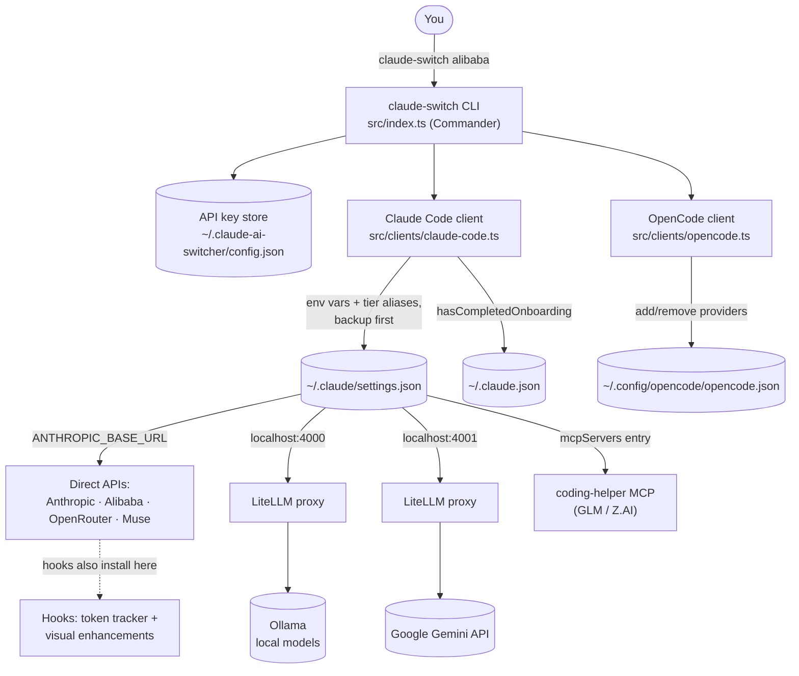

Claude AI Switcher is a Node.js command-line tool that lets you point **Claude Code** — and, with helper commands, **OpenCode** — at seven different AI providers with a single command, instead of hand-editing configuration files. It packages an npm library named `claude-ai-switcher` whose binary is `claude-switch`, currently at version 1.3.0, MIT-licensed, and requiring Node.js 18 or newer. This page explains the problem the tool solves, what it does, how the pieces fit together, and where to go next; it deliberately stays at the "big picture" level, leaving internals to the Deep Dive pages of this wiki.

Sources: [package.json](package.json#L2-L7), [README.md](README.md#L1-L3)

## The Problem It Solves

Claude Code is hard-wired to talk to Anthropic's API through environment variables such as `ANTHROPIC_BASE_URL` and `ANTHROPIC_AUTH_TOKEN` that live in `~/.claude/settings.json`. If you want to run it against Alibaba's Qwen Coding Plan, OpenRouter's free models, Google Gemini, or a fully local Ollama installation, you would normally have to open that JSON file yourself, figure out the correct base URL for each provider, manage API keys in plaintext, remember which model IDs are valid, and — for providers that only speak the OpenAI format — set up and babysit a translation proxy. Doing this repeatedly is error-prone, and one wrong edit can break Claude Code entirely.

**Claude AI Switcher turns that multi-step manual chore into one command.** `claude-switch alibaba` validates or prompts for your API key, verifies your model choice, writes the correct environment variables, backs up your existing settings first, and reports what changed. The same command structure works across all seven providers, so your mental model never changes — only the provider name does.

Sources: [README.md](README.md#L508-L528), [src/clients/claude-code.ts](src/clients/claude-code.ts#L31-L46)

## What It Does at a Glance

The tool is built around a Commander.js CLI (`src/index.ts`) that routes commands to three layers: **client handlers** that edit Claude Code's or OpenCode's config files, **provider modules** that hold each provider's endpoint and setup quirks, and a **local config store** for API keys. When you run a switch command, the CLI may prompt for a missing key, start a LiteLLM proxy (only for Ollama/Gemini), and then write the result into the client's settings file — with a timestamped backup taken before any modification. A good first picture of the everyday surface is the Quick Start block in the README: `claude-switch setup` for the interactive wizard, then top-level commands like `claude-switch alibaba`, `claude-switch ollama`, and `claude-switch anthropic` to switch back.

Sources: [src/index.ts](src/index.ts#L1-L8), [src/index.ts](src/index.ts#L96-L101), [README.md](README.md#L96-L143)

### Feature Highlights

| Feature | What it means for you |
|---|---|
| **Quick switching** | One command per provider: `anthropic`, `glm`, `alibaba`, `openrouter`, `ollama`, `gemini`, `muse` |
| **Model aliases** | Sets `ANTHROPIC_DEFAULT_OPUS/SONNET/HAIKU_MODEL` so Claude Code's tier names always map to a real model |
| **Custom tier overrides** | `--opus`, `--sonnet`, `--haiku` flags pin a specific model per tier |
| **API key verification** | `claude-switch status` checks the current config and validates keys |
| **Local models** | Ollama support for private, local inference (DeepSeek R1, Qwen, Llama…) |
| **Auto proxy management** | LiteLLM translation proxy started automatically for Ollama (port 4000) and Gemini (port 4001) |
| **Token tracking** | Hooks add a color-coded context-usage bar inside Claude Code |
| **Visual enhancements** | Model card, provider info, and active-model display hooks |
| **Secure local storage** | Keys live only in `~/.claude-ai-switcher/config.json` — no cloud sync |
| **Safe configuration** | Timestamped backups of every file before it is modified |
| **Auto onboarding** | Sets `hasCompletedOnboarding: true` to prevent connection errors |
| **OpenCode helper** | `opencode add/remove <provider>` manages entries in `opencode.json` |

Sources: [README.md](README.md#L5-L22), [README.md](README.md#L906-L913)

## The Seven Providers

The provider catalog lives in `src/models.ts` as a typed record: each provider has an ID, display name, optional endpoint, and a list of models with context windows and capabilities. What matters at the overview level is that **the seven providers connect through three different patterns**: direct Anthropic-compatible APIs, LiteLLM proxies that translate OpenAI-format providers, and one MCP-based integration for GLM.

| Provider | Switch command | Connection pattern | Default model (opus tier) | Key handled by the tool? |
|---|---|---|---|---|
| **Anthropic** | `claude-switch anthropic` | Direct Anthropic API (clears provider env vars) | Claude Opus models | No — uses your normal Claude Code login |
| **Alibaba Coding Plan** | `claude-switch alibaba` | Direct Anthropic-compatible endpoint | `qwen3.7-plus` | Yes — stored locally |
| **OpenRouter** | `claude-switch openrouter` | Direct Anthropic-compatible endpoint | `qwen/qwen3.6-plus:free` | Yes — stored locally |
| **Muse (Meta)** | `claude-switch muse` | Direct to `https://api.meta.ai`, no proxy | `muse-spark-1.2-contributor` | Yes — stored locally |
| **GLM / Z.AI** | `claude-switch glm` | `coding-helper` MCP server | `glm-5.3[1m]` | No — auth via `coding-helper auth` |
| **Ollama (local)** | `claude-switch ollama` | LiteLLM proxy on port 4000 | `deepseek-r1:latest` | No — fully local, no key |
| **Gemini (Google)** | `claude-switch gemini` | LiteLLM proxy on port 4001 | `gemini-2.5-pro` | Yes — stored locally |

Anthropic, Alibaba, OpenRouter, and Muse speak the Anthropic Messages API natively, so the switcher only needs to point `ANTHROPIC_BASE_URL` at them. Ollama and Gemini speak the OpenAI format, so LiteLLM sits in between and translates protocols. GLM is the odd one out: the switcher configures the `coding-helper` MCP server, which manages its own connection. The details of these three patterns are covered in [Provider Connectivity Patterns: Direct API vs LiteLLM Proxy vs coding-helper MCP](8-provider-connectivity-patterns-direct-api-vs-litellm-proxy-vs-coding-helper-mcp).

Sources: [src/models.ts](src/models.ts#L335-L373), [src/models.ts](src/models.ts#L24-L56), [README.md](README.md#L147-L162), [README.md](README.md#L485-L506)

## How It Fits Together

Before reading the diagram, keep two ideas in mind. First, the switcher never runs your models — it only **edits configuration files** that Claude Code and OpenCode read at startup. Second, there is a strict separation of concerns: the CLI parses commands, client handlers know each editor's file layout, and provider modules know each provider's endpoints and prerequisites.



The flow reads top to bottom: you invoke the CLI, it consults (or writes) your local key store, and then the appropriate client handler edits the target editor's settings file. Claude Code then reads `ANTHROPIC_BASE_URL` from its settings and routes traffic to whichever provider the URL names — a direct API, a localhost LiteLLM proxy, or the coding-helper MCP server for GLM. OpenCode works differently (providers are added as named entries rather than env vars), which is why it gets its own client module and its own `opencode add/remove` commands rather than sharing the switch flow.

Sources: [src/config.ts](src/config.ts#L11-L21), [src/clients/claude-code.ts](src/clients/claude-code.ts#L98-L134), [README.md](README.md#L485-L506)

### Where Your Data Lives

| File | Owner | Purpose |
|---|---|---|
| `~/.claude/settings.json` | Claude Code | Provider env vars + opus/sonnet/haiku model aliases (written by the switcher, backed up first) |
| `~/.claude.json` | Claude Code | `hasCompletedOnboarding` flag, set automatically |
| `~/.config/opencode/opencode.json` | OpenCode | Provider entries added/removed by `opencode` helper commands |
| `~/.claude-ai-switcher/config.json` | Claude AI Switcher | Your API keys — local only, never synced |

The key store is deliberately simple: `src/config.ts` reads and writes a plain JSON object with one field per provider (`alibabaApiKey`, `openrouterApiKey`, `geminiApiKey`, `museApiKey`) plus optional defaults, and exposes tiny `getApiKey`/`setApiKey` helpers that the rest of the codebase calls. Because everything stays on your machine, there is no account, no telemetry, and no cloud copy of your credentials.

Sources: [README.md](README.md#L476-L483), [src/config.ts](src/config.ts#L14-L21), [src/config.ts](src/config.ts#L53-L67)

## Project Structure at a Glance

The source tree mirrors the architecture: a thin CLI shell on top, clients and providers in their own folders, and supporting modules for display, verification, and hooks. The build is plain TypeScript (`tsc`) plus one small script (`scripts/copy-hooks.js`) that copies the plain-JavaScript hook files into `dist/`, since `tsc` alone only compiles TypeScript.

```
claude-ai-switcher/
├── src/
│   ├── index.ts            # CLI entry — all Commander commands (switch, status, list, setup…)
│   ├── config.ts           # API key store in ~/.claude-ai-switcher/config.json
│   ├── models.ts           # Provider + model catalog, default opus/sonnet/haiku tier maps
│   ├── display.ts          # Terminal formatting: tables, colors, success/error output
│   ├── verify.ts           # Lightweight key health checks + key masking
│   ├── clients/
│   │   ├── claude-code.ts  # Manages ~/.claude/settings.json (env vars, backups, onboarding)
│   │   └── opencode.ts     # Manages ~/.config/opencode/opencode.json (add/remove)
│   ├── providers/
│   │   ├── anthropic.ts    # Direct ─┐
│   │   ├── alibaba.ts      # Direct  │  endpoint + setup logic per provider
│   │   ├── openrouter.ts   # Direct  │
│   │   ├── muse.ts         # Direct ─┘
│   │   ├── ollama.ts       # LiteLLM proxy :4000, proxy lifecycle
│   │   ├── gemini.ts       # LiteLLM proxy :4001, proxy lifecycle
│   │   └── glm.ts          # coding-helper MCP integration
│   └── hooks/
│       ├── index.ts        # Hook manager: install/remove/status
│       ├── token-tracker.js        # Session token counters + context bar
│       └── visual-enhancements.js  # Model card + provider info display
├── scripts/copy-hooks.js   # Copies JS hooks into dist/ during build
└── package.json            # bin: claude-switch → dist/index.js
```

Sources: [package.json](package.json#L5-L24), [src/index.ts](src/index.ts#L16-L90)

## Requirements and Platforms

The baseline requirement is small — Node.js 18+ and the editor you want to configure. Everything else is **per-provider and optional**: LiteLLM (installed via `pip install 'litellm[proxy]'`) and the Ollama runtime are only needed for those two providers, and GLM requires the `coding-helper` package. The tool runs fully on macOS and Linux, and on Windows 11 via Git Bash, WSL, or PowerShell. Runtime dependencies are intentionally minimal — Commander for argument parsing, fs-extra for file work, chalk and ora for terminal UX — with no network calls except the key health checks you explicitly request.

| Requirement | Needed for |
|---|---|
| Node.js >= 18.0.0 | Always |
| Claude Code installed | Claude Code switching |
| OpenCode installed | `opencode` helper commands only |
| Alibaba / OpenRouter / Gemini / Muse API key | Those providers (stored locally) |
| `coding-helper` package | GLM / Z.AI provider |
| LiteLLM + Ollama | Ollama provider (local models) |
| LiteLLM + Google API key | Gemini provider |

| Platform | Status |
|---|---|
| macOS | ✅ Full support (development platform) |
| Linux | ✅ Full support |
| Windows 11 | ✅ Full support (build via Git Bash, WSL, or PowerShell) |

Sources: [README.md](README.md#L829-L850), [README.md](README.md#L81-L95), [package.json](package.json#L42-L57)

## Why It Matters, and Where to Go Next

The value of Claude AI Switcher is **safe, reversible, one-command provider mobility**: you can move Claude Code between Anthropic, cloud alternatives, and fully local models without touching a JSON file, and every change is backed up so you can always go back. Combined with the tier alias system (so Claude Code's opus/sonnet/haiku names always resolve to something valid) and local-only key storage, it turns provider experimentation from a chore into a reflex.

For beginners, the natural reading path follows the catalog's Get Started section, then branches into whichever Deep Dive topic matches what you are trying to do:

1. **Install and make your first switch** — [Quick Start: Installing and Switching Your First Provider (npm, npx, git)](2-quick-start-installing-and-switching-your-first-provider-npm-npx-git)
2. **Work on the code itself** — [Developer Environment Setup: npm ci, Build, and npm link Workflow](3-developer-environment-setup-npm-ci-build-and-npm-link-workflow)
3. **Learn the everyday commands** — [Everyday CLI Commands: Switching Providers, Status, List, and Models](4-everyday-cli-commands-switching-providers-status-list-and-models)
4. **Configure keys comfortably** — [Interactive Setup Wizard and API Key Entry](5-interactive-setup-wizard-and-api-key-entry)
5. **Add the usage visuals** — [Installing Token Tracking and Visual Enhancement Hooks](6-installing-token-tracking-and-visual-enhancement-hooks)

When you are ready for internals, start with [Architecture Overview: CLI, Clients, Providers, and Config Storage Layers](7-architecture-overview-cli-clients-providers-and-config-storage-layers) and [Provider Connectivity Patterns: Direct API vs LiteLLM Proxy vs coding-helper MCP](8-provider-connectivity-patterns-direct-api-vs-litellm-proxy-vs-coding-helper-mcp), which expand the diagram above into implementation detail.