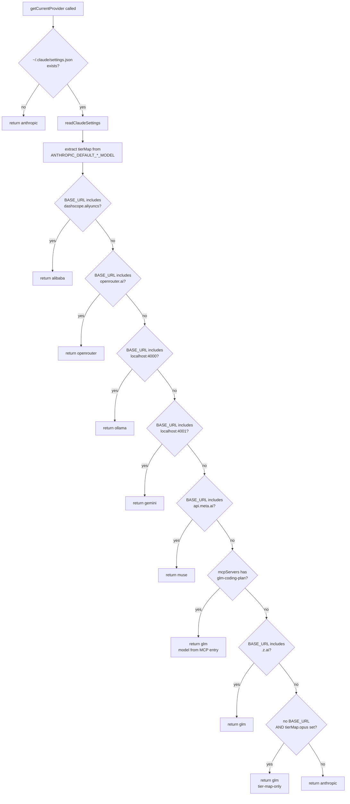
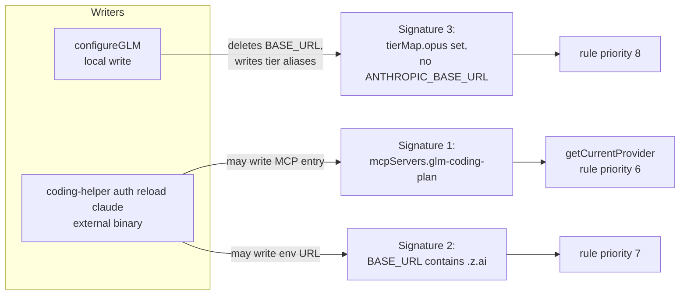

Every provider switch in this tool is a **write-only operation**: the switcher mutates a client's settings file and never records which provider it just activated. `getCurrentProvider()` therefore solves a reverse-engineering problem — given only the artifacts left in `~/.claude/settings.json` or `~/.config/opencode/opencode.json`, reconstruct which provider is currently active. This page dissects both implementations of this function (one per client), the exact signals each heuristic keys on, and the deliberate design trade-offs that make substring fingerprinting reliable in practice. The write-side of these artifacts is covered separately in [The Provider Switch Flow: Key Validation, Tier Maps, Proxy Startup, and Settings Writes](9-the-provider-switch-flow-key-validation-tier-maps-proxy-startup-and-settings-writes).
Sources: [claude-code.ts](src/clients/claude-code.ts#L284-L382), [opencode.ts](src/clients/opencode.ts#L614-L677)

## Why Detection Instead of State: The Single-Source-of-Truth Design

The absence of a "current provider" field in the switcher's own config is not an oversight — it is an architectural constraint. The tool deliberately treats the **client's settings file itself as the authoritative state**, because that file can be modified by third parties the switcher does not control. Most notably, the GLM integration delegates to the external `@z_ai/coding-helper` package, which writes its own entries into Claude Code settings; if the switcher kept its own bookkeeping, it would drift out of sync the moment an external tool touched the file. Detection-from-artifacts makes the system **idempotent under external mutation**: whoever wrote the config last, `getCurrentProvider()` reads the ground truth. Both functions are exported from their client modules and re-imported into the CLI entrypoint under distinct aliases (`getClaudeProvider`, `getOpenCodeProvider`), reflecting that the two clients are detected independently and may legitimately disagree.
Sources: [index.ts](src/index.ts#L36-L47), [glm.ts](src/providers/glm.ts#L43-L60)

## The Claude Code Cascade: URL Substring Fingerprinting

The Claude Code implementation operates on a simple premise: every non-Anthropic provider must set `ANTHROPIC_BASE_URL`, and each provider's base URL contains a **distinctive substring that acts as a fingerprint**. The function first guards with `claudeSettingsExists()`, then reads the JSON, extracts the tier map from `ANTHROPIC_DEFAULT_OPUS_MODEL` / `ANTHROPIC_DEFAULT_SONNET_MODEL` / `ANTHROPIC_DEFAULT_HAIKU_MODEL` (gathered unconditionally via the `TIER_ENV_KEYS` constant, so every return branch carries it), and then walks a fixed-order `if` cascade performing `String.prototype.includes()` checks against the base URL. The first matching substring wins.

Sources: [claude-code.ts](src/clients/claude-code.ts#L287-L313), [claude-code.ts](src/clients/claude-code.ts#L35-L39), [claude-code.ts](src/clients/claude-code.ts#L62-L83)

| Priority | Signal (substring in `ANTHROPIC_BASE_URL`) | Detected Provider | Written By |
|---|---|---|---|
| 1 | `coding-intl.dashscope.aliyuncs.com` | `alibaba` | `configureAlibaba` → `https://coding-intl.dashscope.aliyuncs.com/apps/anthropic` |
| 2 | `openrouter.ai` | `openrouter` | `configureOpenRouter` → `https://openrouter.ai/api/v1` |
| 3 | `localhost:4000` | `ollama` | `configureOllama` → `http://localhost:4000` |
| 4 | `localhost:4001` | `gemini` | `configureGemini` → `http://localhost:4001` |
| 5 | `api.meta.ai` | `muse` | `configureMuse` → `https://api.meta.ai` |
| 6 | *(MCP check, see next section)* | `glm` | coding-helper MCP entry |
| 7 | `.z.ai` | `glm` | `coding-helper auth reload claude` |
| 8 | *(absence of `ANTHROPIC_BASE_URL` + tier map present)* | `glm` | `configureGLM` |
| — | *(no match)* | `anthropic` | default fallback |

The write-side and read-side are mirror images: each `configure*` function stamps exactly one canonical URL, and each detection rule matches exactly that canonical string. The port numbers 4000 and 4001 are the reserved LiteLLM proxy ports for [Ollama Provider: Local Models with Detached LiteLLM Proxy Lifecycle on Port 4000](17-ollama-provider-local-models-with-detached-litellm-proxy-lifecycle-on-port-4000) and [Gemini Provider: LiteLLM Proxy Translation on Port 4001](18-gemini-provider-litellm-proxy-translation-on-port-4001) respectively.
Sources: [claude-code.ts](src/clients/claude-code.ts#L141-L155), [claude-code.ts](src/clients/claude-code.ts#L210-L224), [claude-code.ts](src/clients/claude-code.ts#L229-L243), [claude-code.ts](src/clients/claude-code.ts#L248-L282)

The following flowchart traces the complete decision cascade as ordered in the source. Note how the cascade is *effectively* mutually exclusive — a single `ANTHROPIC_BASE_URL` value normally satisfies at most one rule — yet the code still evaluates rules in a strict priority sequence, and the GLM branches break out of the pure-URL pattern entirely:

Sources: [claude-code.ts](src/clients/claude-code.ts#L293-L381)

## The GLM Trisignal Problem: Three Writers, Three Detection Paths

GLM is the only provider requiring **three separate detection rules**, and the reason is architectural: three distinct writers can legitimately leave GLM configuration in Claude settings. First, `configureGLM` — invoked by the `glm` switch command — explicitly *deletes* `ANTHROPIC_BASE_URL` and applies only the tier map, so its signature is "tier aliases present, no base URL." Second, if the external `coding-helper` binary is installed, the switch command additionally runs `coding-helper auth reload claude`, which may write either a `glm-coding-plan` entry under `mcpServers` (detectable via key lookup, with the model read directly from the MCP entry's `.model` field) or a `.z.ai` base URL into the env block. The detection cascade covers all three signatures in priority order: MCP entry first, then `.z.ai` URL, then tier-map-only absence.

Sources: [claude-code.ts](src/clients/claude-code.ts#L355-L379), [claude-code.ts](src/clients/claude-code.ts#L188-L204), [glm.ts](src/providers/glm.ts#L29-L41), [index.ts](src/index.ts#L204-L230)

The relationship between the three writers and their detectable artifacts is the crux of the design — this diagram shows which code path produces which signal, and why the tier-map-only rule must come *last* (it is the weakest signal, relying purely on absence):

Sources: [claude-code.ts](src/clients/claude-code.ts#L188-L204), [glm.ts](src/providers/glm.ts#L52-L53)

This trisignal arrangement has a subtle consequence for the timing of detection: immediately after `configureGLM` runs but before `coding-helper auth reload claude` completes (or when coding-helper is absent entirely, which the switch command tolerates with only a warning), the settings file exhibits *only* the tier-map signature — and detection still correctly reports `glm`. The full integration flow is detailed in [GLM/Z.AI Provider: Integration via the coding-helper MCP Server](19-glm-z-ai-provider-integration-via-the-coding-helper-mcp-server).
Sources: [index.ts](src/index.ts#L205-L222), [claude-code.ts](src/clients/claude-code.ts#L373-L379)

## Absence as a Signal: The Anthropic Default

Both implementations encode Anthropic as the **null hypothesis** — it is what remains when every distinctive signal is absent. Two distinct absences map to `anthropic`: the settings file does not exist at all (fresh machine, Claude Code running on pure defaults), or the file exists but contains no `ANTHROPIC_BASE_URL` and no tier map. This works because `configureAnthropic` performs a *deletion-based reset*: it removes the MCP overrides, strips `ANTHROPIC_AUTH_TOKEN`, `ANTHROPIC_BASE_URL`, `ANTHROPIC_MODEL`, the Muse-specific extras, and clears the tier map — deliberately returning settings to the canonical "absent" state that the detector's fallthrough branch recognizes. The return type is declared nullable, but no code path actually returns `null`; the `null` case exists only for the caller's defensive "Unable to read configuration" branch, which is dead code in practice.
Sources: [claude-code.ts](src/clients/claude-code.ts#L293-L295), [claude-code.ts](src/clients/claude-code.ts#L381), [claude-code.ts](src/clients/claude-code.ts#L161-L182), [index.ts](src/index.ts#L931-L933)

## OpenCode Detection: Key Presence Instead of URL Parsing

The OpenCode implementation abandons URL substring matching entirely, because OpenCode's configuration model is fundamentally different. Where Claude settings hold a *single* env block (making base URLs mutually exclusive), `opencode.json` holds a `provider` **record keyed by provider name**, and the switcher's add-functions are read-modify-write operations that *preserve* existing providers — providers accumulate rather than replace. Detection therefore reduces to checking `settings.provider?.["<key>"]` for a fixed sequence of keys, with the first present key winning.

Sources: [opencode.ts](src/clients/opencode.ts#L617-L677), [opencode.ts](src/clients/opencode.ts#L11-L17), [opencode.ts](src/clients/opencode.ts#L80-L81), [opencode.ts](src/clients/opencode.ts#L595-L612)

| Priority | Provider Key in `settings.provider` | Detected Provider | Endpoint Resolution |
|---|---|---|---|
| 1 | `bailian-coding-plan` | `alibaba` | read live from `options.baseURL` |
| 2 | `openrouter` | `openrouter` | hardcoded `https://openrouter.ai/api/v1` |
| 3 | `ollama` | `ollama` | hardcoded `http://localhost:4000/v1` |
| 4 | `gemini` | `gemini` | hardcoded `http://localhost:4001/v1` |
| 5 | `glm` | `glm` | read live from `options.baseURL` |
| 6 | `muse` | `muse` | read live from `options.baseURL` |
| — | *(no key present / file missing)* | `anthropic` | default fallback |

Two details distinguish this from the Claude cascade. First, the Alibaba key is `bailian-coding-plan` — an OpenCode-specific provider key, not the human-facing "alibaba" name — so the heuristic encodes knowledge of the exact keys the add-functions write (Alibaba at line 81, GLM at 285, OpenRouter at 390, Ollama at 435, Gemini at 502, Muse at 559). Second, endpoints are resolved two different ways: three providers (openrouter, ollama, gemini) report **hardcoded** endpoints matching what the writers stamp, while three (bailian-coding-plan, glm, muse) read the endpoint **live from the settings file** via `options?.baseURL`, tolerating user edits to the base URL. Note also that OpenCode detection returns no `tierMap` — the tier alias system is a Claude Code env-var mechanism only, as covered in [The Model Tier Alias System: Opus, Sonnet, and Haiku Environment Variables](12-the-model-tier-alias-system-opus-sonnet-and-haiku-environment-variables).
Sources: [opencode.ts](src/clients/opencode.ts#L628-L674), [opencode.ts](src/clients/opencode.ts#L81), [opencode.ts](src/clients/opencode.ts#L285), [opencode.ts](src/clients/opencode.ts#L390), [opencode.ts](src/clients/opencode.ts#L435), [opencode.ts](src/clients/opencode.ts#L502), [opencode.ts](src/clients/opencode.ts#L559)

## Two Clients, Two Heuristic Classes

Because OpenCode providers coexist in one file, its detection answers "which provider has *highest fixed priority* among those present," not necessarily "which provider the user last switched to." If a user runs `use-openrouter` and then `add-ollama` (an add, not a switch), both keys exist and OpenCode detection reports `openrouter` — priority 2 beats priority 3 regardless of operation order. The Claude cascade has no such ambiguity, since each switch overwrites the single `ANTHROPIC_BASE_URL`. This table contrasts the two heuristic classes along every dimension that matters:

Sources: [opencode.ts](src/clients/opencode.ts#L629-L674), [claude-code.ts](src/clients/claude-code.ts#L305-L353)

| Dimension | Claude Code (`claude-code.ts`) | OpenCode (`opencode.ts`) |
|---|---|---|
| Detection mechanism | substring match on `ANTHROPIC_BASE_URL` value | key-presence lookup in `provider` record |
| Config shape consumed | single env block (mutually exclusive signals) | accumulating provider map (coexisting signals) |
| Tie resolution | moot — one URL, one match | fixed priority order, first key present wins |
| Non-URL signals | MCP entry (`glm-coding-plan`), tier-map absence | none beyond key presence |
| Endpoint reported | the raw `ANTHROPIC_BASE_URL` value | hardcoded for 3 providers, live `baseURL` for 3 |
| `model` reported | from `ANTHROPIC_MODEL` (or MCP `.model` for GLM) | not populated (always `undefined`) |
| `tierMap` reported | yes, extracted on every path | no — concept absent from OpenCode |
| Missing-file behavior | `{ provider: "anthropic" }` | `{ provider: "anthropic" }` |

Sources: [claude-code.ts](src/clients/claude-code.ts#L287-L382), [opencode.ts](src/clients/opencode.ts#L617-L677)

## Precision Characteristics of the Substring Fingerprints

For an advanced reader, the exact matching semantics deserve scrutiny. The checks use `String.prototype.includes()`, i.e., **unanchored substring containment**. Three verifiable consequences follow. First, `localhost:4000` also matches `http://localhost:40001` — any service binding a port whose decimal representation starts with `4000` collides with the Ollama rule; the same holds for `4001`/Gemini. Second, `.z.ai` matches any string containing that literal anywhere, including hypothetical hosts like `evil.z.ai.example.com`. Third, rule order is the only arbiter when one URL satisfies multiple patterns simultaneously — a hand-edited URL such as `https://openrouter.ai.proxy.dashscope.example` would report `alibaba` (priority 1) rather than `openrouter` (priority 2). These are acceptable trade-offs given that the switcher itself only ever writes the canonical URLs listed in the fingerprint table, making collisions reachable only through manual edits or exotic proxy topologies.
Sources: [claude-code.ts](src/clients/claude-code.ts#L305-L353), [claude-code.ts](src/clients/claude-code.ts#L363-L371)

## Consumption: How `status` and `current` Render the Detection Result

Both the `status` and `current` commands consume the two detectors symmetrically: they guard with the respective `*SettingsExists()` helper (so the detector itself never even runs on an unconfigured machine), call the aliased function per client, and render the returned object field-by-field — `provider` always, `model`/`endpoint` when defined, and the tier map as an indented alias listing (`opus → …`, `sonnet → …`, `haiku → …`) whenever `tierMap.opus` is set. The two clients are reported as independent sections, so a machine can simultaneously show, for example, Claude Code on `glm` and OpenCode on `openrouter` — the detectors make no attempt to reconcile them, because no shared "current provider" concept exists across clients. Everyday usage of these commands is covered in [Everyday CLI Commands: Switching Providers, Status, List, and Models](4-everyday-cli-commands-switching-providers-status-list-and-models).
Sources: [index.ts](src/index.ts#L909-L953), [index.ts](src/index.ts#L1031-L1073)

## Where to Go Next

To see how these detectable artifacts get *written* — validation, tier map construction, proxy startup, and the backup-protected settings write — continue with [The Provider Switch Flow: Key Validation, Tier Maps, Proxy Startup, and Settings Writes](9-the-provider-switch-flow-key-validation-tier-maps-proxy-startup-and-settings-writes). For the storage layer the detectors read from, see [Claude Code Client: Managing ~/.claude/settings.json with Backups and Onboarding](14-claude-code-client-managing-claude-settings-json-with-backups-and-onboarding) and [OpenCode Client: Adding and Removing Providers in opencode.json](15-opencode-client-adding-and-removing-providers-in-opencode-json).