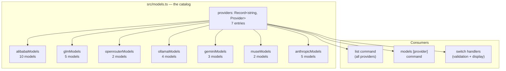
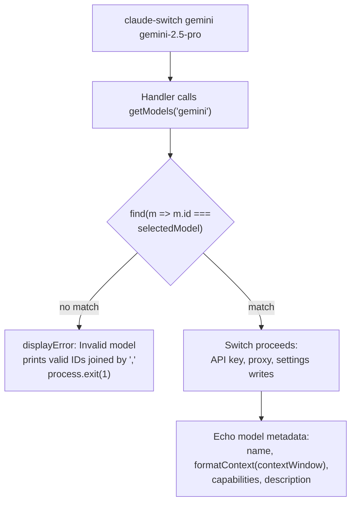

Every time you type `claude-switch models alibaba` or switch to a provider like `claude-switch gemini`, the tool needs to answer three questions: *which models exist*, *what can they do*, and *is the model name you typed actually valid?* The answers all live in one place — a **static, curated catalog** in `src/models.ts`. This page explains how that catalog is shaped: the TypeScript data model behind it, the seven per-provider model lists, what a "context window" means in this codebase, the capabilities vocabulary, and the helper functions (`getModel`, `getModels`, `formatContext`) that the rest of the CLI uses to read this metadata. If you are a beginner, think of `src/models.ts` as the tool's encyclopedia — it never calls the network; everything it knows about models is hardcoded, verified, and versioned with the package.

## The Data Model: `Model` and `Provider` Interfaces

The catalog is built on two small TypeScript interfaces. The **`Model` interface** defines what the tool knows about a single model through five fields: `id` is the exact string you must type on the command line (e.g., `qwen3.7-plus`); `name` is a human-friendly label shown in output (e.g., "Qwen3.7-Plus"); `contextWindow` is a number of tokens (e.g., `1000000`); `capabilities` is a free-form array of strings like `"Deep Thinking"` or `"Coding"`; and `description` is a one-sentence summary printed after a successful switch. The **`Provider` interface** groups models under a provider identity — `id`, `name`, an optional `endpoint`, and the `models` array — which is how the tool knows, for instance, that Alibaba's catalog includes both Qwen and Zhipu models under one API plan.

| Field | Type | Purpose | Example value |
|---|---|---|---|
| `id` | `string` | Exact CLI identifier used for validation | `"gemini-2.5-pro"` |
| `name` | `string` | Human-readable display label | `"Gemini 2.5 Pro"` |
| `contextWindow` | `number` | Maximum context size, in tokens | `1000000` |
| `capabilities` | `string[]` | Ad-hoc capability tags for display | `["Text Generation", "Deep Thinking", "Code", "Vision"]` |
| `description` | `string` | One-line summary shown to the user | `"Google's most capable Gemini model…"` |

A third interface, `ModelTierMap`, also lives in this file but belongs to a separate concern: mapping Claude Code's `opus`/`sonnet`/`haiku` aliases to concrete model IDs. It is covered in depth on [The Model Tier Alias System: Opus, Sonnet, and Haiku Environment Variables](12-the-model-tier-alias-system-opus-sonnet-and-haiku-environment-variables) — for this page, just know that tier maps reference the *same* model IDs that the catalog defines.

Sources: [models.ts](src/models.ts#L1-L20)

## How the Catalog Is Organized

The file follows a simple, flat layout: one exported array per provider (`alibabaModels`, `glmModels`, `openrouterModels`, `ollamaModels`, `geminiModels`, `museModels`, `anthropicModels`), then a `providers` registry object that binds each provider key to its array. There are no classes, no database, and no configuration files — a deliberate choice that makes the catalog trivial to audit with a text editor and fast to load. The diagram below shows the relationship: the **registry is the single entry point**, and every consumer (CLI commands, switch handlers, provider modules) goes through it or through the accessor functions rather than importing arrays directly.



Each registry entry carries the provider's display name, an optional endpoint (for example, `https://coding-intl.dashscope.aliyuncs.com/apps/anthropic` for Alibaba, or `http://localhost:4000` for the Ollama LiteLLM proxy), and a reference to its model array. Note that two entries intentionally have **no endpoint** — `anthropic` (the default, where Claude Code uses its built-in endpoint) and `glm` (which integrates through the coding-helper MCP server rather than an HTTP endpoint).

Sources: [models.ts](src/models.ts#L334-L376)

## The Seven Catalogs at a Glance

The table below summarizes what each catalog contains. A pattern worth noticing: **provider conventions leak into the model IDs**. Ollama IDs end in `:latest` because that is Ollama's tag syntax; OpenRouter IDs use `:free` and a `vendor/model` path (`qwen/qwen3.6-plus:free`); and the GLM flagship uses `[1m]` as a context-size hint (`glm-5.3[1m]`). The catalog preserves these exactly, because the `id` must match what the upstream service accepts.

| Catalog | Models | Context windows | Notable IDs |
|---|---|---|---|
| `anthropicModels` | 5 | 200K (all) | `claude-opus-4-6-20250205`, `claude-haiku-4-5-20251015` |
| `alibabaModels` | 10 | 200K – 1M | `qwen3.7-plus`, `qwen3-coder-plus`, `kimi-k2.5`, `glm-5` |
| `glmModels` | 5 | 200K – 1M | `glm-5.3[1m]`, `glm-5v-turbo`, `glm-4.7-flash` |
| `openrouterModels` | 2 | 131,072 (both) | `qwen/qwen3.6-plus:free`, `openrouter/free` |
| `ollamaModels` | 4 | 100K – 128K | `deepseek-r1:latest`, `qwen2.5-coder:latest` |
| `geminiModels` | 3 | 1M (all) | `gemini-2.5-pro`, `gemini-2.5-flash-lite` |
| `museModels` | 2 | 256K (both) | `muse-spark-1.2`, `muse-spark-1.2-contributor` |

Two catalogs deserve a beginner's closer look. The **Alibaba catalog is a multi-vendor marketplace**: because the Alibaba Coding Plan exposes models from Alibaba (Qwen), Zhipu (GLM), Moonshot (Kimi), and MiniMax through one endpoint, its ten entries span four different companies. The **Anthropic catalog is the reference implementation**: five Claude models with date-stamped IDs (the `20250205`-style suffixes are Anthropic's snapshot dating) and a uniform 200K context window.

Sources: [models.ts](src/models.ts#L89-L161), [models.ts](src/models.ts#L163-L200), [models.ts](src/models.ts#L202-L218), [models.ts](src/models.ts#L220-L250), [models.ts](src/models.ts#L252-L275), [models.ts](src/models.ts#L277-L293), [models.ts](src/models.ts#L295-L332)

## Context Windows and the `formatContext()` Helper

A **context window** is the maximum number of tokens (roughly, chunks of words) a model can consider at once — code, conversation history, and instructions combined. In the catalog it is stored as a plain number (`contextWindow: 1000000`), which is precise for machines but noisy for humans. The `formatContext()` helper converts it for terminal output using two thresholds: values of one million or more become `1M tokens`, values of one thousand or more become `200K tokens`-style strings, and anything smaller prints as-is. This is why the switch confirmation says `Context: 1M tokens` instead of `1000000 tokens`.

One quirk a careful reader will spot: `formatContext` exists **twice in the codebase** — exported from `src/models.ts` and independently defined in `src/display.ts` with identical logic. The CLI imports the `models.ts` copy, while the display module uses its own. It is a harmless duplication today, but a good example of how a small utility can drift between modules as a project grows.

Sources: [models.ts](src/models.ts#L79-L87), [display.ts](src/display.ts#L120-L130), [index.ts](src/index.ts#L16-L27)

## The Capabilities Vocabulary

The `capabilities` array is **free-form, ad-hoc English**, not a closed enum — there is no TypeScript type restricting what strings may appear. In practice the catalog uses a working vocabulary of about a dozen tags, and new entries are free to introduce new ones. This matters for display purposes: the tags are joined with commas and printed in the `Capabilities:` line after a switch, and in the `models` command table.

| Capability tag | Meaning | Where it appears |
|---|---|---|
| `Text Generation` | Base chat/completion ability | Every single model in the catalog |
| `Deep Thinking` | Extended reasoning / thinking modes | Qwen, GLM, Kimi, MiniMax, DeepSeek, Gemini Pro |
| `Coding` / `Code` | Code-oriented model | Qwen Coder, Code Llama, Claude, Gemini, Muse |
| `Coding Agent` | Autonomous, tool-using coding workflows | `qwen3-coder-next`, `qwen3-coder-plus` |
| `Tool Calling` | Function/tool invocation support | `qwen2.5-coder:latest`, Muse models |
| `Vision` / `Visual Understanding` | Multimodal image input | Claude (except Haiku 4.5), Llama 3.1, Qwen, Kimi, `glm-5v-turbo` |
| `Visual Programming` | Works from screenshots/design drafts | `glm-5v-turbo` only |
| `Fast Inference` / `Fast Responses` | Latency-optimized tier | GLM Flash variants, Gemini Flash, Claude Haiku 4.5 |
| `Complex Reasoning` / `Reasoning` | Advanced reasoning positioning | Claude Opus models, DeepSeek R1, Muse |
| `Cost-optimized` / `Discounted` | Pricing-tier distinction | `gemini-2.5-flash-lite`, `muse-spark-1.2-contributor` |

Beginners should read these tags as *marketing-grade descriptions recorded for your convenience*, not as runtime feature switches — nothing in the codebase branches on whether a model has `"Vision"` in its capabilities; the tags exist purely to inform your model choice.

Sources: [models.ts](src/models.ts#L89-L332)

## Accessors: `getModel` and `getModels`

Reading the catalog is mediated by two tiny functions. **`getModels(providerId)`** returns the model array for a provider, or an empty array if the provider key is unknown. **`getModel(providerId, modelId)`** returns a single `Model` object or `undefined` — this is the function that powers model validation during a switch. Both are defensive: they check that the provider exists in the registry before touching its array, so a typo like `getModels("antropic")` degrades gracefully to `[]` rather than crashing.

```typescript
// Get model by ID from a provider
export function getModel(providerId: string, modelId: string): Model | undefined {
  const provider = providers[providerId];
  if (!provider) return undefined;
  return provider.models.find(m => m.id === modelId);
}

// Get all models for a provider
export function getModels(providerId: string): Model[] {
  const provider = providers[providerId];
  if (!provider) return [];
  return provider.models;
}
```

A small variation exists for Ollama: the provider module wraps the same static array in its own `getAvailableModels()` and `findModel()` functions, so the Ollama switch handler calls `findOllamaModel(...)` while everything else uses the central accessors. Under the hood it is the identical `ollamaModels` array — the catalog is never fetched from the running Ollama daemon, even though the daemon itself knows your locally installed models.

Sources: [models.ts](src/models.ts#L378-L390), [ollama.ts](src/providers/ollama.ts#L37-L43)

## Where the Catalog Surfaces in the CLI

The catalog is consumed at three distinct moments, and each one has a visible user-facing behavior. The flowchart below traces the most important path — **switch-time validation** — from your command line input to either a hard failure with a valid-model list, or a successful switch with full metadata echo.



**First, browse-time.** The `list` command iterates over every registry entry and prints both a provider summary (name, model count, endpoint) and the full model table; the `models [provider]` command prints just one provider's table. Both funnel into `displayModels()`, which renders a fixed three-column table (`Model`, `Context`, `Capabilities`) with each model's description on the following line — and it accepts its parameter via structural typing (a matching object shape) rather than importing the `Model` interface, keeping the display layer decoupled from the catalog module. **Second, switch-time validation.** Every provider switch handler looks up your requested model ID against the catalog and exits with an error plus the comma-separated list of valid IDs if it is not found. **Third, post-switch echo.** On success, the handler prints the matched model's `name`, `formatContext(contextWindow)`, `capabilities`, and `description` — so the catalog metadata is the last thing you read after every successful switch.

Sources: [index.ts](src/index.ts#L180-L198), [index.ts](src/index.ts#L299-L326), [index.ts](src/index.ts#L1082-L1097), [index.ts](src/index.ts#L1099-L1117), [display.ts](src/display.ts#L22-L71), [display.ts](src/display.ts#L132-L152)

## Design Observations and Boundaries

Three characteristics define this catalog's design philosophy. **It is static and curated**: no network calls, no caching, no runtime discovery — the trade-off is that new upstream models require a code change and a package release, but the payoff is deterministic validation and zero-latency listing. **It is validation-first**: the catalog's most critical runtime role is the `find()` lookup that rejects invalid model IDs before any API key is used or any settings file is touched, which protects your existing Claude Code configuration from half-applied switches (the full switch pipeline is detailed on [The Provider Switch Flow: Key Validation, Tier Maps, Proxy Startup, and Settings Writes](9-the-provider-switch-flow-key-validation-tier-maps-proxy-startup-and-settings-writes)). **It separates identity from aliases**: the catalog answers "does this model exist and what is it," while the tier-map system answers "which model should `opus`, `sonnet`, and `haiku` resolve to" — two concerns that share model ID strings but live in separate exports. If you want to add your own model or provider entry, the catalog's flat structure makes this a copy-paste exercise, walked through step by step on [Step-by-Step Guide: Adding a New AI Provider to the Switcher](29-step-by-step-guide-adding-a-new-ai-provider-to-the-switcher).

A natural next step is to see how these static IDs become *live configuration*: continue to [The Model Tier Alias System: Opus, Sonnet, and Haiku Environment Variables](12-the-model-tier-alias-system-opus-sonnet-and-haiku-environment-variables) to learn how the default tier maps at the top of `src/models.ts` wire catalog entries into Claude Code's alias environment variables, or revisit [Everyday CLI Commands: Switching Providers, Status, List, and Models](4-everyday-cli-commands-switching-providers-status-list-and-models) for hands-on practice with the `list` and `models` commands.